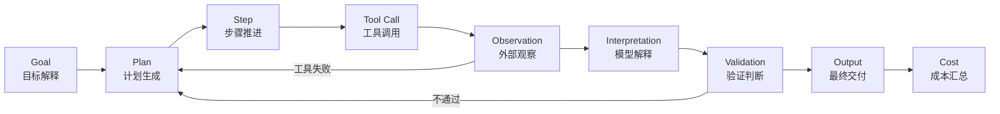
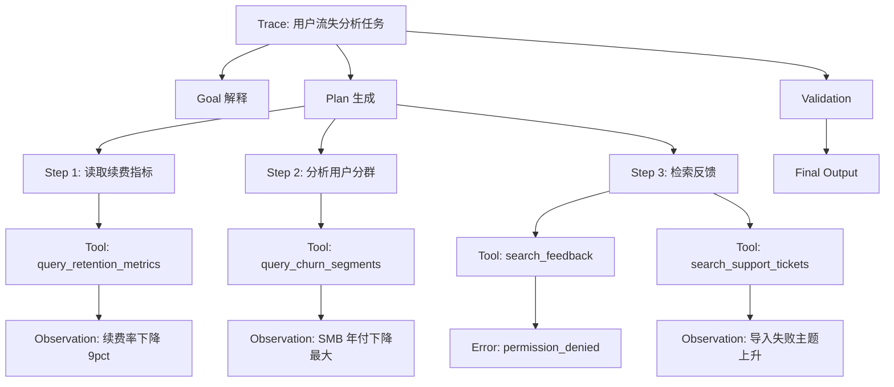
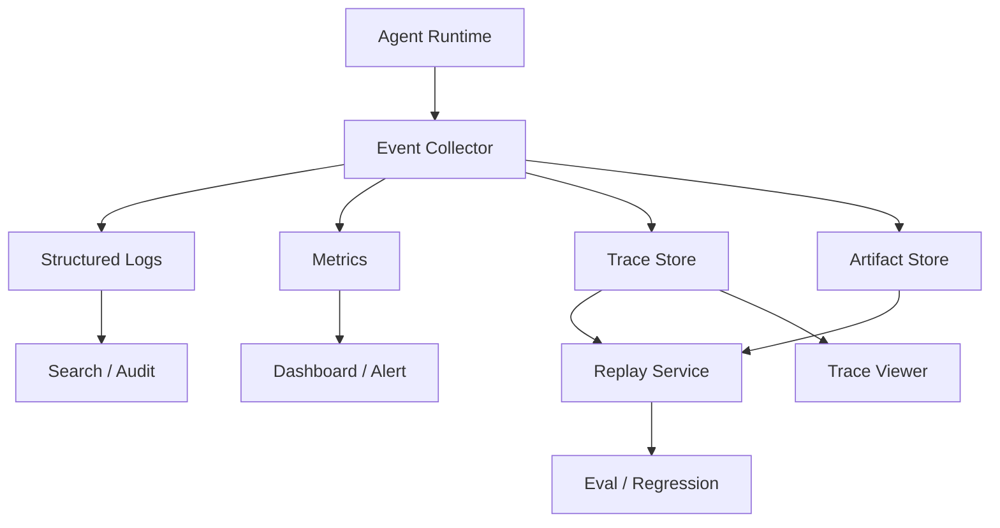

# Agent 可观测性实战：从日志、Trace 到 Replay

> Agent 可观测性不是“多打几行日志”，而是让一次任务从目标、计划、工具调用、观察结果、验证过程到成本消耗都可以被记录、重放、解释和排障。  
> 对生产级 Agent 来说，看得见执行过程，才谈得上稳定、治理和持续优化。

---

## 一、从一个真实问题开始：为什么 Agent 出错后很难定位

先看一个很常见的场景。

用户说：

```text
帮我分析这个 SaaS 产品最近用户流失的主要原因，并给出三个改进建议。
```

Agent 看起来很努力。它查了留存数据、读取了用户反馈、调用了工单系统，还生成了一份结构化报告。最终结论是：

```text
用户流失主要来自新手引导复杂、价格感知偏高和客服响应慢。
建议优化 Onboarding、调整定价展示，并增加客服自动分流。
```

这份报告看起来很完整。问题是，业务负责人追问了几个问题：

```text
为什么认为新手引导是第一原因？
这个结论来自数据、反馈，还是模型推断？
有没有看过最近版本发布记录？
工具调用失败过吗？失败后怎么处理的？
这次任务花了多少钱？为什么跑了这么久？
如果我认为结论不对，能不能回放整个过程？
```

很多 Agent 系统到这里就卡住了。

因为它只保存了最终答案，没有保存完整执行过程。开发者可能只能看到几段零散日志：

```text
start task
call retention api success
call feedback api success
generate report success
```

这些日志说明“发生过一些事”，但不能回答真正的排障问题。

它没有记录：

- 用户目标是如何被理解的。
- Agent 制定了什么计划。
- 每一步为什么选择这个工具。
- 工具参数是什么。
- 工具返回的原始观察是什么。
- Agent 如何把观察转成结论。
- 哪些结论经过验证，哪些只是推断。
- 失败、重试、跳过和降级发生在哪里。
- Token、模型、工具、时间和缓存分别消耗了多少。

这就是 Agent 可观测性的核心问题：

```text
当 Agent 做错、做慢、做贵或做不完时，系统能不能解释它到底经历了什么。
```

没有可观测性，Agent 就像一个黑箱。它成功时让人惊喜，失败时让人无从下手。

---

## 二、Agent 可观测性的第一性原理：把执行过程变成证据链

传统软件系统的可观测性，通常围绕三类信号展开：

```text
Logs：发生了什么事件。
Metrics：整体表现如何变化。
Traces：一次请求经过了哪些链路。
```

这些能力对 Agent 仍然重要，但还不够。

因为 Agent 不只是调用服务。它会理解目标、制定计划、选择工具、解释观察、验证结果、必要时重规划。也就是说，Agent 的失败不只可能发生在技术链路上，还可能发生在认知链路上。

传统服务出错，常见问题是：

```text
哪个接口慢了？
哪个数据库报错了？
哪个服务返回 500？
```

Agent 出错，常见问题会变成：

```text
它是不是理解错目标了？
它是不是计划漏了一步？
它是不是调用了不合适的工具？
它是不是把工具结果读错了？
它是不是没有验证就输出了结论？
它是不是为了补证据不断循环，导致成本失控？
```

所以，Agent 可观测性要观察的不只是系统调用，还包括任务推理结构。

可以把它理解成一条证据链：

```text
Goal -> Plan -> Step -> Tool Call -> Observation -> Interpretation -> Validation -> Output -> Cost
```

这条链路可以画成一张全景图：



注意，这 9 个环节并不意味着一定要设计 9 张表或 9 类顶层对象。工程上可以把它们归并成更少的核心对象，只要字段和事件类型能把链路表达清楚即可。

| 证据链环节 | 归属对象 | 对应字段或事件类型 |
| :--- | :--- | :--- |
| Goal | Goal | `goal_created`、`goal_interpreted`、`user_request`、`interpreted_goal`、`success_criteria`、`constraints` |
| Plan | Plan | `plan_created`、`plan_revised`、`plan_id`、`revision`、`steps`、`dependencies` |
| Step | Plan | `step_started`、`step_completed`、`step_id`、`purpose`、`expected_output`、`done_when`、`status` |
| Tool Call | Tool Call | `tool_call_started`、`tool_call_finished`、`tool_name`、`tool_version`、`arguments`、`status`、`duration_ms` |
| Observation | Observation | `observation_recorded`、`observation_id`、`raw_result_ref`、`summary`、`evidence`、`error` |
| Interpretation | Observation / Validation | `interpretation_created`、`observation_id`、`claim`、`reasoning_summary`、`confidence`、`evidence_ids` |
| Validation | Validation | `validation_started`、`validation_finished`、`validation_rule`、`verdict`、`reason`、`recommended_action` |
| Output | Validation / Goal | `final_output_created`、`final_output_ref`、`output_summary`、`success_criteria_match`、`limitations` |
| Cost | Cost | `cost_recorded`、`cost_summary`、`tokens`、`tool_calls`、`retry_count`、`duration_ms`、`estimated_cost` |

这条链路要回答三个问题。

第一个问题：发生了什么？

```text
Agent 执行了哪些步骤，调用了哪些工具，产生了哪些中间结果。
```

第二个问题：为什么这样做？

```text
每一步服务于哪个目标，依赖哪些上下文，依据什么判断继续或停止。
```

第三个问题：结果是否可信？

```text
最终结论有没有证据，验证是否通过，不确定性和限制在哪里。
```

这四类能力对应不同层次：

```text
Logs：回答发生了什么。
Trace：回答执行路径是什么。
Validation：回答结果是否可信。
Replay：回答当时过程能否复现和对比。
```

如果只能回答“发生了什么”，那只是日志。

如果能把事件串成路径，才接近 Trace。

如果能证明结果是否满足目标，就进入 Validation。

如果还能复现当时的上下文、工具结果、版本和决策链路，才具备 Replay 能力。

一句话总结：

```text
Agent 可观测性的本质，是把一次不确定的智能执行过程，转化为可审计、可解释、可复盘的证据链。
```

---

## 三、一次 Agent 任务到底应该记录什么

很多团队第一次给 Agent 加日志时，会从工具调用开始：记录工具名、参数、返回值和耗时。这个方向没错，但不完整。

Agent 的完整任务轨迹，至少应该覆盖六类对象：

| 对象 | 核心问题 | 典型字段 |
| :--- | :--- | :--- |
| Goal | 用户真正要完成什么 | goal_id、user_request、success_criteria、constraints |
| Plan | 准备怎样完成 | plan_id、steps、dependencies、status、revision |
| Tool Call | 实际调用了什么 | tool_name、arguments、start_time、end_time、status |
| Observation | 工具返回了什么 | raw_result_ref、summary、evidence、error |
| Validation | 如何判断达标 | validation_rule、verdict、reason、confidence |
| Cost | 消耗多少资源 | tokens、duration_ms、tool_count、retry_count、money |

其中 Step、Interpretation 和 Output 没有单独列为顶层对象，是因为它们通常更适合作为事件或字段挂在六类核心对象下面：

- Step 属于 Plan 的执行单元，通过 `step_id` 关联后续工具、观察和验证。
- Interpretation 属于 Observation 的解释层，同时要接受 Validation 检查。
- Output 属于最终交付事件，并且要和 Goal 的成功标准做对齐验证。

这六类对象不一定都要存完整原文，但必须能关联起来。否则，排障时就会出现断点。

例如你知道某个工具调用失败了，但不知道它属于哪个计划步骤。或者你知道最终结论引用了“用户反馈”，但不知道这条反馈来自哪个工具结果。

下面逐个展开。

### 3.1 Goal：用户真正要完成什么

Goal 不是简单保存用户原话。

用户原话经常是模糊的，例如：

```text
帮我看看最近用户为什么不续费。
```

Agent 需要把它转成可执行目标：

```json
{
  "goal_id": "goal_20260828_001",
  "user_request": "帮我看看最近用户为什么不续费。",
  "interpreted_goal": "分析过去 30 天付费用户续费率下降的主要原因，并输出证据、结论和改进建议。",
  "success_criteria": [
    "识别 2 到 4 个主要原因",
    "每个原因至少绑定一类证据",
    "区分事实、推断和建议",
    "输出三个优先级最高的改进动作"
  ],
  "constraints": {
    "time_window": "last_30_days",
    "language": "zh-CN",
    "risk_level": "analysis_only"
  }
}
```

这样记录的价值是：当最终结果被质疑时，可以回到最初的目标解释，看 Agent 是否一开始就跑偏了。

很多失败不是发生在工具调用，而是发生在 Goal 解释阶段。

例如用户说“最近”，Agent 默认理解成 7 天，但业务实际希望看 90 天。后面所有数据查询都可能很精确，但整体方向已经错了。

所以，Goal 记录至少要包含：

- 用户原始请求。
- Agent 解释后的目标。
- 任务边界和约束。
- 成功标准。
- 缺失信息和默认假设。
- 是否经过用户确认。

### 3.2 Plan：Agent 准备怎样完成

Plan 记录的是 Agent 的执行意图。

对于复杂任务，只记录最终结果是不够的。你需要知道 Agent 当时计划怎么做，以及它有没有按计划推进。

一个计划事件可以这样记录：

```json
{
  "plan_id": "plan_001",
  "goal_id": "goal_20260828_001",
  "revision": 1,
  "steps": [
    {
      "step_id": "s1",
      "name": "读取续费指标",
      "purpose": "确认续费率下降是否真实存在，以及影响范围",
      "expected_output": "按周续费率、影响用户数、同比或环比变化",
      "done_when": "得到可计算的续费率趋势，或明确数据不可用"
    },
    {
      "step_id": "s2",
      "name": "分析流失用户分群",
      "purpose": "判断下降主要发生在哪类用户",
      "expected_output": "按套餐、行业、渠道、使用频率分组的流失分布",
      "done_when": "至少得到两个维度的分群结果"
    },
    {
      "step_id": "s3",
      "name": "读取用户反馈和工单",
      "purpose": "寻找流失原因的文本证据",
      "expected_output": "高频主题、样本反馈、主题占比",
      "done_when": "得到可引用的反馈聚类结果"
    }
  ]
}
```

Plan 的核心价值不是“看起来有条理”，而是让后续事件有归属。

一次工具调用应该能追溯到某个计划步骤。一次验证失败也应该能说明是哪个步骤没有达标。

如果中途发生重规划，还应该记录新的 revision：

```json
{
  "event_type": "plan_revised",
  "plan_id": "plan_001",
  "from_revision": 1,
  "to_revision": 2,
  "reason": "用户反馈系统无权限，改用客服工单和取消原因字段作为替代证据",
  "changed_steps": ["s3"]
}
```

这样一来，重规划就不是模糊的“Agent 自己改了主意”，而是一次可解释的计划变更。

### 3.3 Tool Call：调用了什么工具、传了什么参数

Tool Call 是最容易被记录、也最容易被低估的一层。

很多系统只记录工具名和成功失败：

```text
query_retention_metrics success
```

这不够。

至少应该记录：

- 关联的 goal_id、plan_id、step_id。
- tool_name 和 tool_version。
- 输入参数，敏感字段脱敏。
- 调用开始时间和结束时间。
- 状态：success、partial_success、error、timeout、cancelled。
- 错误码和是否可重试。
- 是否产生副作用。
- 调用者身份和权限上下文。

示例：

```json
{
  "event_type": "tool_call",
  "trace_id": "trace_abc",
  "span_id": "span_003",
  "goal_id": "goal_20260828_001",
  "plan_id": "plan_001",
  "step_id": "s1",
  "tool_name": "query_retention_metrics",
  "tool_version": "1.4.2",
  "arguments": {
    "product_id": "prod_17",
    "time_window": "last_30_days",
    "segment": "paid_users"
  },
  "side_effect": false,
  "status": "success",
  "duration_ms": 842,
  "started_at": "2026-08-28T10:13:12+08:00",
  "ended_at": "2026-08-28T10:13:13+08:00"
}
```

工具调用记录要特别注意两件事。

第一，不要把敏感信息直接打进日志。例如 Token、密码、完整用户隐私、内部 SQL、完整文件路径都应该脱敏或只保存引用。

第二，要区分只读工具和有副作用工具。读取指标和发送邮件都叫 Tool Call，但风险完全不同。Replay 时也必须知道某个调用是否可以安全重放。

### 3.4 Observation：工具返回了什么结果

Observation 是 Agent 看到的外部世界。

它不是最终结论，也不是模型解释，而是工具返回后的可观察事实。

例如工具返回：

```json
{
  "renewal_rate_current": 0.68,
  "renewal_rate_previous": 0.77,
  "affected_accounts": 184,
  "largest_drop_segment": "SMB annual plan",
  "sample_size": 1270
}
```

Agent 后续可能解释为：

```text
续费率下降主要集中在 SMB 年付客户。
```

这句话已经是 Interpretation，不是原始 Observation。

为什么要区分？

因为 Agent 很容易误读 Observation。

例如工具返回的是“SMB 年付客户下降最多”，Agent 却写成“所有年付客户下降明显”。前者是数据事实，后者是过度泛化。

Observation 记录可以分两层：

| 层级 | 内容 | 保存方式 |
| :--- | :--- | :--- |
| 原始结果 | 工具完整返回、文件、表格、日志片段 | 存对象存储或数据库，日志中只存 ref |
| 摘要结果 | 对 Agent 有用的结构化摘要 | 存入 trace event，便于检索和展示 |

示例：

```json
{
  "event_type": "observation",
  "trace_id": "trace_abc",
  "parent_span_id": "span_003",
  "observation_id": "obs_003",
  "raw_result_ref": "s3://agent-traces/trace_abc/tool/query_retention_metrics.json",
  "summary": "过去 30 天续费率从 77% 降至 68%，下降主要集中在 SMB 年付客户，影响 184 个账号。",
  "evidence": [
    {
      "type": "metric",
      "name": "renewal_rate_delta",
      "value": -0.09
    },
    {
      "type": "segment",
      "name": "largest_drop_segment",
      "value": "SMB annual plan"
    }
  ]
}
```

好的 Observation 设计应该同时服务人和机器：人能快速看懂摘要，机器能继续基于结构化字段做验证和评估。

### 3.5 Validation：如何判断结果是否达标

没有 Validation 的 Agent，可观测性只完成了一半。

因为你不仅要知道 Agent 做了什么，还要知道它做得对不对。

Validation 可以发生在三个层面。

| 层面 | 验证对象 | 示例 |
| :--- | :--- | :--- |
| 步骤级验证 | 单个计划步骤是否完成 | 是否拿到有效续费率数据 |
| 结论级验证 | 某个判断是否有证据支撑 | “价格问题”是否有反馈或数据证据 |
| 交付级验证 | 最终输出是否满足用户目标 | 是否给出原因、证据、建议和限制说明 |

示例：

```json
{
  "event_type": "validation",
  "trace_id": "trace_abc",
  "validation_id": "val_007",
  "target_type": "claim",
  "target": "价格感知偏高是用户不续费的重要原因",
  "rule": "每个主要原因必须至少有一类数据证据或三条以上用户反馈样本支持",
  "verdict": "failed",
  "reason": "反馈样本中仅 1 条提到价格，且没有最近价格调整记录支持。",
  "recommended_action": "降级为次要假设，或继续检索价格相关反馈。"
}
```

这个记录非常关键。

它让系统知道：“价格感知偏高”不是一个已经被证实的主要结论，而是一个证据不足的假设。

如果没有这条 Validation，最终报告可能会把它写成确定结论，业务团队也可能据此做出错误决策。

### 3.6 Cost：消耗了多少 Token、时间和工具预算

Agent 的成本不只来自模型 Token。

完整成本至少包括：

- 输入 Token。
- 输出 Token。
- 模型调用次数。
- 工具调用次数。
- 外部 API 费用。
- 执行耗时。
- 重试次数。
- 缓存命中率。
- 人工复核成本。

示例：

```json
{
  "event_type": "cost_summary",
  "trace_id": "trace_abc",
  "model_calls": 8,
  "input_tokens": 18420,
  "output_tokens": 4360,
  "tool_calls": 11,
  "retry_count": 2,
  "duration_ms": 48520,
  "estimated_usd": 0.73,
  "cache_hits": 3,
  "cache_misses": 5
}
```

成本记录的价值不只是财务统计，还能帮助定位执行问题。

例如：

| 现象 | 可能原因 |
| :--- | :--- |
| Token 很高但工具很少 | 上下文过大、摘要不充分、历史信息注入过多 |
| 工具很多但结论很弱 | 计划发散、停止条件不清、验证标准缺失 |
| 重试很多 | 工具不稳定、参数生成错误、权限配置异常 |
| 时间很长但 Token 不高 | 外部 API 慢、队列等待、文件解析耗时 |
| 缓存命中率低 | 缓存键设计不合理、数据版本未纳入 key |

对生产级 Agent 来说，成本也是一种可观测信号。一个结果正确但成本不可控的 Agent，仍然不能算稳定可用。

---

## 四、从普通日志到结构化事件

普通日志的问题，不是它没用，而是它很难被机器理解。

例如：

```text
用户流失分析开始。
读取留存数据成功。
反馈系统调用失败，改用工单系统。
最终输出报告。
```

这几句话人能读懂，但系统很难聚合、筛选、统计和重放。

结构化日志应该把每个事件变成可查询对象。

一个最小事件结构可以这样设计：

```json
{
  "timestamp": "2026-08-28T10:13:12+08:00",
  "trace_id": "trace_abc",
  "span_id": "span_003",
  "parent_span_id": "span_002",
  "event_type": "tool_call",
  "level": "info",
  "agent_name": "churn_analysis_agent",
  "agent_version": "0.9.1",
  "goal_id": "goal_20260828_001",
  "plan_id": "plan_001",
  "step_id": "s1",
  "status": "success",
  "payload": {},
  "cost": {},
  "error": null
}
```

关键字段包括：

| 字段 | 作用 |
| :--- | :--- |
| trace_id | 关联一次完整任务 |
| span_id | 标识某个阶段、步骤或工具调用 |
| parent_span_id | 表达层级关系 |
| event_type | 区分 goal、plan、tool_call、observation、interpretation、validation、cost |
| agent_version | 定位是否是版本变更导致的问题 |
| step_id | 关联计划步骤 |
| status | 方便统计成功、失败、跳过、超时 |
| payload | 保存事件主体，敏感字段脱敏 |
| cost | 保存当前事件的局部消耗 |
| error | 保存结构化错误 |

其中 `interpretation` 可以作为独立事件记录，也可以在存储实现里作为 `observation` 的子类型记录：

```json
{
  "event_type": "observation",
  "subtype": "interpretation",
  "observation_id": "obs_003",
  "claim": "续费率下降主要集中在 SMB 年付客户",
  "evidence_ids": ["obs_003.metric.renewal_rate_delta"],
  "confidence": 0.82
}
```

无论采用哪种方式，都必须能让排障时对比 Observation 和 Interpretation。否则，工具结果正确但模型误读时，Trace 会缺少最关键的一环。

结构化事件还有一个重要好处：它让排障查询变得具体。

例如你可以问：

```text
过去 24 小时，哪个 Agent 的 validation_failed 最多？
哪个工具的 timeout 率最高？
哪些任务发生了 plan_revised？
哪些任务因为权限不足降级？
哪些任务成本超过预算但最终没有通过验证？
```

这些问题如果靠自然语言日志，很难稳定回答。靠结构化事件，就可以进入数据库、日志平台、Trace 系统或评估平台继续分析。

一句话总结：

```text
普通日志记录故事，结构化事件记录证据。
```

---

## 五、Trace：把分散事件串成一条执行链

日志解决“发生了什么”，Trace 解决“一次任务经过了什么路径”。

对普通后端服务来说，一条 Trace 可能是：

```text
API Gateway -> User Service -> Order Service -> Database
```

对 Agent 来说，一条 Trace 更像：

```text
User Goal
  -> Goal Interpreter
  -> Planner
  -> Step 1: Query Metrics
  -> Step 2: Analyze Segments
  -> Step 3: Search Feedback
  -> Step 4: Validate Claims
  -> Final Response
```

可以用 span 表达这个层级：



这里最重要的是层级关系。

如果只有扁平日志，你可能知道 Agent 调用了 10 个工具，但不知道这些工具分别服务于哪个步骤。

有了 Trace，你可以看出：

- 哪个步骤最耗时。
- 哪个步骤调用失败最多。
- 哪个步骤发生了重试或降级。
- 哪个结论依赖哪些 Observation。
- 哪个 Validation 拦截了不可靠结论。

Trace 还可以帮助分析“任务漂移”。

例如原始目标是分析用户流失，但 Trace 显示后半段大量 span 都在生成营销文案。这说明 Agent 可能从“分析原因”漂移到了“写召回方案”，需要加强计划边界或停止条件。

一个 Agent Trace 至少应该有三类 span。

| Span 类型 | 说明 |
| :--- | :--- |
| Cognitive Span | 目标解释、计划生成、结论归纳、重规划 |
| Tool Span | 外部工具、API、数据库、文件、浏览器调用 |
| Validation Span | 格式检查、证据检查、测试运行、人工确认 |

传统 APM 更熟悉 Tool Span。Agent 系统真正需要补的是 Cognitive Span 和 Validation Span。

否则你只能知道工具慢不慢，却不知道 Agent 为什么调用它，也不知道调用结果有没有被正确使用。

---

## 六、Replay：让一次失败可以被重放

Replay 是 Agent 可观测性里最容易被误解的概念。

很多人以为 Replay 就是“把同一个问题再跑一遍”。

这不准确。

Agent 的 Replay 至少有三种层次。

| 层次 | 含义 | 适用场景 |
| :--- | :--- | :--- |
| Trace Replay | 回放当时记录，不重新调用工具 | 排查决策过程、审计、复盘 |
| Deterministic Replay | 使用冻结的工具结果和上下文重新运行 Agent | 对比模型、Prompt、Skill 版本差异 |
| Live Replay | 在当前环境重新执行工具调用 | 验证问题是否仍然存在 |

最安全、最基础的是 Trace Replay。

它不重新执行任何副作用动作，只是把当时的 Goal、Plan、Tool Call、Observation、Validation 和 Cost 按顺序展示出来。

这能回答：

```text
当时 Agent 到底看到了什么？
它为什么形成这个结论？
哪个工具失败了？
哪个验证规则没有执行？
```

Deterministic Replay 更进一步。它会冻结当时的上下文和工具返回，让新版本 Agent 在同样输入下重新推理。

这适合做版本对比：

```text
旧版本把“价格问题”写成主要原因。
新版本在相同 Observation 下，把它降级为未验证假设。
```

Live Replay 风险最高。因为它会重新调用真实工具，可能读取到新的数据，也可能产生副作用。

所以 Replay 设计必须区分工具类型：

| 工具类型 | Replay 策略 |
| :--- | :--- |
| 只读查询 | 可在授权后重新执行 |
| 写入操作 | 默认禁止自动重放 |
| 外发操作 | 必须人工确认，通常只回放记录 |
| 付款、删除、生产变更 | 禁止自动重放，只能模拟或人工审批 |

一个 Replay 系统的最小输入包可以包括：

```json
{
  "trace_id": "trace_abc",
  "agent_version": "0.9.1",
  "model": "model_name",
  "system_instructions_ref": "prompt://agent/churn/v12",
  "skill_refs": ["skill://churn-analysis/v3"],
  "tool_registry_version": "2026-08-28",
  "goal": {},
  "plan": {},
  "observations": [],
  "validation_results": [],
  "cost_summary": {}
}
```

注意，这里不一定要把所有内容都塞进一条日志。更好的方式是用引用连接大对象：文件、表格、长文本、原始工具返回都存到对象存储或数据库，Trace 里只保存 `ref`、摘要和哈希。

Replay 的关键不是“完全复刻世界”，而是保留足够信息，让你能判断当时的失败来自哪里。

一句话总结：

```text
Replay 不是再问一次模型，而是把当时的执行环境、观察结果和决策链路重新摆到桌面上。
```

---

## 七、如何用 Trace 定位典型问题

有了 Trace，排障就可以从“猜 Agent 为什么错”变成“沿执行链找断点”。

下面用几个典型问题说明。

### 7.1 目标理解错误

现象：最终输出和用户想要的不一致。

例如用户要“分析不续费原因”，Agent 输出了“召回邮件模板”。

排查方法：先看 Goal 解释事件。

```text
user_request：帮我看看最近用户为什么不续费
interpreted_goal：生成三封用户召回邮件
```

这说明错误发生在目标解释阶段，而不是工具调用阶段。

修复方向包括：

- 要求 Agent 显式记录 interpreted_goal。
- 对高风险或高成本任务先请求用户确认目标。
- 在计划生成前检查输出类型是否匹配用户请求。

### 7.2 计划拆解错误

现象：工具都调用成功了，但结论缺关键维度。

例如 Agent 查了用户反馈，却没有查续费指标，也没有按用户分群。

排查方法：看 Plan 是否包含必要步骤。

如果计划本身没有“读取续费数据”和“分群分析”，那就是计划拆解问题。

修复方向包括：

- 为同类任务沉淀 Skill。
- 给 Planner 加必选步骤检查。
- 使用验证器检查计划是否覆盖核心证据维度。

### 7.3 工具选择错误

现象：Agent 调用了工具，但工具不适合当前任务。

例如要分析付费用户续费，却调用了免费用户活跃数据。

排查方法：检查 Tool Call 的 `tool_name`、`arguments` 和 `step_id`。

常见原因包括：

- 工具描述不清。
- 工具命名相似。
- Agent 没有理解指标口径。
- Tool Registry 缺少适用场景和排除场景。

修复方向包括：

- 优化工具描述。
- 给工具增加 schema 约束和枚举。
- 在工具返回中写清指标口径。
- 对关键工具选择加入验证规则。

### 7.4 工具参数错误

现象：工具返回成功，但数据范围错了。

例如用户要过去 30 天，Agent 查询了过去 7 天。

排查方法：看 Tool Call 参数和 Goal 约束是否一致。

这类问题非常常见，因为工具层只知道参数合法，不知道参数是否符合任务目标。

修复方向包括：

- 把 Goal 约束结构化保存。
- 执行前做参数一致性检查。
- 在 Validation 中检查数据时间窗、用户范围和指标口径。

### 7.5 Observation 误读

现象：工具返回的数据正确，但 Agent 解释错了。

例如 Observation 写着“下降集中在 SMB 年付客户”，最终输出写成“企业客户下降最明显”。

排查方法：对比 Observation 和 Interpretation。

如果原始观察没错，结论错了，说明问题发生在模型解释层。

修复方向包括：

- 将关键 Observation 转成结构化字段。
- 让结论引用 observation_id。
- 对数值和分群结论做程序化校验。
- 要求输出区分事实、推断和建议。

### 7.6 Validation 缺失或过弱

现象：最终报告流畅，但证据不足。

例如报告列出三个主要原因，其中两个没有数据支持。

排查方法：检查是否存在结论级 Validation。

如果只有“格式正确”验证，没有“证据是否支撑结论”验证，说明验证器太弱。

修复方向包括：

- 为每类结论定义证据门槛。
- 要求每个关键 claim 绑定 evidence_id。
- 把不满足证据门槛的内容降级为假设。
- 对高风险报告加入人工复核。

### 7.7 成本和循环失控

现象：任务最终完成了，但耗时和费用明显过高。

排查方法：看 Cost Summary 和 span 层级。

常见原因包括：

- 计划过细，步骤太多。
- 工具失败后重复重试。
- 没有停止条件。
- 上下文注入过大。
- 检索结果没有摘要，导致 Token 膨胀。

修复方向包括：

- 设置最大步骤数、最大工具调用数和预算上限。
- 对重试加入指数退避和最大次数。
- 对大结果做摘要、分页和引用存储。
- 让 Planner 输出“证据足够时停止”的条件。

---

## 八、最小可用可观测方案：先从一张任务轨迹表开始

不要一开始就追求完整平台。

很多团队可以先从一张任务轨迹表开始，把 Agent 的关键事件记录下来。

最小表结构可以这样设计：

| 字段 | 说明 |
| :--- | :--- |
| trace_id | 一次任务的唯一 ID |
| event_index | 事件顺序 |
| timestamp | 事件时间 |
| event_type | goal、plan、tool_call、observation、interpretation、validation、cost、final |
| step_id | 所属计划步骤 |
| name | 事件名称 |
| input_summary | 输入摘要 |
| output_summary | 输出摘要 |
| status | success、failed、skipped、partial |
| duration_ms | 当前事件耗时 |
| cost_tokens | 当前事件 Token 消耗 |
| error_code | 错误码 |
| ref | 原始内容引用 |

一次任务记录可能长这样：

| event_index | event_type | step_id | name | status | output_summary |
| :--- | :--- | :--- | :--- | :--- | :--- |
| 1 | goal | | 解释用户目标 | success | 分析过去 30 天续费下降原因 |
| 2 | plan | | 生成计划 | success | 指标、分群、反馈、验证、建议 |
| 3 | tool_call | s1 | 查询续费指标 | success | 续费率从 77% 到 68% |
| 4 | observation | s1 | 保存指标观察 | success | 下降集中在 SMB 年付客户 |
| 5 | interpretation | s1 | 解释指标含义 | success | 续费下降候选原因需要继续分群验证 |
| 6 | tool_call | s3 | 查询用户反馈 | failed | permission_denied |
| 7 | plan_revised | s3 | 调整证据路径 | success | 改查客服工单和取消原因 |
| 8 | validation | | 验证主要结论 | partial | 2 个结论通过，1 个证据不足 |
| 9 | final | | 输出报告 | success | 输出原因、证据、建议和限制 |

如果团队为了减少事件类型，也可以把第 5 行落成 `event_type=observation`、`subtype=interpretation`。关键不是枚举名字，而是不要把 Interpretation 淹没在普通摘要里。

这个 MVP 已经能解决很多问题。

当用户质疑结果时，开发者至少可以看到完整事件顺序。出现失败时，也能知道 Agent 是在哪一步失败、有没有重试、有没有降级。

最小可用方案建议遵循四个原则。

第一，先记录任务级 Trace，而不是只记录工具日志。

第二，先记录摘要和引用，不要把所有原始内容塞进日志。

第三，所有事件都带 trace_id、event_type、status 和时间戳。

第四，从第一天就记录成本，否则后面很难补齐口径。

### 8.1 OpenTelemetry：给认知步骤加 Cognitive Span

OpenTelemetry 原本常用于服务链路追踪。放到 Agent 场景里，不只要追踪 API 和数据库，也要追踪目标解释、计划生成、重规划、结论归纳这些认知步骤。

下面是一段最小可运行示例。它会把 `agent.plan` 作为 Cognitive Span 输出到控制台。

```bash
pip install opentelemetry-api opentelemetry-sdk
```

```python
import json
from opentelemetry import trace
from opentelemetry.sdk.trace import TracerProvider
from opentelemetry.sdk.trace.export import ConsoleSpanExporter, SimpleSpanProcessor

provider = TracerProvider()
provider.add_span_processor(SimpleSpanProcessor(ConsoleSpanExporter()))
trace.set_tracer_provider(provider)

tracer = trace.get_tracer("agent.observability")


def create_plan(goal_id, interpreted_goal, steps):
    with tracer.start_as_current_span("agent.plan") as span:
        span.set_attribute("agent.span_type", "cognitive")
        span.set_attribute("agent.goal_id", goal_id)
        span.set_attribute("agent.interpreted_goal", interpreted_goal)
        span.set_attribute("agent.plan.step_count", len(steps))
        span.set_attribute("gen_ai.system", "agent")
        span.set_attribute("gen_ai.request.model", "agent-model")
        span.set_attribute("gen_ai.usage.input_tokens", 420)
        span.set_attribute("gen_ai.usage.output_tokens", 38)
        span.add_event(
            "plan_created",
            {
                "steps": json.dumps(steps, ensure_ascii=False),
                "success_criteria": "每个主要结论必须绑定证据",
            },
        )
        return {
            "goal_id": goal_id,
            "interpreted_goal": interpreted_goal,
            "steps": steps,
        }


if __name__ == "__main__":
    plan = create_plan(
        goal_id="goal_20260828_001",
        interpreted_goal="分析过去 30 天续费下降原因",
        steps=[
            {"step_id": "s1", "name": "读取续费指标"},
            {"step_id": "s2", "name": "分析流失分群"},
            {"step_id": "s3", "name": "验证主要结论"},
        ],
    )
    print(json.dumps(plan, ensure_ascii=False, indent=2))
```

生产环境里可以把 `ConsoleSpanExporter` 换成 OTLP Exporter，接到 Jaeger、Tempo、Honeycomb、Datadog 或自建 Trace 平台。控制台 exporter 只是演示用途，中文字段在某些输出里可能显示为 `\uXXXX` 转义，不影响真实后端展示。

属性命名上，建议优先对齐 OpenTelemetry 的 GenAI 语义约定，例如 `gen_ai.system`、`gen_ai.request.model`、`gen_ai.usage.input_tokens`、`gen_ai.usage.output_tokens`。`agent.goal_id`、`agent.plan_id`、`agent.step_id` 这类字段则作为业务补充，用来表达 Agent 特有的目标、计划和步骤结构。

### 8.2 Langfuse 风格：记录 Trace、Span、Generation 和 Score

Langfuse 这类 LLM Observability 工具通常会把一次任务拆成 Trace、Span、Generation、Score 等对象。下面这段代码不依赖具体 SDK，而是用同样的数据模型演示如何埋点。

```python
import json
import time
import uuid


class LangfuseStyleEmitter:
    def __init__(self):
        self.events = []

    def trace(self, name, user_id, input_text, metadata=None):
        trace_id = f"trace_{uuid.uuid4().hex[:8]}"
        self.events.append({
            "type": "trace",
            "id": trace_id,
            "name": name,
            "user_id": user_id,
            "input": input_text,
            "metadata": metadata or {},
            "ts": time.time(),
        })
        return trace_id

    def span(self, trace_id, name, input_data, output_data, metadata=None):
        self.events.append({
            "type": "span",
            "trace_id": trace_id,
            "name": name,
            "input": input_data,
            "output": output_data,
            "metadata": metadata or {},
            "ts": time.time(),
        })

    def generation(self, trace_id, name, model, prompt, completion, usage):
        self.events.append({
            "type": "generation",
            "trace_id": trace_id,
            "name": name,
            "model": model,
            "prompt": prompt,
            "completion": completion,
            "usage": usage,
            "ts": time.time(),
        })

    def score(self, trace_id, name, value, comment):
        self.events.append({
            "type": "score",
            "trace_id": trace_id,
            "name": name,
            "value": value,
            "comment": comment,
            "ts": time.time(),
        })

    def flush(self):
        print(json.dumps(self.events, ensure_ascii=False, indent=2))


if __name__ == "__main__":
    emitter = LangfuseStyleEmitter()
    trace_id = emitter.trace(
        name="churn_analysis",
        user_id="user_17",
        input_text="帮我分析最近用户为什么不续费",
        metadata={"agent_version": "0.9.1", "skill": "churn-analysis/v3"},
    )
    emitter.span(
        trace_id,
        name="tool.query_retention_metrics",
        input_data={"time_window": "last_30_days", "segment": "paid_users"},
        output_data={"renewal_rate_current": 0.68, "renewal_rate_previous": 0.77},
        metadata={"step_id": "s1", "status": "success"},
    )
    emitter.generation(
        trace_id,
        name="claim_interpretation",
        model="agent-model",
        prompt="根据续费指标生成候选结论",
        completion="续费率下降主要集中在付费用户，需要继续分群验证。",
        usage={"input_tokens": 420, "output_tokens": 38},
    )
    emitter.score(
        trace_id,
        name="claim_evidence_coverage",
        value=0.67,
        comment="3 个主要结论中有 2 个绑定了足够证据。",
    )
    emitter.flush()
```

这段代码体现的是埋点结构，而不是绑定某个具体平台。真正接入 Langfuse 或其他工具时，核心仍然是同一件事：把模型生成、工具调用、验证评分和成本消耗放到同一条 Trace 里。

### 8.3 Replay Service 最小伪代码

Replay Service 的核心职责，是按 `trace_id` 取回当时的事件、工具结果引用和版本信息，并决定以哪种模式回放。

下面是一个最小伪代码：

```python
class ReplayService:
    def __init__(self, trace_store, artifact_store, agent_factory, tool_registry):
        self.trace_store = trace_store
        self.artifact_store = artifact_store
        self.agent_factory = agent_factory
        self.tool_registry = tool_registry

    def replay(self, trace_id, mode="trace"):
        trace = self.trace_store.load_trace(trace_id)
        artifacts = self._load_artifacts(trace)

        if mode == "trace":
            return self._trace_replay(trace, artifacts)

        if mode == "deterministic":
            return self._deterministic_replay(trace, artifacts)

        if mode == "live":
            return self._live_replay(trace)

        raise ValueError(f"unknown replay mode: {mode}")

    def _trace_replay(self, trace, artifacts):
        return {
            "mode": "trace",
            "trace_id": trace["trace_id"],
            "events": trace["events"],
            "artifacts": artifacts,
            "note": "只回放记录，不重新调用工具。",
        }

    def _deterministic_replay(self, trace, artifacts):
        agent = self.agent_factory.create(
            agent_version=trace["agent_version"],
            model=trace["model"],
            frozen_observations=artifacts,
        )
        return agent.run(
            goal=trace["goal"],
            tool_policy="use_frozen_observations_only",
        )

    def _live_replay(self, trace):
        for event in trace["events"]:
            if event["event_type"] == "tool_call":
                tool_name = event.get("tool_name")
                if not tool_name:
                    raise ValueError("tool_call event missing tool_name")

                tool = self.tool_registry.get(tool_name)
                if tool is None:
                    raise LookupError(f"tool not found for live replay: {tool_name}")

                if tool.side_effect:
                    raise PermissionError(
                        f"refuse to live replay side-effect tool: {tool.name}"
                    )

        agent = self.agent_factory.create(
            agent_version=trace["agent_version"],
            model=trace["model"],
        )
        return agent.run(goal=trace["goal"], tool_policy="read_only_live")

    def _load_artifacts(self, trace):
        refs = [
            event["raw_result_ref"]
            for event in trace["events"]
            if event.get("raw_result_ref")
        ]
        return {ref: self.artifact_store.load(ref) for ref in refs}
```

这段伪代码故意把 `trace`、`deterministic` 和 `live` 三种模式拆开。尤其要注意：只读工具可以在授权后 Live Replay，有副作用工具默认不能自动重放。

### 8.4 埋点成本和存储开销估算

很多团队担心 Agent 可观测性太重。这个担心合理，但可以量化。

假设一次中等复杂度任务包含：

```text
1 个 goal 事件
1 个 plan 事件
8 个 step 事件
10 个 tool_call 事件
10 个 observation 事件
5 个 validation 事件
1 个 final_output 事件
1 个 cost_summary 事件
```

合计大约 37 条结构化事件。

如果每条事件只保存摘要、结构化字段、引用和少量 metadata，单条 JSON 通常可以控制在 0.8KB 到 2KB。按 1.5KB 估算：

```text
37 条事件 × 1.5KB ≈ 55.5KB / 任务
```

JSON 日志进入对象存储或日志平台后通常还能压缩。按 4:1 压缩估算：

```text
55.5KB / 任务 ÷ 4 ≈ 14KB / 任务
```

如果每天 10 万次任务：

```text
结构化事件原始量：约 5.5GB / 天
压缩后热存储：约 1.4GB / 天
30 天热存储：约 42GB
```

真正容易膨胀的是原始工具结果，而不是事件本身。

假设每次任务有 10 个 `raw_result_ref`，每个原始结果平均 20KB：

```text
10 × 20KB = 200KB / 任务
10 万任务 / 天 ≈ 20GB / 天
30 天 ≈ 600GB
```

所以推荐策略是：

| 内容 | 保存策略 | 保留周期建议 |
| :--- | :--- | :--- |
| 结构化事件 | 全量保存，压缩存储 | 热存 30 到 90 天，冷存更久 |
| 错误 Trace | 全量保存，延长保留 | 至少 180 天 |
| 成功 Trace | 可采样或降级存储 | 高流量场景采样 10% 到 30% |
| 审计事件 | 不采样，强一致保留 | 按合规要求 |
| 原始工具结果 | 引用存储，按大小和敏感级别分层 | 热存 7 到 30 天 |
| 大文件、截图、报告 | 对象存储，只在 Trace 中保存 ref 和 hash | 按业务价值分层 |

从这个估算看，可观测性并不必然很重。重的是无节制保存原文、截图、长日志和重复工具结果。

更稳妥的原则是：

```text
事件全量、原文引用、错误加厚、成功采样、审计不采样。
```

---

## 九、生产级方案：日志、Metrics、Trace、Replay 的分层架构

当 Agent 从 Demo 进入生产环境，可观测性需要分层设计。

一个推荐架构如下：



各层职责可以这样拆：

| 层级 | 职责 |
| :--- | :--- |
| Event Collector | 接收 Agent 运行时事件，统一补 trace_id、时间、版本信息 |
| Structured Logs | 保存可检索事件，服务排障和审计 |
| Metrics | 聚合成功率、耗时、成本、错误率、验证通过率 |
| Trace Store | 保存 span 层级和任务链路 |
| Artifact Store | 保存大对象，如工具原始返回、文件、截图、报告 |
| Replay Service | 基于 Trace 和 Artifact 回放任务过程 |
| Eval / Regression | 使用历史 Trace 构建评测集和回归测试 |

生产级 Agent 至少应该有以下指标。

| 维度 | 指标 |
| :--- | :--- |
| 任务完成 | task_success_rate、final_output_rate、user_cancel_rate |
| 工具调用 | tool_success_rate、tool_timeout_rate、retry_count |
| 验证质量 | validation_pass_rate、claim_evidence_coverage |
| 成本 | cost_per_task、tokens_per_task、tool_calls_per_task |
| 延迟 | task_duration_p50/p95、tool_duration_p95、queue_wait_ms |
| 安全 | permission_denied_count、policy_violation_count、human_gate_count |
| 体验 | user_correction_rate、thumbs_down_rate、rerun_rate |

指标只有采集还不够，还要进入阈值治理。下面是一组初始参考值，真实系统应根据业务风险、任务复杂度和历史基线校准。

| 指标 | 正常区间 | 告警阈值 | 处置动作 |
| :--- | :--- | :--- | :--- |
| `task_success_rate` | 85% 到 98% | 连续 30 分钟低于 80%，或较 7 日基线下降 15% | 回看失败 Trace，按目标理解、工具失败、验证失败分类 |
| `validation_pass_rate` | 80% 到 95% | 连续 1 小时低于 75%，或单版本发布后下降 20% | 暂停灰度，抽样失败输出，检查 Skill 验证规则和模型版本 |
| `claim_evidence_coverage` | 90% 以上 | 低于 85%，高风险任务低于 95% | 降级无证据结论，要求 claim 绑定 evidence_id |
| `tool_success_rate` | 98% 以上 | 低于 95%，或某工具 5 分钟内失败超过 20 次 | 检查 MCP Server、Worker、外部依赖和参数 schema |
| `tool_timeout_rate` | 1% 以下 | 高于 3%，或 P95 耗时超过 SLO 2 倍 | 检查队列、超时配置、缓存命中率和外部 API 状态 |
| `tool_parameter_error_rate` | 2% 以下 | 高于 5%，或发布后翻倍 | 回看工具描述、参数枚举、Planner 到 Tool 的映射 |
| `cost_per_task` | 不超过预算线 | 超过预算线 30%，或连续 1 小时上升 50% | 检查上下文长度、无效重试、计划过细和大结果注入 |
| `tokens_per_task` | 贴近历史基线 | 较 7 日基线上升 50% | 检查记忆注入、检索结果摘要和提示模板膨胀 |
| `plan_revised_rate` | 按任务复杂度校准；简单任务可接近 0，复杂任务常见 5% 到 25% | 复杂任务突然高于 40%；或长任务持续接近 0 且失败率上升 | 过高查工具/权限不稳定；过低只在失败率上升时检查重规划是否失效 |
| `permission_denied_count` | 低且稳定 | 同租户或同工具短时突增 | 检查权限配置、用户角色、工具路由和越权请求 |
| `user_correction_rate` | 低于 10% | 高于 20%，或某类任务持续上升 | 抽样用户修正内容，沉淀到 Evals 和 Skill 规则 |

告警不应该只看服务错误率，也应该看 Agent 语义层指标。

例如：

```text
过去 1 小时 validation_pass_rate 从 92% 降到 64%。
过去 24 小时 tool_parameter_error 增加 3 倍。
某个 Agent 的 cost_per_task 超过预算上限 50%。
某个版本上线后 plan_revised_rate 明显上升。
```

这些信号可能比 HTTP 500 更早暴露问题。

Agent 很少只以“服务挂了”的方式失败。它更多是“还在运行，但质量变差了”。

可观测系统必须能看见这种质量漂移。

---

## 十、和 Skill、MCP、Memory、Evals 的关系

Agent 可观测性不是孤立模块，它和 Skill、MCP、Memory、Evals 都有关系。

### 10.1 和 Skill 的关系

Skill 定义“这类任务应该怎么做”，可观测性记录“这次任务实际怎么做”。

如果一个 Agent 声称使用了某个 Skill，Trace 中应该能看到：

- 加载了哪个 Skill 版本。
- 哪些步骤来自 Skill。
- 哪些步骤发生了偏离。
- 偏离原因是什么。
- Skill 的验证标准是否被执行。

这样才能判断问题来自 Skill 设计，还是 Agent 执行偏航。

### 10.2 和 MCP 的关系

MCP 提供工具、资源和提示模板。可观测性要记录 MCP 调用链路。

这里需要显式划界：

```text
MCP 层管工具有没有稳定工作；
Agent 层管工具结果有没有服务目标。
```

两层都需要日志、指标和 Trace，但观察对象不同。

| 层级 | 主要问题 | 典型证据 | 不应该越界做什么 |
| :--- | :--- | :--- | :--- |
| MCP 层 | Tool 是否可发现、可调用、参数合法、返回稳定 | `tools/list`、`tools/call`、schema 校验、Worker 日志、错误码、耗时 | 不判断业务结论是否成立 |
| Agent 层 | Tool 是否被正确选择，结果是否支撑计划和结论 | `goal_id`、`plan_id`、`step_id`、Observation、Validation、Cost | 不替代 MCP 做协议和 Worker 内部诊断 |
| 关联边界 | 一次 Agent 工具调用如何追到 MCP 执行细节 | `trace_id`、`request_id`、`tool_name`、`tool_version`、`raw_result_ref` | 不把两层日志混成不可查询的长文本 |

至少要关注：

- Tool 是否可发现。
- 参数 schema 是否匹配。
- Tool 是否返回结构化结果。
- 错误码是否清晰。
- request_id、trace_id 是否贯穿 Host、Server、Worker。
- 工具返回是否被 Agent 正确解释。

MCP 层的日志回答“工具有没有稳定工作”。Agent 层的 Trace 回答“工具结果有没有服务目标”。两者要关联，但不要混在一起。

可以把《MCP 的第一性原理》第 17 章看作工具层可观测性的展开：它重点讲结构化日志、Metrics、分布式追踪和告警。本文则是在那个基础上继续往上走一层，讨论 Agent 如何记录目标、计划、解释、验证和 Replay。

### 10.3 和 Memory 的关系

记忆系统会影响 Agent 决策，所以记忆也必须可观测。

Trace 中应该记录：

- 是否触发记忆检索。
- 检索 query 是什么。
- 召回了哪些 memory_id。
- 哪些记忆被注入上下文。
- 记忆是否影响了计划或结论。
- 是否写入新记忆。

否则，当 Agent 因为一条过期记忆做错判断时，很难定位。

记忆不是背景资料，它是会改变行为的输入。凡是会改变 Agent 行为的输入，都应该进入可观测链路。

### 10.4 和 Evals 的关系

Evals 需要样本，Trace 是最好的真实样本来源之一。

失败 Trace 可以沉淀成回归测试：

```text
这次任务里，旧 Agent 把证据不足的假设写成结论。
下一版本必须在相同 Observation 下，把该内容标为未验证假设。
```

成功 Trace 也有价值。它可以成为 Golden Path，用来检查新版 Agent 是否仍然按合理步骤完成任务。

所以，可观测性和评估不是两套系统。

```text
可观测性负责收集真实执行过程；
Evals 负责把这些过程转化为可重复的质量门槛。
```

---

## 十一、常见误区

### 11.1 有日志就等于可观测

日志只是可观测性的基础材料。

如果日志没有结构、没有 trace_id、没有计划步骤、没有验证结果，就只能帮你知道“系统曾经输出过一些文字”。

真正的可观测性要能关联目标、计划、工具、观察、验证和成本。

### 11.2 只记录最终答案

最终答案是结果，不是过程。

Agent 的错误经常藏在中间过程里。只记录最终答案，就像只保存一次手术的出院小结，却不保存诊断、检查、用药和手术记录。

对 Agent 来说，中间过程不是噪声，而是责任链。

### 11.3 Trace 只看耗时，不看决策

很多团队把 Trace 当性能工具，只看哪个 span 慢。

这对 Agent 不够。

Agent Trace 还要看：

- 为什么有这个 span。
- 它服务哪个计划步骤。
- 它产生了什么 Observation。
- 它是否支撑最终结论。
- 它是否通过 Validation。

否则你只能优化速度，不能优化质量。

### 11.4 Replay 只是重新跑一遍

重新跑一遍可能得到完全不同的结果。

数据变了、模型变了、工具变了、Prompt 变了，结果都会变。

Replay 的重点是保留当时的执行证据，并在需要时用冻结上下文做可控对比。对于有副作用的工具，默认不能自动重放。

### 11.5 成本只看 Token，不看无效步骤

Token 是显性成本，无效步骤是隐性成本。

一个 Agent 可能 Token 不高，但反复调用慢工具、不断重试、频繁请求人工确认，整体成本仍然很高。

成本治理要看完整任务链路，而不是只看模型账单。

### 11.6 把所有原始内容都写进日志

这会带来三个问题：成本高、检索慢、风险大。

更稳妥的做法是：日志保存摘要、结构化字段、引用和哈希；原始内容进入受控存储，并按权限读取。

尤其是用户隐私、密钥、合同、财务数据和内部系统返回，不能直接进入普通日志。

---

## 十二、设计检查清单

设计 Agent 可观测性时，可以用下面这份清单自查。

### 12.1 任务链路检查

- 是否为每次任务生成唯一 trace_id？
- 是否记录用户原始请求和 Agent 解释后的目标？
- 是否记录成功标准、约束和默认假设？
- 是否记录计划、步骤、依赖和重规划原因？
- 是否能把每个工具调用关联到具体计划步骤？

### 12.2 工具调用检查

- 是否记录 tool_name、tool_version 和参数？
- 参数中的敏感字段是否脱敏？
- 是否区分只读工具和有副作用工具？
- 是否记录错误码、重试次数、超时和降级路径？
- MCP Server、Worker 和 Agent Runtime 是否共用 request_id 或 trace_id？

### 12.3 Observation 检查

- 是否保存工具原始返回的引用？
- 是否生成结构化摘要？
- 关键数据是否带来源、单位、时间窗和样本量？
- 最终结论是否能反查到 observation_id？
- 是否避免把长原文和敏感内容直接写入日志？

### 12.4 Validation 检查

- 是否有步骤级验证？
- 是否有结论级验证？
- 是否有最终交付验证？
- 验证失败后是否会重试、降级、重规划或停止？
- 证据不足的内容是否会被标记为假设，而不是写成结论？

### 12.5 Cost 检查

- 是否记录模型调用次数、Token 和费用估算？
- 是否记录工具调用次数、耗时和重试？
- 是否有最大步骤数、最大工具调用数和预算上限？
- 是否能定位成本异常来自模型、工具、重试、上下文还是人工复核？
- 是否有缓存命中率和缓存失效原因？

### 12.6 Replay 检查

- 是否能按 trace_id 回放完整任务过程？
- 是否保存 Agent、模型、Prompt、Skill、Tool Registry 的版本？
- 是否区分 Trace Replay、Deterministic Replay 和 Live Replay？
- 有副作用工具是否默认禁止自动重放？
- 历史失败 Trace 是否能进入 Evals 或回归测试？

---

## 十三、总结：可观测性是 Agent 走向生产的飞行记录仪（黑匣子）

Agent 的能力越强，越不能只看最终答案。

因为它不再只是生成文本，而是在目标约束下持续规划、调用工具、解释结果、验证输出和调整路径。这个过程中任何一环都可能出错。

所以，生产级 Agent 必须把执行过程记录下来：

```text
Goal：它认为自己要完成什么。
Plan：它准备怎样完成。
Tool Call：它实际调用了什么。
Observation：它看到了什么结果。
Validation：它如何判断结果是否可靠。
Cost：它消耗了多少资源。
Replay：失败后能否回放和对比。
```

可以用一句话概括：

```text
没有可观测性的 Agent，只能相信它；有了可观测性的 Agent，才能调试它、评估它、治理它。
```

这也是 Agent 从 Demo 走向生产的关键分界线。

Demo 阶段，最终答案好像对了就足够让人兴奋。

生产阶段，系统必须能回答：为什么对、哪里可能错、错了怎么查、重跑会怎样、成本是否可控、责任链在哪里。

Agent 可观测性不是附加功能，而是工程底座。它连接规划、工具、记忆、验证、评估、安全和成本治理。没有这层底座，Agent 越复杂，越难相信；有了这层底座，Agent 才能从一次次惊艳演示，变成可以持续运行的任务执行系统。

---

## 附录：术语对照表

| 术语 | 英文 | 本文含义 |
| :--- | :--- | :--- |
| 请求 ID | request_id | 单次外部请求或工具调用的唯一标识，常用于 Host、MCP Server、Worker 日志关联 |
| 追踪 ID | trace_id | 一次 Agent 任务的完整链路标识，覆盖 Goal、Plan、Tool Call、Observation、Validation、Cost |
| `request_id` 和 `trace_id` | request_id / trace_id | 一个 `trace_id` 下通常会包含多个 `request_id`；前者管任务全局，后者管具体请求或工具调用 |
| 追踪 | Trace | 一次任务的层级执行链路，由多个 span 和事件组成 |
| Span | Span | Trace 中的一个阶段，可以是认知步骤、工具调用或验证动作 |
| 认知 Span | Cognitive Span | 目标解释、计划生成、重规划、结论归纳等非工具调用步骤 |
| 工具 Span | Tool Span | MCP Tool、API、数据库、文件、浏览器等外部调用步骤 |
| 指标 | Metrics | 可聚合的数值信号，如成功率、验证通过率、成本、延迟、错误率 |
| 回放 | Replay | 基于历史 Trace 和 Artifact 复盘或重新执行任务过程 |
| 轨迹回放 | Trace Replay | 只回放当时记录，不重新调用工具，用于排查决策过程、审计和复盘 |
| 确定性回放 | Deterministic Replay | 使用冻结上下文和工具结果复跑 Agent，用于版本对比和回归测试 |
| 在线回放 | Live Replay | 在当前环境重新执行工具调用，默认只允许只读工具 |
| 观察 | Observation | 工具或外部环境返回的事实结果，不等于模型解释 |
| 解释 | Interpretation | Agent 基于 Observation 形成的判断、归纳或候选结论 |
| 验证 | Validation | 判断步骤、结论或最终交付是否满足目标和证据标准 |
| Artifact | Artifact | 原始工具结果、文件、截图、报告等大对象，Trace 中通常只保存引用 |
| 黑箱 | Black Box | 看不到内部过程的系统状态，强调不可解释 |
| 黑匣子 | Flight Recorder | 保存执行过程用于事故复盘的记录系统，本文标题强调这一层含义 |

---

## 参考与延伸

- 《Agent 的第一性原理：从概念到范式演进》：https://blog.csdn.net/sinat_28228747/article/details/164114906
- 《Agent 规划范式进化论：从 CoT 到 Plan-and-Execute》：https://blog.csdn.net/sinat_28228747/article/details/164120351
- 《Agent 的任务拆解艺术：从目标到可执行子任务》：https://blog.csdn.net/sinat_28228747/article/details/164139285
- 《Agent 记忆系统设计：从上下文管理到长期经验复用》：https://blog.csdn.net/sinat_28228747/article/details/164092820
- 《MCP 的第一性原理：从工具调用到能力协议》：https://blog.csdn.net/sinat_28228747/article/details/163638431
- 《MCP 的第一性原理：从工具调用到能力协议》第 17 章“可观测性”：./MCP的第一性原理：从工具调用到能力协议.md#17-可观测性
- 《AI 能力工程：从 Skill、MCP 到 Agent》：https://blog.csdn.net/sinat_28228747/article/details/164061172
- OpenTelemetry：`https://opentelemetry.io`
- Prometheus：`https://prometheus.io`
- Langfuse：`https://langfuse.com`
