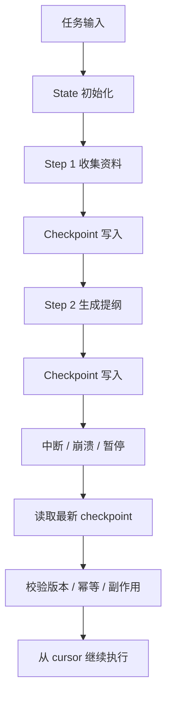
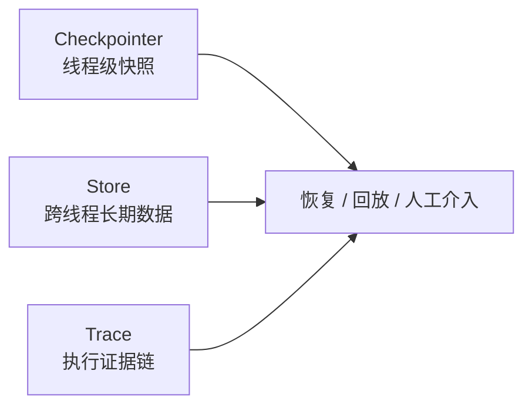

# Agent状态管理与断点续传：Checkpointer机制深度解析

> Agent 真正昂贵的，不是跑一遍。  
> 真正昂贵的是，跑到一半断了，然后又把前面那一半重新跑一遍。

---

## 一、从一个被打断的长任务说起
先看一个很典型的场景。

团队做了一个研报 Agent，流程很朴素：

```text
收集资料 -> 去重归类 -> 生成提纲 -> 写初稿 -> 检查引用 -> 输出报告
```

它平时表现不错。直到某天晚上跑到一半，进程被回收了。
第二天重启后，Agent 重新开始搜索资料、重新做归类、重新生成提纲。

表面上看，它“恢复”了任务。实际上，它只是又做了一遍前半程。

这类问题很常见：

- 中断后不知道停在哪一步
- 重新执行时重复调用了昂贵工具
- 前一次已经拿到的外部结果没有保存
- 人工审批过的状态丢了
- 新版本上线后，旧状态无法继续接

所以，`Checkpointer` 解决的不是“记住聊天内容”。
它解决的是：

```text
这条任务链，能不能从中间停住，再从中间接上。
```

---

## 二、Checkpointer 不是 Memory，也不是 Trace
很多人第一次接触这个话题，会把三件事混在一起。

| 组件 | 负责什么 | 典型用途 |
| :--- | :--- | :--- |
| Checkpointer | 保存某条线程的运行状态快照 | 断点续传、人工接管、回放、容错 |
| Store | 保存跨线程的长期数据 | 用户偏好、知识、长期事实 |
| Trace | 记录执行过程和证据链 | 排障、审计、评估、回溯 |

一句话分清：

```text
Checkpointer 负责“续跑”；
Store 负责“长期记住”；
Trace 负责“看清楚发生了什么”。
```

LangGraph 官方文档也把这层边界说得很清楚：checkpointer 主要用于线程级短期状态，store 适合跨线程的长期数据；两者可以一起用，但职责不同。

---

## 三、状态管理的核心，不是存得多，而是存得对
断点续传最容易犯的错，就是把“状态”理解成一大坨 JSON。

其实真正要存的，通常只有这几类：

| 字段 | 为什么要存 |
| :--- | :--- |
| `thread_id` / `task_id` | 标识这条任务链是谁 |
| `run_id` | 区分同一任务的不同执行轮次 |
| `cursor` | 当前停在第几步 |
| `state_version` | 防止恢复时和新代码不兼容 |
| `plan_version` | 任务拆解是否变了 |
| `artifact_refs` | 外部结果的引用，不一定存原文 |
| `side_effect_ledger` | 记录已经做过哪些不可逆动作 |
| `idempotency_keys` | 防止恢复后重复写外部系统 |
| `human_decisions` | 人工审批过的结论 |

不要把所有中间文本都塞进去。
checkpoint 不是垃圾桶，更不是日志仓库。

### 3.1 该存什么，不该存什么

| 应该存 | 不该直接存 |
| :--- | :--- |
| 步骤游标 | 整段冗长推理过程 |
| 工具调用摘要 | 敏感密钥和原始凭证 |
| 外部结果引用 | 巨大的原始响应全文 |
| 版本号 | 无法追踪来源的临时结论 |
| 人工审批结果 | 过期很快的临时猜测 |

如果你把 checkpoint 存成“全量聊天记录”，恢复时一样会慢。
如果你什么都不存，恢复时就只能重来。

---

## 四、LangGraph 里 Checkpointer 到底做了什么
在 LangGraph 里，checkpointer 的作用很直接：

```text
每完成一个 super-step，就把当前 graph state 持久化一次。
```

这带来三个能力：

1. 任务中断后可以恢复
2. 人工可以在中间介入
3. 可以从旧 checkpoint 做 replay 或 fork

这也是为什么 LangGraph 里常见的做法是：

```text
graph = builder.compile(checkpointer=...)
graph.invoke(
    input,
    config={"configurable": {"thread_id": "..."}}
)
```

这里真正重要的不是 API 形式，而是两个概念：

- 线程级别的状态边界
- 每一步都能落快照

如果图里还有子图，父图编译时带上的 checkpointer 通常会向下传播，这样整条链路才不会在子流程里断掉。

### 4.1 Checkpoint 和 Replay 的区别

LangGraph 的 time-travel 不是“读缓存”。
官方文档里强调得很明确：从旧 checkpoint 重跑时，后面的节点会重新执行，LLM 调用、API 请求和 interrupt 都可能再次发生。

所以：

- checkpoint 负责恢复状态
- replay 负责重走后续路径
- idempotency 负责兜住副作用

这三件事不能混。

---

## 五、断点续传的最小闭环
一个能用的恢复链路，通常长这样：

```text
初始化状态
  -> 执行步骤
  -> 写入 checkpoint
  -> 任务中断
  -> 读取最新 checkpoint
  -> 校验版本和幂等键
  -> 继续从 cursor 往后跑
```



这个闭环里最关键的不是“能恢复”，而是“恢复后不会乱”。

恢复前至少要问三件事：

1. 这条线程是不是同一个任务？
2. 现在的 graph 版本和上次一样吗？
3. 之前做过的外部动作，会不会被重复执行？

如果这三个问题答不清，别直接 resume。

---

## 六、一个可跑的最小实现
下面这个例子不依赖 LangGraph，但它表达的是同一件事：
把任务状态按步骤落盘，恢复时从最后一个 checkpoint 接着跑。

```python
from dataclasses import dataclass, asdict, field
from pathlib import Path
import json
import hashlib
import tempfile


STEPS = ["collect", "outline", "draft", "verify"]


@dataclass
class TaskState:
    task_id: str
    cursor: int = 0
    version: str = "v1"
    status: str = "running"
    summary: str = ""
    artifacts: list[str] = field(default_factory=list)
    side_effects: list[str] = field(default_factory=list)


class FileCheckpointer:
    def __init__(self, root: Path):
        self.root = root
        self.root.mkdir(parents=True, exist_ok=True)

    def path(self, task_id: str) -> Path:
        return self.root / f"{task_id}.json"

    def save(self, state: TaskState) -> None:
        self.path(state.task_id).write_text(
            json.dumps(asdict(state), ensure_ascii=False, indent=2),
            encoding="utf-8",
        )

    def load(self, task_id: str) -> TaskState | None:
        p = self.path(task_id)
        if not p.exists():
            return None
        return TaskState(**json.loads(p.read_text(encoding="utf-8")))


def run_task(task_id: str, cp: FileCheckpointer, crash_at: int | None = None) -> TaskState:
    state = cp.load(task_id) or TaskState(task_id=task_id)

    while state.cursor < len(STEPS):
        step = STEPS[state.cursor]

        if step == "collect":
            state.summary = "已收集资料"
        elif step == "outline":
            state.artifacts.append("outline_done")
        elif step == "draft":
            token = hashlib.sha256(f"{task_id}:{step}".encode("utf-8")).hexdigest()[:8]
            state.side_effects.append(f"draft:{token}")
            state.artifacts.append("draft_done")
        elif step == "verify":
            state.artifacts.append("verify_done")
            state.status = "finished"

        state.cursor += 1
        cp.save(state)

        if crash_at is not None and state.cursor == crash_at:
            raise RuntimeError("simulate interruption")

    return state


if __name__ == "__main__":
    cp = FileCheckpointer(Path(tempfile.gettempdir()) / "checkpointer_demo")

    try:
        run_task("rpt-001", cp, crash_at=2)
    except RuntimeError:
        pass

    resumed = run_task("rpt-001", cp)
    print(resumed.cursor, resumed.status, resumed.artifacts[-1])
```

这段代码会先模拟一次中断，再从 checkpoint 接着跑。
核心不是“代码很短”，而是它说明了三件事：

- `cursor` 决定从哪一步继续
- `save` 发生在每个步骤之后
- 恢复时不会重复执行前面的步骤

如果你的 Agent 会写外部系统，就要再补一层幂等键：

```json
{
  "task_id": "rpt-001",
  "cursor": 2,
  "version": "v1",
  "plan_version": "plan_2026_09_02",
  "status": "paused",
  "artifact_refs": [
    "s3://report-cache/source_set_v1",
    "s3://report-cache/outline_v1"
  ],
  "idempotency_keys": [
    "search:source_set_v1",
    "draft:d9f2a8c1"
  ]
}
```

---

## 七、恢复不是重试，幂等才是保险丝
很多团队把“断点续传”误做成“失败后再来一次”。

这两个不是一回事。

| 场景 | 正确动作 |
| :--- | :--- |
| 网络超时 | 可以重试 |
| 文件缺字段 | 修正输入或回退一步 |
| 图版本变了 | 重新规划，不要盲续 |
| 外部写入已发生 | 用幂等键避免重复写 |
| 人工审批过期 | 重新审批 |

最危险的错误，是恢复后把副作用再做一遍。

比如：

```text
已经创建过工单 -> 恢复后又创建一次
已经发过通知 -> 恢复后再发一次
已经执行过退款 -> 恢复后重复退款
```

这类问题不是 checkpoint 能自动解决的。
你必须把副作用单独记账。

### 7.1 一个简单的恢复规则

```text
如果节点是纯计算，可以直接继续。
如果节点会产生外部副作用，必须检查幂等键。
如果节点的前提条件变了，必须重新规划。
如果节点涉及高风险动作，必须人工确认。
```

这也是为什么检查点不是“状态快照”这么简单。
它更像一条恢复协定。

---

## 八、Checkpointer、Store、Trace 的分工
这三个东西最适合一起用，但不能互相冒充。



更具体一点：

- Checkpointer 记“这次任务跑到哪了”
- Store 记“这个用户长期喜欢什么”
- Trace 记“这次任务到底是怎么跑的”

如果你把 Store 当 Checkpointer，用来恢复任务，很容易漏 cursor。
如果你把 Trace 当 Checkpointer，只能看见过程，看不见可恢复状态。
如果你把 Checkpointer 当 Trace，就会丢证据链，排障很痛苦。

---

## 九、最容易踩的坑

### 9.1 只存对话，不存游标
恢复后还是要从头再算一遍。

### 9.2 把 checkpoint 当日志仓库
快照越来越大，恢复越来越慢。

### 9.3 不记录版本号
一升级就接不上旧状态。

### 9.4 忘记幂等键
恢复一次，副作用多做一次。

### 9.5 只看最终结果，不看中间状态
你会以为 Agent 没问题，直到它在中间步骤里把成本烧穿。

### 9.6 把人工审批状态扔在临时变量里
重启以后，系统就忘了这一步已经批过。

---

## 十、底层存储怎么选
Checkpointer 最后总要落到某种持久层上。选型时别追花活，先看这四件事：

| 方案 | 适合场景 | 要注意什么 |
| :--- | :--- | :--- |
| SQLite | 本地开发、单机 PoC、低并发任务 | 单写者更稳，适合先跑通闭环 |
| PostgreSQL | 生产主路径、多 worker、需要事务和版本控制 | 适合作为权威 checkpoint 存储 |
| Redis | 热状态、短时缓存、临时恢复点 | 不建议作为唯一真相源 |
| 对象存储 | 大型 artifact、回放文件、归档快照 | 只存引用，不要把 state 撑爆 |

一个实用原则是：

```text
权威 checkpoint 放事务型存储；
大对象放对象存储；
state 里只留引用。
```

如果你已经在用 LangGraph，常见做法也是先从 SQLite 起步，再切到 PostgreSQL。核心不是“选了哪家”，而是“恢复时能不能可靠地找到最后一个一致状态”。

## 十一、一个更稳的落地顺序
如果现在还没有 Checkpointer，别一口气做成“全自动时间旅行平台”。

更稳的路线是：

1. 先把 `task_id + cursor + state_version` 存起来
2. 再把关键 artifact 改成引用保存
3. 再给副作用动作加幂等键
4. 再把人工审批状态接进去
5. 再接入 Trace 做回放
6. 最后把高频失败回流到 Evals

这样做的好处很现实：

- 先解决能不能续
- 再解决续得准不准
- 再解决续完会不会出副作用
- 再解决续完后能不能持续优化

---

## 十二、检查清单
做一个能上线的 Checkpointer，至少要确认这些问题。

### 11.1 状态层
- 能否定位到唯一任务线程
- 能否找到最后一个稳定 checkpoint
- 是否记录了步骤游标
- 是否记录了版本号
- 是否保存了关键 artifact 引用

### 11.2 恢复层
- 能否从中断点继续
- 能否避免重复执行已完成步骤
- 能否识别版本不兼容
- 能否区分重试和重规划

### 11.3 副作用层
- 是否给外部写操作加了幂等键
- 是否能识别已经发生过的副作用
- 是否对高风险动作做了人工确认

### 11.4 治理层
- 是否能把失败 checkpoint 转成 Trace
- 是否能把高频恢复失败转成 Evals
- 是否能把反复出错的步骤沉淀成规则

---

## 十三、结尾
Agent 状态管理的目标，不是把系统做得更“健忘”。
它的目标恰恰相反：

```text
让系统知道自己跑到哪了；
让系统知道自己为什么停了；
让系统知道自己该从哪儿接回去；
让系统知道哪些动作不能再做一遍。
```

这就是 Checkpointer 的价值。

它把“跑到一半被打断”这件事，从事故，变成流程。

---

## 参考与延伸

- [LangGraph Persistence](https://docs.langchain.com/oss/python/langgraph/persistence)
- [LangGraph Checkpointers](https://docs.langchain.com/oss/python/langgraph/checkpointers)
- [LangGraph Use Time-travel](https://docs.langchain.com/oss/python/langgraph/use-time-travel)
- [LangGraph Memory](https://docs.langchain.com/oss/python/concepts/memory)
- [LangGraph Subgraphs](https://docs.langchain.com/oss/python/langgraph/use-subgraphs)
- [AI能力工程：从Skill、MCP到Agent](./AI能力工程：从Skill、MCP到Agent.md)
- [Agent的可观测性实战：用Tracing看清你的Agent“大脑”](./Agent的可观测性实战：用Tracing看清你的Agent“大脑”.md)
- [Agent的自动化评估体系（Evals）：从单元测试到集成评测](./Agent的自动化评估体系（Evals）：从单元测试到集成评测.md)
