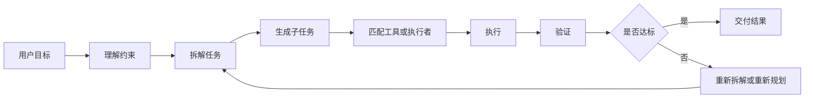
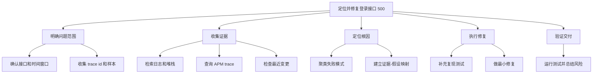
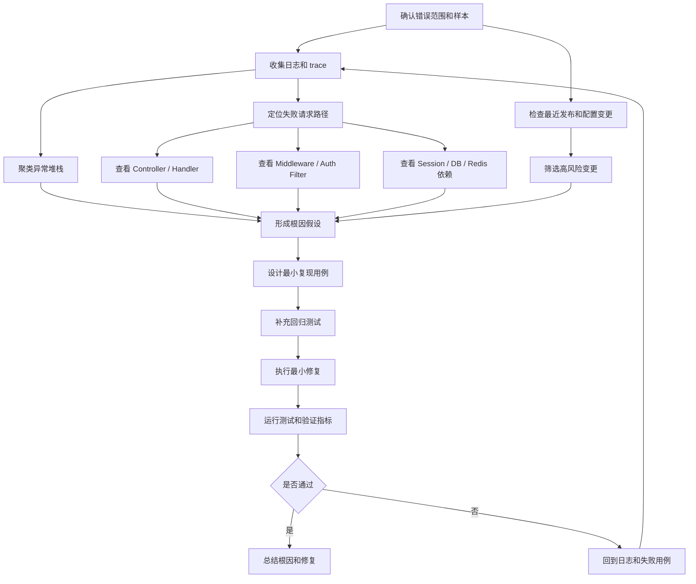
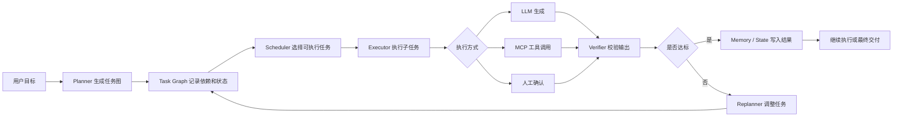

# Agent 的任务拆解艺术：从目标到可执行子任务

> 好的任务拆解，不是把目标切碎，而是把目标转化为一条可执行、可观察、可验证的行动路径。  
> 对 Agent 来说，任务拆解不是写一份待办列表，而是在目标和行动之间建立稳定的工程桥梁。

---

## 一、从一个简单问题开始：为什么 Agent 不能直接开干

先看一个很常见的工程需求。

```text
登录接口线上偶发 500，帮我定位并修复。
```

如果把这个问题直接交给一个普通 LLM，它很可能马上给出一段看起来合理的回答：

```text
登录接口 500 可能来自数据库连接异常、Token 校验失败、缓存超时、并发过高或空指针问题。
建议检查日志、重启服务、优化数据库连接池，并增加异常捕获。
```

这段回答不能说完全错误。它列出的确实是常见原因，也给出了一些常见动作。但如果你真的要让 Agent 去修线上问题，这样的回答几乎不能直接使用。

它的问题很明显：

- 它没有确认错误发生在哪个环境、哪个接口版本、哪类用户请求上。
- 它没有拿到请求样本、trace id、日志堆栈或监控指标。
- 它没有区分“可能原因”和“已经被证据支持的根因”。
- 它没有判断最近是否有发布、配置变更、依赖波动或流量异常。
- 它没有说明应该先查什么、后查什么，哪些任务可以并行。
- 它没有给出最小修复范围，也没有补充回归测试。
- 它没有定义验收标准：怎样证明这个 500 已经被修复，并且没有引入新问题。

这就是很多 Agent 系统在早期阶段容易出现的问题：看起来会回答，实际上没有完成任务。

一个线上故障目标通常不是一个动作，而是一组互相依赖的动作。用户说“登录接口偶发 500”，这句话里面至少包含了几个隐含问题：

```text
错误发生在哪个接口和环境？
偶发的比例是多少，影响哪些用户？
有没有可复现样本或 trace id？
日志堆栈指向哪一层？
最近是否有代码、配置或依赖变更？
最小修复点在哪里？
需要补什么测试？
怎样验证修复已经生效？
```

如果 Agent 不先把这些问题拆开，就会把“定位并修复”误认为一个动作，最后要么停留在泛泛建议，要么贸然修改代码。

所以，任务拆解的第一个价值，就是把一句模糊目标转成一组可执行问题。

```text
目标不是任务，任务不是动作，动作不是结果，结果还需要验证。
```

对 Agent 来说，任务拆解不是锦上添花，而是从“会说”走向“会做”的必要步骤。

---

## 二、任务拆解的第一性原理：从目标到行动闭环

在 Agent 的执行闭环里，任务拆解位于“目标理解”和“工具执行”之间。

如果用一条链路表示，一个完整 Agent 通常会经历：

```text
目标 -> 上下文 -> 计划 -> 任务拆解 -> 工具/动作 -> 反馈 -> 验证 -> 状态更新 -> 输出或继续
```

这里的“计划”和“任务拆解”很接近，但重点不同。

计划回答的是：

```text
为了完成目标，大体要经过哪些阶段？
```

任务拆解回答的是：

```text
每个阶段具体由谁来做、用什么做、输入是什么、输出是什么、怎样算完成？
```

可以把它们的关系理解成：

```text
规划告诉 Agent 应该走哪条路；
任务拆解告诉 Agent 每一步具体怎么走、谁来做、怎么验收。
```

一个比较完整的任务闭环可以画成这样：



这张图里面最关键的不是“拆解”两个字，而是闭环。

很多系统会把任务拆成一串步骤，但拆完以后就不管了。这样的拆解仍然很脆弱。真正可靠的任务拆解，必须让每个子任务都进入可执行闭环。

一个好的子任务至少要满足六个条件。

| 标准 | 说明 | 反例 |
| :--- | :--- | :--- |
| 清晰 | 子任务知道要做什么 | 分析一下情况 |
| 可执行 | 能映射到动作、工具或人工确认 | 修一下登录 |
| 可验证 | 有完成标准 | 尽量稳定一点 |
| 有边界 | 知道不做什么 | 把所有代码都看看 |
| 有依赖 | 知道前置条件 | 先改代码，再看日志 |
| 可恢复 | 失败后知道怎么处理 | 查不到日志就停止 |

比如，“排查登录问题”不是一个好的子任务，因为它太宽泛。更好的写法是：

```text
检索过去 24 小时 /api/login 的 500 错误日志，按异常堆栈和请求来源聚类，输出 Top 3 堆栈、样本 trace id、影响比例和首次出现时间。
```

它有时间范围，有数据对象，有动作，有输出格式，也有验收标准。这样的子任务才有可能被 Agent 稳定执行。

一句话总结：

```text
任务拆解不是列待办项，而是为 Agent 创建可执行、可验证、可恢复的工作单元。
```

---

## 三、第一种模式：层级分解，把大目标拆成小目标

最容易理解的任务拆解方式，是层级分解。

它的基本思路是：先从总目标开始，把目标拆成几个阶段，再把每个阶段继续拆成更小的子任务，直到拆到可以执行的粒度。

结构类似这样：

```text
总目标
  -> 阶段任务
      -> 子任务
          -> 原子动作
```

以前面的登录接口 500 为例。

总目标是：

```text
定位并修复登录接口线上偶发 500。
```

如果使用层级分解，可以拆成五个阶段。

```text
1. 明确问题范围
   1.1 确认接口路径、环境和服务版本
   1.2 确认错误时间窗口和影响范围
   1.3 收集失败请求样本、trace id 和用户上下文
   1.4 明确是否允许修改代码、配置或只做诊断

2. 收集证据
   2.1 检索应用日志和异常堆栈
   2.2 查询 APM trace 和慢请求记录
   2.3 查看登录链路依赖：DB、Redis、Session、第三方认证
   2.4 检查最近发布记录、配置变更和依赖变更
   2.5 检查监控指标：错误率、延迟、连接池、缓存命中率

3. 定位根因
   3.1 按堆栈、请求参数、用户分群和时间分布聚类
   3.2 判断错误是否集中在某条代码路径或某个依赖
   3.3 建立“现象-证据-假设”映射
   3.4 找到最小复现条件
   3.5 选出最小修复点

4. 执行修复
   4.1 补充能复现问题的测试用例
   4.2 修改最小范围代码或配置
   4.3 增加必要的边界处理和日志
   4.4 运行相关测试和静态检查

5. 验证交付
   5.1 确认新增测试通过
   5.2 确认登录主路径和异常路径不回归
   5.3 输出根因、修改点、验证结果和剩余风险
   5.4 如涉及生产发布，给出发布和回滚建议
```

这比直接回答“检查日志、重启服务、优化连接池”要可靠得多。因为它让 Agent 先意识到：线上问题不是靠猜原因解决的，而是靠证据链、最小复现、最小修改和验证闭环解决的。

也可以画成一个任务树：



层级分解的优点很明显：结构清晰，容易理解，适合工程排障、调研分析、方案设计、文档整理这类复杂任务。

但它也有局限。

第一，层级分解容易生成漂亮的大纲，却不一定生成可执行任务。比如“收集证据”“定位根因”仍然偏抽象，需要继续拆成具体动作。

第二，层级结构不能充分表达依赖关系。它能告诉我们有哪些任务，却不能清楚说明哪些任务必须先做，哪些任务可以并行。

第三，层级太深会增加管理成本。如果一个目标被拆成几十个小步骤，Agent 反而可能迷失在任务树里，不知道当前最重要的路径是什么。

因此，层级分解适合作为第一步。它负责展开任务全貌，但不能止步于任务树。

工程上更好的做法，是把任务树的叶子节点继续转成可执行任务对象。

例如：

```json
{
  "id": "task_login_error_logs",
  "name": "检索登录接口 500 错误日志",
  "goal": "找到登录接口偶发 500 的主要失败模式和样本证据",
  "type": "collect",
  "depends_on": ["confirm_scope"],
  "input": {
    "service": "auth-service",
    "endpoint": "/api/login",
    "date_range": "last_24_hours",
    "status_code": 500
  },
  "action": "检索并聚类登录接口 500 错误日志",
  "tool": "search_application_logs",
  "output": {
    "error_clusters": "按异常堆栈聚类的错误样本",
    "sample_trace_ids": "代表性 trace id",
    "impact_ratio": "影响比例",
    "first_seen": "首次出现时间"
  },
  "done_when": "得到至少一个可追踪的失败模式，或明确日志不足并给出替代证据路径",
  "failure_policy": "如果应用日志不可用，则改查 APM trace、网关日志和监控告警",
  "permission": "auto",
  "status": "pending"
}
```

当一个子任务能写到这个程度，它才真正从“思路”变成了“工作单元”。

---

## 四、第二种模式：依赖图，把任务关系讲清楚

层级分解回答的是“有哪些任务”，依赖图回答的是“任务之间是什么关系”。

真实任务里，很多子任务不是线性排列的。有些任务必须先做，有些任务可以并行，有些任务只有在前一个结果失败时才会触发。

比如在登录接口排障里：

- 没有错误样本，就很难判断偶发 500 是否真实存在。
- 没有 trace id，就很难从网关日志一路追到应用堆栈。
- 没有堆栈和监控，就很难区分代码缺陷、依赖异常和流量问题。
- 没有最小复现条件，就很难判断修复是否命中根因。
- 没有测试验证，就不能证明修复没有引入回归。

这时候，仅仅有任务树是不够的。我们需要把任务之间的依赖关系表达出来。



这张图比任务树多表达了三类信息。

第一，前置条件。比如“收集日志和 trace”必须在“形成根因假设”之前完成，否则很容易靠猜测改代码。

第二，并行机会。检查最近发布、查询监控指标、读取应用日志可以并行执行，因为它们都依赖同一个错误范围。

第三，汇聚节点。真正的根因判断不是来自单一线索，而是来自日志、trace、代码路径、依赖状态和最近变更的交叉验证。

这个例子也说明，任务拆解不是为了让 Agent 显得“考虑周全”，而是为了避免错误行动。

修复登录接口前，Agent 需要先知道错误发生在哪条路径、什么条件触发、堆栈指向哪里、相关依赖是否异常。否则它可能只是随机修改登录代码，甚至引入新的问题。

依赖图的工程价值主要有四个：

- 它能表达前置条件，避免顺序错误。
- 它能发现可并行任务，提高执行效率。
- 它能识别关键路径，让 Agent 优先处理阻塞节点。
- 它能支持失败重试和重新规划。

当然，依赖图也有局限。初始依赖可能判断错误，图太复杂会难以维护，动态任务还需要支持执行过程中调整图结构。

这里就涉及动态重规划。动态重规划不是任务失败后把整张图推倒重拆，而是在已有依赖图上做增量更新：保留已经完成且仍然有效的节点，只替换、追加或跳过受影响的局部分支。

以登录接口 500 为例，Agent 一开始可能假设问题来自数据库连接池，于是生成了“检查 DB 连接池”“查看慢查询”“验证连接泄漏”几个节点。但日志聚类后出现了新证据：所有 500 都集中在 OAuth 回调路径，堆栈指向 `user_profile.email` 为空。这时系统不应该整体重拆，而应该这样更新任务图：

```text
1. 保留已完成节点：错误范围确认、日志收集、trace 聚类。
2. 标记受影响节点：DB 连接池相关排查降级为 skipped 或 low_priority。
3. 追加新节点：阅读 OAuth 回调代码、构造 email 为空的复现用例、检查第三方用户资料契约。
4. 重连依赖边：让新复现用例依赖日志样本，让最小修复依赖 OAuth 代码阅读和复现测试。
5. 继续执行：Scheduler 只调度新增或重新打开的 pending 节点，不重复执行已经验证过的任务。
```

动态重规划通常由几类事件触发：任务失败、工具返回空结果、Verifier 判定不达标、出现新证据、用户修改目标、权限被拒绝。每次触发时，Replanner 都应该先判断影响范围，而不是重新生成完整计划。

工程上可以把它写成一个很简单的策略：

```text
新证据只推翻局部假设 -> 局部改图。
目标发生变化 -> 重新评估关键路径。
核心前提被推翻 -> 才整体重规划。
```

所以在实际系统里，不要一开始就追求完美 DAG。更实用的方式是：先生成一版粗粒度依赖图，在执行过程中根据反馈增量更新。

一句话总结：

```text
层级分解解决“任务有哪些”，依赖图解决“任务之间如何协作”。
```

---

## 五、第三种模式：输入输出分解，让每个子任务可交付

很多 Agent 计划失败，不是因为没有拆任务，而是因为子任务只有名字，没有输入、输出和完成标准。

比如：

```text
查看日志。
```

这句话看起来像任务，其实不够可靠。它没有说明：

- 查看哪个服务的日志？
- 查看哪个接口、哪个状态码、哪个时间范围？
- 输出原始日志、异常聚类、trace id 还是根因假设？
- 怎样算查看完成？
- 如果日志权限不足或日志缺失怎么办？

更好的写法是：

```json
{
  "id": "cluster_login_errors",
  "name": "聚类登录接口 500 错误",
  "goal": "聚类登录接口最近 24 小时的 500 错误，找到主要失败模式",
  "type": "analyze",
  "depends_on": ["collect_logs"],
  "input": {
    "service": "auth-service",
    "endpoint": "/api/login",
    "date_range": "last_24_hours",
    "status_code": 500,
    "min_sample_size": 20
  },
  "action": "按 exception type 和 stack trace 聚类错误日志，抽取代表性 trace id，并统计每类错误占比",
  "tool": "cluster_error_logs",
  "output": {
    "error_clusters": "错误类型和堆栈聚类",
    "sample_trace_ids": "代表性请求样本",
    "ratio": "每类错误占比",
    "first_seen": "首次出现时间",
    "confidence": "置信度"
  },
  "done_when": "至少识别一个主要失败模式，或明确样本不足并给出下一步证据来源",
  "failure_policy": "如果日志样本不足，则改查网关日志、APM trace 和告警记录",
  "permission": "auto",
  "status": "pending"
}
```

这就是输入输出分解。

它的核心问题不是“这个任务叫什么”，而是“这个任务接收什么，产出什么”。

一个可交付子任务通常可以用下面这个模板描述：

```json
{
  "id": "task_id",
  "name": "子任务名称",
  "goal": "这个子任务要完成什么",
  "type": "collect|analyze|execute|verify|confirm",
  "depends_on": [],
  "input": {},
  "action": "具体执行动作",
  "tool": "使用的工具；如果不需要工具则为 null",
  "output": {},
  "done_when": "完成标准",
  "failure_policy": "失败时如何处理",
  "permission": "auto|requires_human_confirmation",
  "status": "pending|running|awaiting_confirmation|done|failed|skipped"
}
```

这个模板看起来有点工程化，但它解决了一个关键问题：让子任务可以被调度。这里可以把它当作全文统一的权威 schema：后面的 Prompt 输出和 Python `Task` 类，都应与这组字段保持一致。

如果一个任务没有输入，Executor 不知道从哪里开始。  
如果一个任务没有输出，后续任务不知道依赖什么。  
如果一个任务没有完成标准，Verifier 不知道怎么验收。  
如果一个任务没有失败策略，系统就无法恢复。

这也是为什么生产级 Agent 不能只依赖自然语言步骤，而要把任务变成结构化对象。

一句话总结：

```text
没有输入输出的子任务只是想法，有完成标准的子任务才是可执行工作单元。
```

---

## 六、第四种模式：工具映射分解，把任务接到 MCP 能力上

Agent 的任务拆解不能只停留在自然语言层。最终，每个子任务要么由模型生成内容，要么由工具执行，要么需要人工确认。

所以拆解之后，还要继续问一个问题：

```text
这个子任务靠什么完成？
```

以前面的登录接口排障为例，任务和能力可以这样映射：

| 子任务 | 需要的能力 | 可能的工具 |
| :--- | :--- | :--- |
| 检索应用日志 | 日志查询 | `search_logs` |
| 查询请求链路 | APM / Trace 查询 | `query_traces` |
| 查看最近发布 | CI/CD 或发布系统读取 | `list_deployments` |
| 检查配置变更 | 配置中心读取 | `read_config_history` |
| 阅读相关代码 | 代码检索和文件读取 | `repo_search` / `read_file` |
| 补充测试 | 代码编辑 | `edit_file` |
| 运行测试 | 命令执行 | `run_tests` |
| 验证错误率 | 指标查询 | `query_metrics` |
| 总结修复 | 内容生成 | LLM 写作能力 |

这就把任务拆解和 MCP 连接起来了。

MCP 解决的是：工具和资源如何标准化暴露。  
任务拆解解决的是：Agent 应该在什么时候调用哪个工具和资源。

可以理解为：

```text
MCP 提供能力货架；
任务拆解决定拿哪件工具、在什么步骤使用、产出给谁。
```

一个子任务如果无法映射到任何工具、数据源、模型能力或人工确认，通常说明它还不够具体。

比如：

```text
判断登录为什么不稳定。
```

这个任务太抽象，无法直接映射到工具。应该继续拆成：

```text
1. 查询登录接口 500 错误率曲线。
2. 检索对应时间窗口的异常日志。
3. 按堆栈聚类失败样本。
4. 对照最近发布和配置变更。
5. 阅读命中堆栈对应的代码路径。
6. 编写复现测试并验证修复。
```

每一步都可以找到对应能力。

在工程实现中，工具映射还需要考虑权限和风险。

比如“读取日志”是只读操作，可以自动执行；“修改代码”需要限定范围；“发布到生产环境”会影响真实用户，必须进入人工确认；“修改线上配置”可能扩大故障，也必须设置权限门禁。

所以一个更完整的任务对象，还应该包含权限等级。

```json
{
  "id": "deploy_login_fix",
  "name": "发布登录接口修复",
  "goal": "在用户确认后发布登录接口修复，并保留回滚路径",
  "type": "execute",
  "depends_on": ["run_login_tests", "summarize_fix"],
  "input": {
    "service": "auth-service",
    "change_summary": "待生成",
    "rollback_plan": "待生成"
  },
  "action": "创建发布任务并绑定回滚方案",
  "tool": "deployment_tool",
  "output": {
    "deployment_id": "发布任务 ID",
    "version": "发布版本号",
    "rollback_plan": "回滚方案"
  },
  "done_when": "用户确认发布窗口、影响范围和回滚方案后，创建发布任务",
  "failure_policy": "如果未获得确认，则只输出发布建议，不调用发布工具",
  "permission": "requires_human_confirmation",
  "status": "pending"
}
```

这类设计可以避免 Agent 从“排障助手”突然变成“未经确认的生产执行器”。

工具映射分解的本质，是把自然语言任务接入真实世界能力，同时保留边界、权限和可恢复性。

---

## 七、第五种模式：验证导向分解，从终局倒推任务

很多 Agent 输出失败，不是因为没有做事，而是因为不知道“做对了”是什么。

所以任务拆解时，可以先定义最终验收标准，再倒推需要哪些子任务。

还是登录接口 500 这个例子。最终交付必须满足：

```text
1. 说明错误范围：接口、环境、时间窗口、影响比例。
2. 给出证据链：日志、trace、监控、最近变更或复现用例。
3. 说明根因，而不是只列可能原因。
4. 修复范围尽量小，并解释为什么改这里。
5. 至少补充一个能覆盖问题的回归测试。
6. 相关测试通过。
7. 标注剩余风险、上线建议和回滚方式。
```

从这些验收标准往回倒推，就会得到对应的子任务。

| 验收标准 | 倒推出的子任务 |
| :--- | :--- |
| 说明错误范围 | 查询错误率、确认接口路径和时间窗口 |
| 给出证据链 | 收集日志、trace、监控和最近变更 |
| 说明根因 | 建立现象-证据-假设映射并验证 |
| 修复范围小 | 定位最小修改点，避免无关重构 |
| 补充回归测试 | 设计复现用例并加入测试集 |
| 测试通过 | 运行相关测试、必要时运行回归测试 |
| 标注风险 | 总结影响范围、残余风险、上线和回滚建议 |

这类拆解很适合代码修复、故障排查、数据分析、研究报告、内容交付等任务。

如果最终验收标准只是“回答看起来合理”，Agent 会倾向于生成一段漂亮总结。  
如果最终验收标准包含“测试通过、根因明确、风险可控”，Agent 才会围绕工程质量组织行动。

这就是验证导向分解。

它的好处是让 Agent 不会只追求“完成动作”，而是围绕“交付质量”组织行动。

一句话总结：

```text
验证导向分解的关键，是先定义终点，再倒推路径。
```

---

## 八、Prompt 工程如何实现可靠拆解

很多人第一次做 Agent Planner 时，会写一个很短的 Prompt：

```text
请把这个任务拆解一下。
```

这个 Prompt 太松了。模型可能会生成一份漂亮大纲，但大纲不一定可执行。

更可靠的 Prompt 应该明确拆解目标、任务类型、输出结构、反例约束和验收规则。

例如：

```text
你是一个 Agent Planner。
请把用户目标拆成可执行子任务。

要求：
1. 先复述目标和已知约束。
2. 区分信息收集、分析判断、执行产出、验证检查、人工确认五类任务。
3. 每个子任务必须包含：输入、动作、工具、输出、完成标准、失败处理、权限、状态。
4. 标明任务依赖关系。
5. 标明哪些任务需要工具，哪些任务需要人工确认。
6. 不要输出无法执行的泛化动作，例如“优化稳定性”“深入排查”“提升质量”。
7. 如果信息不足，生成“需要确认”的子任务，而不是编造前提。

输出 JSON：
{
  "goal": "",
  "assumptions": [],
  "questions": [],
  "tasks": [
    {
      "id": "",
      "name": "",
      "goal": "",
      "type": "collect|analyze|execute|verify|confirm",
      "depends_on": [],
      "input": {},
      "action": "",
      "tool": "",
      "output": {},
      "done_when": "",
      "failure_policy": "",
      "permission": "auto|requires_human_confirmation",
      "status": "pending|running|awaiting_confirmation|done|failed|skipped"
    }
  ]
}
```

这个 Prompt 的重点不是让模型“多想一点”，而是约束它生成可以进入系统执行的结构。

对登录接口 500，Planner 的输出可以类似这样：

```json
{
  "goal": "定位并修复登录接口线上偶发 500",
  "assumptions": ["如果用户未提供时间窗口，默认先分析最近 24 小时，并在总结中标注"],
  "questions": ["服务名和接口路径是否为 auth-service /api/login？", "是否允许修改代码并运行测试？"],
  "tasks": [
    {
      "id": "confirm_scope",
      "name": "确认错误范围",
      "goal": "确认登录接口排障所需的最小上下文和执行边界",
      "type": "confirm",
      "depends_on": [],
      "input": {"user_goal": "原始需求"},
      "action": "确认服务名、接口路径、环境、时间窗口和可执行权限",
      "tool": "human_confirmation",
      "output": {"service": "", "endpoint": "", "env": "", "date_range": "", "execution_scope": ""},
      "done_when": "得到排障范围，或明确采用默认假设",
      "failure_policy": "如果用户暂不确认，则只做只读诊断并标注假设",
      "permission": "requires_human_confirmation",
      "status": "pending"
    },
    {
      "id": "collect_logs",
      "name": "收集错误日志和 trace",
      "goal": "找到登录接口 500 的主要失败模式和代表性证据",
      "type": "collect",
      "depends_on": ["confirm_scope"],
      "input": {"service": "from confirm_scope", "endpoint": "from confirm_scope", "date_range": "from confirm_scope"},
      "action": "查询 500 日志、异常堆栈、trace id 和错误率曲线",
      "tool": "search_logs_and_traces",
      "output": {"error_clusters": "按堆栈聚类的失败样本"},
      "done_when": "得到至少一个主要失败模式和代表性 trace id",
      "failure_policy": "如果日志不可用，则改查网关日志、APM trace 和监控告警",
      "permission": "auto",
      "status": "pending"
    },
    {
      "id": "verify_fix",
      "name": "验证修复结果",
      "goal": "确认修复命中根因，并且测试、风险说明和交付信息完整",
      "type": "verify",
      "depends_on": ["apply_fix", "run_tests"],
      "input": {"test_result": "from run_tests", "change_summary": "from apply_fix"},
      "action": "检查测试是否通过，修复是否命中根因，是否存在未说明风险",
      "tool": "rule_based_checker",
      "output": {"quality_check": "通过项和风险项"},
      "done_when": "根因、修改点、测试结果和剩余风险都已说明",
      "failure_policy": "如果验证失败，则回到失败用例和日志重新定位",
      "permission": "auto",
      "status": "pending"
    }
  ]
}
```

这里有一个重要细节：Prompt 里要允许“不知道”。

如果信息不足，可靠的 Planner 不应该编造服务名、trace id 或根因，而应该生成确认任务，或者在可接受的情况下使用默认假设并明确标注。

因此，Prompt 工程的关键不是写更华丽的提示词，而是把拆解结果约束成可执行结构。

---

## 九、结构化编程如何实现可靠拆解

Prompt 可以生成候选拆解，但生产系统不能只依赖 Prompt。

真正可用的 Agent 还需要结构化程序来管理任务。

至少要处理这些问题：

- Schema 校验：任务字段是否完整。
- 依赖校验：依赖任务是否存在，是否形成环。
- 权限校验：是否调用了高风险工具。
- 工具校验：任务声明的工具是否可用。
- 状态管理：任务是 pending、running、awaiting_confirmation、done、failed 还是 skipped。
- 输出校验：任务产出是否符合下游需要。
- 失败恢复：重试、降级、请求人工确认或重新规划。
- 执行日志：记录每一步做了什么，方便复盘。

一个与上面 JSON schema 对齐的简化任务对象可以这样设计：

```python
from dataclasses import dataclass, field
from typing import Any, Literal


TaskType = Literal["collect", "analyze", "execute", "verify", "confirm"]
TaskStatus = Literal["pending", "running", "awaiting_confirmation", "done", "failed", "skipped"]
Permission = Literal["auto", "requires_human_confirmation"]


@dataclass
class Task:
    id: str
    name: str
    goal: str
    type: TaskType
    depends_on: list[str] = field(default_factory=list)
    input: dict[str, Any] = field(default_factory=dict)
    action: str = ""
    tool: str | None = None
    output: dict[str, Any] = field(default_factory=dict)
    done_when: str = ""
    failure_policy: str = ""
    permission: Permission = "auto"
    status: TaskStatus = "pending"
```

执行器的基本逻辑可以写成：

```python
while not graph.done():
    ready_tasks = graph.get_ready_tasks()

    if not ready_tasks:
        replanner.resolve_blocked_graph(graph)
        continue

    for task in ready_tasks:
        if permission.requires_confirmation(task):
            graph.mark_awaiting_confirmation(task.id)
            request_human_confirmation(task)
            continue

        result = executor.run(task)

        if verifier.pass_(task, result):
            graph.mark_done(task.id, result)
        else:
            replanner.handle_failure(task, result)
```

这里有一个容易忽略的细节：`get_ready_tasks()` 只能返回 `pending` 状态的任务。需要人工确认的任务一旦触发确认请求，就要先标记为 `awaiting_confirmation`，等用户确认后再由外部事件把它恢复为 `pending` 或直接推进到 `running`。否则下一轮循环会再次取到同一个任务，重复发起确认请求。

这段伪代码背后的思想很简单：

```text
Prompt 负责生成候选拆解；
程序负责让拆解可执行、可校验、可恢复。
```

在真实系统里，还可以进一步拆出几个角色。

| 组件 | 职责 |
| :--- | :--- |
| Planner | 根据目标生成任务图 |
| Scheduler | 根据依赖关系选择可执行任务 |
| Executor | 调用模型、工具或人工流程 |
| Verifier | 校验子任务输出是否达标 |
| Memory | 保存上下文、历史经验和中间结果 |
| Permission | 控制高风险动作是否需要确认 |
| Replanner | 失败时调整任务图或生成替代路径 |
| Observability | 记录日志、状态、耗时和错误 |

如果没有这些结构化组件，Agent 很容易变成“模型一次性生成计划，然后按感觉执行”。这在 Demo 里可能有效，但进入复杂任务后会快速失控。

比如登录接口排障中，如果 `collect_logs` 失败，系统不应该直接终止。它可以尝试三种恢复路径：

```text
1. 降级：从应用明细日志退化为网关日志和监控指标。
2. 替代：改用 APM trace、错误告警和最近发布记录推断高风险路径。
3. 确认：请求用户补充日志权限、错误样本或部署记录。
```

这就是“可恢复”的意义。

工程上，任务拆解不是单独存在的。它必须和状态、工具、验证、权限、记忆一起工作，才能形成一个稳定 Agent。

---

## 十、如何评估任务拆解质量

到这里，还缺一个关键问题：怎样判断一次任务拆解是好是坏？

如果没有评估指标，任务拆解很容易变成“看起来有条理”。模型列出十几个步骤，读者觉得完整，系统也照着执行，但真正运行时才发现：有些任务没有输入，有些任务没有输出，有些任务没有依赖顺序，有些任务需要权限却没有确认，有些任务失败后没有恢复路径。

所以，任务拆解也需要质量评估。

### 10.1 一组可操作的评估指标

可以把任务拆解质量拆成十个维度。

| 指标 | 要问的问题 | 登录接口 500 中的合格表现 |
| :--- | :--- | :--- |
| 目标覆盖度 | 子任务是否覆盖最终交付目标 | 覆盖错误范围、根因、修复、测试、风险说明 |
| 可执行性 | 每个任务是否能落到具体动作 | 不是“排查问题”，而是“检索最近 24 小时登录 500 日志” |
| 输入完整性 | 执行前是否知道需要哪些输入 | 包含服务名、接口路径、环境、时间窗口、状态码 |
| 输出明确性 | 任务产出是否能被后续任务使用 | 输出 trace id、异常堆栈、错误占比、首次出现时间 |
| 依赖正确性 | 是否先拿证据，再形成结论 | 先日志和 trace，再根因假设，再修复代码 |
| 粒度合理性 | 任务是否既不太粗也不太碎 | “聚类错误日志”可独立交付，“点击查询按钮”不单独成任务 |
| 工具匹配度 | 每个任务是否能映射到工具、模型或人工确认 | 日志查询用 `search_logs`，测试执行用 `run_tests` |
| 可验证性 | 是否有明确完成标准 | “相关测试通过，并说明根因、修改点和剩余风险” |
| 可恢复性 | 失败时是否有替代路径 | 日志不可用时改查网关日志、APM trace 和监控告警 |
| 权限安全性 | 高风险动作是否需要确认 | 发布服务、修改生产配置必须进入人工确认 |

这十个指标不是为了写成一张漂亮表格，而是为了让 Agent 在执行前就能发现拆解缺陷。

如果一个任务没有输入，它执行不了。  
如果一个任务没有输出，它无法被下游依赖。  
如果一个任务没有完成标准，它无法被验证。  
如果一个任务没有失败路径，它无法恢复。  
如果一个任务没有权限边界，它可能越权执行。

### 10.2 运行期指标：让拆解质量可观测

上面的十个维度适合在执行前做静态检查。到了真实运行环境，还需要看运行期指标，因为很多拆解问题只有执行后才会暴露。

可以重点观察三类指标。

| 运行指标 | 计算方式 | 说明 |
| :--- | :--- | :--- |
| 子任务可执行率 | 可直接进入 Executor 的任务数 / 总任务数 | 如果比例低，说明任务过于抽象、缺少输入或工具映射不足 |
| 平均重规划次数 | 单个目标执行过程中的重规划次数 / 目标数 | 如果过高，说明初始拆解不稳定，或任务边界和失败策略设计不好 |
| 关键路径阻塞时长 | 关键路径任务处于 blocked / awaiting_confirmation 的累计时间 | 如果过长，说明依赖设计、权限确认或外部资源获取存在瓶颈 |

以登录接口 500 为例，如果 12 个子任务里只有 5 个能直接执行，其他都需要临时补参数、补工具、补权限，那么“子任务可执行率”只有 41.7%。这说明问题不在 Executor，而在 Planner 拆出来的任务不够完整。

如果一次排障过程中反复重规划 6 次以上，也不一定说明 Agent 很聪明，可能说明初始拆解没有先确认错误范围、日志入口和最近变更。动态重规划是必要能力，但平均重规划次数过高，通常意味着拆解质量偏低。

关键路径阻塞时长则更接近工程管理指标。比如“等待生产日志权限”阻塞了后续所有根因分析任务，那么这个节点就是关键路径。系统应该把它标出来，而不是继续生成更多无法执行的下游任务。

### 10.3 一个简单评分方法

工程上可以给每个指标打 0 到 2 分。

| 分数 | 含义 |
| :--- | :--- |
| 0 分 | 缺失或完全不可执行 |
| 1 分 | 有描述，但不够明确，执行时仍需大量猜测 |
| 2 分 | 清晰、可执行、可验证，可以进入调度系统 |

总分可以简单计算为：

```text
拆解质量得分 = 实际得分 / (指标数量 * 2) * 100
```

比如一个登录接口 500 的坏拆解：

```text
1. 查看日志。
2. 分析原因。
3. 修复代码。
4. 测试一下。
```

这份拆解看起来有步骤，但质量很低。

| 指标 | 评分 | 原因 |
| :--- | :--- | :--- |
| 目标覆盖度 | 1 | 提到了修复和测试，但没有风险说明和交付标准 |
| 可执行性 | 1 | “查看日志”“分析原因”仍然过于抽象 |
| 输入完整性 | 0 | 没有服务名、接口、环境、时间窗口 |
| 输出明确性 | 0 | 不知道每一步产出什么 |
| 依赖正确性 | 1 | 大方向顺序正确，但缺少证据到根因的连接 |
| 粒度合理性 | 1 | 粒度偏粗 |
| 工具匹配度 | 0 | 没有说明使用哪些工具 |
| 可验证性 | 0 | “测试一下”没有通过标准 |
| 可恢复性 | 0 | 日志查不到、测试失败都没有处理策略 |
| 权限安全性 | 0 | 没有区分本地修改、生产配置和发布动作 |

它的得分只有 4 / 20，也就是 20 分。这样的拆解不应该直接进入执行。

一份更好的拆解会写成：

```text
1. 确认 auth-service /api/login 在生产环境最近 24 小时的 500 错误范围，输出错误率、影响用户数和样本 trace id。
2. 检索这些 trace id 对应的应用日志、网关日志和 APM trace，按异常堆栈聚类，输出主要失败模式。
3. 对照最近 24 小时的发布记录、配置变更和依赖告警，形成根因假设，并标注证据来源。
4. 为最可信根因补充最小复现测试，确认测试在修复前失败。
5. 执行最小代码修复或配置修复，避免无关重构。
6. 运行登录相关测试，验证正常登录、无效 Token、Session 过期和异常依赖场景。
7. 输出根因、修改点、测试结果、剩余风险；如需发布生产，先生成发布和回滚方案并等待人工确认。
```

这份拆解虽然也只有七步，但每一步都有输入、动作、输出和验收方向，也保留了权限边界。它更适合交给 Agent 执行。

### 10.4 比评分更重要的硬性门槛

评分适合排序和比较，但生产系统还需要硬性门槛。

有些问题不是“扣几分”，而是“不能执行”。

可以设置几条拒绝规则：

```text
1. 高风险任务没有 permission 字段，拒绝执行。
2. 任务依赖了不存在的 task id，拒绝执行。
3. 依赖图存在环，拒绝执行。
4. 子任务缺少 done_when，拒绝执行。
5. 子任务缺少 output，拒绝进入下游依赖。
6. 工具任务没有 tool，拒绝进入 Executor。
7. 执行型任务没有 failure_policy，拒绝进入自动执行。
```

这类规则可以放在 Scheduler 或 Verifier 之前，作为任务图进入执行系统的质量门禁。

```python
def validate_task_graph(tasks: list[Task]) -> None:
    task_ids = {task.id for task in tasks}

    for task in tasks:
        if task.permission == "requires_human_confirmation" and task.status != "pending":
            raise ValueError(f"high-risk task has invalid initial status: {task.id}")

        if any(dep not in task_ids for dep in task.depends_on):
            raise ValueError(f"task depends on missing task: {task.id}")

        if not task.done_when:
            raise ValueError(f"task has no completion criteria: {task.id}")

        if task.type in {"collect", "execute", "verify"} and task.tool is None:
            raise ValueError(f"tool task has no tool: {task.id}")

        if task.type == "execute" and not task.failure_policy:
            raise ValueError(f"execute task has no failure policy: {task.id}")
```

这段伪代码并不完整，但它表达了一个重要思想：任务拆解质量不能只靠人读，也应该能被程序检查。

### 10.5 本节小结

任务拆解质量可以用一句话判断：

```text
一个好的拆解，应该让 Executor 知道怎么做，让 Verifier 知道怎么验收，让 Replanner 知道失败后怎么恢复。
```

如果拆解只能让读者觉得“思路清楚”，但不能让系统稳定执行，它仍然只是大纲，不是工程化任务图。

---

## 十一、任务拆解中的常见错误

任务拆解看起来简单，但真正做成可执行系统时，常见错误非常多。

### 11.1 把目标当任务

反例：

```text
任务：修复登录接口 500。
```

问题在于，“修复登录接口 500”是目标，不是可直接执行的任务。它没有说明先拿什么证据、怎么定位、改哪里、怎么验证。

更好的拆法是：

```text
1. 确认错误样本和时间窗口。
2. 收集日志、trace 和监控指标。
3. 聚类失败模式。
4. 定位命中堆栈的代码路径。
5. 补充复现测试。
6. 执行最小修复。
7. 运行测试并总结风险。
```

### 11.2 把抽象动词当可执行动作

反例：

```text
优化登录稳定性。
```

这句话没有动作边界。更好的写法是：

```text
针对登录接口中 Session 读取为空导致的异常路径，增加空值处理和错误分支测试，确认正常登录、无效 Token 和 Session 过期三类场景均通过。
```

### 11.3 没有依赖顺序

反例：

```text
先改登录代码，再看线上日志。
```

这会让 Agent 用猜测驱动修改，最后可能修错地方。

更好的顺序是：

```text
先收集日志和 trace，再形成根因假设，然后补测试、做最小修复，最后验证。
```

### 11.4 没有完成标准

反例：

```text
排查登录报错。
```

更好的写法是：

```text
检索最近 24 小时登录接口 500 日志，输出 Top 3 异常堆栈、代表性 trace id、错误占比、首次出现时间和下一步定位建议。
```

### 11.5 不考虑失败路径

反例：

```text
如果日志查不到，就停止。
```

更好的策略是：

```text
如果应用日志查不到，改查网关日志、APM trace、监控告警和最近部署记录，并标注根因置信度下降。
```

### 11.6 拆得太碎，反而不可控

过度拆解也是问题。

比如把“检索登录错误日志”拆成“打开日志系统、选择环境、输入服务名、输入关键字、点击查询、复制第一条日志”这类步骤，在很多场景下没有必要。过细的任务会增加调度成本，也会让 Agent 在不重要的节点上消耗注意力。

判断粒度是否合适，可以看三个问题：

```text
这个子任务是否有独立输出？
这个输出是否会被后续任务依赖？
这个子任务失败时是否需要单独处理？
```

如果答案都是否定的，它可能不需要成为独立子任务。

### 11.7 忽略人工确认

很多 Agent 任务不是纯自动化任务。

比如修改生产配置、发布服务、删除数据、发送通知、提交代码，这些动作都可能需要人工确认。

如果拆解时没有标注权限边界，Agent 就可能越权执行。

更好的方式是把高风险动作拆成两个任务：

```text
1. 生成执行方案、影响说明和回滚计划。
2. 等待用户确认后再执行。
```

这也是工程级 Agent 和普通自动化脚本的重要区别之一：Agent 不只是执行动作，还要理解动作的边界和风险。

---

## 十二、从任务拆解回到 Skill、MCP、记忆和 Agent 工程

任务拆解不是孤立能力。它和 Skill、MCP、记忆系统、验证器、权限系统都有关。

### 12.1 任务拆解和 Skill

Skill 本质上是可复用的任务拆解和执行规范。

比如“定位线上接口异常”这个 Skill，可以预先沉淀一套流程：

```text
确认问题范围 -> 收集错误样本 -> 检索日志和 trace -> 检查最近变更 -> 建立根因假设 -> 设计复现测试 -> 最小修复 -> 运行验证 -> 总结风险
```

当 Agent 下次遇到类似任务时，不需要从零规划，而是调用已经沉淀好的 Skill。

这说明，稳定的 Skill 并不只是几句提示词，而是把专家经验固化成可执行任务结构。

### 12.2 任务拆解和 MCP

MCP 提供标准化工具和资源，任务拆解决定如何使用这些能力。

可以这样理解：

```text
任务拆解：我需要查询登录接口错误日志。
MCP 工具：search_logs(service, endpoint, status_code, date_range)

任务拆解：我需要读取相关代码。
MCP Resource：repo://auth-service/src/login

任务拆解：我需要运行登录相关测试。
MCP 工具：run_tests(pattern)

任务拆解：我需要发布修复。
MCP 工具：deploy_service(service, version)
权限系统：requires_human_confirmation
```

没有 MCP，任务拆解很难连接真实环境。  
没有任务拆解，MCP 工具只是一堆可调用能力，Agent 不知道何时调用、为何调用、调用后给谁用。

### 12.3 任务拆解和记忆系统

任务拆解也依赖记忆。

同样是“登录接口偶发 500”，如果 Agent 记得这个项目上一次线上故障来自 Redis 连接池耗尽，那么本次拆解就应该优先检查 Redis 指标、连接池配置和最近流量变化。

记忆不应该只是保存聊天记录，而应该影响任务拆解：

```text
历史问题 -> 当前假设
历史失败 -> 当前风险提示
历史成功流程 -> 当前 Skill 复用
用户偏好 -> 当前输出格式
项目上下文 -> 当前工具选择
```

这也是长期 Agent 和一次性问答最大的不同。它不是每次都重新开始，而是把过去的经验变成当前任务拆解的一部分。

### 12.4 任务拆解和验证器

任务拆解必须和验证器配套。

如果 Planner 生成了任务，Executor 执行了任务，但没有 Verifier 检查输出是否达标，Agent 仍然可能交付错误结果。

比如登录接口修复的验证器可以检查：

```text
是否说明错误范围和影响面？
是否提供日志、trace 或复现用例作为证据？
是否说明根因，而不是只列可能原因？
是否只修改了必要范围？
是否补充了覆盖问题的测试？
是否运行了相关测试？
是否说明剩余风险和回滚方式？
```

这类验证规则越清楚，任务拆解就越有方向。

### 12.5 任务拆解和多 Agent 分配

当任务由多个 Agent 协作完成时，拆解还要多回答一个问题：每个子任务归谁负责，完成后交给谁。

多 Agent 分配不是把同一个目标扔给多个 Agent，让它们各自发挥。更可靠的方式是先把目标拆成有边界的子任务，再为每个子任务指定 owner、输入契约、输出契约和交接对象。

以登录接口 500 为例，可以这样分配：

| 子任务 | 负责 Agent | 接收输入 | 交付输出 | 交接给 |
| :--- | :--- | :--- | :--- | :--- |
| 确认错误范围 | Coordinator Agent | 用户目标、环境信息 | 服务名、接口路径、时间窗口、权限边界 | SRE Agent |
| 检索日志和监控 | SRE Agent | 错误范围、trace id | 错误聚类、监控异常、依赖状态 | Code Agent |
| 阅读代码并定位根因 | Code Agent | 错误聚类、堆栈、最近变更 | 根因假设、最小修改点 | Test Agent |
| 补充复现测试 | Test Agent | 根因假设、失败路径 | 失败用例、测试覆盖说明 | Code Agent |
| 验证修复与风险 | Review Agent | 修改 diff、测试结果 | 验证结论、剩余风险、上线建议 | Coordinator Agent |

这里最重要的是交接协议。每次交接至少要包含：

```text
task_id：交接的是哪个子任务。
from_agent：上游 Agent 是谁。
to_agent：下游 Agent 是谁。
handoff_reason：为什么交给下游。
input_artifacts：日志、trace、diff、测试结果等可引用产物。
expected_output：下游必须交付什么。
acceptance_check：上游或协调者如何验收。
fallback：下游发现输入不足时退回给谁、补什么信息。
```

如果没有交接协议，多 Agent 协作很容易变成“多个模型同时聊天”：每个 Agent 都在做一点事，但没有清晰边界，也没有稳定交付物。任务拆解的价值，就是让多 Agent 协作从角色扮演变成可调度的工程流程。

### 12.6 任务拆解和 Agent 工程闭环

把这些能力放在一起，Agent 的核心链路可以写成：

```text
理解目标
  -> 拆解任务
  -> 建立依赖关系
  -> 匹配工具和资源
  -> 执行子任务
  -> 验证结果
  -> 写入记忆和状态
  -> 必要时重新规划
  -> 交付最终结果
```

也可以进一步展开成工程架构图：



在具体框架里，LangGraph 的 `StateGraph` + `add_conditional_edges`、CrewAI 的 `Task` / `Process`，都可以看作这种结构的工程落地形态。

任务拆解是 Planner 的核心能力，也是 Agent 从“会回答”走向“能完成任务”的关键桥梁。

---

## 十三、总结：任务拆解的本质

最后回到开头那个问题。

用户说：

```text
登录接口线上偶发 500，帮我定位并修复。
```

一个不可靠的 Agent 会直接回答常见原因。  
一个稍微好一点的 Agent 会列一个排查大纲。  
一个真正工程化的 Agent，会把这个目标拆成可执行、可验证、可恢复的任务图。

它会先确认范围，再收集证据；先建立根因假设，再交叉验证；先补复现测试，再做最小修复；最后运行测试、总结风险，并在需要发布时请求人工确认。

这才是任务拆解的核心。

```text
任务拆解不是把一个目标拆成很多句话，
而是把一个目标拆成可执行、可验证、可恢复的行动单元。
```

可以用三句话收束全文：

```text
层级分解解决“目标如何展开”。
依赖图解决“任务如何排序和协作”。
输入输出、工具映射和验证标准解决“子任务如何真正可执行”。
```

如果说规划解决“先做什么、后做什么”，任务拆解解决的就是“每一步具体怎么做”。  
如果说记忆解决“过去什么信息仍然有用”，任务拆解决定这些信息会影响哪些子任务。  
如果说 MCP 解决“工具如何连接”，任务拆解决定哪个任务应该调用哪个工具。  
如果说 Skill 解决“同类任务如何稳定复用”，任务拆解就是 Skill 能否可靠执行的骨架。

最终，一个成熟 Agent 的能力不是来自某一次聪明回答，而是来自持续稳定的执行闭环。

而任务拆解，就是这个闭环里最容易被低估、也最决定上限的一环。

---

## 参考与延伸

- 《Skill设计方法论：从专家经验到可复用能力》：https://blog.csdn.net/sinat_28228747/article/details/163827530
- 《Agent的第一性原理：从概念到范式演进》：https://blog.csdn.net/sinat_28228747/article/details/164114906
- 《Agent规划范式进化论：从CoT到Plan-and-Execute》：https://blog.csdn.net/sinat_28228747/article/details/164120351
- 《MCP的第一性原理：从工具调用到能力协议》：https://blog.csdn.net/sinat_28228747/article/details/163638431
- 《Agent工程实践指南：从最小闭环到生产级系统》：https://blog.csdn.net/sinat_28228747/article/details/164014253
- 《Agent记忆系统设计：从上下文管理到长期经验复用》：https://blog.csdn.net/sinat_28228747/article/details/164092820
- 《AI能力工程：从Skill、MCP到Agent》：https://blog.csdn.net/sinat_28228747/article/details/164061172
- LangGraph Graph API： https://docs.langchain.com/oss/python/langgraph/graph-api
- CrewAI Tasks / Processes： https://docs.crewai.com/
