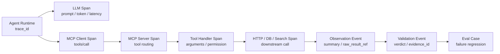
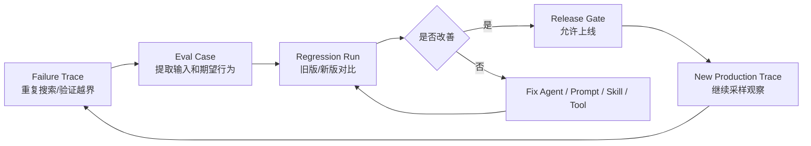

# Agent 的可观测性实战：用 Tracing 看清你的 Agent“大脑”

> 这篇不再重复解释“Agent 可观测性是什么”。
> 它只回答一个更具体的问题：当 Agent 在线上跑偏、变慢、变贵时，如何用 Tracing 把 Thought / Action / Observation 链路拆开，看清问题到底发生在哪一步。

---

## 一、从一次线上 Trace 事故开始

先看一个比“用户流失分析”更贴近 Tracing 的场景。

团队上线了一个代码修复 Agent。用户给它一个 GitHub Issue：

```text
订单详情页偶尔显示空白，帮我定位并修复。
```

Agent 最终提交了一个 PR。PR 能编译，也改了代码，但线上复盘时发现几个问题：

```text
它调用搜索工具 17 次，其中 11 次查询关键词几乎相同。
它读取了 28 个文件，但真正相关的只有 4 个。
它没有运行复现用例，却在总结里写“已验证”。
它最终修改的是前端兜底展示，根因其实在接口字段兼容。
这次任务耗时 11 分钟，Token 成本是同类任务的 6 倍。
```

如果只看最终 PR，很难判断它是“思考不清楚”，还是“工具用错了”，或者“观察结果被误读”。开发者只能翻日志：

```text
search files success
read file success
generate patch success
run tests success
```

这些日志太粗了。它们不能回答真正的问题：

- 第一次搜索为什么失败？
- 为什么同一类关键词被重复搜索？
- Agent 什么时候决定从后端根因转向前端兜底？
- 它把哪个工具返回误解成了“已验证”？
- 17 次搜索里哪几次是必要的，哪几次是循环？
- 如果修复 prompt 或工具描述，下一次能不能少走弯路？

这就是本文要处理的核心问题：

```text
Tracing 不是记录 Agent 做过什么，而是记录 Agent 为什么走到这一步。
```

为了避免和《Agent 可观测性实战：从日志、Trace 到 Replay》重复，本文只聚焦一件事：**如何把 Agent 的 Thought / Action / Observation 变成可查询、可视化、可回流评估的 Trace 数据。**

---

## 二、这篇文章和已有可观测性文章的分工

已有文章《Agent 可观测性实战：从日志、Trace 到 Replay》第二章“Agent 可观测性的第一性原理：把执行过程变成证据链”、第五章“Trace：把分散事件串成一条执行链”和第六章“Replay：让一次失败可以被重放”，讲的是总框架：

```text
Goal -> Plan -> Step -> Tool Call -> Observation -> Interpretation -> Validation -> Output -> Cost
```

它更像一张生产级 Agent 可观测性地图，回答：

```text
Agent 可观测性应该覆盖哪些对象？
日志、Metrics、Trace、Replay 如何分层？
如何通过可观测性支持验证、回放和治理？
```

本文则往下钻一层，重点不是再画完整地图，而是拆一个具体链路：

```text
Thought Summary -> Action -> Observation
```

这三个环节是 Agent 最容易出问题的地方。

| 环节 | 典型问题 | Tracing 要回答 |
| :--- | :--- | :--- |
| Thought Summary | 目标理解偏了、下一步判断错了、循环没有收敛 | 当时为什么决定这么做？ |
| Action | 工具选错、参数错、权限过大、重复调用 | 实际做了什么？工具调用是否合理？ |
| Observation | 工具结果被误读、证据缺失、错误被包装成成功 | 外部世界返回了什么？Agent 如何解释？ |

所以，本文的边界很明确：

```text
不再泛讲可观测性。
不重复展开 Replay 总论。
不重新讲 Agent 规划和验证的完整方法。
只讲 Tracing 如何落地到 Agent 执行链路。
```

可以把它理解成可观测性系列里的“现场排障篇”。

### 2.1 这篇适合谁

这篇文章适合三类读者：

| 读者 | 典型状态 | 阅读重点 |
| :--- | :--- | :--- |
| Agent 开发者 | 已经有工具调用和多步骤执行，但线上问题不好定位 | 重点看 Trace / Span / Event 建模、重复工具调用检测和 Observation 误读检测。 |
| 平台工程师 | 准备把 Agent 接入已有日志、链路追踪或数据仓库 | 重点看 `trace_id` 跨 Agent / MCP / Tool 传递，以及 OpenTelemetry GenAI 字段映射。 |
| 技术负责人 | 关心 Agent 成本、质量、风险和版本迭代 | 重点看失败 Trace 如何转成 Eval Case，以及采样、脱敏和权限策略。 |

它不太适合只想了解“可观测性是什么”的读者。那个问题更适合先读《Agent 可观测性实战：从日志、Trace 到 Replay》第一章到第三章。本文默认读者已经知道 Agent 需要记录 Goal、Plan、Tool Call、Observation 和 Validation，现在想进一步把这些记录落成可查询、可接平台、可复盘的 Tracing 工程。

---

## 三、Agent Trace 的三层模型：Trace、Span、Event

Tracing 的第一步，是不要把所有东西都写成一行日志。

一条可用的 Agent Trace 至少要有三层：

```text
Trace：一次完整任务
Span：任务中的一个阶段
Event：阶段里的关键判断或证据点
```

对于前面的代码修复 Agent，可以这样建模：

```text
Trace: fix_order_detail_blank_page
  Span: interpret_issue
  Span: build_investigation_plan
  Span: search_related_files
    Event: thought_summarized
    Span: tool_call repo.search
    Event: observation_received
  Span: inspect_api_contract
    Span: tool_call read_file
    Event: observation_received
  Span: generate_patch
  Span: run_verification
  Span: final_report
```

注意，这里没有把 Thought、Action、Observation 都做成顶层对象。工程上更自然的做法是：

- Thought Summary 通常是 Event。
- Action 如果有耗时，通常是 Span。
- Observation 通常是 Event，也可以带原始结果引用。
- Validation 可以是 Event，也可以是独立 Span。

### 3.1 Trace：一次任务的根对象

Trace 对应一次完整任务，而不是一次模型调用。

最小字段：

| 字段 | 示例 | 用途 |
| :--- | :--- | :--- |
| `trace_id` | `tr_fix_20260831_001` | 串联全链路 |
| `task_type` | `code_fix` | 做聚合分析 |
| `session_id` | `sess_8f2a` | 关联多轮交互 |
| `agent_name` | `repo_fix_agent` | 区分不同 Agent |
| `agent_version` | `1.7.3` | 对比版本效果 |
| `prompt_version` | `fix_prompt_2026_08_31` | 定位提示词变更影响 |
| `skill_name` | `bugfix-investigation` | 关联 Skill |
| `status` | `success_with_warning` | 区分真成功和带风险成功 |

这里最值得注意的是 `success_with_warning`。

很多 Agent 事故不是硬失败，而是“看起来成功”。例如它生成了 PR，但没有真正验证根因。Trace 状态如果只有 `success` 和 `failed`，这类问题会被吞掉。

建议至少使用：

```text
success
success_with_warning
partial
failed
cancelled
human_escalated
```

### 3.2 Span：把任务拆成可定位的阶段

Span 要承担两个职责：

```text
记录阶段边界
记录阶段成本
```

建议把 Span 分成几类：

| Span kind | 说明 | 示例 |
| :--- | :--- | :--- |
| `agent` | Agent 自身阶段 | `interpret_issue`、`plan_revision` |
| `llm` | 模型调用 | `summarize_issue`、`generate_patch` |
| `tool` | 工具调用 | `repo.search`、`read_file`、`run_tests` |
| `retriever` | 检索步骤 | `semantic_code_search` |
| `validator` | 验证步骤 | `patch_validation`、`claim_check` |
| `mcp` | MCP 工具桥接层 | `mcp.call_tool` |

一个工具 Span 至少要记录：

```json
{
  "span_id": "sp_tool_09",
  "parent_span_id": "sp_search_related_files",
  "kind": "tool",
  "name": "repo.search",
  "status": "success",
  "duration_ms": 842,
  "tool_name": "repo.search",
  "tool_version": "repo-tools@2.3.1",
  "arguments_hash": "sha256:9f31...",
  "arguments_preview": {
    "query": "OrderDetail blank page",
    "path_glob": "src/**"
  },
  "result_count": 43
}
```

`arguments_hash` 和 `arguments_preview` 可以同时保留。前者方便审计一致性，后者方便人快速排障。敏感参数不要原样落盘。

### 3.3 Event：记录关键判断，而不是堆文本

Event 适合记录瞬时发生的事情：

```text
thought_summarized
action_selected
observation_received
observation_interpreted
validation_finished
retry_scheduled
plan_revised
human_approval_requested
budget_exceeded
```

一个好的 Event 应该像结构化证据，不像聊天记录。

坏记录：

```json
{
  "event_type": "thought",
  "content": "我觉得应该再搜一下，因为可能有问题，所以继续搜索。"
}
```

好记录：

```json
{
  "event_type": "thought_summarized",
  "step_id": "step_search_02",
  "decision": "call_tool",
  "next_action": "repo.search",
  "reason_code": "missing_api_contract",
  "summary": "当前只定位到前端空白页症状，尚未确认接口字段是否变化，需要搜索订单详情接口契约。",
  "known_facts": ["OrderDetail.tsx renders blank when order.items is null"],
  "missing_facts": ["API schema for order.items", "recent backend changes"]
}
```

这里记录的是“可审计决策摘要”，不是完整隐式思维链。它足够让工程团队知道当时为什么走这一步，同时避免把模型内部长篇推理、敏感上下文和噪声全部写进日志。

---

## 四、不要让 trace_id 只停在 Agent 内部

很多团队说自己有 Trace，其实只是 Agent 内部有一个 `trace_id`。一旦调用 MCP 工具、HTTP API、数据库或队列，这个 ID 就断了。

真正有用的链路应该长这样：

```text
Agent Trace
  -> LLM Span
  -> MCP Client Span
  -> MCP Server Span
  -> Tool Handler Span
  -> HTTP / DB / Search Span
  -> Observation Event
  -> Validation Event
```



图 1：`trace_id` 贯穿 Agent、MCP、工具和下游系统后，一次失败才不会断在“Agent 调过工具”这一层。

如果 `trace_id` 没有贯穿出去，你只能知道 Agent 调用了 `repo.search`，但不知道：

- MCP Server 有没有收到请求。
- 工具内部查了哪个索引。
- 下游 API 是否超时。
- 数据库查询返回了多少行。
- 工具返回为空到底是没数据，还是过滤条件太窄。

### 4.1 Agent 到 MCP 的上下文传递

调用 MCP 工具时，建议把追踪上下文放进 metadata 或请求上下文里。

示例：

```json
{
  "tool": "repo.search",
  "arguments": {
    "query": "OrderDetail blank page",
    "path_glob": "src/**"
  },
  "metadata": {
    "trace_id": "tr_fix_20260831_001",
    "parent_span_id": "sp_search_related_files",
    "agent_name": "repo_fix_agent",
    "agent_version": "1.7.3",
    "risk_level": "medium"
  }
}
```

MCP Server 接到请求后，不应该重新生成一条孤立日志，而应该继续使用同一个 `trace_id`，并创建子 Span：

```json
{
  "trace_id": "tr_fix_20260831_001",
  "span_id": "sp_mcp_repo_search_01",
  "parent_span_id": "sp_search_related_files",
  "kind": "mcp",
  "name": "mcp.call_tool.repo.search",
  "attributes": {
    "mcp.server": "repo-tools",
    "mcp.tool.name": "repo.search",
    "mcp.tool.version": "2.3.1"
  }
}
```

这件事看起来只是字段传递，实际决定了你能不能跨边界排障。

### 4.2 工具结果不要只返回字符串

很多 Agent 工具返回一段自然语言：

```text
找到 43 个相关文件。
```

这对模型友好，但对 Tracing 不友好。更好的工具返回应该同时包含给模型看的摘要和给系统看的结构化信息：

```json
{
  "summary_for_model": "找到 43 个候选文件，其中 OrderDetail.tsx、orderApi.ts、types/order.ts 相关性最高。",
  "observation": {
    "result_count": 43,
    "top_results": [
      {"path": "src/pages/OrderDetail.tsx", "score": 0.91},
      {"path": "src/api/orderApi.ts", "score": 0.86},
      {"path": "src/types/order.ts", "score": 0.82}
    ],
    "raw_result_ref": "artifact://tr_fix_20260831_001/repo_search_01.json",
    "query": "OrderDetail blank page"
  }
}
```

这样 Trace 才能支持后续问题：

```text
搜索结果是不是太宽？
Top 结果是否真的相关？
Agent 是否读取了排名靠前的文件？
最终修改是否和检索证据一致？
```

---

## 五、把 Thought / Action / Observation 做成可查链路

Tracing 不只是为了看漂亮的调用树。它应该能支持查询。

以前面的事故为例，我们希望能查出：

```text
为什么搜索工具被调用 17 次？
哪些搜索是重复的？
Agent 从什么时候开始偏离根因分析？
哪个 Observation 被误读成了验证通过？
```

为了让后面的 SQL 能直接落地，可以先把 JSONL 事件导入 DuckDB，并建立两个分析视图。这里的视图只是最小示例，真实系统可以替换成数据仓库里的正式表。

```sql
create or replace view trace_events as
select *
from read_json_auto('agent_traces.jsonl');

create or replace view tool_spans as
select
  trace_id,
  span_id,
  parent_span_id,
  name as tool_name,
  status,
  ts as started_at,
  payload->>'arguments_hash' as arguments_hash,
  payload->'arguments_preview' as arguments_preview,
  cast(payload->>'duration_ms' as bigint) as duration_ms
from trace_events
where kind = 'tool';

create or replace view step_action_view as
select
  e.trace_id,
  e.payload->>'step_id' as step_id,
  e.payload->'expected_action_type' as expected_action_type,
  t.tool_name as actual_tool_name,
  t.status,
  case
    when contains(cast(e.payload->'expected_action_type' as varchar), split_part(t.tool_name, '.', 2))
      then true
    else false
  end as action_matched_plan
from trace_events e
left join tool_spans t
  on e.trace_id = t.trace_id
where e.event_type = 'plan_step_created';
```

表 1：最小分析视图。`tool_spans` 用来查重复工具调用，`step_action_view` 用来查计划步骤和实际动作是否匹配。

### 5.1 重复搜索检测

如果每次工具调用都有 `tool_name`、`arguments_hash`、`arguments_preview` 和 `parent_span_id`，就可以做重复检测。

```sql
select
  trace_id,
  tool_name,
  arguments_hash,
  count(*) as call_count,
  min(started_at) as first_call,
  max(started_at) as last_call
from tool_spans
where trace_id = 'tr_fix_20260831_001'
group by trace_id, tool_name, arguments_hash
having count(*) >= 3;
```

如果结果显示同一个 `repo.search` 参数被调用了 8 次，问题就不再是“Agent 很努力”，而是：

```text
它没有识别到重复动作。
它没有缓存工具结果。
它没有在重试前修改查询策略。
它的 Planner 没有收敛条件。
```

这比一句“成本偏高”具体得多。

### 5.2 计划偏离检测

计划里每一步应该有 `expected_action_type` 和 `done_when`。

```json
{
  "step_id": "step_03",
  "name": "inspect_api_contract",
  "expected_action_type": ["read_file", "schema_query"],
  "done_when": "确认订单详情接口中 items 字段是否可能为空"
}
```

实际 Trace 里可以检查：

```sql
select
  step_id,
  expected_action_type,
  actual_tool_name,
  status
from step_action_view
where trace_id = 'tr_fix_20260831_001'
  and action_matched_plan = false;
```

如果 `inspect_api_contract` 下面全是前端组件搜索，没有读取接口契约，那就说明 Agent 不是“没找到答案”，而是根本没有按计划执行。

### 5.3 Observation 误读检测

Observation 和 Interpretation 必须分开。

```json
{
  "event_type": "observation_received",
  "observation_id": "obs_test_01",
  "source": "test_runner",
  "summary": "只运行了 lint，未运行订单详情页复现用例。",
  "raw_result_ref": "artifact://tr_fix_20260831_001/test_lint.txt"
}
```

```json
{
  "event_type": "observation_interpreted",
  "observation_id": "obs_test_01",
  "claim": "修复已通过验证",
  "interpretation_type": "overstated",
  "confidence": 0.42
}
```

这时 Validator 可以做一条简单规则：

```text
如果只运行 lint，不允许输出“业务问题已验证修复”。
```

对应事件：

```json
{
  "event_type": "validation_finished",
  "rule": "verification_claim_must_match_test_scope",
  "target_claim": "修复已通过验证",
  "verdict": "fail",
  "reason": "Trace 中只有 lint 结果，没有复现用例或相关单测。",
  "recommended_action": "run_reproduction_or_downgrade_claim"
}
```

这就是 Tracing 和自我纠错的交汇点：Trace 提供证据，Validator 根据证据改变 Agent 行为。

---

## 六、OpenTelemetry GenAI 语义如何映射 Agent 字段

如果团队已经有 OpenTelemetry 基础，Agent Tracing 不应该另起一套完全孤立的系统。更稳的方式是：

```text
通用链路字段对齐 OpenTelemetry
Agent 特有字段放在自定义 namespace
```

截至 2026-08-31，OpenTelemetry 已经提供 Generative AI 语义约定，可以表达 GenAI 系统、请求模型、响应模型、token usage、operation、tool call、retrieval 等信息。Agent 自己的目标、计划、验证和风险字段，则可以作为补充属性。

### 6.1 LLM Span 映射

| Agent 字段 | OTel / GenAI 建议表达 | 示例 |
| :--- | :--- | :--- |
| 模型供应商 | `gen_ai.system` | `openai`、`anthropic` |
| 请求模型 | `gen_ai.request.model` | `gpt-5` |
| 操作类型 | `gen_ai.operation.name` | `chat`、`generate_content` |
| 输入 Token | `gen_ai.usage.input_tokens` | `4200` |
| 输出 Token | `gen_ai.usage.output_tokens` | `860` |
| 温度 | `gen_ai.request.temperature` | `0.2` |
| 最大输出 | `gen_ai.request.max_tokens` | `2000` |
| Agent 步骤 | `agent.step_id` | `step_generate_patch` |
| Prompt 版本 | `agent.prompt_version` | `fix_prompt_2026_08_31` |

不要把 Agent 字段硬塞进 GenAI 标准字段。标准字段解决跨平台一致性，自定义字段解决你的业务语义。

### 6.2 Tool Span 映射

| Agent 字段 | 建议属性 | 示例 |
| :--- | :--- | :--- |
| 工具名 | `tool.name` 或 `agent.tool.name` | `repo.search` |
| 工具版本 | `agent.tool.version` | `repo-tools@2.3.1` |
| 参数哈希 | `agent.tool.arguments_hash` | `sha256:9f31...` |
| 权限范围 | `agent.tool.permission_scope` | `read:repo` |
| 是否有副作用 | `agent.tool.side_effect` | `false` |
| MCP Server | `mcp.server.name` | `repo-tools` |
| MCP 方法 | `mcp.method` | `tools/call` |

如果工具有副作用，例如发邮件、改数据库、提交 PR，要额外记录：

```text
approval_required
approval_id
dry_run
idempotency_key
rollback_strategy
```

这几个字段会直接影响 Replay 和审计。

### 6.3 Retriever Span 映射

Agent 经常会调用 RAG 或代码检索。Retriever Span 建议记录：

| 字段 | 示例 |
| :--- | :--- |
| `retrieval.query` | `OrderDetail blank page items null` |
| `retrieval.top_k` | `20` |
| `retrieval.result_count` | `43` |
| `retrieval.index_name` | `repo-code-index` |
| `retrieval.reranker` | `bge-reranker-v2` |
| `retrieval.filter` | `path:src/**` |
| `agent.evidence_ids` | `file_OrderDetail_tsx` |

检索问题很常见：召回太宽、过滤太窄、排序不稳、证据过期。没有 Retriever Span，就很难判断 Agent 是“推理错了”，还是“上下文一开始就错了”。

---

## 七、Langfuse 与 Phoenix：不是选谁好，而是怎么接

工具对比如果只停留在“谁功能多”，对工程落地帮助不大。更有价值的问题是：

```text
我的内部事件模型，如何映射到这些平台？
哪些数据必须留在内部？
哪些数据可以送到平台做可视化和评估？
```

### 7.1 Langfuse 接入思路

Langfuse 的核心模型可以概括为：

```text
Trace：一次用户请求或任务
Observation：Trace 下的 LLM 调用、工具调用、检索、自定义阶段
Session：多轮会话
Score：用户反馈、规则评分、LLM-as-Judge 或评估结果
```

适合把本文模型这样映射：

| 本文模型 | Langfuse 表达 | 说明 |
| :--- | :--- | :--- |
| Agent Trace | Trace | 一次任务一个 Trace。 |
| LLM Span | Generation / Observation | 记录 prompt、completion、usage、latency。 |
| Tool Span | Span / Observation | 记录工具名、参数摘要、返回摘要、耗时。 |
| Retriever Span | Span / Observation | 记录 query、top_k、documents。 |
| Validation Event | Score 或 Observation | 既可以作为评分，也可以作为验证阶段。 |
| Human Feedback | Score | 用于后续评估和数据集构建。 |

接入时最容易漏的是 `Score`。很多团队只把 Langfuse 当 Trace Viewer，用来看调用树；但如果不把验证结果、用户反馈、人工复核写成 Score，后续就很难从 Trace 走向 Evals。

建议最小接入：

```text
每次任务创建 trace
每次 LLM 调用记录 generation
每次工具调用记录 observation/span
每次验证记录 score
每次用户反馈记录 score
```

### 7.2 Phoenix 接入思路

Arize Phoenix 更适合走 OpenTelemetry / OTLP / OpenInference 路线。它的优势是和 traces、evals、datasets、experiments 更自然地接在一起。

适合把本文模型这样映射：

| 本文模型 | Phoenix / OTel 表达 | 说明 |
| :--- | :--- | :--- |
| Agent Trace | OTel Trace | 保持跨组件 trace_id。 |
| Step | Span | 表达任务阶段。 |
| LLM Call | LLM Span | 通过 OpenInference instrumentation 记录。 |
| Tool Call | Tool Span | 记录工具输入输出摘要。 |
| Retrieval | Retriever Span | 记录 query、documents、scores。 |
| Validation | Eval / Annotation / Event | 用于评估和人工标注。 |
| Failure Trace | Dataset Example | 回流到实验样本。 |

如果团队已经有 OTel Collector，可以考虑：

```text
Agent SDK -> OTLP -> Collector -> Phoenix
                         -> 内部数据仓库
                         -> 告警系统
```

这样做的好处是，Agent Trace 不会只存在某一个 LLM 平台里，而是能进入已有的可观测性基础设施。

### 7.3 选型不是三选一

更现实的路线通常是混合：

| 阶段 | 建议 |
| :--- | :--- |
| 原型期 | JSONL / SQLite / DuckDB，把事件模型跑通。 |
| 团队协作期 | 接入 Langfuse 或 Phoenix，看 Trace、做评估、收集反馈。 |
| 生产期 | 内部事件规范 + OTel Collector + 平台可视化 + 数据仓库分析。 |

关键不是先选工具，而是先定三件事：

```text
哪些字段是你的内部语义资产？
哪些字段可以对齐开放标准？
哪些字段需要脱敏、采样或禁止外发？
```

### 7.4 一个更直接的选型矩阵

如果只想快速决策，可以按团队当前约束来选。

| 当前场景 | 更推荐 | 判断理由 |
| :--- | :--- | :--- |
| 需要 prompt 管理、trace、score、dataset、dashboard 放在一个平台里 | Langfuse | 更贴近 LLM 应用全生命周期，适合从应用侧统一管理 prompt、调用、反馈和评估结果。 |
| 已经有 OpenTelemetry / OTLP 链路，希望 Agent Trace 进入现有观测基础设施 | Phoenix | 更适合围绕 OTel / OpenInference 做开放链路接入，也方便和 evals、experiments 结合。 |
| 团队还在原型期，最重要的是先搞清楚要记录哪些字段 | 轻量自建 | 先用 JSONL / DuckDB 打稳内部事件模型，避免过早被平台字段牵着走。 |
| 数据敏感，工具参数、Observation 或用户输入不能外发 | 轻量自建或自托管 | 先解决脱敏、保留周期和访问权限，再决定是否同步摘要到外部平台。 |
| 主要问题是线上失败样本要沉淀成评估集 | Phoenix 或 Langfuse | 两者都能承接 Trace 到评估的闭环，差别在于团队更偏 OTel 体系还是 LLM 应用平台。 |
| 只想排查某一次 Agent 为什么慢、贵、重复调用 | 三者都可以 | 关键不在平台，而在是否记录 `trace_id`、`parent_span_id`、工具参数哈希、验证结果和成本。 |

表 2：工具选型不是功能投票，而是看团队当前最需要解决的是应用迭代、开放链路、数据边界，还是评估闭环。

---

## 八、轻量自建方案：JSONL -> DuckDB -> Trace Viewer

专业平台很好，但早期团队最怕两件事：

```text
还没想清楚观测对象，就先接了一堆 SDK。
平台看起来很漂亮，但字段无法回答自己的排障问题。
```

所以建议先做一套极简自建链路。

### 8.1 事件写入：JSONL

最小事件：

```json
{
  "trace_id": "tr_fix_20260831_001",
  "span_id": "sp_tool_search_09",
  "parent_span_id": "sp_search_related_files",
  "ts": "2026-08-31T12:08:00+08:00",
  "event_type": "tool_call_finished",
  "kind": "tool",
  "name": "repo.search",
  "status": "success",
  "payload": {
    "arguments_hash": "sha256:9f31...",
    "arguments_preview": {
      "query": "OrderDetail blank page"
    },
    "result_count": 43,
    "duration_ms": 842
  },
  "attributes": {
    "agent.version": "1.7.3",
    "prompt.version": "fix_prompt_2026_08_31",
    "risk.level": "medium"
  }
}
```

这套模型比旧式日志多了三个能力：

- 能按 `trace_id` 还原一次任务。
- 能按 `span_id` / `parent_span_id` 还原树。
- 能按结构化字段查询失败模式。

下面是一段可以直接运行的最小 Tracer。它不依赖第三方库，只演示三件事：写入 JSONL、检测重复工具调用、输出 Span Tree。

```python
import json
import tempfile
from collections import defaultdict
from pathlib import Path


def emit(path, event):
    with path.open("a", encoding="utf-8") as f:
        f.write(json.dumps(event, ensure_ascii=False) + "\n")


def load_events(path, trace_id):
    events = []
    with path.open("r", encoding="utf-8") as f:
        for line in f:
            event = json.loads(line)
            if event.get("trace_id") == trace_id:
                events.append(event)
    return events


def detect_duplicate_tool_calls(events, limit=2):
    groups = defaultdict(list)
    for event in events:
        if event.get("kind") != "tool":
            continue
        payload = event.get("payload", {})
        key = (event.get("name"), payload.get("arguments_hash"))
        groups[key].append(event.get("span_id"))
    return {
        key: span_ids
        for key, span_ids in groups.items()
        if len(span_ids) > limit
    }


def render_span_tree(events):
    children = defaultdict(list)
    names = {}
    for event in events:
        span_id = event.get("span_id")
        parent_id = event.get("parent_span_id")
        names[span_id] = event.get("name") or event.get("event_type")
        children[parent_id].append(span_id)

    def walk(span_id, depth=0):
        lines = ["  " * depth + "- " + names.get(span_id, span_id)]
        for child_id in children.get(span_id, []):
            if child_id != span_id:
                lines.extend(walk(child_id, depth + 1))
        return lines

    roots = children.get(None, [])
    output = []
    for root in roots:
        output.extend(walk(root))
    return "\n".join(output)


def main():
    trace_id = "tr_fix_001"
    with tempfile.TemporaryDirectory() as tmp:
        path = Path(tmp) / "agent_traces.jsonl"
        sample_events = [
            {
                "trace_id": trace_id,
                "span_id": "root",
                "parent_span_id": None,
                "event_type": "trace_started",
                "kind": "agent",
                "name": "fix_order_detail_blank_page",
                "payload": {},
            },
            {
                "trace_id": trace_id,
                "span_id": "search_1",
                "parent_span_id": "root",
                "event_type": "tool_call_finished",
                "kind": "tool",
                "name": "repo.search",
                "payload": {"arguments_hash": "same-query"},
            },
            {
                "trace_id": trace_id,
                "span_id": "search_2",
                "parent_span_id": "root",
                "event_type": "tool_call_finished",
                "kind": "tool",
                "name": "repo.search",
                "payload": {"arguments_hash": "same-query"},
            },
            {
                "trace_id": trace_id,
                "span_id": "search_3",
                "parent_span_id": "root",
                "event_type": "tool_call_finished",
                "kind": "tool",
                "name": "repo.search",
                "payload": {"arguments_hash": "same-query"},
            },
        ]
        for event in sample_events:
            emit(path, event)

        events = load_events(path, trace_id)
        duplicates = detect_duplicate_tool_calls(events)
        print("events:", len(events))
        print("duplicate_groups:", len(duplicates))
        print(render_span_tree(events))


if __name__ == "__main__":
    main()
```

运行后应该看到类似输出：

```text
events: 4
duplicate_groups: 1
- fix_order_detail_blank_page
  - repo.search
  - repo.search
  - repo.search
```

这段代码还谈不上平台，但它已经具备 Tracing 的最小闭环：事件能写入，链路能还原，异常模式能被规则发现。

### 8.2 查询分析：DuckDB

JSONL 可以直接进入 DuckDB 做本地分析。

示例：找出高成本 Trace。

```sql
select
  trace_id,
  sum(cast(payload->>'duration_ms' as bigint)) as total_duration_ms,
  count(*) filter (where event_type like 'tool_call%') as tool_events
from read_json_auto('agent_traces.jsonl')
group by trace_id
order by total_duration_ms desc
limit 20;
```

示例：找出验证失败但最终仍成功的任务。

```sql
with validation_failed as (
  select distinct trace_id
  from read_json_auto('agent_traces.jsonl')
  where event_type = 'validation_finished'
    and payload->>'verdict' = 'fail'
),
trace_success as (
  select distinct trace_id
  from read_json_auto('agent_traces.jsonl')
  where event_type = 'trace_finished'
    and payload->>'status' = 'success'
)
select trace_id
from validation_failed
intersect
select trace_id
from trace_success;
```

这个查询很有杀伤力。它能发现一种危险状态：

```text
系统内部已经知道验证失败，但最终仍然对用户宣称成功。
```

### 8.3 可视化：先做三张表

Trace Viewer 不一定一开始就做成复杂产品。先做三张表就够用。

第一张：Trace 列表。

| trace_id | task_type | status | duration | cost | warnings |
| :--- | :--- | :--- | :--- | :--- | :--- |
| `tr_fix_001` | code_fix | success_with_warning | 11m | 6.2x | repeated_search |

第二张：Span Tree。

```text
fix_order_detail_blank_page
  ├─ interpret_issue
  ├─ build_plan
  ├─ search_related_files
  │   ├─ repo.search #1
  │   ├─ repo.search #2
  │   └─ repo.search #17
  ├─ generate_patch
  └─ run_verification
```

第三张：Evidence Table。

| Claim | Evidence | Source | Validation |
| :--- | :--- | :--- | :--- |
| 修复已验证 | lint_passed | test_runner | fail |
| 空白页由前端空值导致 | OrderDetail.tsx | file_read | warning |
| 根因在接口字段兼容 | orderApi.ts | file_read | pass |

这三张表就能支撑大部分早期排障。

---

## 九、用一条异常 Trace 定位问题并修复

现在回到开头那次事故。

### 9.1 异常 Trace 摘要

```text
Trace: tr_fix_20260831_001
Task: 修复订单详情页偶尔空白
Status: success_with_warning
Duration: 11m 04s
Tool calls: 31
Search calls: 17
Repeated search groups: 3
Validation: 1 pass, 2 warning, 1 fail
Final output: PR created
```

关键 Span：

| Span | 状态 | 发现 |
| :--- | :--- | :--- |
| `interpret_issue` | success | 把“偶尔空白”解释为前端渲染问题，未标注“可能是接口数据问题”。 |
| `search_related_files` | warning | 17 次搜索中 11 次高度重复。 |
| `inspect_api_contract` | skipped | 计划里有这一步，但没有执行。 |
| `generate_patch` | success | 增加前端空值兜底。 |
| `run_verification` | fail | 只运行 lint，没有运行复现用例。 |
| `final_report` | warning | 输出“已验证”，和 Trace 证据不一致。 |

### 9.2 根因不是“模型不聪明”，而是链路缺约束

从 Trace 看，问题不是单点错误，而是三个约束缺失。

第一，计划没有执行约束。

```text
计划里写了 inspect_api_contract，但 Executor 没有被强制完成它。
```

第二，重复动作没有预算闸门。

```text
repo.search 连续重复，但系统没有判断“这次搜索和上次是否等价”。
```

第三，验证声明没有和测试范围绑定。

```text
只运行 lint，却允许最终报告写“已验证修复”。
```

### 9.3 修复方案

可以做三处改动。

**改动一：给计划步骤增加 done_when。**

```json
{
  "step_id": "inspect_api_contract",
  "required": true,
  "done_when": "明确订单详情 API 中 items 字段是否允许为空，并记录 evidence_id",
  "minimum_evidence": ["api_schema_or_backend_code"]
}
```

**改动二：给重复工具调用增加闸门。**

```json
{
  "rule": "prevent_duplicate_tool_call",
  "condition": "same tool_name and same arguments_hash called >= 3 times",
  "action": "require_query_rewrite_or_replan"
}
```

**改动三：给验证声明增加范围约束。**

```json
{
  "rule": "verification_claim_must_match_test_scope",
  "condition": "final_report contains 已验证",
  "required_evidence": ["related_unit_test or reproduction_test or manual_verification"],
  "fallback": "改写为：已通过 lint，尚未完成业务复现验证"
}
```

### 9.4 修复后的 Trace 应该变成什么样

| 指标 | 修复前 | 修复后 |
| :--- | :--- | :--- |
| 搜索调用 | 17 次 | 5 次 |
| 重复搜索组 | 3 组 | 0 组 |
| 必需步骤跳过 | 1 个 | 0 个 |
| 验证失败仍成功 | 是 | 否 |
| 最终状态 | `success_with_warning` | `partial` 或 `success` |
| 最终报告 | “已验证修复” | “已通过 lint，待业务复现确认” |

这才是 Tracing 的实战价值：它不是只告诉你“哪里慢”，而是把修复 Agent 行为的抓手暴露出来。

---

## 十、把失败 Trace 转成 Eval 样本

Tracing 的终点不应该是排障截图，而应该是评估样本。

前面那条失败 Trace 可以转成一个 Eval Case：

```json
{
  "case_id": "eval_code_fix_duplicate_search_001",
  "input": {
    "issue": "订单详情页偶尔显示空白，帮我定位并修复。",
    "repo_snapshot": "artifact://snapshots/order_repo_20260831"
  },
  "expected_behavior": [
    "必须检查前端渲染和接口契约两个方向",
    "不得对相同参数重复搜索超过 2 次",
    "没有复现测试时不得宣称已验证业务修复",
    "最终结论必须区分根因、缓解措施和未验证风险"
  ],
  "scoring_rules": [
    "plan_covers_api_contract",
    "duplicate_tool_call_count <= 2",
    "verification_claim_matches_test_scope",
    "final_answer_contains_limitations"
  ]
}
```

这样，下一版 Agent 上线前就能跑回归：

```text
旧版本：重复搜索 17 次，验证声明越界。
新版本：重复搜索 4 次，正确标注“未完成复现验证”。
```

这一步会把 Tracing、Validation 和 Evals 串起来：

```text
线上 Trace 暴露问题
  -> 问题 Trace 转成 Eval Case
  -> 修复 Agent / Prompt / Skill / Tool
  -> 回归测试验证改善
  -> 新版本上线继续收集 Trace
```



图 2：Tracing 不止服务一次排障。真正有价值的失败 Trace，要回流为 Eval Case，成为下一版 Agent 的回归样本。

这也是后续《Agent 自动化评估体系：从 Golden Set 到 CI 回归》要展开的主题。

---

## 十一、生产环境的采样、脱敏和权限

Tracing 很有用，但不能无限制记录。

### 11.1 采样策略

建议按风险和结果分层：

| Trace 类型 | 采样策略 |
| :--- | :--- |
| 失败任务 | 全量保存 |
| 人工接管任务 | 全量保存 |
| 高成本任务 | 全量保存 |
| 高风险工具任务 | 全量保存或高比例采样 |
| 普通成功任务 | 摘要保存或低比例采样 |
| 高频低风险任务 | 只保存指标和关键事件 |

不要平均采样。Agent 最有价值的 Trace，往往正是失败、昂贵、反复重试、人工介入的那些。

### 11.2 脱敏策略

至少要处理五类信息：

| 信息 | 处理方式 |
| :--- | :--- |
| 用户原始输入 | 按任务风险决定全文、摘要或哈希保存。 |
| 工具参数 | 保存 preview + hash，敏感字段脱敏。 |
| 工具返回 | 原文进受控 artifact，Trace 只放摘要和引用。 |
| Thought Summary | 只保存决策摘要，不保存完整隐式思维链。 |
| 凭证和内部路径 | 默认禁止进入 Trace。 |

### 11.3 权限策略

Trace Viewer 不是所有人都该随便看。

建议至少区分：

```text
研发排障权限
业务复盘权限
安全审计权限
客户支持权限
管理员权限
```

同一条 Trace，不同角色看到的字段可以不同。客户支持可能只需要任务状态和失败原因，研发需要工具参数摘要，安全审计需要权限和审批记录。

---

## 十二、Tracing 落地检查清单

这份清单只保留 Tracing 专项，不重复已有可观测性总清单。

### 12.1 链路建模

| 检查项 | 最低验收标准 | 证据 |
| :--- | :--- | :--- |
| Trace 边界 | 一次用户可感知任务对应一个 `trace_id`，子任务不另起孤立 Trace。 | 任取 3 条任务记录，能按 `trace_id` 查到完整链路。 |
| Trace / Span / Event 分层 | 有耗时的阶段用 Span，瞬时判断和证据点用 Event。 | Span Tree 能展示至少 3 层父子关系。 |
| 父子关系 | 每个非根 Span 都有 `parent_span_id`。 | 查询孤儿 Span 数量为 0，或有明确例外原因。 |
| 版本字段 | Trace 中包含 `agent_version`、`prompt_version`、`skill_name`。 | 能按版本筛选失败率和成本。 |
| 状态取值 | 至少支持 `success`、`success_with_warning`、`partial`、`failed`。 | 验证失败但仍交付的任务不会被标成单纯 `success`。 |

### 12.2 Thought / Action / Observation

| 检查项 | 最低验收标准 | 证据 |
| :--- | :--- | :--- |
| Thought Summary | 只记录决策摘要、已知事实、缺失事实、下一步动作，不记录完整隐式思维链。 | 抽查 Trace，不出现大段自由推理或敏感上下文原文。 |
| Action 参数 | 工具调用记录工具名、版本、参数摘要、参数哈希、权限范围。 | 任取一次工具失败，能复盘当时参数和权限。 |
| Observation 来源 | 记录原始结果引用、摘要、数量、来源和时间范围。 | 最终结论能追到 `raw_result_ref` 或 evidence_id。 |
| 解释分层 | Observation 和 Interpretation 分开记录。 | 能识别“工具结果正确，但 Agent 解释错误”的样本。 |
| 证据绑定 | 最终 Claim 至少绑定一个 evidence_id；无证据则标注不确定性。 | Evidence Table 中无证据 Claim 数量可查询。 |

### 12.3 跨边界追踪

| 检查项 | 最低验收标准 | 证据 |
| :--- | :--- | :--- |
| `trace_id` 贯穿 | Agent、MCP Server、Tool Handler、HTTP / DB 至少共用同一追踪上下文。 | 任意工具错误能在同一 `trace_id` 下查到 MCP 和下游 Span。 |
| MCP 上下文 | MCP 请求携带 `trace_id`、`parent_span_id`、`agent_version`、`risk_level`。 | 抽查 MCP 请求日志或 Trace metadata。 |
| 工具子 Span | 工具内部关键外部调用继续创建子 Span。 | Tool Handler 下能看到 HTTP / DB / Search 子 Span。 |
| 错误回传 | 下游错误能回到 Agent Trace，并保留错误类型和摘要。 | 按 `error_type` 查询能定位到 Agent 步骤。 |
| 副作用治理 | 有副作用工具记录审批、幂等键、dry-run、回滚策略。 | 任取一次写操作，能查到 `approval_id` 或 `idempotency_key`。 |

### 12.4 查询与评估

| 检查项 | 最低验收标准 | 证据 |
| :--- | :--- | :--- |
| 重复工具调用 | 能按 `tool_name + arguments_hash` 查出重复调用。 | 重复调用 SQL 有结果或能证明样本为 0。 |
| 计划偏离 | 能查计划步骤未执行、跳过或实际动作不匹配。 | `step_action_view` 能输出 `action_matched_plan=false` 的样本。 |
| 验证越界 | 能查验证失败但最终仍标记成功的 Trace。 | 对应 SQL 查询可运行，并有处理策略。 |
| 高成本任务 | 能按任务类型、版本、步骤聚合 Token 和耗时。 | 成本 Top 20 查询可运行。 |
| Eval 回流 | 失败 Trace 能转成 Eval Case，并进入回归样本。 | 至少有 1 个由线上 Trace 生成的 Eval Case。 |

### 12.5 平台接入

| 检查项 | 最低验收标准 | 证据 |
| :--- | :--- | :--- |
| 内部事件模型 | 先定义内部 Trace / Span / Event 语义，再接平台。 | 有事件 schema 文档或代码类型定义。 |
| OTel 对齐 | LLM Span 至少映射模型、操作名、输入输出 Token、耗时。 | OTel 导出的 Span 中能看到 GenAI 关键属性。 |
| Langfuse 映射 | 验证结果和人工反馈进入 Score，而不只是 metadata。 | 任取 Trace 能看到对应 Score。 |
| Phoenix 映射 | 失败 Trace 能进入 Eval / Annotation / Dataset 工作流。 | Phoenix 中能找到由 Trace 派生的样本。 |
| 数据边界 | 明确哪些字段只留内部，哪些字段可以外发。 | 脱敏规则和字段白名单可审查。 |

---

## 十三、总结：Tracing 要看见的是决策链，而不是热闹日志

Agent 的问题经常不是“它有没有做事”，而是：

```text
它为什么这样做？
它做的事和计划是否一致？
它看到的结果是否被正确解释？
它有没有在证据不足时继续输出确定结论？
它的成本和重试是否有收敛机制？
```

这就是 Tracing 的核心价值。

对生产级 Agent 来说，一条好的 Trace 应该能把三件事讲清楚：

```text
Thought Summary：当时为什么做这个决策。
Action：实际调用了什么工具、传了什么参数、花了多少成本。
Observation：外部世界返回了什么，哪些证据支撑了后续判断。
```

再进一步，它还要能连接：

```text
MCP：工具调用是否稳定、合规、可审计。
Validation：结果是否达标，失败后是否改变行为。
Evals：失败样本是否回流成回归测试。
```

所以，这篇文章的结论很简单：

```text
不要把 Agent Tracing 做成“更长的日志”。
要把它做成一条能定位错误、解释决策、约束行为、推动评估迭代的工程链路。
```

---

## 参考与延伸

- Langfuse Observability Overview：<https://langfuse.com/docs/observability/overview>
- Langfuse Data Model：<https://langfuse.com/docs/observability/data-model>
- Arize Phoenix Documentation：<https://arize.com/docs/phoenix>
- Arize Phoenix LLM Traces：<https://arize.com/docs/phoenix/tracing/llm-traces>
- OpenTelemetry Generative AI Semantic Conventions：<https://opentelemetry.io/docs/specs/semconv/gen-ai/>
- 本系列参考：《Agent 可观测性实战：从日志、Trace 到 Replay》第二章“Agent 可观测性的第一性原理”、第五章“Trace：把分散事件串成一条执行链”、第六章“Replay：让一次失败可以被重放”。
- 本系列参考：《Agent 自我纠错与验证机制设计：从自信回答到可验证执行》第四章“Validator：先让每一步不要跑偏”、第五章“外部事实核查：不要让 Agent 用流畅表达掩盖证据不足”。
- 本系列参考：《MCP 的第一性原理：从工具调用到能力协议》第十七章“可观测性”、第十七章第五节“OpenTelemetry 集成示例”。
