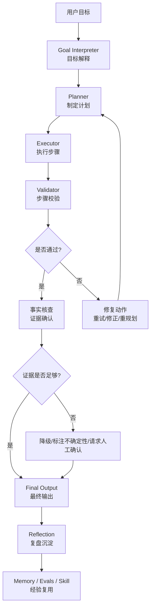
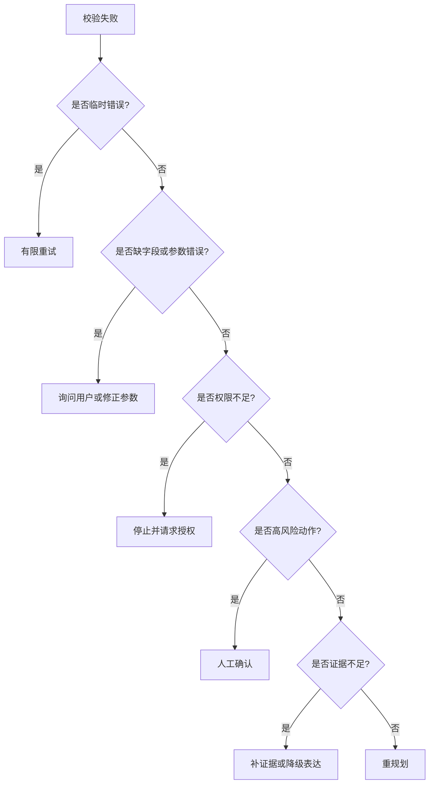

# Agent自我纠错与验证机制设计：从自信回答到可验证执行

> Agent 真正危险的地方，不是它会犯错，而是它犯错时看起来仍然很自信。  
> 一个成熟的 Agent 系统，必须让“怀疑自己”成为工程机制：执行前有假设检查，执行中有结果校验，执行后有事实核查和复盘修正。

---

## 一、从一个真实问题开始：为什么 Agent 看起来完成了任务，结果却不可信

先看一个很常见的场景。

用户说：

```text
帮我分析这个 SaaS 产品最近用户流失的主要原因，并给出三个改进建议。
```

Agent 很快开始工作。它读取了留存数据，搜索了用户反馈，查了几条工单，然后生成了一份看起来很完整的报告：

```text
用户流失主要来自三个原因：
1. 新手引导流程复杂
2. 价格感知偏高
3. 客服响应速度慢

建议优化 onboarding、调整价格展示，并增加客服自动分流。
```

这份报告看起来没有明显问题。结构清楚，建议也合理。

但业务负责人继续追问：

```text
为什么认为“价格感知偏高”是第二大原因？
这个结论来自用户反馈、数据指标，还是模型推断？
客服响应慢的数据来自哪个系统？
有没有检查最近版本发布记录？
如果其中一个工具调用失败了，Agent 是怎么处理的？
```

这时问题就暴露出来了。

很多 Agent 不是没有做事，而是**无法证明自己做对了**。它可能确实查了一些数据，也可能确实调用了几个工具，但最终结论里混在一起的东西太多：

- 有些是工具返回的事实
- 有些是模型自己的归纳
- 有些是未经验证的猜测
- 有些是从过期上下文里继承来的判断
- 有些是因为工具失败后临时补出来的替代结论

如果系统没有校验、事实核查和复盘机制，这些内容会被包装成一段流畅的最终回答。用户看到的是“完成了”，但系统内部其实没有回答一个更关键的问题：

```text
这个结果凭什么可信？
```

这就是 Agent 自我纠错与验证机制要解决的问题。

---

## 二、自我纠错不是让模型“再想一遍”

很多人第一次设计 Agent 纠错机制时，会想到一个简单办法：

```text
让模型生成答案后，再让它检查一遍自己的答案。
```

这个办法有用，但远远不够。

因为模型“再想一遍”仍然可能停留在同一个信息边界里。它第一次没有看到事实证据，第二次也不一定能凭空看到。它第一次误解了工具结果，第二次也可能只是把误解解释得更顺。

真正的自我纠错不是一句 prompt：

```text
请仔细检查你的回答是否正确。
```

而是一套执行机制：

```text
每一步都有可检查的目标
每个结论都有证据来源
每次失败都有处理路径
每次任务结束后都有复盘记录
```

所以，Agent 的“自我怀疑”不应该只发生在最终回答前，而应该贯穿整个任务过程。

可以把它拆成三层：

```text
Validator：这一步是否合格
事实核查（Fact Check）：这个事实是否成立
Reflection：这次经验下次怎么复用
```

Validator 更像现场质检员，盯着当前步骤是否达标。事实核查更像外部审稿人，检查关键事实有没有可靠来源。Reflection 更像复盘会议，把成功和失败转成下一次可复用的规则。

---

## 三、把自我怀疑放进 Agent 闭环

在《Agent规划范式进化论：从CoT到Plan-and-Execute》第五章“Plan-and-Execute：先规划，再执行”中，Planner、Executor、Verifier 被拆成了三个相对独立的角色。用本文的话说，规划范式里的 Verifier 是 Validator 的前身：它强调“检查结果”，而本文进一步把它扩展为“检查结果、说明原因、给出修复动作”。

如果把前文的思想概括成一条闭环，可以写成：

```text
目标 -> 计划 -> 执行 -> 验证 -> 调整 -> 输出
```

自我纠错机制不是另起炉灶，而是嵌入这条链路。

更完整地看，可以写成：

```text
理解目标
  -> 制定计划
  -> 执行当前步骤
  -> 校验步骤结果
  -> 核查关键事实
  -> 判断是否继续、重试、降级或请求人工确认
  -> 输出结果
  -> 复盘并沉淀经验
```

用图表示就是：



图 1：Agent 自我纠错闭环。Validator 负责步骤级校验，事实核查负责证据确认，Reflection 负责把过程沉淀为后续可复用的经验。

这条链路里最重要的一点是：**校验结果必须能改变 Agent 的行为**。

如果 Validator 只是输出一句“看起来还行”，但 Agent 无论如何都会继续往下走，那它不是校验，只是装饰。

如果外部核查发现证据不足，但最终回答仍然写成确定结论，那核查也没有意义。

如果 Reflection 只是生成一段总结，却不进入记忆、评测集或 Skill 规则，那它对下一次任务没有帮助。

---

## 四、Validator：先让每一步不要跑偏

Validator 是 Agent 自我纠错的第一层，也是最容易落地的一层。

它解决的问题很朴素：

```text
当前这一步，是否达到了继续往下走的条件？
```

比如在用户流失分析任务里，Agent 的计划可能是：

```text
1. 读取最近 30 天留存数据
2. 分析流失用户分群
3. 检索用户反馈和工单
4. 查看版本发布记录
5. 交叉验证主要原因
6. 输出报告和建议
```

每一步都应该有自己的校验点。

| 步骤 | 常见错误 | Validator 应该检查什么 |
| :--- | :--- | :--- |
| 读取留存数据 | 时间窗口错了、样本为空、指标口径不一致 | 是否覆盖指定时间范围，是否有样本量和指标定义 |
| 分析用户分群 | 只看总体均值，忽略关键分组 | 是否至少按用户类型、渠道或套餐拆分 |
| 检索反馈和工单 | 只摘录个别案例 | 是否有主题聚类、数量占比和样本来源 |
| 查看版本记录 | 忘记检查版本变更 | 是否读取目标时间段内的发布记录 |
| 交叉验证原因 | 把猜测写成结论 | 每个主要原因是否至少绑定一类证据 |
| 输出报告 | 没有标注不确定性 | 是否区分事实、推断和建议 |

这样一来，Validator 就不是抽象模块，而是每一步的“完成条件”。

### 4.1 不同类型的 Validator

Validator 不一定都是 LLM。很多校验最好不要交给模型。

| Validator 类型 | 适合检查什么 | 例子 |
| :--- | :--- | :--- |
| 结构校验 | 格式、字段、类型、枚举值 | JSON 是否符合 schema |
| 数值校验 | 范围、单位、计算结果 | 增长率是否可复算 |
| 权限校验 | 是否越权、是否有副作用 | 是否允许发送邮件或写数据库 |
| 语义校验 | 是否符合用户目标 | 报告是否回答了用户的问题 |
| 证据校验 | 结论是否绑定来源 | 每个 claim 是否有 evidence_id |
| 风险校验 | 是否需要人工确认 | 删除、支付、外发、生产写入 |

工程上最稳妥的顺序是：

```text
先用规则挡住确定性错误
再用模型判断语义质量
最后用人工确认兜住高风险动作
```

不要把所有东西都交给一个“大模型评审员”。这会让系统看起来聪明，但边界很模糊。

### 4.2 一个最小可运行的 Validator

下面这段代码故意写得很小，只做三件事：

- 检查任务输入是否缺字段
- 检查强结论是否绑定证据
- 检查高风险动作是否需要人工确认

它不是完整框架，但已经能表达 Validator 的核心：**不是给一句评价，而是返回 verdict、原因和下一步动作**。

```python
REQUIRED_FIELDS = ("goal", "claims", "actions")
HIGH_RISK_ACTIONS = {"send_email", "delete_record", "refund", "write_production"}
STRONG_CLAIM_TYPES = {"causal_inference", "ops_inference", "user_feedback_inference"}


def result(verdict, reason, rule, action, retryable=False):
    return {
        "verdict": verdict,  # pass / warn / fail
        "reason": reason,
        "failed_rule": rule,
        "recommended_action": action,
        "retryable": retryable,
    }


def validate_required_fields(task):
    missing = [field for field in REQUIRED_FIELDS if field not in task]
    if missing:
        return result(
            "fail",
            f"任务缺少必填字段: {', '.join(missing)}",
            "required_fields",
            "ask_or_infer_with_default",
            retryable=True,
        )
    return result("pass", "必填字段完整", "required_fields", "continue")


def validate_claim_evidence(task):
    for claim in task.get("claims", []):
        if claim.get("type_id") in STRONG_CLAIM_TYPES and not claim.get("evidence_ids"):
            return result(
                "fail",
                f"强结论未绑定证据: {claim.get('text')}",
                "major_claim_requires_evidence",
                "search_evidence_or_downgrade_claim",
                retryable=True,
            )
    return result("pass", "强结论均已绑定证据", "major_claim_requires_evidence", "continue")


def validate_risk_action(task):
    risky = [action for action in task.get("actions", []) if action in HIGH_RISK_ACTIONS]
    if risky:
        return result(
            "warn",
            f"检测到高风险动作: {', '.join(risky)}",
            "high_risk_action_requires_confirmation",
            "human_confirm",
        )
    return result("pass", "未发现高风险动作", "high_risk_action_requires_confirmation", "continue")


VALIDATORS = [
    validate_required_fields,
    validate_claim_evidence,
    validate_risk_action,
]


def run_validators(task):
    reports = [validator(task) for validator in VALIDATORS]
    blocking = [report for report in reports if report["verdict"] == "fail"]
    warnings = [report for report in reports if report["verdict"] == "warn"]

    if blocking:
        return blocking[0]
    if warnings:
        return warnings[0]
    return result("pass", "所有校验通过", "all_validators", "continue")


if __name__ == "__main__":
    task = {
        "goal": "分析最近一个月用户流失原因",
        "claims": [
            {
                "text": "价格感知偏高是用户流失的主要原因",
                "type_id": "user_feedback_inference",
                "evidence_ids": [],
            }
        ],
        "actions": ["generate_report"],
    }

    print(run_validators(task))
```

这段代码运行后会返回 `fail`，因为“价格感知偏高是主要原因”这种强结论没有绑定证据。

如果把 `evidence_ids` 补成 `["feedback_cluster_017"]`，它就会继续检查后面的风险动作。如果 `actions` 里出现 `send_email` 或 `write_production`，结果会从 `pass` 变成 `warn`，并要求 `human_confirm`。

这就是 Validator 最小闭环：

```text
规则注册 -> 执行校验 -> 输出 verdict -> 决定下一步动作
```

### 4.3 Validator 的输出不能只是对错

一个好的 Validator 不应该只返回：

```json
{
  "valid": false
}
```

这对 Agent 没有什么帮助。它不知道为什么失败，也不知道下一步该怎么办。

更好的输出应该包含：

```json
{
  "verdict": "fail",
  "reason": "流失原因'价格感知偏高'没有绑定任何数据或反馈证据",
  "failed_rule": "major_claim_requires_evidence",
  "recommended_action": "search_feedback_or_downgrade_claim",
  "retryable": true
}
```

这里的 `verdict` 建议固定为三档：

| verdict | 含义 | 典型动作 |
| :--- | :--- | :--- |
| `pass` | 可以继续执行 | `continue` |
| `warn` | 可以继续，但需要标注风险或请求确认 | `human_confirm` / `mark_uncertain` |
| `fail` | 不能继续，需要修正 | `retry` / `replan` / `downgrade_claim` |

这样 Executor 才能继续行动：

- 重新检索价格相关反馈
- 查看最近是否有价格变更
- 如果查不到证据，就把结论降级为“可能原因”
- 如果任务要求强证据，就请求用户补充数据权限

Validator 的价值不在于批评 Agent，而在于把“错了”翻译成“下一步怎么修”。

### 4.4 步骤级校验比最终校验更重要

很多系统只在最终输出前加一个检查：

```text
请检查最终报告是否完整、准确、有帮助。
```

这个检查太晚了。

如果 Agent 在第一步就选错了时间窗口，后面报告写得再漂亮也没有用。如果第二步分群错了，第三步再努力补反馈也只是沿着错误方向继续走。

所以，成熟 Agent 应该尽量把校验前移：

```text
目标解释后校验一次
计划生成后校验一次
每个关键工具调用后校验一次
每个中间结论形成后校验一次
最终输出前再做一次总校验
```

这里和《Agent的任务拆解艺术：从目标到可执行子任务》第七章“验证导向分解”正好接上：验证导向分解是在**拆解阶段**先定义验收标准，Validator 是在**执行阶段**把这些验收标准变成每一步的完成条件。前者回答“任务应该怎样拆才可验证”，后者回答“执行到这里是否真的达标”。

校验不是为了让流程变慢，而是为了防止错误在长任务里滚雪球。

---

## 五、外部事实核查：不要让 Agent 用流畅表达掩盖证据不足

Validator 可以检查“这一步是否合格”，但它不一定能判断“这个世界事实是否真的成立”。

比如 Agent 写道：

```text
客服响应速度慢是用户流失的重要原因。
```

这句话看起来合理，但它至少需要回答三个问题：

```text
客服响应速度真的变慢了吗？
流失用户真的提到了客服问题吗？
客服问题和流失之间有没有时间或分群上的对应关系？
```

如果没有这些证据，这句话只能算假设，不能算结论。

### 5.1 事实核查要先拆 Claim

外部事实核查的第一步，不是马上搜索，而是把回答拆成可核查的 claim。

例如最终报告里有一句：

```text
最近一个月用户流失上升，主要是因为新手引导复杂、价格感知偏高和客服响应慢。
```

它至少包含四个 claim：

| Claim | 类型 | 需要的证据 |
| :--- | :--- | :--- |
| 最近一个月用户流失上升 | 指标事实 | 留存或流失数据 |
| 新手引导复杂是原因之一 | 因果推断 | 激活数据、反馈、工单、版本记录 |
| 价格感知偏高是原因之一 | 用户反馈推断 | 取消原因、问卷、销售反馈 |
| 客服响应慢是原因之一 | 运营事实与推断 | 响应时长、工单 SLA、用户投诉 |

拆完以后，Agent 才知道哪些内容需要查数据库，哪些需要查文档，哪些需要标注为推断。

也可以把这件事写成一个很小的证据绑定校验：

```python
MIN_EVIDENCE_BY_TYPE = {
    "metric_fact": 1,
    "causal_inference": 2,
    "user_feedback_inference": 2,
    "ops_inference": 2,
}


def check_claim_evidence(claims):
    reports = []
    for claim in claims:
        required = MIN_EVIDENCE_BY_TYPE.get(claim["type_id"], 1)
        evidence_count = len(claim.get("evidence_ids", []))

        if evidence_count >= required:
            reports.append({
                "claim_id": claim["id"],
                "verdict": "pass",
                "action": "keep_claim",
            })
        elif evidence_count == 0:
            reports.append({
                "claim_id": claim["id"],
                "verdict": "fail",
                "action": "remove_or_research_claim",
            })
        else:
            reports.append({
                "claim_id": claim["id"],
                "verdict": "warn",
                "action": "downgrade_claim",
            })
    return reports


if __name__ == "__main__":
    claims = [
        {
            "id": "c1",
            "text": "最近一个月用户流失上升",
            "type_id": "metric_fact",
            "evidence_ids": ["retention_metric_202608"],
        },
        {
            "id": "c2",
            "text": "价格感知偏高是主要流失原因",
            "type_id": "user_feedback_inference",
            "evidence_ids": ["feedback_cluster_price"],
        },
    ]

    print(check_claim_evidence(claims))
```

这段代码会让 `c1` 通过，因为指标事实只需要一个直接证据；但 `c2` 会得到 `warn`，因为“主要流失原因”属于更强的推断，只靠一个反馈聚类还不够，应该降级表达或继续补证据。

### 5.2 事实来源也要分等级

不同来源的可信度不一样。

| 来源 | 适合支持什么结论 | 风险 |
| :--- | :--- | :--- |
| 生产数据库 | 指标、状态、用户行为 | 口径可能误用 |
| 日志和埋点 | 真实行为路径 | 数据可能缺失或噪声大 |
| 工单系统 | 用户问题和投诉 | 样本偏向有问题的用户 |
| 用户访谈 | 深层原因 | 样本量小 |
| 官方文档或公告 | 规则、版本、价格 | 需要确认时间有效性 |
| 网页搜索结果 | 背景信息 | 质量参差，容易过期 |

事实核查不能只问“有没有来源”，还要问：

```text
这个来源适不适合支持这个结论？
```

比如用三条用户评论证明“全部用户都认为价格贵”，就属于证据级别不匹配。

### 5.3 多源交叉验证比单点证据可靠

在高价值任务里，关键结论最好不要只靠一个来源。

继续看用户流失案例。

如果 Agent 认为“新手引导复杂”是主要原因，比较稳的证据链可能是：

```text
新用户第 1 天激活率下降
  + 新手引导相关工单增加
  + 用户反馈中高频出现“导入失败”“上手困难”
  + 两周前发布过导入流程改版
```

这四类证据相互支撑，结论就比单独一句“用户反馈里有人提到上手困难”可靠得多。

外部事实核查的目标，不是让 Agent 永远百分百确定，而是让它知道：

- 哪些结论证据强
- 哪些结论证据弱
- 哪些只是合理猜测
- 哪些需要用户补充数据

### 5.4 证据不足时，好的 Agent 应该降级表达

一个成熟 Agent 不应该为了显得有用而强行下结论。

如果证据不足，输出应该从：

```text
价格感知偏高是用户流失的第二大原因。
```

降级为：

```text
价格感知偏高可能是影响因素之一，但当前证据不足以判断它是主要原因。现有依据仅来自少量取消反馈，建议补充查看价格页转化、续费前沟通记录和竞品对比数据。
```

这种表达看起来没有那么“果断”，但它更可信。

对生产级 Agent 来说，知道什么时候不下结论，是比生成漂亮结论更重要的能力。

---

## 六、Reflection：不是复述过程，而是把错误变成经验

任务完成后，很多系统会让 Agent 做一个总结：

```text
本次任务顺利完成，已生成报告。
```

这不是 Reflection。

真正的 Reflection 应该回答的是：

```text
这次任务中，哪些判断是有效的？
哪些错误差点发生？
哪些校验拦住了问题？
下次遇到类似任务，系统应该提前做什么？
```

### 6.1 Reflection 要基于 Trace，而不是只看最终答案

如果 Agent 只看最终答案，它很难知道自己为什么对、为什么错。

Reflection 应该读取完整任务轨迹，包括：

- 用户原始目标
- Agent 解释后的目标
- 初始计划和重规划记录
- 工具调用结果
- Validator 通过和失败记录
- 外部事实来源
- 最终输出
- 用户修正或反馈
- 成本、耗时和重试次数

这也和《Agent可观测性实战：从日志、Trace到Replay》第二章“Agent 可观测性的第一性原理：把执行过程变成证据链”的观点一致。这里不是逐字引用，而是同一个工程判断的延伸：没有过程记录，复盘就没有材料。

### 6.2 Reflection 应该产出可执行经验

好的 Reflection 不只是这样写：

```text
下次要更加注意证据。
```

这种话太空。

更好的输出是：

```json
{
  "failure_pattern": "unsupported_major_claim",
  "lesson": "当报告中出现'主要原因'、'核心问题'、'显著影响'等强结论时，必须绑定至少一个结构化指标或两个独立文本来源。",
  "suggested_validator_rule": "major_claim_requires_evidence",
  "suggested_eval_case": "churn_report_with_weak_price_evidence",
  "memory_write": false,
  "skill_update": true,
  "eval_add": true
}
```

这样的反思可以进入后续工程系统：

- 加一条 Validator 规则
- 生成一个回归评测样本
- 更新某个 Skill 的执行标准
- 给下次同类任务增加检查点

Reflection 的价值，不是让 Agent 表现得谦虚，而是让系统真的变稳。

### 6.3 成功案例也值得反思

反思不只发生在失败后。

如果一次任务完成得很好，也应该沉淀成功路径。

比如某次 Agent 成功完成用户流失分析，是因为它先确认了时间窗口，再按渠道和套餐做分群，最后用反馈和版本记录交叉验证原因。那么这条路径就可以变成同类任务的默认流程：

```text
流失分析任务默认检查：
1. 时间窗口和流失定义
2. 留存指标变化
3. 用户分群
4. 反馈和工单主题
5. 版本、价格、渠道变化
6. 结论证据绑定
```

这就是从一次成功执行，沉淀成可复用 Skill。

### 6.4 Reflection 不是什么都写进记忆

这里要特别小心。

不是所有反思都应该进入长期记忆。

适合写入长期记忆的内容通常有三个特征：

- 稳定：不是一次偶然现象
- 可复用：未来同类任务还会用到
- 低风险：不会引入隐私、偏见或错误假设

不适合写入长期记忆的内容包括：

- 一次性的用户隐私数据
- 未验证的业务猜测
- 已经过期的市场信息
- 模糊的偏好判断
- 只对某个临时任务成立的策略

错误记忆会污染后续任务。Reflection 的目标不是“多记”，而是“记对”。

---

## 七、失败后应该怎么修：重试、重规划、降级和人工确认

很多 Agent 系统一遇到校验失败，就只会重试。

但不是所有失败都适合重试。

### 7.1 七种常见修正动作

| 失败类型 | 例子 | 推荐动作 |
| :--- | :--- | :--- |
| 临时失败 | API 超时、网络错误 | 有限重试 |
| 缺字段 | 用户没有给时间窗口、公司名或输出格式 | 询问用户，或在低风险场景下使用默认值 |
| 参数格式错误 | 时间窗口格式错、枚举值不合法 | 修正参数后重试 |
| 权限不足 | 当前账号无权读取日志或写入系统 | 停止执行并请求授权 |
| 目标不匹配或路径错误 | 当前工具无法提供所需证据，或执行路径偏离目标 | 重规划，换数据源 |
| 证据不足 | 结论无法被来源支持 | 降级表达或请求补充 |
| 高风险动作 | 删除数据、对外发送、写生产库 | 人工确认 |

可以把失败处理画成一个决策树：



图 2：校验失败后的修复动作决策树。它的重点不是覆盖所有异常，而是避免把所有失败都粗暴地处理成“再试一次”。

最危险的是把所有失败都当成“再试一次”。

如果问题是路径错了，重试只会重复浪费成本。

如果问题是证据不足，重试可能会诱导 Agent 编造证据。

如果问题是高风险动作，自动重试反而可能扩大影响。

### 7.2 修正动作要写进系统策略

可以把校验失败后的动作设计成明确规则：

```text
fail_format -> rewrite_output
fail_missing_field -> ask_or_infer_with_default
fail_tool_timeout -> retry_with_limit
fail_permission -> stop_and_request_access
fail_weak_evidence -> downgrade_claim
fail_high_risk -> human_confirm
fail_goal_mismatch -> replan
```

这段规则也可以直接落成一个很小的分发器：

```python
REPAIR_RULES = {
    "fail_format": "rewrite_output",
    "fail_missing_field": "ask_or_infer_with_default",
    "fail_tool_timeout": "retry_with_limit",
    "fail_permission": "stop_and_request_access",
    "fail_weak_evidence": "downgrade_claim",
    "fail_high_risk": "human_confirm",
    "fail_goal_mismatch": "replan",
}


def decide_repair(validation_report, retry_count=0, max_retries=2):
    failed_rule = validation_report["failed_rule"]
    action = REPAIR_RULES.get(failed_rule, "stop_and_report")

    if action == "retry_with_limit" and retry_count >= max_retries:
        return {
            "action": "fallback_or_stop",
            "reason": "已达到最大重试次数",
        }

    return {
        "action": action,
        "reason": validation_report["reason"],
    }


if __name__ == "__main__":
    report = {
        "verdict": "fail",
        "failed_rule": "fail_weak_evidence",
        "reason": "强结论缺少足够证据",
    }

    print(decide_repair(report))
```

注意这里的 `fail_goal_mismatch` 不只表示“用户目标理解错了”，也包括执行路径已经无法服务原目标的情况。比如用户要的是“流失原因分析”，Agent 却一路写成了“新手引导改版方案”，这时继续修句子没有意义，应该回到 Planner 重新规划。

这样 Agent 不会在失败后临场发挥。

临场发挥越多，系统越难评估，也越难治理。

---

## 八、把自我纠错和可观测性连起来

自我纠错机制如果没有记录，就很难持续优化。

每一次 Validator 失败、事实核查不足、人工确认和 Reflection 输出，都应该进入 Trace。

至少记录这些字段：

| 字段 | 说明 |
| :--- | :--- |
| `trace_id` | 本次任务链路 |
| `goal_id` | 对应目标 |
| `plan_id` | 对应计划版本 |
| `step_id` | 当前步骤 |
| `validator_name` | 使用哪个校验器 |
| `verdict` | pass / warn / fail |
| `reason` | 校验原因 |
| `evidence_ids` | 相关证据 |
| `recommended_action` | 建议动作 |
| `actual_action` | Agent 实际动作 |
| `reflection_tags` | 复盘标签 |

这些记录可以回答后续问题：

- 哪类任务最容易证据不足
- 哪个 Validator 最常拦截错误
- 哪些失败经常被重试但没有收益
- 哪些人工确认其实可以规则化
- 哪些成功路径可以沉淀成 Skill

没有记录，纠错只是一次性动作。

有了记录，纠错才会变成系统能力。

---

## 九、从 Demo 到生产：如何逐步建设

不要一开始就设计一个完整的“自我纠错平台”。

更现实的路径是分阶段演进。

### 9.1 Demo 阶段：先加最终输出检查

目标是防止最明显的错误。

可以先检查：

- 输出格式是否正确
- 是否回答了用户问题
- 是否有明显缺项
- 是否标注不确定性

这一阶段不追求完美，只要先让 Agent 不要裸奔输出。

### 9.2 MVP 阶段：增加步骤级 Validator

当任务超过三步，就应该把校验前移。

重点检查：

- 目标解释是否正确
- 计划是否覆盖关键步骤
- 工具结果是否可用
- 中间结论是否有证据

这一步能显著减少长任务跑偏。

### 9.3 内部试用阶段：引入外部事实核查

当 Agent 的输出开始影响业务判断，就不能只靠内部校验。

这一阶段要做：

- Claim 拆解
- 来源等级
- 证据绑定
- 多源交叉验证
- 低置信度标注

用户不一定需要看到所有证据细节，但系统内部必须能追溯。

### 9.4 生产阶段：Reflection 进入 Evals 和 Skill

生产阶段的重点不是“每次都反思一下”，而是让反思结果进入持续改进链路。

典型做法包括：

- 失败 Trace 转成回归测试
- 成功 Trace 转成 Golden Path
- 高频失败模式更新 Validator
- 稳定经验沉淀到 Skill
- 高风险场景更新权限和人工确认规则

到这里，自我纠错才真正从 prompt 技巧变成工程系统。

---

## 十、和 Skill、MCP、Memory、Observability 的关系

这篇文章不是孤立主题，它和前面几篇文章有明确关系。

### 10.1 和 Skill 的关系

Skill 定义“这类任务应该怎么做”。

Validator 和 Reflection 会反过来帮助 Skill 变得更稳定。

例如用户流失分析 Skill 原本只有步骤：

```text
读取数据 -> 分析原因 -> 输出建议
```

经过多次 Reflection 后，它可能演进成：

```text
确认流失定义
读取留存指标
按用户分群
检索反馈和工单
检查版本、价格、渠道变化
为每个原因绑定证据
输出事实、推断、建议和不确定性
```

这就是经验沉淀。

### 10.2 和 MCP 的关系

MCP 提供工具和资源接口。

自我纠错机制要检查的不只是工具有没有调用成功，还要检查：

- 工具是否适合当前任务
- 参数是否正确
- 返回结果是否被正确解释
- 工具失败后是否有替代路径
- 有副作用的工具是否经过权限控制

MCP 层解决“工具如何被稳定调用”，Agent 验证层解决“工具结果是否支撑目标”。

这两个问题不能混在一起。

### 10.3 和 Memory 的关系

Memory 保存可复用信息，但也可能保存错误信息。

所以写入记忆前也要验证。

建议把记忆写入当成一个高影响动作，至少检查：

- 这条经验是否稳定
- 是否有来源
- 是否会过期
- 是否包含敏感信息
- 是否只适用于某个临时上下文

没有验证的记忆，比没有记忆更危险。

### 10.4 和 Observability 的关系

Observability 让纠错过程可见。

如果没有 Trace，就不知道 Validator 为什么失败。如果没有 evidence_id，就不知道事实核查查了什么。如果没有 Reflection 记录，就不知道系统为什么变成现在这样。

所以可以把关系总结成：

```text
Validator 负责拦错
事实核查负责证据
Reflection 负责沉淀
Observability 负责让这些过程可追踪
```

---

## 十一、常见误区

### 11.1 以为自我纠错就是 Self-Reflection Prompt

Self-Reflection Prompt 可以作为一个环节，但不能替代系统校验。

没有外部证据、没有结构化规则、没有失败处理，只让模型“反思一下”，很容易得到一段更自信的解释。

### 11.2 以为 Validator 越智能越好

很多校验不需要智能。

JSON schema、数值范围、权限边界、必填字段、最大重试次数，都应该用确定性规则。

模型适合判断语义质量，不适合承担所有系统边界。

### 11.3 以为核查来源越多越好

来源多不等于可信。

十个低质量网页互相重复，不如一个权威系统字段。事实核查要看来源质量、独立性和与结论的匹配程度。

### 11.4 以为失败后自动重试就是纠错

重试只能解决临时失败。

目标理解错了、证据不足、权限不够、路径选错了，都不是重试能解决的问题。这些情况需要重规划、降级表达或人工确认。

### 11.5 以为反思越多越好

反思也会产生噪声。

把一次偶然经验写进长期记忆，可能导致后续任务持续偏航。Reflection 要有写入门槛，而不是把所有总结都保存。

---

## 十二、设计检查清单

设计 Agent 自我纠错机制时，可以用下面这份清单快速自查。

### 12.1 Validator 检查

- 是否为关键步骤定义了完成条件？
- 是否区分格式校验、语义校验、证据校验和风险校验？
- 校验失败时是否给出原因和推荐动作？
- 是否避免把确定性规则交给模型判断？
- 是否有最大重试次数和停止条件？

### 12.2 事实核查检查

- 是否把最终输出拆成可核查 claim？
- 关键 claim 是否绑定 evidence_id？
- 是否区分事实、推断和建议？
- 是否标注来源类型和可信度？
- 证据不足时是否会降级表达？

### 12.3 Reflection 检查

- 是否基于完整 Trace 做复盘？
- 是否产出可执行经验，而不是空泛总结？
- 是否区分写入 Memory、更新 Skill、进入 Evals 三种去向？
- 是否避免写入敏感、过期或未验证信息？
- 成功路径是否也被沉淀？

### 12.4 生产治理检查

- 校验失败是否进入可观测性系统？
- 高频失败是否能聚合分析？
- 高风险动作是否有人类确认点？
- 失败 Trace 是否能进入回归测试？
- Validator、Skill、Memory 是否有版本管理？

---

## 十三、思考题

### 13.1 基础题

★ 如果一个 Agent 输出“价格感知偏高是用户流失的主要原因”，你会要求它至少提供哪些证据？这些证据分别来自指标、反馈、工单还是外部资料？

### 13.2 设计题

★★ 设计一个“退款 Agent”的 Validator。哪些动作可以自动执行？哪些动作必须人工确认？哪些字段缺失时应该停止，而不是让模型自行补全？

### 13.3 工程题

★★ 给定一个失败 Trace：工具调用成功，但最终结论没有引用任何 evidence_id。你会把这个失败归类为格式错误、证据不足、路径错误，还是目标不匹配？对应的修复动作应该是什么？

### 13.4 进阶题

★★★ 如果 Reflection 发现某类任务经常因为“证据不足”失败，你会优先更新 Validator、Skill、Memory，还是 Evals？为什么？

---

## 十四、总结：可信 Agent 不是更会回答，而是更会证明

Agent 的能力越强，越不能只看最终回答。

因为它不只是生成文本，还会理解目标、制定计划、调用工具、解释结果、形成结论，甚至影响外部系统。这个过程中任何一步都可能错。

所以，成熟 Agent 必须具备三种自我纠错能力：

```text
Validator：发现局部错误
事实核查：确认外部事实
Reflection：沉淀可复用经验
```

这三者合在一起，才构成真正的“自我怀疑”。

一句话总结：

```text
不可信的 Agent 会自信地给答案；
可信的 Agent 会带着证据、校验和限制条件给答案。
```

从 Demo 到生产，分界线往往不在模型有多强，而在系统能不能回答：

```text
它为什么这么做？
它怎么知道自己做对了？
它发现做错后会怎么修？
它下次如何少犯同样的错？
```

能回答这些问题，Agent 才不只是一个聪明的生成器，而是一个可调试、可审计、可持续改进的执行系统。
