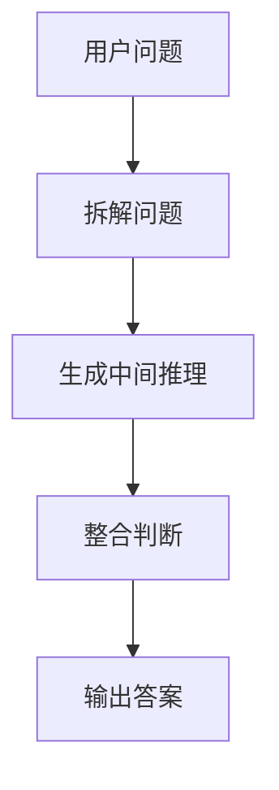
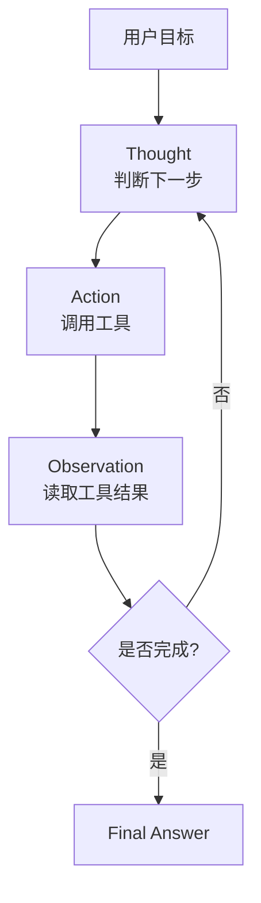
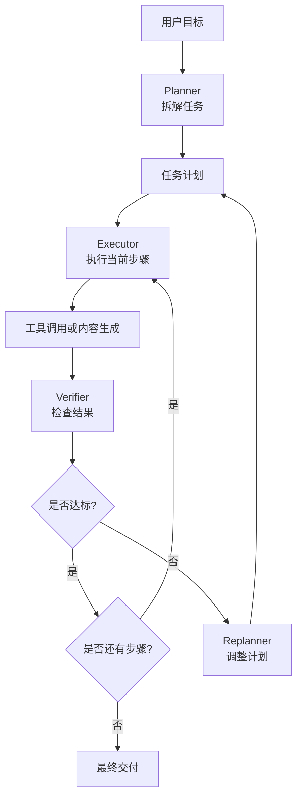

# Agent 规划范式进化论：从 CoT 到 Plan-and-Execute

> Agent 不是“会调用工具的大模型”，而是在目标约束下持续感知、规划、行动、验证并调整的执行系统。规划，就是把开放目标转化为可执行闭环的关键机制。

---

## 一、从一个简单问题开始：为什么“直接回答”不够

先看一个很普通的需求：

```text
帮我分析这个 SaaS 产品最近用户流失的主要原因，并给出三个改进建议。
```

如果把这个问题直接交给一个普通 LLM，它很可能会给出一段看起来很合理的答案：

```text
用户流失可能来自价格过高、产品体验不好、竞品吸引、客服响应慢。建议优化价格体系、改善核心功能体验、加强客户运营和召回机制。
```

这段回答不能说完全错。它符合常识，也有一定启发性。但如果你真的要拿它做产品决策，它的问题就很明显了。

第一，它没有确认“这个 SaaS 产品”到底是什么。是面向企业协作，还是面向开发者工具？是低客单价自助订阅，还是高客单价销售驱动？不同产品的流失原因完全不同。

第二，它没有读取真实数据。用户流失究竟发生在注册后第一天、试用期结束时，还是付费续约阶段？如果不知道流失发生在哪个阶段，就很难判断是获客质量问题、激活问题、价格问题还是长期价值不足。

第三，它没有区分事实和猜测。价格过高、体验不好、竞品吸引、客服慢，这些都是可能原因，但不是已经被证据支持的结论。

第四，它没有说明为什么是这三个建议优先。真正的业务建议需要考虑影响面、实施成本、验证难度和风险，而不只是列出几个看似正确的方向。

这个例子说明，复杂任务不是靠“一次生成”完成的。它需要一个推进过程：

```text
理解目标 -> 分解问题 -> 获取证据 -> 形成判断 -> 验证结论 -> 输出方案
```

这就是 Agent 为什么需要规划。

规划的本质不是“让模型写一个步骤列表”，而是让系统在开放目标面前知道：

- 现在要解决的问题是什么？
- 下一步应该做什么？
- 需要哪些信息和工具？
- 当前结果是否足够支撑结论？
- 什么时候应该继续，什么时候应该停下？
- 失败或证据不足时如何调整路径？

如果没有规划，Agent 很容易退化成“会调用工具的问答模型”：它可能查一些资料，做一些总结，但不一定能稳定完成目标。真正可用的 Agent，需要把推理、工具、状态、验证和反馈组织成闭环。

本文就围绕三种经典规划范式展开：

```text
CoT：让模型先想清楚。
ReAct：让模型边想边行动。
Plan-and-Execute：让模型先规划，再分步执行和验证。
```

它们不是简单的替代关系，而是一条能力逐步外化的演进路径。

---

## 二、规划范式总览：从内部思考到外部执行

LLM 应用最早的形态很简单：用户输入一个问题，模型直接输出答案。

这种方式适合单步任务，比如翻译一句话、解释一个概念、总结一段短文本。但一旦任务需要多步推理、外部信息或持续执行，直接回答就不够了。

于是规划范式开始演化：


这条路径可以这样理解：

| 范式 | 核心动作 | 解决的问题 | 主要局限 |
| :--- | :--- | :--- | :--- |
| CoT | 先推理，再回答 | 复杂问题不能一步到位 | 只能内部推理，不能接触真实环境 |
| ReAct | 一边推理，一边行动 | 需要外部工具和反馈 | 容易局部最优，长任务会漂移 |
| Plan-and-Execute | 先规划，再分步执行 | 长任务需要全局路径和验证 | 需要状态管理、重规划和工程治理 |

还是回到前面的 SaaS 用户流失案例。

如果使用 CoT，模型会先分析用户流失的常见原因，再给出一个结构化判断。它的优势是思路更清楚，但它主要依赖内部知识。

如果使用 ReAct，模型会一边分析，一边查询留存数据、用户反馈和客服工单。它的优势是能接触外部证据，但它可能想到哪里查到哪里，缺少全局计划。

如果使用 Plan-and-Execute，Agent 会先制定完整调研计划：确认分析范围、读取核心指标、分析变化点、检索用户反馈、交叉验证证据、形成结论、输出建议。它的优势是更适合复杂交付物。

所以，三种范式的演进不是从“笨”到“聪明”那么简单，而是从内部思考，走向外部交互，再走向工程化任务管理。

---

## 三、CoT：让模型先想清楚

CoT，全称 Chain-of-Thought，通常翻译为“思维链”。它的基本思想是：不要让模型直接给出最终答案，而是让模型先经过若干中间推理步骤，再形成结论。

它对应的基本结构是：

```text
Question -> Reasoning -> Final Answer
```

在 Agent 规划范式里，CoT 的价值在于：它让模型从“直接反应”变成“先组织思考”。

### 3.1 一个具体例子

用户问：

```text
一个 SaaS 产品最近用户留存下降，可能有哪些原因？请按优先级分析。
```

直接回答可能是：

```text
可能是体验不好、价格过高、竞品影响、客服响应慢。
```

CoT 型处理方式会更有层次。它会先把问题拆成几个维度：

```text
第一步：判断留存下降发生在哪类用户身上，是新用户、活跃用户还是付费用户。
第二步：如果主要发生在新用户，优先怀疑激活路径、获客质量和新手引导。
第三步：如果主要发生在付费用户，优先怀疑价值感、价格、续费周期和竞品替代。
第四步：如果所有用户都下降，可能是产品稳定性、核心功能变化或外部市场变化。
第五步：输出时按“影响范围 + 可验证性 + 可干预性”排序。
```

即使这个过程不调用任何工具，它也比直接罗列原因更有分析价值。因为它开始考虑：问题发生在哪里，哪些原因更可能，哪些原因更容易验证。

可以把 CoT 流程画成：



### 3.2 CoT 的价值

CoT 的第一个价值，是提升复杂推理任务的稳定性。很多问题不能一步到位，必须先拆解条件，再形成结论。比如数学题、逻辑题、方案比较、风险分析，都需要中间步骤。

第二个价值，是让模型的回答更结构化。即使最终不展示完整推理链，模型内部也需要先形成分析框架。

第三个价值，是为后续 Agent 规划打基础。Planner 制定计划时需要推理，Executor 判断工具结果时需要推理，Verifier 检查结论时也需要推理。没有 CoT 这类内部推理能力，后面的 ReAct 和 Plan-and-Execute 都很难成立。

### 3.3 CoT 的局限

CoT 的最大问题是：它仍然停留在模型内部世界。

它可以推测 SaaS 用户流失的可能原因，但不知道真实原因。它可以说“可能是新手引导复杂”，但没有读取用户反馈。它可以说“价格可能过高”，但没有检查价格变更记录。它可以给出建议，但不能验证建议是否和真实数据一致。

更麻烦的是，CoT 可能产生“自洽幻觉”。也就是说，它的推理过程看起来很顺，但前提可能是错的。比如模型可能假设用户流失主要发生在试用期结束后，然后围绕价格给出一整套建议。但真实数据可能显示，流失发生在注册后的第一天，根因是导入数据失败。

所以，CoT 解决的是“怎么想”的问题，但没有解决“怎么接触真实世界”的问题。

一句话总结：

```text
CoT 让模型从“直接回答”变成“先推理再回答”，但它仍然停留在模型内部世界。
```

---

## 四、ReAct：让模型边想边行动

CoT 的局限很快会暴露出来：真实任务不能只靠内部推理。尤其是 Agent 场景，模型必须通过工具获取外部信息。

分析用户流失至少需要：

- 查询留存数据。
- 阅读用户反馈。
- 查看客服工单。
- 对比版本发布记录。
- 检查渠道变化。
- 必要时查看竞品和价格变化。

这些信息不在模型当前上下文里，也不应该靠模型猜。

于是 ReAct 出现了。

ReAct 是 Reasoning and Acting 的组合。它把推理和行动放进同一个循环：

```text
Thought -> Action -> Observation -> Thought -> Action -> Observation -> Final Answer
```

也就是：

- Thought：我现在应该判断什么？
- Action：我调用哪个工具？
- Observation：工具返回了什么？
- Thought：根据新结果，我下一步该做什么？

流程图如下：



### 4.1 一个具体例子

还是用户流失分析。

ReAct 型 Agent 可能这样运行：

```text
Thought：要分析用户流失，先看最近 30 天留存数据。
Action：query_retention_metrics(product_id, last_30_days)
Observation：7 日留存从 42% 降到 31%，下降主要发生在新用户。

Thought：新用户下降明显，需要继续查新用户来源变化。
Action：query_acquisition_channels(product_id, last_30_days)
Observation：付费渠道流量占比从 30% 上升到 55%，但激活率明显低于自然流量。

Thought：可能是获客质量下降，也可能是新用户引导不顺。继续查用户反馈。
Action：search_feedback("onboarding", "activation", last_30_days)
Observation：大量反馈提到新手引导复杂、导入数据失败。

Thought：反馈指向激活阻塞，需要查版本发布记录。
Action：query_release_notes(last_30_days)
Observation：两周前上线了新的导入流程，相关错误率升高。

Final Answer：用户流失主要可能来自两个因素：付费渠道用户质量下降，以及新导入流程导致新用户激活受阻。
```

和 CoT 相比，ReAct 的进步非常明显。它不再只是在脑子里推理，而是让工具结果参与下一步判断。

### 4.2 ReAct 的价值

ReAct 的第一个价值，是把模型和外部世界连接起来。工具返回结果后，模型可以基于真实观察继续推理。

第二个价值，是适合探索式任务。有些任务一开始并不知道该查什么，必须边查边判断。比如排查 bug、搜索资料、分析异常数据，都很适合 ReAct。

第三个价值，是它构成了很多早期 Agent 的原型。一个最小 Agent 往往就是：

```text
理解目标 -> 判断下一步 -> 调用工具 -> 读取结果 -> 再判断
```

这已经比普通聊天机器人更接近“能做事”的系统。

### 4.3 ReAct 的局限

但 ReAct 也有明显局限。

首先，它容易局部最优。模型每一步都基于当前观察决定下一步，但不一定有全局计划。它可能看到留存下降就查留存，看到反馈提到导入失败就查导入，却忘了检查价格变化、竞品活动或客服响应。

其次，它容易造成工具调用失控。如果没有预算和停止条件，Agent 可能不断搜索、不断查询、不断补充信息，却迟迟不给出结论。

再次，它不天然知道什么叫“证据够了”。例如它查到了留存数据和反馈数据，但是否还需要查版本记录？是否需要查渠道变化？是否需要做分群？这些都需要更高层的计划来约束。

最后，长任务中 ReAct 容易漂移。刚开始目标是“分析用户流失”，查着查着可能变成“优化新手引导”，再查着查着可能变成“重新设计导入流程”。如果没有明确计划和状态管理，任务会偏离原目标。

一句话总结：

```text
ReAct 让模型从“内部推理”走向“外部交互”，但它更像即时决策，不天然擅长长程规划。
```

---

## 五、Plan-and-Execute：先规划，再执行

当任务从“回答一个问题”变成“交付一个结果”时，仅靠 ReAct 通常不够。

比如用户说：

```text
帮我完成一份用户流失分析报告，包含数据证据、主要原因、改进建议和下一步实验设计。
```

这已经不是一个轻量问答任务，而是一个完整交付任务。它需要：

- 明确输出结构。
- 确定数据来源。
- 按步骤收集证据。
- 分析多个可能原因。
- 交叉验证数据和反馈。
- 形成优先级。
- 给出可执行建议。
- 说明不确定性和下一步验证方式。

这时更合适的范式是 Plan-and-Execute。

它的基本结构是：

```text
用户目标
  -> Planner 制定计划
  -> Executor 执行步骤
  -> Verifier 检查结果
  -> Replanner 必要时重规划
  -> Final Output
```

流程图如下：



### 5.1 Planner：先把目标拆成路径

对于用户流失分析任务，Planner 可以先输出这样的计划：

```text
1. 确认分析范围：产品、时间窗口、流失定义。
2. 获取核心指标：新增、激活、留存、付费、流失分群。
3. 查找变化点：渠道、版本、价格、客服、竞品。
4. 阅读用户反馈和客服工单，提取高频问题。
5. 将数据变化和反馈证据交叉验证。
6. 归纳 2 到 4 个主要流失原因。
7. 为每个原因生成改进建议、预期收益和验证指标。
8. 输出结构化报告，并标注不确定内容。
```

这个计划的价值不只是“看起来有条理”。它给后续执行提供了边界。

Executor 不会随便查资料，而是按步骤推进。Verifier 也知道每一步该检查什么。用户或开发者可以看到当前进度。系统也可以设置最大步骤数、最大工具调用次数、失败重试策略和人工确认点。

### 5.2 Executor：按步骤执行，不随意偏航

假设当前执行第 4 步：

```text
当前步骤：阅读用户反馈和客服工单，提取高频问题。
```

Executor 可以这样执行：

```text
Action 1：search_feedback("cancel", "churn", last_30_days)
Result：取消原因中 38% 提到“上手困难”。

Action 2：search_support_tickets("import failed", last_30_days)
Result：导入失败相关工单增加 64%。

Action 3：cluster_feedback(feedback_items)
Result：高频主题包括导入失败、新手引导复杂、价格不清晰。

步骤结论：用户流失与新手激活阻塞高度相关，需要和留存数据交叉验证。
```

注意，这里 Executor 并没有直接跳到最终结论。它只完成当前步骤，并给出中间结论。这个中间结论还需要后续验证。

这就是 Plan-and-Execute 与普通 ReAct 的差异：ReAct 往往每一步都在即时决定下一步，而 Plan-and-Execute 让每一步都服务于全局计划。

### 5.3 Verifier：检查结果是否支撑目标

没有验证的计划，只是更长的 Prompt。

Verifier 要检查的不是“回答是否流畅”，而是结果是否满足目标。对于用户流失报告，它至少应该检查：

```text
1. 是否覆盖了用户要求的三个改进建议？
2. 每个结论是否有数据或反馈证据？
3. 是否区分事实、推断和建议？
4. 是否标注了不确定性？
5. 建议是否可执行、可验证？
6. 是否遗漏了关键维度，例如渠道、版本、价格和客服？
```

例如，Agent 输出：

```text
主要原因是价格过高。
```

Verifier 应该追问：

```text
有什么证据支持价格过高？
最近是否涨价？
取消反馈中有多少比例提到价格？
价格因素和新手引导问题相比，哪个影响更大？
```

如果这些问题回答不上来，这个结论就不能作为主要原因。

### 5.4 Replanner：重规划不是失败

真实环境里，计划经常会失败。

比如：

```text
原计划：查询完整用户行为日志。
失败原因：当前账号没有日志权限。
```

一个脆弱的 Agent 可能直接报错退出。一个成熟的 Agent 应该重规划：

```text
新计划：
1. 改用聚合留存指标。
2. 补充客服工单和用户反馈。
3. 使用版本发布记录辅助判断。
4. 在报告中标注限制：由于缺少完整行为日志，结论置信度为中等。
```

这就是 Plan-and-Execute 的关键能力：计划不是一次性写死的步骤，而是可以根据环境反馈调整的任务结构。

### 5.5 Plan-and-Execute 的价值和代价

Plan-and-Execute 的优势很明显：

- 适合长任务。
- 任务进度可见。
- 更容易控制成本。
- 更容易插入人工确认点。
- 更容易结合记忆、权限、日志和验证。
- 更接近生产级 Agent 架构。

但它也有代价。

初始计划可能不准确。计划太细，会增加执行开销；计划太粗，又无法指导行动。Planner 和 Executor 之间也可能出现信息断裂：Planner 设计的步骤很好，但 Executor 执行时丢了上下文。

所以，Plan-and-Execute 不是“越复杂越好”，而是适合那些确实需要长期推进、分步验证和风险控制的任务。

一句话总结：

```text
Plan-and-Execute 让 Agent 从“边想边做”走向“先组织任务，再受控执行”。
```

---

## 六、三种范式的本质对比

把 CoT、ReAct、Plan-and-Execute 放在一起看，会更清楚它们的边界。

| 维度 | CoT | ReAct | Plan-and-Execute |
| :--- | :--- | :--- | :--- |
| 核心范式 | 推理链 | 推理-行动循环 | 计划-执行分离 |
| 主要目标 | 提升思考质量 | 引入外部反馈 | 管理复杂任务 |
| 是否调用工具 | 通常不调用 | 会调用 | 会调用，并按计划调用 |
| 状态管理 | 弱 | 中 | 强 |
| 全局视角 | 弱 | 中 | 强 |
| 适合任务 | 逻辑推理、解释、简单分析 | 搜索、问答、轻量工具任务 | 调研、编码、报告、多步骤任务 |
| 主要风险 | 自洽幻觉 | 工具乱跳、循环 | 计划僵化、执行开销高 |
| 工程成熟度 | Prompt 技巧 | Agent 原型 | Agent 架构基础 |

再看一个工程案例：修复登录接口 500 错误。

用户说：

```text
登录接口线上偶发 500，帮我定位并修复。
```

如果用 CoT，模型可能根据报错文本推测：

```text
可能是空指针、数据库连接失败、参数缺失、session 过期、middleware 执行顺序错误。
```

这个分析有帮助，但还没有真正修复问题。

如果用 ReAct，Agent 会开始行动：

```text
读取报错日志 -> 查看 controller -> 查看 session middleware -> 运行测试 -> 根据结果继续判断。
```

它能逐步接近问题，但如果没有全局计划，可能读很多文件、跑很多命令，却没有明确验收标准。

如果用 Plan-and-Execute，Agent 会先制定修复路径：

```text
1. 复现错误。
2. 定位日志和失败测试。
3. 追踪请求链路。
4. 找到最小修改点。
5. 修改代码。
6. 运行相关测试。
7. 检查是否引入回归。
8. 总结根因和修复方案。
```

这个例子说明：任务越长、风险越高、验证越重要，就越需要显式计划。

---

## 七、演进动因：为什么不是谁替代谁

CoT、ReAct、Plan-and-Execute 不是简单的替代关系。

它们更像是三层能力外化：

```text
CoT 把推理显式化。
ReAct 把行动接入推理。
Plan-and-Execute 把任务管理从推理中拆出来。
```

可以画成：


CoT 并没有因为 ReAct 出现而消失。Planner 制定计划时需要推理，Executor 判断工具结果时需要推理，Verifier 检查结论时也需要推理。CoT 更像底层认知能力。

ReAct 也没有因为 Plan-and-Execute 出现而消失。Plan-and-Execute 的每个执行步骤内部，仍然可能是一个小型 ReAct 循环。

比如计划中的一步是：

```text
分析用户反馈中的高频流失原因。
```

Executor 在执行这一步时，可能仍然需要：

```text
搜索反馈 -> 读取结果 -> 判断主题是否足够 -> 继续检索 -> 聚类总结
```

这就是 ReAct。

所以，成熟 Agent 系统不是在三者中只选一个，而是分层使用：

```text
CoT 支撑内部推理。
ReAct 支撑局部工具交互。
Plan-and-Execute 支撑全局任务推进。
```

---

## 八、如何选择规划范式

实际工程里，不要一上来就套最复杂的架构。选择范式时，可以先看任务复杂度。

| 场景 | 推荐范式 | 原因 |
| :--- | :--- | :--- |
| 单步解释、概念分析 | CoT | 不需要工具，重点是思考清楚 |
| 需要查资料或调用少量工具 | ReAct | 边查边判断更灵活 |
| 长报告、代码修复、复杂分析 | Plan-and-Execute | 需要全局计划和分步验证 |
| 高风险业务流程 | Plan-and-Execute + Human-in-the-loop | 需要权限、审计和人工确认 |
| 多角色协作任务 | Plan-and-Execute + Multi-Agent | 需要分工、互评和合并结果 |

一个简单判断规则是：

```text
如果问题只需要想清楚，用 CoT。
如果问题需要边查边判断，用 ReAct。
如果问题需要交付一个复杂结果，用 Plan-and-Execute。
```

也可以问四个问题：

1. 是否需要外部工具？
2. 是否超过 3 个步骤？
3. 是否需要验证结果？
4. 是否有失败重试或权限风险？

如果答案大多是“是”，就应该考虑 Plan-and-Execute。

例如：

```text
请解释什么是 MCP。
```

这类任务用 CoT 或普通结构化回答就够了。

```text
请帮我查一下某个开源框架最近版本变化，并总结影响。
```

这类任务需要搜索和阅读资料，ReAct 更合适。

```text
请帮我基于现有代码实现一个功能，补测试，并说明修改点。
```

这类任务涉及读取代码、制定计划、修改文件、运行测试、验证结果，明显更适合 Plan-and-Execute。

---

## 九、从规划范式走向 Agent 工程

如果把本文放回“AI 能力工程”的整体框架里，规划范式只是 Agent 系统的一部分。

完整工程链路可以概括为：

```text
Skill：沉淀“怎么做”的方法论
MCP：提供“靠什么做”的工具接口
Agent：负责“谁来规划、调度、执行和验证”
```

CoT、ReAct、Plan-and-Execute 分别对应 Agent 内部的不同能力层：

| 能力 | 对应位置 |
| :--- | :--- |
| CoT | 模型内部推理能力 |
| ReAct | 工具调用和反馈循环能力 |
| Plan-and-Execute | 任务管理和执行编排能力 |
| Skill | 可复用的方法和流程 |
| MCP | 标准化工具、资源和上下文接口 |
| Memory | 跨会话状态延续 |
| Verifier | 结果可靠性边界 |
| Permission | 行动安全边界 |
| Observability | 可调试和可审计能力 |

生产级 Agent 的规划闭环可以写成：

```text
用户目标
  -> 读取相关 Skill
  -> 制定任务计划
  -> 调用 MCP 工具
  -> 记录状态和记忆
  -> 验证结果
  -> 必要时请求人工确认
  -> 交付结果
  -> 写入经验和日志
```

这也解释了为什么只讨论 Prompt 不够。Prompt 可以改善模型行为，但不能单独解决工具权限、执行状态、结果验证、成本预算和审计追踪。

Agent 真正的工程问题，是把不确定的模型能力放进确定的系统边界里。

---

## 十、常见误区

### 10.1 CoT 越长越好

长推理不等于正确推理。推理链越长，错误累积风险越高。对于简单任务，过长的推理反而会引入噪声。

例如用户只问：

```text
什么是 MCP？
```

这时不需要十步推理。直接给定义、结构和例子，效果更好。

### 10.2 ReAct 就是 Agent

ReAct 是一种推理-行动模式，但不是完整 Agent。

一个系统能搜索网页并总结，并不代表它能长期推进调研项目。完整 Agent 还需要目标、状态、记忆、权限、验证和观测。

### 10.3 Plan-and-Execute 一定更高级

Plan-and-Execute 更适合复杂任务，但不适合所有任务。

如果用户只是说：

```text
帮我把这句话翻译成英文。
```

这时不需要 Planner、Executor、Verifier 三件套。过度规划会增加延迟和成本。

好的 Agent 应该根据任务复杂度选择规划粒度，而不是默认把所有问题都包装成长流程。

### 10.4 规划等于一次性写死步骤

真实 Agent 的计划应该可执行、可验证、可调整。

如果搜索不到官方财报，Agent 不应该直接失败，而应该改查监管机构公告、公司投资者关系页面或可信新闻源，并在最终输出里说明来源限制。

重规划不是失败，而是 Agent 面对真实环境变化时的正常能力。

---

## 十一、总结：Agent 规划的本质

可以用三句话总结三种范式：

```text
CoT 解决“怎么想”。
ReAct 解决“怎么边想边做”。
Plan-and-Execute 解决“怎么围绕目标组织长期行动”。
```

再回到第一性原理：

```text
规划不是 Agent 的装饰能力，而是开放目标转化为可执行闭环的核心机制。
```

没有规划，Agent 只是会调用工具的模型。它可能完成一些局部动作，但不一定能稳定交付目标。

有了规划，Agent 才能把目标、状态、工具、反馈和验证组织成连续行动。

如果说规划解决“下一步做什么”，记忆解决“过去什么信息仍然有用”；如果说 ReAct 让 Agent 能调用工具，MCP 让工具调用变成可标准化、可治理的能力接口；如果说 Plan-and-Execute 让 Agent 能长期推进任务，Skill 则让可复用方法沉淀成稳定执行范式。

所以，从 CoT 到 ReAct，再到 Plan-and-Execute，本质上不是 Prompt 技巧的升级，而是 Agent 从“会思考”走向“能行动”，再走向“可治理执行系统”的过程。
