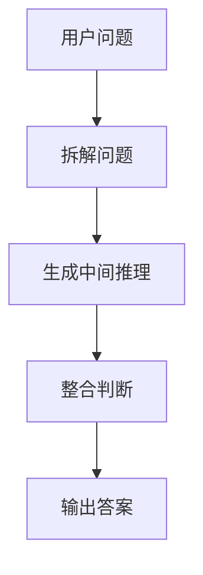
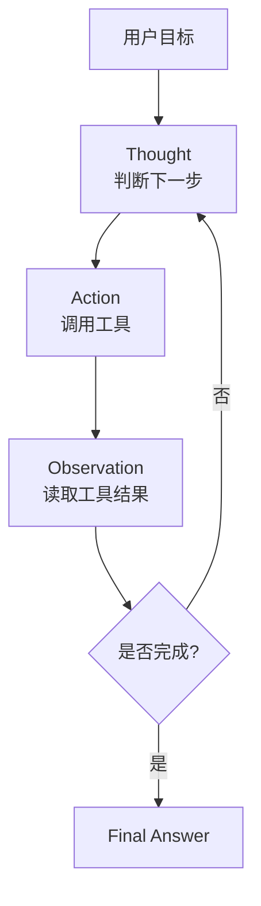
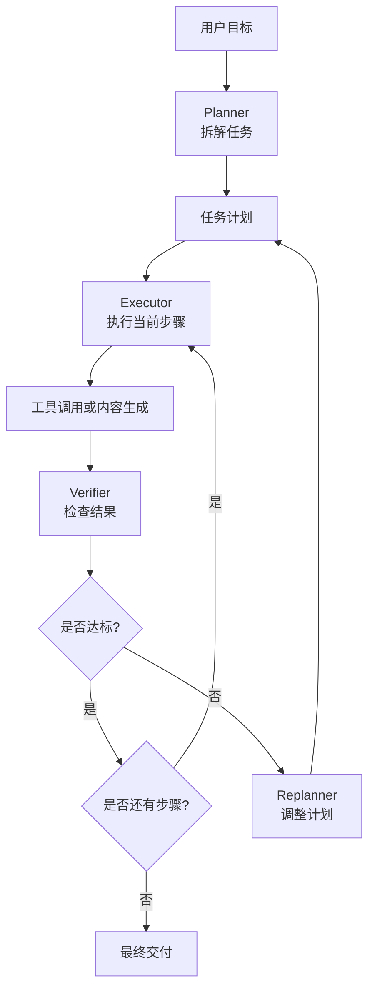

# Agent 规划范式进化论：从 CoT 到 Plan-and-Execute

> 本文结构稿。写作目标：从一个简单问题切入，逐层抽象 CoT、ReAct、Plan-and-Execute 的演进逻辑，最后回到 Agent 工程落地。正文扩写时应尽量用具体案例讲清楚，而不是只堆概念。

---

## 写作主线

本文要回答一个核心问题：

```text
LLM Agent 为什么需要规划？规划能力是如何从模型内部推理，演化到外部工具交互，再演化到显式任务执行系统的？
```

建议用一个贯穿案例来讲：

```text
用户目标：帮我分析某个 SaaS 产品最近用户流失的原因，并给出三条可执行改进建议。
```

这个任务天然包含三类难点：

- 需要推理：用户为什么流失，可能有哪些原因。
- 需要外部信息：要查数据、看工单、读反馈、统计指标。
- 需要多步骤推进：先明确目标，再收集信息，再分析原因，再形成建议，再验证结论。

用这个案例可以自然引出：

```text
CoT：模型先在脑子里分析。
ReAct：模型一边分析，一边查资料和调用工具。
Plan-and-Execute：模型先制定完整计划，再分步执行、检查和重规划。
```

---

## 一、从一个简单问题开始：为什么“直接回答”不够

### 1.1 场景引入

用户问：

```text
帮我分析这个产品最近用户流失的主要原因，并给出三个改进建议。
```

如果普通 LLM 直接回答，可能会输出：

```text
用户流失可能来自价格过高、产品体验不好、竞品吸引、客服响应慢。建议优化价格、改善体验、加强客户运营。
```

这个回答看起来合理，但问题是：

- 没有确认“这个产品”是什么。
- 没有读取真实用户数据。
- 没有区分事实和猜测。
- 没有说明三条建议为什么优先。
- 没有验证结论是否和真实数据一致。

### 1.2 抽象问题

这个例子说明：复杂任务不是靠“一次生成”完成的，而需要一套任务推进机制。

可以把复杂任务拆成：

```text
理解目标 -> 分解问题 -> 获取证据 -> 形成判断 -> 验证结论 -> 输出方案
```

这就是 Agent 规划范式出现的原因。

### 1.3 本节小结

一句话收束：

```text
复杂任务的关键不是让模型回答得更流畅，而是让模型知道下一步该做什么、凭什么做、做到什么程度才算完成。
```

---

## 二、规划范式总览：从内部思考到外部执行

### 2.1 三种范式的演进关系

建议放流程图：


### 2.2 三种范式一句话理解

| 范式 | 一句话 | 解决的问题 |
| :--- | :--- | :--- |
| CoT | 让模型先想清楚再回答 | 复杂推理不能一步到位 |
| ReAct | 让模型边想边调用工具 | 仅靠内部知识不够，需要外部反馈 |
| Plan-and-Execute | 让模型先规划任务，再分步执行 | 长任务需要全局路径、状态管理和验证 |

### 2.3 用同一个任务对比

任务：

```text
分析 SaaS 产品用户流失原因。
```

三种范式的表现：

| 范式 | 可能行为 |
| :--- | :--- |
| CoT | 先分析可能原因，再给建议，但主要基于模型内部知识 |
| ReAct | 先想一个方向，然后查询用户反馈、调用数据工具，再继续分析 |
| Plan-and-Execute | 先制定调研计划：确认指标、读取数据、分析工单、归因、验证、输出建议 |

---

## 三、CoT：让模型先想清楚

### 3.1 CoT 的基本思想

CoT，即 Chain-of-Thought，核心是让模型在回答前进行中间推理。

它对应的范式是：

```text
Question -> Reasoning Steps -> Final Answer
```

### 3.2 具体例子：不用工具时如何分析

用户问：

```text
一个产品最近用户留存下降，可能有哪些原因？请按优先级分析。
```

CoT 型处理方式：

```text
第一步：先判断留存下降可能来自产品、用户、市场、运营四类因素。
第二步：产品因素包括性能、功能缺失、体验路径变长。
第三步：用户因素包括目标用户变化、新用户质量下降。
第四步：市场因素包括竞品活动、价格变化。
第五步：运营因素包括触达减少、客服响应变慢。
最终输出：按可能影响面和可验证性排序。
```

### 3.3 CoT 的流程图



### 3.4 CoT 的价值

- 让模型从直接回答变成逐步分析。
- 对数学、逻辑、分类、概念解释有帮助。
- 可以提升复杂问题的可解释性。
- 是后续 Agent 规划能力的基础。

### 3.5 CoT 的局限

结合前面的 SaaS 案例说明：

- 它能提出“可能原因”，但不知道真实原因。
- 它能组织推理，但不能读取数据库。
- 它能生成建议，但不能验证建议优先级。
- 它可能输出一套自洽但未经证据支持的解释。

### 3.6 本节小结

```text
CoT 解决的是“模型怎么想”的问题，但它仍停留在模型内部世界。
```

---

## 四、ReAct：让模型边想边行动

### 4.1 ReAct 为什么出现

CoT 的核心问题是只能内部推理。真实任务往往需要外部证据。

比如分析用户流失，至少需要：

- 查询用户留存数据。
- 阅读用户反馈。
- 查看客服工单。
- 对比版本发布记录。
- 检查竞品和价格变化。

于是 ReAct 出现：把 Reasoning 和 Acting 放进同一个循环。

### 4.2 ReAct 的基本循环

```text
Thought -> Action -> Observation -> Thought -> Action -> Observation -> Final Answer
```

流程图：



### 4.3 具体例子：分析用户流失

ReAct 可能这样运行：

```text
Thought：要分析用户流失，先看最近 30 天留存数据。
Action：query_retention_metrics(product_id, last_30_days)
Observation：7 日留存从 42% 降到 31%，下降主要发生在新用户。

Thought：新用户下降明显，继续查新用户来源变化。
Action：query_acquisition_channels(product_id, last_30_days)
Observation：付费渠道流量占比从 30% 上升到 55%，但激活率较低。

Thought：可能是获客质量下降，也需要查用户反馈。
Action：search_feedback("onboarding", "activation", last_30_days)
Observation：大量反馈提到新手引导复杂、导入数据失败。

Final Answer：流失主要可能来自新用户质量变化和新手引导阻塞。
```

### 4.4 ReAct 的价值

- 把模型推理和工具调用结合起来。
- 外部观察结果会影响下一步判断。
- 适合搜索、问答、轻量数据查询、调试探索。
- 是很多早期 Agent 的基础范式。

### 4.5 ReAct 的局限

用同一个例子说明：

- 它可能查到哪里想到哪里，缺少全局调研计划。
- 它可能反复查询相似数据，造成成本浪费。
- 它可能遗漏关键维度，例如版本发布、价格变化、竞品动作。
- 它不天然知道什么时候“证据够了”。
- 长任务中容易循环或漂移。

### 4.6 本节小结

```text
ReAct 解决的是“模型怎么边想边做”的问题，但它更像即时决策，不天然擅长长程任务管理。
```

---

## 五、Plan-and-Execute：先规划，再执行

### 5.1 为什么需要 Plan-and-Execute

当任务从“查一个事实”变成“完成一个交付物”时，仅靠 ReAct 不够。

例如：

```text
帮我完成一份用户流失分析报告，包含数据证据、主要原因、改进建议和下一步实验设计。
```

这个任务需要：

- 明确输出结构。
- 确定数据来源。
- 按步骤收集证据。
- 分析多个原因。
- 形成优先级。
- 检查结论是否有证据支持。
- 生成最终报告。

这就需要 Plan-and-Execute。

### 5.2 基本结构

```text
用户目标
  -> Planner 制定计划
  -> Executor 执行步骤
  -> Verifier 检查结果
  -> Replanner 必要时重规划
  -> Final Output
```

流程图：



### 5.3 具体例子：Planner 如何拆任务

用户目标：

```text
分析 SaaS 产品用户流失原因，并给出三条可执行建议。
```

Planner 输出：

```text
1. 确认分析范围：产品、时间窗口、流失定义。
2. 获取核心指标：新增、激活、留存、付费、流失分群。
3. 查找变化点：渠道、版本、价格、客服、竞品。
4. 阅读用户反馈和客服工单，提取高频问题。
5. 将数据变化和反馈证据交叉验证。
6. 归纳 2 到 4 个主要流失原因。
7. 为每个原因生成改进建议、预期收益和验证指标。
8. 输出结构化报告，并标注不确定内容。
```

### 5.4 Executor 如何执行其中一步

执行第 4 步：

```text
当前步骤：阅读用户反馈和客服工单，提取高频问题。

Action 1：search_feedback("cancel", "churn", last_30_days)
Result：取消原因中 38% 提到“上手困难”。

Action 2：search_support_tickets("import failed", last_30_days)
Result：导入失败相关工单增加 64%。

Action 3：cluster_feedback(feedback_items)
Result：高频主题包括导入失败、新手引导复杂、价格不清晰。

步骤结论：用户流失与新手激活阻塞高度相关，需要和留存数据交叉验证。
```

### 5.5 Verifier 如何检查

Verifier 不应该只说“看起来不错”，而要检查：

```text
1. 是否覆盖了用户要求的三个改进建议？
2. 每个结论是否有数据或反馈证据？
3. 是否区分事实、推断和建议？
4. 是否标注了不确定性？
5. 建议是否可执行、可验证？
```

### 5.6 Replanner 什么时候介入

需要重规划的情况：

- 数据接口没有权限。
- 留存指标缺失。
- 用户反馈和数据结论冲突。
- 分析范围过大，需要缩小。
- 成本或时间超过预算。

例子：

```text
原计划：查询完整用户行为日志。
失败原因：没有日志权限。
重规划：改用聚合指标、客服工单和用户访谈摘要做近似分析，并在报告中标注限制。
```

### 5.7 本节小结

```text
Plan-and-Execute 解决的是“模型如何围绕目标组织长期行动”的问题。
```

---

## 六、三种范式的本质对比

### 6.1 对比表

| 维度 | CoT | ReAct | Plan-and-Execute |
| :--- | :--- | :--- | :--- |
| 核心范式 | 推理链 | 推理-行动循环 | 计划-执行分离 |
| 主要目标 | 提升思考质量 | 引入外部反馈 | 管理复杂任务 |
| 是否调用工具 | 通常不调用 | 会调用 | 会调用，并按计划调用 |
| 状态管理 | 弱 | 中 | 强 |
| 全局视角 | 弱 | 中 | 强 |
| 适合任务 | 逻辑推理、解释 | 搜索、问答、轻量工具任务 | 调研、编码、报告、多步骤任务 |
| 主要风险 | 自洽幻觉 | 工具乱跳、循环 | 计划僵化、执行开销高 |
| 工程成熟度 | Prompt 技巧 | Agent 原型 | Agent 架构基础 |

### 6.2 用一个代码修复案例再对比

任务：

```text
修复登录接口 500 错误。
```

CoT：

```text
模型根据报错文本推测可能是空指针、数据库连接、参数缺失。
```

ReAct：

```text
模型读取报错 -> 查看 controller -> 查看 middleware -> 运行测试 -> 继续判断。
```

Plan-and-Execute：

```text
1. 复现错误。
2. 定位日志和失败测试。
3. 追踪请求链路。
4. 修改最小相关代码。
5. 运行测试。
6. 检查是否引入回归。
7. 总结修复原因。
```

这个例子说明：任务越长、风险越高、验证越重要，就越需要 Plan-and-Execute。

---

## 七、演进动因：为什么不是谁替代谁

### 7.1 能力逐层外化

三种范式不是简单替代关系，而是能力逐层外化：

```text
CoT 把推理显式化；
ReAct 把行动接入推理；
Plan-and-Execute 把任务管理从推理中拆出来。
```

建议流程图：


### 7.2 为什么 CoT 仍然重要

即使有 ReAct 和 Plan-and-Execute，CoT 仍然是基础能力。

例子：

```text
Planner 制定计划时，需要内部推理。
Executor 判断工具结果时，需要内部推理。
Verifier 检查结论时，也需要内部推理。
```

所以 CoT 不是被淘汰，而是成为更复杂 Agent 系统里的底层推理能力。

### 7.3 为什么 ReAct 仍然重要

Plan-and-Execute 的每个执行步骤内部，仍然可能是 ReAct 循环。

例子：

```text
计划步骤：分析用户反馈。
执行过程：搜索反馈 -> 读取结果 -> 判断还缺什么 -> 再搜索 -> 总结。
```

所以 ReAct 也不是被淘汰，而是成为执行阶段的局部行动策略。

---

## 八、如何选择规划范式

### 8.1 选型表

| 场景 | 推荐范式 | 原因 |
| :--- | :--- | :--- |
| 单步解释、概念分析 | CoT | 不需要工具，重点是思考清楚 |
| 需要查资料或调用少量工具 | ReAct | 边查边判断更灵活 |
| 长报告、代码修复、复杂分析 | Plan-and-Execute | 需要全局计划和分步验证 |
| 高风险业务流程 | Plan-and-Execute + Human-in-the-loop | 需要权限、审计和人工确认 |
| 多角色协作任务 | Plan-and-Execute + Multi-Agent | 需要分工、互评和合并结果 |

### 8.2 一个简单判断规则

```text
如果问题只需要想清楚，用 CoT。
如果问题需要边查边判断，用 ReAct。
如果问题需要交付一个复杂结果，用 Plan-and-Execute。
```

### 8.3 任务复杂度判断

可以从四个问题判断：

1. 是否需要外部工具？
2. 是否超过 3 个步骤？
3. 是否需要验证结果？
4. 是否有失败重试或权限风险？

如果答案大多是“是”，就应该考虑 Plan-and-Execute。

---

## 九、从规划范式走向 Agent 工程

### 9.1 接回 Skill、MCP、Agent 主线

本文最后要回到整套 AI 能力工程框架：

```text
Skill：沉淀“怎么做”的方法论
MCP：提供“靠什么做”的工具接口
Agent：负责“谁来规划、调度、执行和验证”
```

### 9.2 三种范式在工程系统中的位置

| 能力 | 对应位置 |
| :--- | :--- |
| CoT | 模型内部推理能力 |
| ReAct | 工具调用和反馈循环能力 |
| Plan-and-Execute | 任务管理和执行编排能力 |
| Skill | 可复用的方法和流程 |
| MCP | 标准化工具、资源和上下文接口 |
| Memory | 跨会话状态延续 |
| Verifier | 结果可靠性边界 |
| Permission | 行动安全边界 |
| Observability | 可调试和可审计能力 |

### 9.3 生产级 Agent 的规划闭环

最终可以把生产级 Agent 的规划闭环写成：

```text
用户目标
  -> 读取 Skill
  -> 制定计划
  -> 调用 MCP 工具
  -> 记录状态和记忆
  -> 验证结果
  -> 必要时请求人工确认
  -> 交付结果
  -> 写入经验和日志
```

---

## 十、常见误区

### 10.1 误区一：CoT 越长越好

要点：

- 长推理不等于正确推理。
- 推理链越长，错误累积风险越高。
- 对简单任务，直接回答更好。

例子：

```text
用户只问“什么是 MCP？”时，不需要十步推理，直接给定义和例子即可。
```

### 10.2 误区二：ReAct 就是 Agent

要点：

- ReAct 是一种推理-行动模式。
- Agent 还需要目标、状态、记忆、权限、验证和观测。

例子：

```text
一个系统能搜索网页并总结，并不代表它能长期推进调研项目。
```

### 10.3 误区三：Plan-and-Execute 一定更高级

要点：

- 对短任务，它可能过度设计。
- 对探索性强的任务，计划需要频繁调整。
- 好的 Agent 应该根据任务复杂度选择规划粒度。

例子：

```text
用户问“帮我把这句话翻译成英文”，不需要 Planner、Executor、Verifier 三件套。
```

### 10.4 误区四：规划等于一次性写死步骤

要点：

- 真实 Agent 的计划应该可执行、可验证、可调整。
- 重规划不是失败，而是面对真实环境变化的正常能力。

例子：

```text
如果搜索不到官方财报，Agent 应该改查监管机构公告，而不是直接失败。
```

---

## 十一、总结：Agent 规划的本质

### 11.1 三句话收束

```text
CoT 解决“怎么想”。
ReAct 解决“怎么边想边做”。
Plan-and-Execute 解决“怎么围绕目标组织长期行动”。
```

### 11.2 回到第一性原理

规划不是 Agent 的装饰能力，而是开放目标转化为可执行闭环的核心机制。

```text
没有规划，Agent 只是会调用工具的模型。
有了规划，Agent 才能把目标、状态、工具、反馈和验证组织成连续行动。
```

### 11.3 承接后续文章

可以在结尾承接整个专栏：

- 如果说规划解决“下一步做什么”，记忆解决“过去什么信息仍然有用”。
- 如果说 ReAct 让 Agent 能调用工具，MCP 让工具调用变成可标准化、可治理的能力接口。
- 如果说 Plan-and-Execute 让 Agent 能长期推进任务，Skill 则让可复用方法沉淀成稳定执行范式。

---

## 写作注意事项

扩写正文时建议遵循：

```text
概念不要堆，先讲问题。
范式不要孤立讲，讲它为什么出现。
对比不要只列优缺点，要讲适用边界。
每个范式至少配一个具体例子。
最后一定回到 Agent 工程体系。
```
