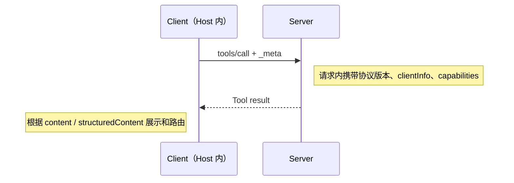
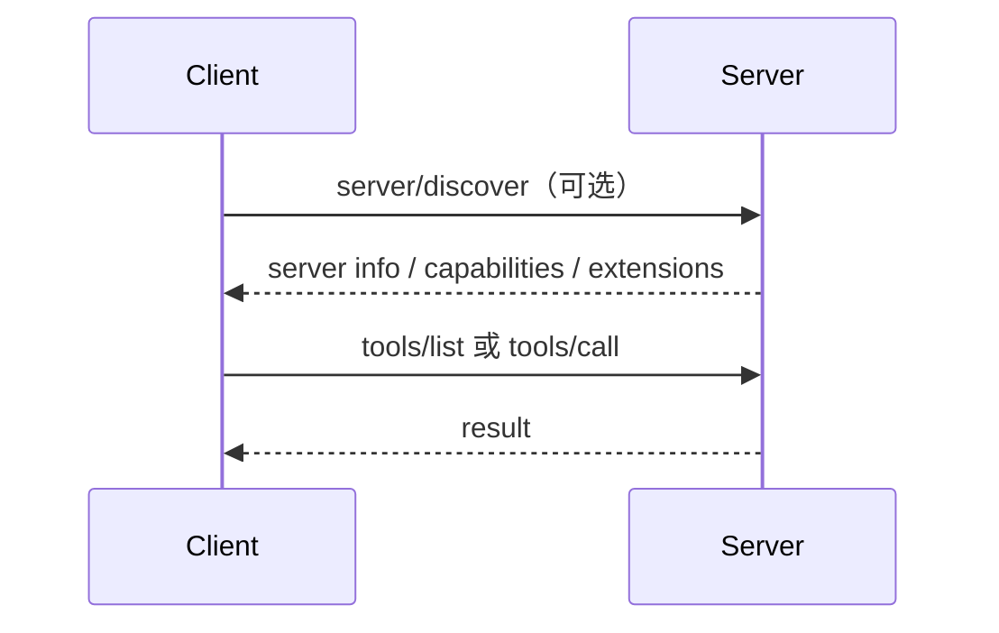
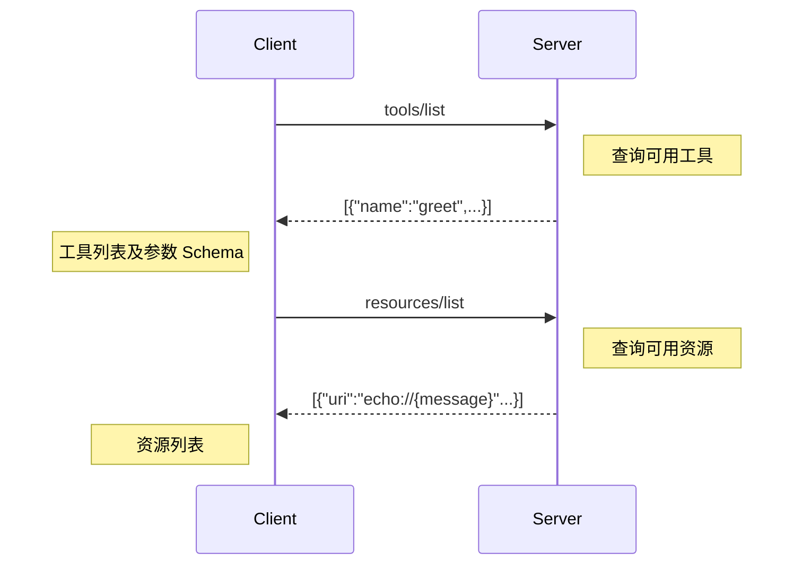
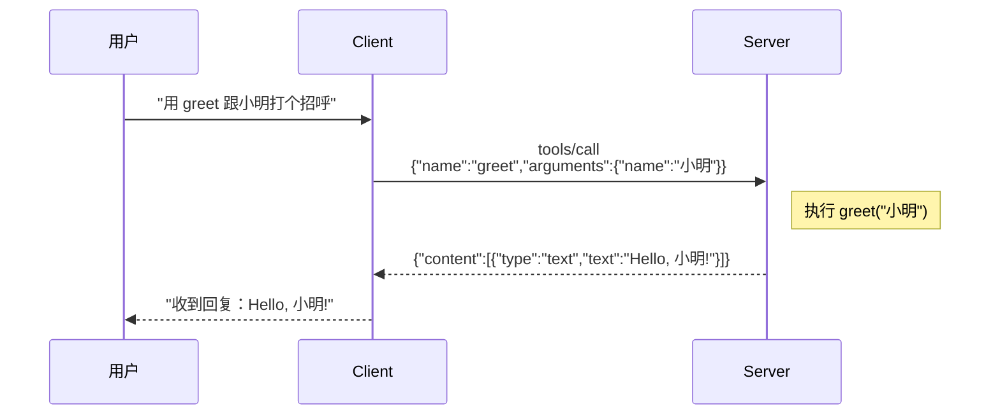

# MCP 开发总结 V5

## 阅读路径建议

这份文档已经覆盖从入门、开发、生产治理到生态集成的完整 MCP 路径。初读时不必一次性读完 22 章，可以按目标选择路线。

| 路径 | 适用人群 | 必读章节 | 阅读目标 |
|------|----------|----------|----------|
| **快速入门** | 只想跑通第一个 MCP Server | 1, 2, 3, 4, 6, 8 | 理解 MCP 是什么、怎么注册 Tool、怎么被 Host 调用 |
| **生产开发** | 要写一个真实可用的 MCP Server | 1-9, 11, 13, 14, 15 | 掌握结构化返回、边界校验、错误处理、安全和测试 |
| **架构/运维** | 要部署、治理和维护 MCP 服务 | 5, 9, 11, 14, 16, 17, 19, 22 | 掌握 HTTP 化、部署、观测、版本迁移和压测 |
| **生态集成** | 要把 MCP 接入 Agent 或自研 Host | 6, 10, 18, 20, 21 | 掌握工具编排、Client 开发、协议扩展和框架适配 |

建议读法：先用第 2 章跑通 Hello World，再按自己的路线补齐后续章节。遇到生产落地问题时，优先查第 9 章、附录 E 和附录 F。

# 1. 什么是 MCP

## 一句话定义

**MCP（Model Context Protocol，模型上下文协议）** 是一个开放标准协议，由 Anthropic 提出，规定了 AI 模型（如 Claude）如何与外部工具、数据源和服务进行连接和通信。

## 它解决什么问题？

在 MCP 出现之前，每个 AI 应用想连接外部服务（比如 GitHub、数据库、本地文件系统），都得自己写一套对接代码。10 个 AI 应用 × 10 个外部服务 = 100 套集成代码，而且每套都要单独维护，扩展性极差。

MCP 的核心思路是：**所有 AI 应用和所有外部服务都遵循同一套通信协议**，就像 USB-C 统一了各种充电线。一个 MCP Server 写一次，所有支持 MCP 的 Host 都能用。

> **类比**：USB-C 出现前，手机用 Micro-USB，相机用 Mini-USB，笔记本用各种圆口——每个设备一种线。USB-C 统一接口后，一根线充所有设备。MCP 对 AI 工具连接做了同样的事。
>
> **类比不成立的地方**：USB-C 是物理硬件标准，传输电流和数据流；MCP 是软件协议，传输 JSON-RPC 消息（请求、响应、通知），且通信是双向的——AI 可以调用工具，工具也可以主动通知 AI。

## 架构概览

```
┌─────────────────────────────────────────┐
│              Host（宿主应用）              │
│         如 Claude Desktop / WorkBuddy     │
│  ┌──────────────┐     ┌──────────────┐   │
│  │   AI 模型     │────▶│  MCP Client  │   │
│  │ LLM 推理引擎  │◀────│  协议客户端    │   │
│  └──────────────┘     └──────┬───────┘   │
└──────────────────────────────┼───────────┘
                               │ MCP 协议通信
          ┌────────────────────┼────────────────────┐
          │           MCP Server（可多个）             │
          │  ┌──────────┐ ┌──────────┐ ┌──────────┐ │
          │  │ GitHub   │ │ 文件系统  │ │ 数据库   │ │
          │  │ Server   │ │ Server   │ │ Server   │ │
          │  └──────────┘ └──────────┘ └──────────┘ │
          └─────────────────────────────────────────┘
```

| 概念 | 角色 | 类比 |
|------|------|------|
| **Host** | 运行 AI 的宿主应用 | 电脑主机 |
| **MCP Client** | 嵌在 Host 里的协议客户端 | USB-C 接口控制器 |
| **MCP Server** | 对接外部服务的协议服务端 | 外接设备（U盘、显示器）|
| **Tools / Resources / Prompts** | Server 暴露的三类能力 | 设备提供的功能 |

## 三种能力

MCP Server 向 AI 暴露三类能力：

- **Tools（工具）**：AI 可以调用的操作。如"创建 GitHub Issue"、"查询数据库"。
- **Resources（资源）**：AI 可以读取的数据。如"项目文件内容"、"数据库表结构"。
- **Prompts（提示词模板）**：预置的标准提示词。如"代码审查检查清单"。

---

# 2. 第一个 MCP Server（Hello World）

别急着啃理论。先跑起来，获得成就感。

## 2.0 5 分钟快速跑通

如果你只想先确认 MCP 能工作，按下面顺序做一遍即可：

1. 新建一个空目录，例如 `D:/mcp-demo`。
2. 创建虚拟环境并安装依赖：`python -m venv .venv`，然后用 `.venv/Scripts/python.exe -m pip install fastmcp`。
3. 把本章 `hello_server.py` 示例保存到 `D:/mcp-demo/hello_server.py`。
4. 在终端里先运行：`.venv/Scripts/python.exe hello_server.py`，确认没有导入错误；看到服务等待连接即可停止。
5. 用 MCP Inspector 连接这个脚本，确认能看到 `greet` Tool 和 `echo://{message}` Resource。
6. 把 Host 配置里的 `command` 写成虚拟环境 Python 绝对路径，把 `args` 写成脚本绝对路径。
7. 重启 Host，在对话里请求“用 greet 工具和小明打招呼”。

这条路径的目标不是讲完所有概念，而是把“Server 能启动、Host 能发现、Tool 能调用”三件事一次串起来。后面章节再解释每一步为什么这样做。

## 2.1 安装 SDK

本文的 Hello World 使用 `fastmcp` 写法，和本文第 9 章的质检服务示例保持一致。不要把不同文档里的 SDK 安装命令和导入路径混在同一个示例里，否则新手很容易照抄后导入失败。

```bash
pip install fastmcp
```

## 2.2 写代码

创建 `hello_server.py`：

```python
from fastmcp import FastMCP

# 创建一个 MCP Server
mcp = FastMCP("Hello MCP")

# 注册一个工具：AI 调用 greet("小明") 就能得到回复
@mcp.tool()
def greet(name: str) -> str:
    """向某人打招呼"""
    return f"Hello, {name}!"

# 注册一个资源：AI 读取 echo://hello 就能拿到数据
@mcp.resource("echo://{message}")
def echo_resource(message: str) -> str:
    """返回用户输入的消息"""
    return f"你说的是: {message}"

# 启动 Server
if __name__ == "__main__":
    mcp.run()
```

这就是一个完整可用的 MCP Server。10 行代码，一个 Tool，一个 Resource。

## 2.3 配置到 Host

在你的 AI 应用（如 Claude Desktop、WorkBuddy）的 MCP 配置中添加。下面是本地 `stdio` 方式：

```json
{
  "mcpServers": {
    "hello-world": {
      "command": "python",
      "args": ["D:/你的路径/hello_server.py"]
    }
  }
}
```

如果使用虚拟环境，建议把 `command` 写成虚拟环境里的 Python 绝对路径，避免 Host 启动时找错解释器：

```json
{
  "mcpServers": {
    "hello-world": {
      "command": "D:/你的项目/.venv/Scripts/python.exe",
      "args": ["D:/你的项目/hello_server.py"]
    }
  }
}
```

如果服务端以 Streamable HTTP 方式运行，则 Host 配置通常长这样：

```json
{
  "mcpServers": {
    "hello-world-streamableHTTP": {
      "type": "http",
      "url": "http://127.0.0.1:8000/mcp"
    }
  }
}
```

### 2.3.1 环境诊断：先解决 command / python / PATH

新手最常见的失败不是 MCP 协议错了，而是 Host 启动不了你的 Server。因为 Host 通常不是从你当前终端启动的，它看到的 `PATH`、`PYTHONPATH`、虚拟环境激活状态，可能和你在命令行里看到的不一样。

如果 Host 报 `command not found`、`python not found`、`No module named fastmcp`，按这个顺序排查：

1. **把 `command` 改成绝对路径**：不要依赖 Host 能找到 `python`。
2. **确认用的是虚拟环境 Python**：优先写 `.venv/Scripts/python.exe` 这类绝对路径。
3. **确认依赖装在同一个解释器里**：用同一个 Python 执行 `-m pip show fastmcp`。
4. **不要假设虚拟环境已激活**：Host 启动 stdio Server 时通常不会自动执行 `activate`。
5. **需要额外模块路径时显式配置 `PYTHONPATH`**：如果你的代码依赖本地 `src` 目录，Host 不一定知道它。

可以在支持 `env` 的 Host 配置里显式传环境变量：

```json
{
  "mcpServers": {
    "hello-world": {
      "command": "D:/你的项目/.venv/Scripts/python.exe",
      "args": ["D:/你的项目/hello_server.py"],
      "env": {
        "PYTHONPATH": "D:/你的项目/src"
      }
    }
  }
}
```

在 Windows 上，如果你的 Server 还要调用本地 EXE 或 DLL，也要确认 Host 启动时的 `PATH` 包含这些程序或动态库所在目录。更稳的做法是：在服务端代码或启动脚本里使用绝对路径。

### 2.3.2 日志诊断：工具列表为空时看哪里

如果 AI 应用里看不到工具，或者工具列表为空，不要只看当前控制台。`stdio` 模式下，Server 的 stdout 是协议通道，stderr 通常会被 Host 捕获到自己的日志文件里。

排查顺序：

1. 先确认配置 JSON 语法正确，路径没有写错。
2. 重启 Host，让它重新启动 MCP Server。
3. 查看 Host 的 MCP 日志，重点找 Python 异常、导入失败、路径不存在、权限失败。
4. 如果日志里显示 Server 启动了但工具数量是 0，检查 `@mcp.tool()` 是否注册在全局 `mcp` 实例上，以及文件是否真的执行到 `mcp.run()`。

Claude Desktop 常见日志位置：

```text
macOS:   ~/Library/Logs/Claude
Windows: %APPDATA%\Claude\logs
```

在 Python 里临时输出诊断信息时，写到 stderr：

```python
import sys
print("server starting...", file=sys.stderr)
```

不要把调试信息写到 stdout，否则可能污染 MCP 的 JSON-RPC 协议消息。

## 2.4 测试

重启 AI 应用后，对 AI 说：

- "用 greet 工具跟我打个招呼，我叫小明"
- "读取 echo://你好世界"

AI 会自动发现并调用你写的工具。

### 2.4.1 必修实操：用 Inspector 看见协议层

如果你还没配好 AI 应用，或者想确认 Server 本身没问题，先用 MCP Inspector 在浏览器里调试。本文使用 `fastmcp` 包，推荐命令是：

```bash
fastmcp dev inspector hello_server.py --with fastmcp
```

如果你的环境安装的是官方 MCP Python SDK CLI，很多教程会写成：

```bash
mcp dev hello_server.py
```

这两种命令的目标类似：启动 MCP Inspector，把你的 Server 作为 stdio 子进程拉起来，然后在浏览器里可视化调试。不要同时混用两套 SDK 示例；本文代码以 `from fastmcp import FastMCP` 为准。

Inspector 打开后按这个流程走：

1. 如果页面要求选择传输方式，选择 `STDIO`。
2. 点击 `Connect`，让 Inspector 启动并连接 `hello_server.py`。
3. 打开 `Tools` 标签页，点击刷新或 `List Tools`。
4. 你应该能看到 `greet` 工具，以及它的参数 schema。
5. 选择 `greet`，填入 `{"name":"小明"}`，点击运行。
6. 观察返回结果，同时留意 Inspector 里展示的 MCP 请求和响应。

这一步非常重要：你会亲眼看到 `tools/list` 和 `tools/call` 的效果。它是理解协议层 JSON-RPC 的最佳可视化窗口。

如果 Inspector 报依赖找不到，说明它启动 Server 时没有用到你以为的环境。FastMCP 的 Inspector 调试命令会通过子进程启动 Server，不要假设它继承了当前激活的虚拟环境。可以继续用 `--with` 显式增加依赖：

```bash
fastmcp dev inspector weather_server.py --with fastmcp --with httpx
```

复杂项目可以改用：

```bash
fastmcp dev inspector server.py --with-requirements requirements.txt
```

---

# 3. MCP 生命周期

你写好了 Server，它在被 Host 调用时会发生什么？这里要先区分协议版本。**2026-07-28 版 MCP 已改为无状态核心模型**：不再要求 `initialize` / `notifications/initialized` 三次握手，也不再依赖协议级 session。每个请求都应自带协议版本、Client 身份和能力信息，通常放在请求 `_meta` 以及标准 HTTP 头中。

旧版文档常把 MCP 生命周期讲成“初始化握手 → 能力发现 → 工具调用”。这个模型对 `2025-11-25` 及更早实现仍有参考价值，但新实现应优先按 2026-07-28 的无状态模型设计。

## 3.1 无状态请求模型（2026-07-28 起）

在新模型里，Server 不需要先记住某个 Client 的初始化状态。每个请求都能被任意 Server 实例独立处理，因此更适合普通 HTTP 负载均衡、弹性扩缩容和无共享会话部署。



典型请求结构示意：

```json
{
  "jsonrpc": "2.0",
  "id": 1,
  "method": "tools/call",
  "params": {
    "name": "greet",
    "arguments": {"name": "小明"},
    "_meta": {
      "io.modelcontextprotocol/clientInfo": {"name": "my-host", "version": "1.0.0"},
      "io.modelcontextprotocol/clientCapabilities": {"tools": true, "resources": true}
    }
  }
}
```

在 Streamable HTTP 中，请求还可以通过标准头显式携带协议版本和路由信息，例如 `MCP-Protocol-Version: 2026-07-28`。具体头部、`_meta` 键名和 SDK 封装方式，以当前 SDK 文档为准。

## 3.2 服务发现：`server/discover` 可选

2026-07-28 版新增了 `server/discover` RPC，用于让 Client 在正式调用前了解 Server 信息、能力和扩展。但它不是必选握手：Client 如果已经通过配置或缓存知道工具能力，也可以直接发起 `tools/list`、`resources/list` 或 `tools/call`。



实践建议：

- 自研 Host 第一次连接未知 Server 时，可以先调用 `server/discover`。
- 已配置好的内部 Server，可以直接按需调用 `tools/list` 或业务 Tool。
- 能力发现结果可以缓存，但要根据 Server 版本、工具列表变更通知或缓存 TTL 失效。

## 3.3 能力发现

能力发现仍然重要，只是不再依赖初始化握手。Client 可以按需查询 Tools、Resources、Prompts：



Host 可以在启动时预取这些列表，也可以在用户真正需要时懒加载。列表结果如果可缓存，应配合第 17 章的变更通知或第 19 章的版本策略刷新。

## 3.4 工具调用



Server 不做 UI、不聊天、不推理——只做一件事：接收结构化请求，返回结构化结果。

## 3.5 旧版握手模型（兼容说明）

在 `2025-11-25` 及更早协议实现中，Client 通常会先发送 `initialize`，Server 返回协议版本、Server 信息和能力，Client 再发送 `notifications/initialized` 表示初始化完成。2026-07-28 版已移除这套握手。新项目不应再把 `initialize` / `initialized` 当成必需流程；只有兼容旧 Client / 旧 SDK 时才需要保留。

同样，`ping` 和 `logging/setLevel` 等旧式能力也已不适合新实现：`ping` 不再作为协议核心方法依赖；日志级别应按请求通过 `_meta` 或部署配置表达，而不是依赖全局 `logging/setLevel` 改变 Server 状态。

---

# 4. MCP 四层架构拆解

> 官方规范将通信、传输、协议统称为 **Transport Layer**（传输层）。本文为教学目的将其拆分为更细粒度的四层，以便逐层理解消息流动的全过程。

## 用"寄快递"类比

| 层 | MCP 含义 | 寄快递类比 | 核心问题 |
|----|----------|-----------|---------|
| **通信层** | 连接方式 | 用顺丰还是邮政？面交还是快递柜？| **递什么渠道？** |
| **传输层** | 消息流转 | 装车→分拣→干线→派送 | **包裹怎么运？** |
| **协议层** | 消息格式 | 面单规范、包装标准、签收规则 | **怎么规范打包？** |
| **应用层** | 真实能力 | 礼物？合同？样品？| **包裹里到底是什么？** |

---

## 第 1 层：通信 — 递什么渠道？

Client 和 Server 之间必须建立一条物理通道。MCP 官方定义了两种传输方式：

| 传输方式 | 适用场景 | 类比 |
|----------|----------|------|
| **stdio**（标准输入输出） | 本地进程间通信 | 面交——直接把文件递给对方 |
| **Streamable HTTP**（流式 HTTP） | 远程服务、跨网络 | 快递柜——放到约定位置，对方来取 |

> stdio 的实现最简单：Host 启动 MCP Server 子进程（就像你的 `hello_server.py`），通过 stdin/stdout 管道收发消息，零网络开销。

## 第 2 层：传输 — 包裹怎么运？

消息在通信层建立的通道上流动。核心任务：**把对象变成字节流发出去，再从字节流变回对象**。

```
AI 调用工具 "greet"
        ↓ 序列化
{"jsonrpc":"2.0","id":1,"method":"tools/call","params":{"name":"greet","arguments":{"name":"小明"}}}
        ↓ 经 stdio / HTTP 推送
MCP Server 收到 → 反序列化 → 执行 greet("小明") → 返回结果
```

这一层不关心消息含义，只负责可靠搬运。

## 第 3 层：协议 — 怎么规范打包？

MCP 基于 **JSON-RPC 2.0**，消息只有三种形态：

| 消息类型 | 方向 | 含义 | 示例 |
|----------|------|------|------|
| **Request** | Client → Server | 发起请求，期待回复 | `{"jsonrpc":"2.0","id":1,"method":"tools/list"}` |
| **Response** | Server → Client | 请求的回复 | `{"jsonrpc":"2.0","id":1,"result":{"tools":[...]}}` |
| **Notification** | 双向均可 | 单向通知，无需回复 | `{"jsonrpc":"2.0","method":"notifications/progress"}` |

每条消息都带 `jsonrpc` 版本号和 `method` 方法名。Request 和 Response 通过 `id` 配对，Notification 没有 `id` 字段，Server 收到后不回复。

**协议层的存在意味着：你写一个 GitHub MCP Server，所有支持 MCP 的 Host 都能直接用，无需额外适配。**

## 第 4 层：应用 — 包裹里到底是什么？

前三层是手段，这一层是目的。就是你 Server 暴露给 AI 的真实能力：

| 能力 | 含义 | 你的 Hello World 示例 |
|------|------|----------------------|
| **Tools** | AI 可执行的操作 | `greet(name)` |
| **Resources** | AI 可读取的数据 | `echo://{message}` |
| **Prompts** | 预置提示词模板 | （下一节详解） |

## 四层协作：一次完整调用

以你的 Hello World Server 为例：

| 层 | 发生的事情 |
|----|-----------|
| **应用** | AI 决定调用 `greet` 这个 Tool，传参 `{"name":"小明"}` |
| **协议** | 封装成 JSON-RPC Request：`{"jsonrpc":"2.0","id":1,"method":"tools/call","params":{"name":"greet","arguments":{"name":"小明"}}}` |
| **传输** | 序列化成 JSON 字符串，推入 stdio 管道 |
| **通信** | 通过本地进程管道（Host spawn 的 Python 子进程），交付给 Server 的 stdin |

Server 执行完，反向把结果一路传回来——AI 拿到 "Hello, 小明!"，展示给用户。

---

# 5. 传输方式深入：stdio vs Streamable HTTP

Hello World 用的是 stdio。实际项目中你可能还需要远程部署。

## 5.1 stdio：最简路径

### 连接过程

```
1. Host 执行: spawn("python", ["hello_server.py"])
2. 子进程启动，Server 向 stdout 写入初始化消息
3. Host 从 Server 的 stdout 读取，向 Server 的 stdin 写入请求
4. 每一轮 = Host 写 JSON 到 stdin → Server 写 JSON 到 stdout
5. Host 退出 → 子进程被操作系统自动回收
```

### 消息格式

入门阶段不需要手写 stdio 消息帧。你只要调用 SDK 的 `mcp.run()`，SDK 会负责从 stdin/stdout 读写 JSON-RPC 消息。

为了理解它在传什么，可以把它粗略想成一条只传 JSON-RPC 消息的本地管道：

```
→ {"jsonrpc":"2.0","id":1,"method":"tools/call","params":{...}}
← {"jsonrpc":"2.0","id":1,"result":{"content":[...]}}
```

不要在业务代码里直接向 stdout 打印调试日志。stdio 模式下，stdout 是协议通道；调试信息应写 stderr 或日志文件。

### 优劣

| 优势 | 代价 |
|------|------|
| 零延迟（进程管道直通，微秒级） | 只能本机 |
| 零配置（无端口、CORS、证书） | 单客户端（一个父进程独占） |
| 天然安全（进程隔离，外部不可达） | 崩溃即断（Server crash 丢失未完成请求） |
| 自动清理（子进程随 Host 退出） | 重连 = 杀旧进程 + 启新进程 |

## 5.2 Streamable HTTP：远程世界的入场券

如果 stdio 是面交，Streamable HTTP 就是快递网络——Server 可以跑在云上。

很多人会问“为什么不用 WebSocket”。MCP 的 Streamable HTTP 选择了 HTTP POST 加可选 SSE：Client 用 POST 发送请求，Server 可以用普通 JSON 或 SSE 流式返回。这个组合已经能覆盖请求、响应、进度和流式结果，同时更容易复用负载均衡、网关、鉴权、日志和代理等标准 HTTP 基础设施。

### 消息流

```
Client: POST /mcp
  Content-Type: application/json
  Accept: application/json, text/event-stream

  {"jsonrpc":"2.0","id":1,"method":"tools/call","params":{...}}

Server 自主选择响应方式：

  短响应 → 直接返回 JSON：
  HTTP 200 + Content-Type: application/json
  {"jsonrpc":"2.0","id":1,"result":{...}}

  流式输出 → 返回 SSE 流：
  HTTP 200 + Content-Type: text/event-stream
  data: {"jsonrpc":"2.0","id":1,"result":{...}}
  data: {"jsonrpc":"2.0","id":1,"result":{...}}
```

> MCP 规范在 2025 年更新了 HTTP 传输方式。旧方案需要两条连接（GET `/sse` + POST `/message`），新方案统一为单端点 `POST /mcp`，Server 在响应体里自选 JSON 或 SSE 格式。本文和当前质检服务示例采用 Streamable HTTP 方式。

### 会话管理：多 Client 怎么区分

Streamable HTTP 会同时面对多个 Client。Server 必须能区分“谁在和我说话”，否则 A 用户初始化的上下文、任务状态或订阅关系可能串到 B 用户身上。

这里要注意规范版本差异：

- **2025-11-25 及更早 Streamable HTTP 实现**：可能使用协议级 session，Server 可在初始化后返回 `Mcp-Session-Id` 头，Client 后续请求带回这个头。HTTP 头大小写不敏感，排查旧系统日志时你可能看到 `mcp-session-id`。
- **2026-07-28 版 Streamable HTTP**：移除了协议级 session 管理，不再需要 `Mcp-Session-Id`。Server 如果需要状态，应在应用层自行管理，并放到共享存储中。

实践建议：

- 如果你的 Server 是有状态的，例如维护任务、资源订阅、用户上下文，不要部署成完全无状态的云函数，除非你把状态放进 Redis、数据库或任务队列。
- 多实例部署时，不要把 session 只放在进程内存里；否则负载均衡切到另一台机器就会丢状态。
- 如果兼容旧客户端，可以识别并透传 `Mcp-Session-Id`；如果只支持 2026-07-28 及之后版本，不要再把它作为新实现的必需头部。

### 鉴权：Bearer Token / API Key 怎么传

Streamable HTTP 是网络服务，不能像 stdio 一样依赖本机进程隔离。生产环境至少要有 Bearer Token、API Key、mTLS 或网关鉴权。

如果 Host 支持在 MCP 配置里写请求头，推荐把凭据放到 `headers`，而不是拼在 URL 查询参数里：

```json
{
  "mcpServers": {
    "remote-mcp": {
      "type": "http",
      "url": "https://example.com/mcp",
      "headers": {
        "Authorization": "Bearer ${MCP_TOKEN}",
        "X-API-Key": "${MCP_API_KEY}"
      }
    }
  }
}
```

如果某个 Host 暂不支持 `headers`，只能用 URL query 传 key，也要在部署文档里标明风险：URL 更容易出现在代理日志、浏览器历史、错误日志和截图里。

### 取消：用户点“停止生成”时怎么办

取消语义也有版本和实现差异。不要把它简单理解成“前端停止显示文本”。

- stdio 场景下，MCP 标准取消通知是 `notifications/cancelled`。
- Streamable HTTP 场景下，Client 可以通过关闭请求对应的 SSE 响应流来表示取消。
- `$/cancelRequest` 是很多人从 LSP/JSON-RPC 生态带来的说法，部分框架或适配层可能这么命名；写 MCP Server 文档时应以当前 MCP 规范和所用 SDK 暴露的取消接口为准。

服务端要配合取消，否则用户点了停止，后台 EXE 还在跑，CPU、显存、临时文件都会继续消耗。Python 里常见做法是把长任务放进 `asyncio.Task`，收到取消后调用 `Task.cancel()`，并在 `finally` 里杀掉子进程和清理资源：

```python
proc = await asyncio.create_subprocess_exec("MeshCheck.exe", config_path)
try:
    await proc.wait()
except asyncio.CancelledError:
    proc.kill()
    await proc.wait()
    raise
```

如果 Tool 只是提交异步任务并立即返回 `task_id`，还需要设计 `cancel_task(task_id)` 工具或等价的服务端取消入口，确保能终止对应 worker，而不是只把状态标成 cancelled。

### 优劣

| 优势 | 代价 |
|------|------|
| 远程部署，跨网络访问 | 网络延迟（至少一个 RTT） |
| 多客户端并发连接 | 鉴权需自建（Token / API Key） |
| Server 生命周期独立于 Client | 运维复杂度上升（端口、证书、健康检查、状态存储） |
| 复用标准 HTTP 基础设施（LB、反向代理） | |

## 5.3 对比总结

| 维度 | stdio | Streamable HTTP |
|------|-------|-----------------|
| **通信介质** | 操作系统管道（stdin/stdout） | HTTP（POST + SSE） |
| **部署范围** | 仅本机 | 任意网络可达 |
| **连接模型** | 1 对 1（父子进程） | 1 对 N（HTTP 并发） |
| **消息格式** | SDK 管理的 JSON-RPC 字节流 | JSON body / SSE event stream |
| **延迟** | ~微秒级 | ~毫秒级 |
| **鉴权** | 无需（进程隔离） | 自行实现 |
| **生命周期** | 绑定 Host 进程 | 独立 Server 进程 |
| **状态管理** | 随子进程天然隔离 | 需要显式区分 Client 和任务状态 |
| **取消处理** | 父进程退出即可清理 | 需要处理取消通知、断流和 worker 终止 |
| **适用场景** | CLI 工具、本地 IDE 插件 | SaaS 服务、团队共享的 MCP 网关 |

## 5.4 选型指南

```
需要跨机器访问？
  ├── 是 → Streamable HTTP
  │      └── 多个 AI 应用共用同一个 Server？
  │            ├── 是 → Streamable HTTP + 鉴权
  │            └── 否 → Streamable HTTP（简单 Token）
  └── 否 → stdio
         └── 需要 Server 独立于 Host 存活？
               ├── 是 → Streamable HTTP（即使本机也建议）
               └── 否 → stdio
```

## 5.5 混合部署：开发用 stdio，生产用 HTTP

同一个 MCP Server 可以用同一套业务函数支持两种传输：本地开发时通过 `stdio` 快速调试，生产环境通过 HTTP 服务化部署。关键是把“工具业务逻辑”和“传输启动方式”分开。

```text
server/tools.py        # 注册 Tool / Resource / Prompt
server/run_stdio.py    # 本地 stdio 启动
server/run_http.py     # 生产 HTTP 启动
```

示意写法：

```python
# server/app.py
from fastmcp import FastMCP

mcp = FastMCP("QC MCP")
register_tools(mcp)

# server/run_stdio.py
from server.app import mcp

if __name__ == "__main__":
    mcp.run()

# server/run_http.py
from server.app import mcp

if __name__ == "__main__":
    mcp.run(transport="http", host="0.0.0.0", port=8000)
```

实际参数名以所用 SDK 版本为准。设计重点是：Tool 契约不因为传输方式变化而变化，只有部署入口、鉴权和状态存储策略变化。

---

# 6. 三种能力详解

回顾一下：MCP Server 可以暴露 Tools、Resources、Prompts。Hello World 示例里只用了前两种，这里完整展开。

## 6.1 Tools（工具）

**什么时候用**：AI 需要执行一个操作、触发一次计算、修改一些数据。

```python
@mcp.tool()
def create_issue(title: str, body: str, labels: list[str] = None) -> str:
    """在 GitHub 仓库中创建一个 Issue"""
    # 实际的 GitHub API 调用
    return f"Issue '#{title}' created."

@mcp.tool()
def run_query(sql: str) -> list[dict]:
    """在只读数据库上执行 SQL 查询"""
    # 实际的数据库查询
    return [{"id": 1, "name": "Alice"}]
```

关键规则：
- 函数名 + docstring = AI 看到的工具描述，写清楚用途
- 参数类型注解 = AI 看到的输入 Schema，决定它如何传参
- Hello World 可以返回纯字符串，方便理解；生产环境不要让业务 Tool 返回纯字符串

### 生产 Tool 要返回结构化契约

纯字符串只适合教学示例。生产环境永远不要让业务 Tool 只返回一段自然语言，因为机器读不懂它：下游无法稳定判断“任务失败”到底是返回内容，还是工具真的报错；也无法可靠拿到产物路径、分页游标、统计字段。

推荐用 `ToolResult` 同时返回：

- `content`：给调用 MCP 的 LLM 读，用自然语言总结。
- `structured_content`：给平台、下游工具、自动化流程读，用稳定字段表达状态、数据和产物。

术语说明：Python / FastMCP 代码里通常写 `structured_content`，序列化到 MCP 协议消息后常见字段名是 `structuredContent`。本文在代码中使用 `structured_content`，在讲协议或平台消费时也会提到 `structuredContent`；两者指向同一类“机器可读结构化结果”。

```python
from fastmcp.tools.tool import ToolResult

@mcp.tool()
def run_query(sql: str, limit: int = 100) -> ToolResult:
    """执行只读 SQL 查询。"""
    rows = query_database(sql, limit=limit)
    return ToolResult(
        content=f"查询完成，返回 {len(rows)} 行。",
        structured_content={
            "status": "success",
            "row_count": len(rows),
            "rows": rows,
        },
    )
```

失败时也返回结构化状态，不要只写一句“失败了”：

```python
return ToolResult(
    content="查询失败：SQL 不能为空。",
    structured_content={
        "status": "error",
        "error": {"code": "INVALID_SQL", "message": "SQL 不能为空"},
    },
)
```

这样 LLM 可以把 `content` 展示给用户，平台也可以根据 `structured_content.status` 做路由、重试、告警或交接。完整的错误分类、重试策略和熔断降级方案见第 13 章。

### 输入参数要做边界校验

类型注解只能告诉 LLM “这是 float / str / int”，不能表达业务边界。生产环境建议用 Pydantic `Field` 给参数加约束，例如经纬度范围、字符串最小长度、分页大小上限。

```python
from typing import Annotated
from pydantic import Field

@mcp.tool()
def get_weather(
    latitude: Annotated[float, Field(ge=-90, le=90, description="纬度")],
    longitude: Annotated[float, Field(ge=-180, le=180, description="经度")],
) -> ToolResult:
    """查询指定经纬度的当前天气。"""
    ...

@mcp.tool()
def search_docs(
    keyword: Annotated[str, Field(min_length=1, max_length=100)],
    page_size: Annotated[int, Field(ge=1, le=100)] = 20,
) -> ToolResult:
    """搜索文档。"""
    ...
```

把边界写进 schema 后，Host 和 LLM 更容易传对参数，服务端也能更早拒绝危险或无意义的输入。

### 大返回体要截断和分页

Tool 返回值会进入 LLM 上下文。一次返回 10 万行 SQL、几 MB 日志或完整 HTML 报告，会拖慢模型、挤爆上下文窗口，还可能让用户看不懂。

推荐策略：

- 返回前估算 `content + structured_content` 的 JSON 大小。
- 超过阈值就截断，例如 `100KB`。
- 返回 `truncated=true`、`next_page_token`、`returned_rows`、`total_rows`。
- 提供 `get_next_page` 这类只读 Tool，让 LLM 按需继续取。
- 大文件放到 `artifacts` 或 Resource URI 里交接，不把全文塞进 ToolResult。

```python
PAGE_CACHE: dict[str, list[dict]] = {}

@mcp.tool()
def run_query(sql: str, page_size: int = 100) -> ToolResult:
    rows = query_database(sql)
    page = rows[:page_size]
    token = save_page_cache(rows[page_size:]) if len(rows) > page_size else None
    return ToolResult(
        content=f"查询返回 {len(rows)} 行，当前展示 {len(page)} 行。",
        structured_content={
            "status": "success",
            "rows": page,
            "total_rows": len(rows),
            "returned_rows": len(page),
            "truncated": token is not None,
            "next_page_token": token,
        },
    )

@mcp.tool()
def get_next_page(page_token: str, page_size: int = 100) -> ToolResult:
    rows = PAGE_CACHE.get(page_token, [])
    page = rows[:page_size]
    return ToolResult(
        content=f"继续返回 {len(page)} 行。",
        structured_content={"status": "success", "rows": page},
    )
```

上面的 `PAGE_CACHE` 只是教学示例。生产环境不能让分页缓存无限增长，应设置 TTL、LRU 驱逐或改用 Redis 这类外部存储，并把用户、租户、查询版本和权限范围放进缓存键。

### 耗时 Tool 优先异步处理，保持心跳即可

生产项目里，很多 Tool 不是瞬间返回的：YOLO 推理、MeshCheck 模型质检、批量影像检查、数据库大查询，都可能跑几十秒甚至几小时。长任务优先设计成异步任务：提交任务后返回 `task_id`，再用 `get_task_status` 查询状态；同步调用只适合较短、可预期的操作。

MCP 支持进度通知，协议层消息是 `notifications/progress`。通常不需要手写这条 JSON-RPC 通知，SDK 会帮你发；你只要在耗时步骤里更新进度即可。2026-07-28 版中，请求范围内的进度通知仍通过原请求的响应流发送，不走 `subscriptions/listen` 订阅流。

对于已经异步化的长任务，进度通知不必追求每个文件、每一帧都上报。保持心跳和关键节点即可，例如“已接收任务”“正在执行 worker”“正在收集产物”“已完成”。真正的进度明细放在 `get_task_status` 的结构化结果里。

FastMCP 中可以把 `Progress` 作为依赖注入到工具里，用来发低频心跳：

```python
from fastmcp.dependencies import Progress

@mcp.tool()
async def run_mesh_check(input_path: str, progress=Progress()) -> ToolResult:
    """提交模型质检任务。"""
    await progress.set_total(100)
    await progress.set_message("已接收任务，正在校验参数。")
    task_id = create_task(input_path)

    await progress.set_message("任务已提交，正在后台执行。")
    return ToolResult(
        content=f"模型质检任务已提交，任务 ID：{task_id}。可稍后查询状态。",
        structured_content={"status": "accepted", "task_id": task_id},
    )
```

进度通知适合表达“任务还活着”。最终业务结果仍然要通过 Tool 的返回值、`get_task_status` 或产物清单交接，不要把进度消息当成最终报告。

## 6.2 Resources（资源）

**什么时候用**：AI 需要读取数据但不触发副作用。资源是声明式的——存在一个 URI，读取它就拿到数据。

URI 中的 `{name}` 是模板占位符。AI 读取 `file://notes/readme` 时，`name` 参数自动变成 `"readme"` 传入函数。

URI 模板的具体语法支持取决于所用 SDK，并不是 MCP 协议对所有实现的强制要求。常见 `{name}` 占位符最稳妥；更复杂的 RFC 6570 模式（例如 `{+path}`、`{?query}`）是否可用，应以当前 SDK 文档和契约测试为准。

```python
@mcp.resource("file://notes/{name}")
def get_note(name: str) -> str:
    """读取笔记内容"""
    with open(f"notes/{name}.md") as f:
        return f.read()

@mcp.resource("db://users")
def list_users() -> str:
    """列出所有用户"""
    return json.dumps([{"id": 1, "name": "Alice"}])
```

**Tool 和 Resource 的根本区别**：

| | Tool | Resource |
|--|------|----------|
| 语义 | 做一件事（动词） | 读一个东西（名词） |
| 副作用 | 可能有 | 没有 |
| 调用方式 | AI 主动调用 | AI 主动读取；变更通知需通过新版订阅流 opt-in |

### Resource 变更通知：通过 `subscriptions/listen` 选择加入

Resources 不只是“读一次文件”。在旧版协议中，常见说法是 Client 对某个 URI 调用 `resources/subscribe`，Server 再发送 `notifications/resources/updated`。**2026-07-28 版已移除 `resources/subscribe` / `resources/unsubscribe`，改为通过 `subscriptions/listen` 长连接选择加入通知流。**

新的关键点：

- Client 主动打开 `subscriptions/listen` 长连接，声明自己要接收哪些类型的通知。
- Server 只有在 Client opt-in 后，才通过该订阅流发送对应通知。
- 请求范围内的通知，例如某次 `tools/call` 的进度，仍应通过原请求的响应流发送，不要转移到 `subscriptions/listen`。
- 收到资源变更通知后，Client 再按需调用 `resources/read` 拉取最新内容。

这在 IDE、知识库、监控面板里很有用。例如：

```text
1. Client 发现资源：resources/list → file://workspace/current_file
2. Client 打开订阅流：subscriptions/listen，并声明关注资源变更类通知
3. 用户切换或修改当前文件
4. Server 在订阅流中发送资源变更通知
5. Client 按需重新读取：resources/read(file://workspace/current_file)
6. LLM 获得最新上下文，再继续分析或回答
```

资源变更通知适合“上下文会变，但读取本身没有副作用”的场景：当前打开文件、项目配置、日志尾部、运行状态、数据库 schema 快照。不要用订阅通知触发写操作；需要写入或执行时仍然应该设计成 Tool。

## 6.3 Prompts（提示词模板）

**什么时候用**：你希望 AI 在特定场景下使用你预设的提示词模板。

```python
@mcp.prompt()
def code_review(code: str, language: str) -> str:
    """为代码审查提供标准提示词"""
    return f"""请审查以下 {language} 代码，关注：
1. 潜在的安全漏洞
2. 性能问题
3. 代码可读性

代码：
{code}
"""
```

Prompts 最不常用但很有价值——它让你的 MCP Server 不仅提供工具，还能教 AI *怎么更好地使用*这些工具。

### Prompt 可以带动态参数，也可以组合上下文

生产级 Prompt 往往不是一段固定字符串，而是一个带参数的“上下文组装函数”。它可以根据用户传入的参数，读取当前 Resource 数据，组合其他 Tool 的能力，或复用 Tool 背后的业务函数，再拼成更适合 LLM 执行的消息。

例如“结合当前打开的文件做代码审查”：

```python
from pathlib import Path

def read_current_file() -> str:
    return Path("src/app.py").read_text(encoding="utf-8")

@mcp.prompt()
def review_current_file(focus: str = "安全性") -> str:
    """结合当前文件生成代码审查提示词。"""
    code = read_current_file()
    return f"""请审查当前文件，重点关注：{focus}

代码：
{code}
"""
```

也可以让 Prompt 复用 Resource 背后的读取函数，把动态上下文和操作建议组合在一起：

```python
def read_project_summary(project_id: str) -> str:
    return load_resource_text(f"project://{project_id}/summary")

@mcp.prompt()
def plan_quality_check(project_id: str, focus: str = "风险优先") -> str:
    """基于项目摘要生成质检执行建议。"""
    summary = read_project_summary(project_id)
    return f"""你将帮助用户规划一次 MCP 质检任务。

项目摘要：
{summary}

重点：{focus}

请先判断是否需要调用 run_mesh_check 或 run_image_check；如果必要参数缺失，先向用户追问，不要编造路径或阈值。
"""
```

Prompt 可以引用 Resource 的读取逻辑，但不要在 Prompt 内执行有副作用的 Tool。需要执行时，应让 Host/Agent 在后续步骤中显式调用 Tool。

实践建议：Prompt 里可以组合数据和规则，但不要在 Prompt 里偷偷执行高风险动作。需要联网、写文件、启动 EXE、提交工单时，应把这些动作拆成 Tool，让 Host 和用户能看见并审计。

实现建议：如果 Prompt、Tool、Resource 都在同一个 Server 里，优先把公共逻辑抽成普通函数复用；不要为了“调用 Tool”而让 Server 通过 MCP 协议反向调用自己。

## 6.4 实用跳板：用 FastMCP 调 HTTP API 查天气

下面这个例子展示了一个最常见的 MCP Tool 形态：LLM 传入结构化参数，Tool 调外部 HTTP API，再把精简后的结果返回给 LLM。示例使用 Open-Meteo 天气接口，不需要 API Key。

```bash
pip install fastmcp httpx pydantic
```

```python
from typing import Annotated
from fastmcp import FastMCP
from fastmcp.tools.tool import ToolResult
from pydantic import Field
import httpx

mcp = FastMCP("Weather MCP")

@mcp.tool()
def get_weather(
    latitude: Annotated[float, Field(ge=-90, le=90, description="纬度")],
    longitude: Annotated[float, Field(ge=-180, le=180, description="经度")],
) -> ToolResult:
    """查询指定经纬度的当前天气。"""
    url = "https://api.open-meteo.com/v1/forecast"
    params = {
        "latitude": latitude,
        "longitude": longitude,
        "current": "temperature_2m,wind_speed_10m,weather_code",
    }
    response = httpx.get(url, params=params, timeout=10)
    response.raise_for_status()
    current = response.json()["current"]
    return ToolResult(
        content=f"当前气温 {current['temperature_2m']}℃，风速 {current['wind_speed_10m']} km/h。",
        structured_content={
            "status": "success",
            "temperature_2m": current["temperature_2m"],
            "wind_speed_10m": current["wind_speed_10m"],
            "weather_code": current["weather_code"],
        },
    )

if __name__ == "__main__":
    mcp.run()
```

这个例子里，`latitude` 和 `longitude` 会进入工具 schema，并带有合法范围约束。LLM 需要先把“北京天气”这类自然语言转换成经纬度，再调用 `get_weather`。Tool 返回 `ToolResult`，既给 LLM 一句可展示摘要，也给下游系统稳定字段。

---

# 7. 进阶附录：C++ MCP Server 代码拆解

> 本节是协议原理附加阅读，不是入门推荐路径。如果你刚入门，优先用 Python / TypeScript SDK 写 MCP Server，不要从手写 JSON-RPC、stdio 读写和 C++ 路由器开始。只有在你必须把服务做成极轻量原生进程、嵌入既有 C++ 工程，或者研究协议实现细节时，再阅读本章。

以下是一个用 C++ 实现的 YOLO 目标检测 MCP Server，四个文件精确对应四层架构。

## 映射总览

```
主程序.cpp ─── 组装者 ─── 把三层串联，注册工具，启动事件循环
    │
    ├── 通信层.cpp ─── 物理通道 + 消息搬运
    ├── 协议层.cpp ─── JSON-RPC 路由 + 方法分发
    └── 应用层.cpp ─── YOLO 目标检测（真实能力）
```

## 通信层.cpp — stdio 传输实现原理

只做两件事：读 stdin 解析 JSON，写 JSON 到 stdout。实际项目优先交给 SDK 处理，下面代码只用于理解协议消息如何流动。

```cpp
json readMessage() {
    std::string firstLine;
    std::getline(std::cin, firstLine);

    // 格式一：换行分隔 JSON（NDJSON）
    if (firstLine[0] == '{') {
        return json::parse(firstLine);
    }

    // 格式二：Content-Length 头格式
    int contentLength;
    // 解析 Content-Length 头...
    std::cin.read(&body[0], contentLength);
    return json::parse(body);
}

void writeMessage(const json& response) {
    std::string body = response.dump();
    std::cout << "Content-Length: " << body.length() << "\r\n\r\n";
    std::cout << body << std::flush;
}
```

## 协议层.cpp — JSON-RPC 路由器

实现方法路由和消息分发：

| method | 作用 |
|--------|------|
| `server/discover` | 2026-07-28 起的可选服务发现 |
| `tools/list` | 返回已注册工具列表及 Schema |
| `tools/call` | 执行工具，路由到 handler |
| `resources/list` | 返回已注册资源列表 |
| `resources/read` | 读取资源内容 |

如果你维护的是 `2025-11-25` 及更早实现，可能还会看到 `initialize`、`notifications/initialized`、`ping` 等旧方法。新实现不应再把 `initialize` 视为必需握手，也不应依赖 `ping` 作为核心保活机制。

请求无 `id` = Notification → Server 不回复。

工具调用异常时，不返回 JSON-RPC error，而是包装为 `result` 带 `isError: true`——协议层成功了，应用层失败了，两层错误语义分离。

## 应用层.cpp — YOLO 目标检测

```cpp
static json detect(const json& args) {
    std::string imagePath = args["image_path"];

    cv::Mat image = cv::imread(imagePath);      // 1. 加载图像
    cv::Mat blob = preprocess(image, 640);       // 2. 预处理
    auto results = inference(blob, 0.25);         // 3. ONNX Runtime 推理
    return postprocess(results, image, 0.25);    // 4. 后处理
}
```

AI 不关心底层是 OpenCV + ONNX Runtime，只知道调用 `detect_objects({image_path: "/photo.jpg"})` 就能拿到检测结果。

## 主程序.cpp — 组装一切

```cpp
int main() {
    MCPServer server;

    server.registerTool({
        .name = "detect_objects",
        .description = "Run local YOLO object detection on an image",
        .inputSchema = {
            {"type", "object"},
            {"properties", {
                {"image_path", {{"type", "string"}}},
                {"conf",       {{"type", "number"}, {"default", 0.25}}},
                {"imgsz",      {{"type", "integer"}, {"default", 640}}}
            }},
            {"required", json::array({"image_path"})}
        },
        .handler = YOLODetector::detect
    });

    server.run();   // 事件循环：读 stdin → 路由 → 执行 → 写 stdout
    return 0;
}
```

`inputSchema` 用 JSON Schema 声明工具契约——AI 看到后自动知道 `image_path` 必填、`conf` 默认 0.25、取值范围如何。

---

# 8. MCP 与 Agent、SKILL 的关系

MCP、Agent、SKILL 三者构成 **"能力 → 知识 → 行动"** 的递进链条。

## 开一家餐厅——核心类比

| 角色 | 类比 | 对应概念 |
|------|------|----------|
| **厨房设备** | 灶台、烤箱、冰箱——物质基础 | **MCP** |
| **菜谱** | 步骤、火候、调料用量——经验 | **SKILL** |
| **厨师** | 看菜谱、用设备、做成品的人 | **Agent** |

设备在那里不会自己做饭。菜谱再详细也只是书。厨师把两样结合才端出菜。

## 两两关系

### MCP ↔ SKILL：能力和知识，彼此独立但互相引用

- **MCP 只管"能做"**——GitHub Server 能创建 Issue、搜索代码，但不告诉 AI 什么时候该用。
- **SKILL 只管"怎么做"**——定义工作流程和判断规则，但不产生网络调用。
- **交集**：SKILL 里可以引用 MCP 工具——"用文件系统 MCP 读取 SKILL.md，然后检查合规性"。

### SKILL ↔ Agent：知识注入，决定 Agent 的行为边界

- Agent 加载 SKILL = 厨师读菜谱。加载后获得特定领域的判断规则。
- 同一个 Agent，加载不同 SKILL 就变成不同专家。

### MCP ↔ Agent：工具赋予 Agent 行动力

这是 **"AI Agent = LLM + Tools"** 模式：

- **没有 MCP**：只能推理和生成文本，查不了真实数据。
- **接入 MCP**：自动调用工具，拿到真实数据，基于数据深入推理。

## 一句话总结

> **MCP 给 Agent 手脚，SKILL 给 Agent 脑子。** MCP 决定 Agent *能*做什么，SKILL 决定 Agent *会*怎么做，Agent 是把两者串起来完成任务的执行者。

## LLM、Agent、MCP、SKILL 如何协同运作

上面把四者的角色说清楚了。现在用一个完整的用户场景串起来，看它们如何联动。

### 场景：用户想让 AI 检查代码仓库的安全性

```
用户: "帮我审查一下 my-repo 项目最近 3 天的提交，看看有没有安全问题"
```

### 运作过程

```
┌─ 第 1 步：LLM 理解意图 ─────────────────────────────┐
│                                                      │
│  LLM（大语言模型）收到用户指令，它理解到：             │
│  - 目标仓库：my-repo                                │
│  - 时间范围：最近 3 天                                │
│  - 关注点：安全问题                                   │
│                                                      │
│  但它不知道该怎么做——它只是一段推理文字，没有手脚。     │
└──────────────────────────────────────────────────────┘
                         ↓
┌─ 第 2 步：Agent 加载 SKILL 获得知识 ──────────────────┐
│                                                      │
│  Agent（智能体）加载了 "代码安全审查" SKILL：          │
│                                                      │
│  SKILL 说：                                          │
│  1. 用 GitHub MCP 获取最近 N 天的 commits            │
│  2. 逐个读取 diff                                    │
│  3. 按以下清单检查：SQL 注入、XSS、硬编码密钥、       │
│     不安全的反序列化、权限绕过                          │
│  4. 按严重程度分级输出报告                             │
│                                                      │
│  SKILL 给了 Agent "怎么做"的知识，但它不提供工具。      │
└──────────────────────────────────────────────────────┘
                         ↓
┌─ 第 3 步：Agent 通过 MCP 执行工具 ────────────────────┐
│                                                      │
│  Agent 按 SKILL 的步骤，调用 MCP Server 的工具：       │
│                                                      │
│  Step 1: github/list_commits(repo="my-repo", days=3) │
│  Step 2: github/get_diff(commit_id="abc123")         │
│  Step 3: github/get_diff(commit_id="def456")         │
│  ...                                                 │
│                                                      │
│  MCP Server 负责真正去调 GitHub API，             │
│  Agent 不关心 API 细节——它只管"我要什么"。             │
└──────────────────────────────────────────────────────┘
                         ↓
┌─ 第 4 步：LLM 分析结果并输出 ─────────────────────────┐
│                                                      │
│  Agent 把 MCP 返回的代码 diff 交给 LLM：               │
│                                                      │
│  LLM 按 SKILL 定义的审查清单逐条分析：                  │
│  - commit abc123: 发现硬编码 API 密钥 → 严重          │
│  - commit def456: 无安全问题                          │
│  - commit ghi789: SQL 拼接，无参数化查询 → 高危       │
│                                                      │
│  Agent 汇总后输出给用户。                              │
└──────────────────────────────────────────────────────┘
```


### 四者的分工一句话

| 角色 | 一句话 | 在这个场景中 |
|------|--------|-------------|
| **LLM** | 大脑——理解和生成 | 理解"审查安全性"，分析代码 diff，判断是否安全问题 |
| **Agent** | 调度者——串联一切 | 加载 SKILL 获得流程，按步骤调用 MCP 工具，汇总结果 |
| **MCP** | 手脚——执行动作 | 真正去 GitHub API 拉 commits、读 diff |
| **SKILL** | 菜谱——方法和经验 | "先拉提交记录→逐条读 diff→按清单检查→分级输出" |

### 核心洞察

**LLM 和 Agent 经常被混为一谈，但分工明确：**

- LLM 只负责**推理**（理解文本、生成文本、判断对错）
- Agent 负责**行动**（决定做什么、调用什么工具、什么时候停）
- Agent 用 LLM 来思考，用 MCP 来执行，用 SKILL 来导航

**MCP 和 SKILL 也容易被混淆，但边界清晰：**

- 有人问 "GitHub 上 my-repo 有哪些 issue？" → Agent 直接调 MCP，不需要 SKILL
- 有人说 "帮我审查代码安全性" → Agent 先加载 SKILL 获得审查流程，再调 MCP 拿代码

SKILL 处理的是**怎么组合使用多个能力**，MCP 处理的是**每个单独的能力**。

### 用户请求不在任何职责范围内怎么办

真实系统里，用户不一定只问你擅长的事。比如一个只负责质检的 Agent，可能收到“帮我订机票”“解释劳动合同”“生成游戏脚本”这类请求。此时不要为了“显得有用”而硬调用 MCP 工具，也不要把请求牵强映射到某个相近能力。

推荐处理流程：

1. **先做职责匹配**：LLM / Agent 根据当前 Agent 的职责说明、已加载 SKILL、可用 MCP 工具列表判断请求是否可处理。
2. **匹配明确时再执行**：只有请求落在当前职责范围内，才继续补参数、调用 MCP 工具。
3. **缺少参数但职责匹配时追问**：例如用户要做影像检查但没给月份范围，应追问 `time_threshold`，而不是拒绝。
4. **职责不匹配时明确说明**：告诉用户当前 Agent/MCP 不具备该能力，并给出可行交接建议，例如“请切换到合同审查 Agent”或“需要接入航班查询 MCP”。
5. **不能假装执行**：不要返回伪造结果，不要调用无关工具，不要把职责外请求塞进 `prepare_check_request` 的默认值里。

可以把职责外请求返回成结构化状态，便于上层平台做路由：

```json
{
  "status": "rejected",
  "reason": "out_of_scope",
  "message": "当前 MCP 只支持 MeshCheck / ImageCheck 质检任务，不能处理订票请求。",
  "handoff_hint": "请交接给具备航班查询或订单能力的 Agent。"
}
```

这条规则对新手特别重要：MCP Server 的价值不在于“什么都接”，而在于把自己能做的事情做得边界清楚、输入可靠、输出可信。

> 进阶思考：当系统变得更复杂时，多个 Agent 可以协作——一个 Agent 负责收集代码，另一个 Agent 负责审查，它们通过同一个 MCP Server 共享工具。这时候 SKILL 就是 Agent 之间的"交接语言"。


---

# 9. 案例：一个生产级 MCP Server 的设计决策

> 以质检系统的 EXE 封装为例。

前面从零写了一个 Hello World，也了解了协议原理。现在看一个真实的 MCP Server 是怎么设计的：它虽然以本地 EXE 做 3D 模型和影像质检为背景，但重点不是 EXE 本身，而是生产级 MCP Server 都会遇到的设计决策：预处理和执行分离、MCP 层和 Worker 层边界隔离、结构化参数契约、输出摘要和产物交接。

注意：这只是 MCP 的一种常见落地方式，不代表所有 MCP Server 都要封装 EXE。很多 MCP Server 只是调用 HTTP API、查数据库、读文件、访问云服务，完全不需要本地可执行程序。

## 9.0 先判断：代码适不适合抽成 EXE 再封装 MCP

把既有代码封装成 MCP，推荐拆成两层：

- **Worker 层**：真正干活的程序，可以是 `MeshCheck.exe`、`ImageCheck.exe`、Python 脚本、CLI 工具或服务接口。
- **MCP Server 层**：负责把 Host / LLM 的 MCP 调用，转换成 Worker 能理解的结构化输入，并把 Worker 结果整理成 MCP 输出。

适合封装成 MCP Worker 的 EXE，一般要满足：

- 能无人值守运行，不依赖用户点击窗口、弹窗确认或拖拽文件。
- 能接收稳定的结构化参数，最好是一份 JSON 配置。
- 能把结果写到调用方指定的输出目录。
- stdout 能返回一条机器可读结果，stderr 或日志文件记录诊断信息。
- 退出码有明确含义，例如 `0` 成功、非 `0` 失败。

不适合直接封装成 MCP Worker 的 EXE：

- 只能通过 GUI 操作，没有命令行或配置文件入口。
- 会随机弹窗、等待人工确认、依赖桌面焦点。
- 参数格式不稳定，版本一变就破坏兼容。
- 输出目录不可控，结果散落在固定目录或用户目录。
- stdout 混杂进度条、日志和 JSON，调用方无法可靠解析。
- 执行时间、内存、磁盘占用完全不可控，且没有超时或取消策略。
- 对 GPU 显存、磁盘空间、内存没有明确上限，且无法通过配置限制。

推荐的参数传递形式是：MCP Server 接收结构化参数，校验后生成 Worker JSON，再用参数数组启动 EXE。不要拼接 shell 命令字符串。

```json
{
  "schema_version": 1,
  "output_path": "D:\\output\\task-result",
  "input": {
    "image_path": "D:\\data\\images",
    "time_threshold": "6-9",
    "checks": { "quality": true }
  }
}
```

## 9.1 场景与架构

这个 Server 的能力不是自己实现的——已有两个桌面质检程序（`MeshCheck.exe`、`ImageCheck.exe`），现在要让 AI 能通过自然语言驱动它们。

核心思路是 **"薄适配层"**：MCP Server 不搬算法逻辑，只负责协议适配。

```
用户: "帮我检查这个模型的破洞和悬浮物"
  │
  ▼
LLM → MCP Server
  │  ├── prepare_check_request   ← 规范化参数、补默认值、检查必填
  │  ├── run_mesh_check          ← 校验 → 启动 MeshCheck.exe → 收集产物
  │  └── get_task_status         ← 查询执行进度
  │
  ▼
Worker EXE（MeshCheck.exe）
  │  stdin  ← JSON 配置
  │  stdout → 机器可读结果
  │  disk   → HTML 报告、CSV 数据
```

这个 MCP Server 的职责可以拆成六件事：

- **能力发现**：告诉 Host 当前支持 `MeshCheck` 和 `ImageCheck`，以及每个工具需要什么参数。
- **参数整理**：把自然语言里的同义词、模糊需求和默认策略整理成结构化字段。
- **输入校验**：检查路径、必填项、阈值范围、未知字段和输出目录。
- **执行调度**：启动对应 EXE，设置超时、并发限制和日志路径。
- **产物收集**：扫描实际输出目录，只把真实存在的文件声明为 artifacts。
- **结果交接**：返回 `content` 给 LLM 总结，返回 `structuredContent` 给平台或下游工具读取。

它不负责：

- 不负责和用户长篇对话，追问和解释由调用 MCP 的 LLM 完成。
- 不负责生成最终用户报告正文，只提供摘要、统计和产物路径。
- 不负责审批协议，审批由 Host 或平台处理；服务端只标注风险并做安全校验。
- 不把服务端字段、EXE 路径、DLL 路径、内部临时目录暴露给调用方。

## 9.2 设计决策 1：预处理和执行分离

刚写 Hello World 时，工具直接跑。但生产环境中，用户会说出"帮我做个高质量质检"这种模糊指令。直接把这句话扔给 EXE？EXE 只认识 JSON，不认识自然语言。

**方案**：增加一个预处理工具 `prepare_check_request`，把 LLM 能理解的模糊请求，翻译成 EXE 能执行的结构化参数。

```
用户说："全面检查、严格一点"
        ↓
prepare_check_request 返回：
  holes=true, suspended_objects=true, sampling_ratio=1.0
        ↓
LLM 确认参数完备后，调用 run_mesh_check
```

**为什么不在 `run_*` 里自己翻译？** 因为 LLM 比你的同义词表聪明。让 LLM 先解释用户意图、补全缺失字段、确认模糊点，再把确定的结构化参数交给执行工具。执行工具只接收已确认的参数——它不负责对话。

**三条归一规则**：

- 确定性强的表达直接归一（"破洞" → `holes=true`，"夏季" → `time_threshold="6-8"`）
- 无法稳定判断时返回 `needs_clarification`，让 LLM 继续追问
- 冲突需求（"又要快又要最精细"）不猜测，让 LLM 给用户解释取舍后追问
- 明显不属于当前 MCP 能力范围的请求返回 `rejected/out_of_scope`，由调用 MCP 的 LLM 说明边界或交接给其他 Agent

> 关于执行工具如何做到幂等，避免同一请求被重复处理后产生副作用，见第 13.5 节「幂等和重复提交」。

### 参数同义词怎么处理

同义词处理不应该靠 Worker EXE 猜。推荐由 `prepare_check_request` 做一层显式归一，并把结果返回给 LLM 确认或继续调用执行工具。

MeshCheck 示例：

| 用户表达 | 归一结果 | 说明 |
|----------|----------|------|
| `破洞`、`查破洞`、`破洞检查` | `input.checks.holes=true` | 开启破洞检查 |
| `悬浮物`、`悬浮物质检` | `input.checks.suspended_objects=true` | 开启悬浮物检查 |
| `高质量`、`全面`、`严格`、`精细` | `holes=true` 且 `suspended_objects=true` | 倾向完整检查 |
| `快速`、`初步`、`简单看一下` | 保持可选检查默认关闭，或只开启用户点名项 | 倾向减少耗时 |

ImageCheck 示例：

| 用户表达 | 归一结果 | 说明 |
|----------|----------|------|
| `6-9月`、`6到9月` | `input.time_threshold="6-9"` | 规范化月份范围 |
| `春季` | `input.time_threshold="3-5"` | 季节转月份 |
| `夏季` | `input.time_threshold="6-8"` | 季节转月份 |
| `秋季` | `input.time_threshold="9-11"` | 季节转月份 |
| `冬季` | `input.time_threshold="12-12;1-2"` | 跨年月份分段表达 |
| `质量检查`、`有效性检查`、`高质量` | `input.checks.quality=true` | 开启影像质量检查 |
| `只看拍摄时间`、`快速检查` | `input.checks.quality=false` | 只做月份规则检查 |

同义词规则要保守：能确定才归一，不能确定就返回 `needs_clarification`。例如用户只说“检查一下这些影像”，但没有给月份范围时，不能随便猜 `time_threshold`，因为它是必填业务参数。

### 用户追求效率还是精度

LLM 在调用执行工具前，应识别用户是在追求速度还是结果完整性。

| 用户倾向 | MeshCheck 策略 | ImageCheck 策略 | 回复时要说明 |
|----------|----------------|-----------------|--------------|
| 效率优先：`快点`、`先预检`、`粗略检查` | 可选检查保持默认关闭，或降低 `sampling_ratio` | `quality=false`，只做月份检查 | 这是快速配置，未启用的检查项不会出现在结果里 |
| 精度优先：`正式验收`、`高质量`、`严格检查` | 开启 `holes` 和 `suspended_objects`，优先 `sampling_ratio=1.0` | `quality=true`，同时做月份和质量检查 | 会更耗时，但结果更完整 |
| 冲突表达：`又快又最精细` | 不直接执行 | 不直接执行 | 解释取舍，并追问优先速度还是完整性 |

这一步应发生在 `run_mesh_check` / `run_image_check` 之前。执行工具只接收已经明确的结构化参数，不继续和用户对话。

## 9.3 设计决策 2：MCP 层和 Worker 层的边界隔离

这是实践中最容易踩的坑。来看一个真实事故：

> `run_image_check` 最初把 `timeout_seconds`（服务层超时参数）一起传给了 `ImageCheck.exe`。EXE 不认识这个字段，直接报错退出。

**教训**：MCP 服务层字段和 Worker 层字段必须严格隔离。

传给 Worker EXE 的 JSON 保持最小契约——只三样：

```json
{
  "schema_version": 1,
  "output_path": "D:\\output\\task-result",
  "input": {
    "image_path": "D:\\data\\images",
    "time_threshold": "6-9",
    "checks": { "quality": true }
  }
}
```

| 字段类别 | 谁处理 | 传给 EXE？ |
|----------|--------|-----------|
| 业务参数（目录、阈值、检查项） | EXE 消费 | 是 |
| 输出目录 | MCP 校验，EXE 写入 | 是 |
| 超时、请求 ID、报告偏好 | MCP Server 调度 | **否** |
| EXE 路径、DLL 路径 | 部署环境固定 | **否** |

当前质检服务还有一个重要约束：`output_path` 是 `run_mesh_check` 和 `run_image_check` 的必填参数，必须是绝对目录，并且服务端应原样传给 EXE。不要偷偷改成服务端内部目录，也不要自动追加 task 子目录。用户输入哪个输出目录，成功结果里就应该交接哪个实际输出目录。

服务端字段也不能透传给原生 EXE。`timeout_seconds` 是 MCP Server 用来控制进程等待时间的字段，只能留在服务端调度层；如果把它传给 `ImageCheck.exe`，原生程序会因为未知字段报错退出。

**Worker EXE 进入条件**：能在无人值守环境中，接受一份 JSON、稳定执行、写产物到指定目录、stdout 只输出一条合法 JSON、stderr 只写诊断日志。不符合就不能做 Worker。

## 9.4 设计决策 3：输出要同时服务人和机器

工具返回的结果有两个消费者：
- **LLM**（人）要读 `content`，用来向用户总结
- **下游工具**（机器）要读 `structuredContent`，用来找产物路径

这里的分工要清楚：MCP Server 不额外调用 LLM 生成报告，也不把 HTML / CSV / JSON 报告全文塞进返回值。MCP Server 只生成稳定、短小、事实性的摘要；由调用 MCP 的 LLM 根据这个摘要和 `structuredContent` 展示给用户。

> `ToolResult` 是 FastMCP 提供的结构化返回类型，第 6 章已经前置介绍过。当前项目使用的导入方式是：`from fastmcp.tools.tool import ToolResult`

```python
# 成功时
return ToolResult(
    content="质检完成。检查 120 项，发现 3 项问题。输出：D:\\output\\mesh",
    structured_content={
        "status": "success",
        "output_path": "D:\\output\\mesh",
        "artifacts": [
            {"name": "check.json", "path": "...", "description": "原始检查结果"},
            {"name": "report.html", "path": "...", "description": "可视化报告"}
        ]
    }
)

# 失败时：仍然返回 content + structuredContent，但不声明 artifacts
return ToolResult(
    content="质检未完成。原因：output_path 必须是绝对路径。",
    structured_content={
        "status": "error",
        "error": {"code": "ValueError", "message": "output_path 必须是绝对路径。"}
    }
)
```

**关键规则**：失败不声明产物、产物清单必须来自实际文件扫描、`content` 不放完整 JSON 或长日志。

`content` 建议包含：

- 任务是否完成。
- 执行的是 MeshCheck 还是 ImageCheck。
- 实际输出目录。
- 发现的问题数量、失败数量或关键统计。
- 主要产物名称，例如 `report.html`、`check.json`、`summary.csv`。

`structuredContent` 建议包含：

- `status`：`success`、`partial_success` 或 `error`。
- `output_path`：实际输出目录。
- `summary`：机器可读摘要。
- `result`：Worker 原始结果。
- `artifacts`：从输出目录扫描得到的真实文件清单。

## 9.5 设计决策 4：安全边界

MCP Server 不实现审批协议（那是客户端的事），但必须通过风险标注帮助客户端决策：

```python
# 当前内部工具标为 safe，但执行类工具仍会读本地文件、启 EXE、写磁盘
SAFE_ANNOTATIONS = {"risk_level": "safe"}
```

当前内部质检服务的策略是：`run_mesh_check` 和 `run_image_check` 两个执行工具也无需审批，因此工具元数据不设置 `approval_reason`。这不等于没有安全要求，只表示当前部署环境信任这些本地工具，审批不由 MCP Server 发起。

即使标了 `safe`，服务端仍须：

- 路径校验存在性、类型、绝对性，并确认规范化后的路径仍落在允许根目录内
- 启动 EXE 用参数数组，**禁止拼接 shell 命令字符串**
- 子进程环境变量使用白名单，只传必要的 `PATH`、DLL 路径和运行参数，不默认继承宿主进程的全部环境变量
- 超时服务端控制（默认 3600s）
- 并发默认 1（避免 EXE 的全局状态互相影响）
- stdout/stderr 写入受控日志目录

### 路径穿越：绝对路径不等于安全

只检查“是不是绝对路径”是不够的。攻击者可以传入看似合法的路径，再通过 `..`、符号链接或大小写差异绕出工作目录。服务端应把用户输入路径规范化后，确认它仍在允许根目录下。

推荐写法：

```python
from pathlib import Path

BASE_DIR = Path("D:/项目/CheckMCP/work").resolve()

def resolve_inside_base(user_path: str) -> Path:
    path = Path(user_path).resolve()
    if not path.is_relative_to(BASE_DIR):
        raise ValueError(f"path must be inside {BASE_DIR}")
    return path
```

如果需要兼容旧版 Python，可以用 `os.path.abspath` 和 `os.path.commonpath`：

```python
import os

def resolve_inside_base(user_path: str) -> str:
    base = os.path.abspath("D:/项目/CheckMCP/work")
    path = os.path.abspath(user_path)
    if os.path.commonpath([base, path]) != base:
        raise ValueError("path is outside allowed root")
    return path
```

输入目录、输出目录、产物路径都要套这条规则。尤其是输出目录，不能允许用户写到系统目录、其他项目目录或服务端源码目录。

### 命令注入：不要把用户输入拼进 shell 字符串

反面教材：

```python
subprocess.run(f"MeshCheck.exe {user_input}", shell=True)
```

这类写法会把用户输入交给 shell 解释。只要 `user_input` 里混入 `&`、`|`、`;`、重定向符或引号，就可能变成额外命令。

推荐写法：

```python
subprocess.run(
    ["D:/tools/MeshCheck.exe", "--config", str(config_path)],
    shell=False,
    check=True,
)
```

Worker 参数尽量通过 JSON 配置文件或 stdin 传递。命令行参数只放固定开关和服务端生成的安全路径。

### 环境变量：不要把宿主密钥全交给 EXE

默认 `subprocess.run(...)` 会继承当前进程的环境变量。对 MCP Server 来说，这可能包含 `OPENAI_API_KEY`、数据库密码、Git Token、对象存储密钥等。原生 EXE 一旦崩溃、写日志或被替换，就可能泄露这些敏感值。

推荐显式构造最小环境：

```python
safe_env = {
    "PATH": "D:/tools/qc/bin;C:/Windows/System32",
    "GDAL_DATA": "D:/tools/qc/share/gdal",
}

subprocess.run(
    ["D:/tools/ImageCheck.exe", "--config", str(config_path)],
    env=safe_env,
    check=True,
)
```

需要传给 EXE 的业务参数放进 Worker JSON，不要通过环境变量传密钥、Token 或用户输入。

如果未来上开放平台，执行工具需要审批时必须写明：读什么数据、写什么目录、启什么程序、消耗多少资源、有无不可逆影响。

## 9.6 当前 HTTP 配置示例

如果质检 MCP 服务通过 `server/run_http.py` 启动，本地 Host 可以使用下面的配置：

```json
{
  "mcpServers": {
    "qc-check-mcp-streamableHTTP": {
      "type": "http",
      "url": "http://127.0.0.1:8000/mcp"
    }
  }
}
```

如果是第三方远程 HTTP MCP 服务，配置形式也类似，例如：

```json
{
  "mcpServers": {
    "amap-maps-streamableHTTP": {
      "type": "http",
      "url": "https://mcp.amap.com/mcp?key=你的key"
    }
  }
}
```

> 部分第三方服务仅支持 URL query 传递 API Key（如高德 MCP）。这种情况下应确保日志和错误监控不记录完整 URL 中的 query 参数。如果 Host 支持 `headers`，优先改用 Bearer Token 方式（参见 5.2 节鉴权说明）。
```

如果第三方 HTTP MCP 使用 Bearer Token 或 API Key，且 Host 支持自定义请求头，优先这样配置：

```json
{
  "mcpServers": {
    "secure-remote-mcp": {
      "type": "http",
      "url": "https://example.com/mcp",
      "headers": {
        "Authorization": "Bearer ${MCP_TOKEN}",
        "X-API-Key": "${MCP_API_KEY}"
      }
    }
  }
}
```

本地 `127.0.0.1` 调试通常可以先不加鉴权；一旦暴露到局域网、公网或团队共享环境，就应增加鉴权，并避免把密钥直接写进 URL。

---

# 10. 高级 Tool 设计模式

第 1 到第 9 章解决的是“如何把一个 MCP Server 跑起来，并且封装出生产可用的单个工具”。真正进入复杂业务后，问题会从“注册一个工具”变成“如何组织一组工具，让它们可组合、可治理、可演进”。

高级 Tool 设计的核心目标不是把工具做复杂，而是把复杂度放在正确的位置：Tool 暴露给 Host 的接口保持清晰，业务步骤在服务端内部拆分，跨工具协作有明确的数据契约和错误边界。

## 10.1 组合工具：一个入口，多步执行

组合工具适合“用户只关心结果，但服务端必须执行多步流程”的场景。例如质检服务中，一个 `run_full_check` 可以先校验路径，再创建输出目录，再调用 MeshCheck，再调用 ImageCheck，最后汇总产物。

组合工具的设计原则：

1. 外部只暴露稳定的业务入口。
2. 内部子步骤优先复用普通函数，不一定每个子步骤都注册为 MCP Tool。
3. 每一步返回结构化中间结果，避免用自然语言串联状态。
4. 任一步失败时，返回可定位的 `step`、`error.code` 和 `retryable`。

```python
from fastmcp.tools.tool import ToolResult

def validate_request(input_path: str, output_path: str) -> dict:
    return {
        "input_path": resolve_inside_base(input_path),
        "output_path": resolve_inside_base(output_path),
    }

def run_mesh_worker(request: dict) -> dict:
    # 调用 EXE 或内部 Worker，返回机器可读结果
    return {"status": "success", "issue_count": 3}

def collect_artifacts(output_path: str) -> list[dict]:
    return scan_output_files(output_path)

@mcp.tool()
def run_full_check(input_path: str, output_path: str) -> ToolResult:
    try:
        validated = validate_request(input_path, output_path)
        worker_result = run_mesh_worker(validated)
        artifacts = collect_artifacts(str(validated["output_path"]))
        return ToolResult(
            content=f"质检完成，发现 {worker_result['issue_count']} 个问题。",
            structured_content={
                "status": "success",
                "summary": worker_result,
                "artifacts": artifacts,
            },
        )
    except ValueError as exc:
        return ToolResult(
            content=f"质检请求无效：{exc}",
            structured_content={
                "status": "error",
                "step": "validate_request",
                "error": {"code": "INVALID_INPUT", "message": str(exc), "retryable": False},
            },
        )
```

## 10.2 链式调用：Pipeline 而不是隐式魔法

链式调用指工具 A 的结果成为工具 B 的输入。MCP 本身不要求 Server 直接调用另一个 Tool，也不建议把 Host 侧的工具选择逻辑偷偷搬到 Server 里。更稳妥的做法是定义一个明确的 Pipeline：

```text
normalize_input -> run_worker -> parse_result -> generate_summary -> collect_artifacts
```

每个阶段只消费上游结构化字段，不消费自然语言摘要。这样即使之后把某个阶段拆成独立服务，契约也不会崩。

```python
def run_pipeline(context: dict, stages: list[callable]) -> dict:
    for stage in stages:
        context = stage(context)
        if context.get("status") == "error":
            return context
    return context

@mcp.tool()
def run_pipeline_check(input_path: str, output_path: str) -> ToolResult:
    result = run_pipeline(
        {"input_path": input_path, "output_path": output_path},
        [normalize_input, run_worker, parse_result, collect_artifacts],
    )
    return to_tool_result(result)
```

## 10.3 条件路由：按参数和上下文选择路径

条件路由适合多种 Worker、多种质量策略或多租户场景。例如 `check_type=mesh` 时调用 MeshCheck，`check_type=image` 时调用 ImageCheck，`mode=fast` 时跳过重型检查。

路由逻辑应该显式、可测试，避免把分支判断散落在多个工具函数里。

```python
WORKER_ROUTES = {
    "mesh": run_mesh_worker,
    "image": run_image_worker,
}

@mcp.tool()
def run_check(check_type: str, input_path: str, output_path: str, mode: str = "standard") -> ToolResult:
    worker = WORKER_ROUTES.get(check_type)
    if worker is None:
        return error_result("UNSUPPORTED_CHECK_TYPE", f"不支持的检查类型：{check_type}")

    options = {"sampling_ratio": 0.2 if mode == "fast" else 1.0}
    result = worker(input_path=input_path, output_path=output_path, options=options)
    return to_tool_result(result)

def run_mesh_worker(input_path: str, output_path: str, options: dict) -> dict:
    sampling_ratio = options.get("sampling_ratio", 1.0)
    checks = {
        "holes": sampling_ratio >= 1.0,
        "suspended_objects": sampling_ratio >= 1.0,
        "basic_geometry": True,
    }
    worker_payload = {
        "input": {"input_path": input_path, "checks": checks, "sampling_ratio": sampling_ratio},
        "output_path": output_path,
    }
    return execute_mesh_worker(worker_payload)
```

## 10.4 工厂模式：按配置创建工具能力

当同一类工具需要连接不同后端、不同租户或不同算法版本时，工厂模式比复制多个 Tool 更可靠。

```python
class CheckWorkerFactory:
    def __init__(self, settings: dict):
        self.settings = settings

    def create(self, worker_name: str):
        config = self.settings[worker_name]
        if config["kind"] == "exe":
            return ExeWorker(config["path"], config["env"])
        if config["kind"] == "http":
            return HttpWorker(config["base_url"], config["timeout"])
        raise ValueError(f"unsupported worker kind: {config['kind']}")
```

工厂模式的价值是把部署差异放进配置，把业务 Tool 保持为稳定接口。

## 10.5 装饰器进阶：把横切能力标准化

日志、鉴权、超时、重试、指标统计都属于横切能力，不应在每个工具里手写一遍。可以用装饰器统一包装业务函数。

```python
import functools
import time

def with_metrics(tool_name: str):
    def decorate(fn):
        @functools.wraps(fn)
        def wrapper(*args, **kwargs):
            start = time.perf_counter()
            try:
                result = fn(*args, **kwargs)
                record_metric(tool_name, "success", time.perf_counter() - start)
                return result
            except Exception:
                record_metric(tool_name, "error", time.perf_counter() - start)
                raise
        return wrapper
    return decorate

@mcp.tool()
@with_metrics("run_mesh_check")
def run_mesh_check(input_path: str, output_path: str) -> ToolResult:
    return execute_mesh_check(input_path, output_path)
```

装饰器要克制使用：业务分支仍然放在业务函数里，装饰器只处理通用治理逻辑。

## 10.6 事件驱动工具：异步回调和消息队列

有些工具不适合“请求进来立即返回最终结果”。例如大型扫描、模型训练、批处理质检。此时 Tool 应该返回 `task_id`，后台 Worker 通过队列执行，Client 再调用 `get_task_status` 查询状态。

```text
tools/call submit_check -> 返回 task_id
后台队列执行 Worker -> 写入状态存储
tools/call get_task_status -> 返回进度、状态、产物列表
```

事件驱动工具要重点处理三件事：任务幂等、取消请求、状态过期清理。

## 10.7 共享状态管理：Context 和依赖注入优先

当多个 Tool 共享数据库连接、HTTP Client、Worker 队列、缓存或租户配置时，不要直接使用散落的全局变量。更稳的做法是把共享依赖收敛到 `AppContext`，由工具函数显式读取。

```python
from dataclasses import dataclass

@dataclass
class AppContext:
    worker_factory: CheckWorkerFactory
    task_store: TaskStore
    audit_logger: AuditLogger
    settings: dict

app_context = AppContext(
    worker_factory=CheckWorkerFactory(settings),
    task_store=TaskStore(settings["task_db"]),
    audit_logger=AuditLogger(settings["audit_log"]),
    settings=settings,
)

@mcp.tool()
def get_task_status(task_id: str) -> ToolResult:
    task = app_context.task_store.get(task_id)
    if task is None:
        return error_result("TASK_NOT_FOUND", f"任务不存在：{task_id}")
    return ToolResult(
        content=f"任务状态：{task['status']}",
        structured_content={"status": "success", "task": task},
    )
```

这类 Context 应该只保存基础设施依赖和配置，不保存“当前用户正在处理哪个文件”这类请求级业务状态。请求级状态应随参数、会话或任务记录传递。

## 10.8 装饰器和 schema：不要破坏函数签名

FastMCP 依赖函数签名、类型提示和 docstring 推导工具 schema。自定义装饰器如果没有保留签名，Host 看到的参数 schema 可能变成 `args` / `kwargs`，导致工具不可用。

正确做法是使用 `functools.wraps`，并尽量让 `@mcp.tool()` 位于最外层，确保注册时看到的是已经包装但仍保留元信息的函数。

```python
import functools

def with_request_log(fn):
    @functools.wraps(fn)
    def wrapper(*args, **kwargs):
        log_tool_start(fn.__name__, kwargs)
        return fn(*args, **kwargs)
    return wrapper

@mcp.tool()
@with_request_log
def run_safe_check(input_path: str, output_path: str) -> ToolResult:
    """执行安全边界内的质检任务。"""
    return execute_check(input_path, output_path)
```

注册后应在契约测试中检查 `tools/list` 的 schema，确认参数名、类型、必填项没有被装饰器破坏。

## 10.9 高级设计反模式

高级设计不是越多越好。MCP Tool 的目标是给 Host 暴露清晰能力，而不是展示抽象技巧。

| 反模式 | 问题 | 更好的做法 |
|--------|------|------------|
| 只有 3 个工具却引入工厂、路由、插件系统三层抽象 | 增加阅读和测试成本 | 先用普通函数，等重复模式稳定后再抽象 |
| 装饰器持有可变业务状态 | 多请求并发时状态串扰，测试困难 | 业务状态放入任务存储或 Context |
| 一个 Tool 接收 `action: str` 执行所有事情 | schema 失去约束，Agent 难以正确调用 | 拆成多个语义明确的 Tool |
| Tool 之间互相调用 MCP 协议接口 | 调试链路变长，错误传播复杂 | 复用内部业务函数，不绕回协议层 |
| 为了“智能”在 Server 内部猜用户意图 | 职责越界，结果不可预测 | Server 只处理结构化参数，意图判断交给 Host/Agent |

```python
# 反模式：不要在装饰器里存储业务状态
def with_counter(fn):
    counter = {"value": 0}

    def wrapper(*args, **kwargs):
        counter["value"] += 1
        return fn(*args, **kwargs)
    return wrapper
```

如果确实需要统计调用次数，应写入 metrics 或审计日志，而不是让装饰器保存业务状态。

## 10.10 工具版本化模式预览

当同一个能力需要同时服务旧 Client 和新 Client 时，不要让同名 Tool 静默改变参数含义。可以用版本化 Tool 或版本化路由提前规划。

```python
def versioned_tool_name(base_name: str, version: str) -> str:
    return f"{base_name}_{version}"

@mcp.tool(name=versioned_tool_name("run_mesh_check", "v1"))
def run_mesh_check_v1(input_path: str, output_path: str) -> ToolResult:
    """旧版网格质检接口，保留到迁移窗口结束。"""
    return run_mesh_check_impl(input_path=input_path, output_path=output_path, schema_version=1)

@mcp.tool(name=versioned_tool_name("run_mesh_check", "v2"))
def run_mesh_check_v2(input_path: str, output_path: str, checks: list[str]) -> ToolResult:
    """新版网格质检接口，支持显式 checks 列表。"""
    return run_mesh_check_impl(input_path=input_path, output_path=output_path, checks=checks, schema_version=2)
```

第 19 章会继续展开多版本共存、废弃警告和迁移文档。这里先记住原则：工具契约一旦被 Host 和 Agent 使用，就要像 API 一样管理版本。

## 10.11 MCP 网关：多个 Server 的统一入口

当团队有 5 个以上 MCP Server 时，每个 Host 都直连所有 Server 会导致配置爆炸、鉴权分散、工具名冲突。MCP 网关可以把多个 Server 聚合为一个统一入口，对外暴露合并后的工具列表，对内做路由、限流和鉴权。

```
Host（多个）──▶ MCP 网关 ──┬──▶ Server A（质检）
                          ├──▶ Server B（报表）
                          ├──▶ Server C（审批）
                          └──▶ Server D（知识库）
```

网关的核心职责：

| 职责 | 说明 |
|------|------|
| **工具聚合** | 把多个 Server 的 `tools/list` 合并为单一列表，去重并按命名空间标记来源 |
| **路由代理** | `tools/call` 时按工具名路由到对应 Server，透传请求并回传结果 |
| **统一鉴权** | 网关层做 Token / OAuth / API Key 校验，Server 只信任网关转发的已验证身份 |
| **限流和熔断** | 按租户 / 工具 / Server 粒度限流，后端异常时熔断并降级 |
| **Schema 校验** | 在网关层检查请求参数是否符合工具 schema，拒绝明显违规的调用 |
| **统一审计** | 所有工具调用经过网关，天然获得完整审计日志 |

实现建议：Go 或 Java 最适合做 MCP 网关——高性能、连接池成熟、中间件生态丰富。网关本身也是一个 MCP Server（对 Host 暴露），同时作为 Client 连接下游。

如果一个工具被多个 Server 注册了同名怎么办？网关可以用命名空间前缀（如 `qc/mesh_check`、`report/get_summary`）或版本号前缀做区分。

工具名冲突时，不要在网关里静默选一个——要么用命名空间区分，要么返回错误让用户明确选择。

---

# 11. 性能优化策略

MCP Server 的性能瓶颈通常不在 JSON-RPC 协议本身，而在外部依赖：文件系统、数据库、HTTP API、EXE Worker、模型服务和大结果序列化。优化前先测量，再决定优化哪一层。

## 11.1 先分类：轻量工具和重量工具

| 类型 | 典型耗时 | 示例 | 处理方式 |
|------|----------|------|----------|
| 轻量工具 | 毫秒到数百毫秒 | 查询状态、列目录、读小配置 | 同步返回，设置短超时 |
| 中量工具 | 数秒 | HTTP API 聚合、数据库查询 | 连接池、缓存、分页 |
| 重量工具 | 数十秒到数小时 | EXE 质检、批量分析、训练任务 | 异步任务、进度查询、取消机制 |

不要把重量工具伪装成普通同步工具。用户点击停止时，Host 会期待请求可取消；如果服务端实际还在跑 EXE，就会造成资源泄露和结果错位。

## 11.2 异步并发：适合 I/O，不适合无脑并发 Worker

如果工具主要等待网络或数据库，`asyncio` 可以提升吞吐量。如果工具启动本地 EXE 或占满 CPU/GPU，并发数反而要严格限制。

```python
import asyncio
import httpx

async def fetch_json(client: httpx.AsyncClient, url: str) -> dict:
    response = await client.get(url, timeout=10)
    response.raise_for_status()
    return response.json()

@mcp.tool()
async def aggregate_status(project_ids: list[str]) -> ToolResult:
    async with httpx.AsyncClient() as client:
        results = await asyncio.gather(*[
            fetch_json(client, f"https://api.example.com/projects/{project_id}/status")
            for project_id in project_ids
        ])
    return ToolResult(
        content=f"已汇总 {len(results)} 个项目状态。",
        structured_content={"status": "success", "items": results},
    )
```

对 EXE Worker，建议用信号量限制并发：

```python
worker_semaphore = asyncio.Semaphore(1)

async def run_exe_with_limit(command: list[str]) -> dict:
    async with worker_semaphore:
        return await run_exe(command)
```

## 11.3 缓存：只缓存可复用且可解释的数据

缓存适合读多写少的数据，例如资源元数据、工具列表、外部 API 字典表。不要缓存带权限、带用户上下文或包含敏感字段的结果，除非缓存键完整包含租户、用户和权限范围。

常见策略：

- **TTL 缓存**：固定过期时间，适合外部 API 结果。
- **LRU 缓存**：限制容量，适合小型元数据。
- **产物缓存**：重量任务按输入哈希复用结果，必须记录生成版本。

```python
from functools import lru_cache

@lru_cache(maxsize=256)
def load_schema(schema_name: str) -> dict:
    return read_json(f"schemas/{schema_name}.json")
```

> `lru_cache` 适用于同步只读函数。如果缓存的函数是 `async def`，`lru_cache` 不适用——请改用 `async_lru` 库或自己用 `dict` + `asyncio.Lock` 实现异步安全缓存。

缓存返回时建议在 `structured_content` 中标记：

```json
{
  "status": "success",
  "cache": {"hit": true, "key": "mesh:v2:abc123", "created_at": "2026-08-07T10:00:00Z"}
}
```

## 11.4 连接池和资源复用

HTTP Client、数据库连接、模型服务连接都应复用。每次 Tool 调用都新建连接会拖垮延迟，也可能触发对方限流。

```python
import httpx

http_client = httpx.AsyncClient(
    timeout=httpx.Timeout(10.0),
    limits=httpx.Limits(max_connections=50, max_keepalive_connections=10),
)
```

服务关闭时要显式释放连接。若框架支持生命周期钩子，应把初始化和关闭放入生命周期，不要散落在工具函数里。

## 11.5 批量请求：让调用次数和数据量都可控

如果用户经常对 100 个对象执行同一查询，提供批量 Tool 比让 Agent 循环调用单条 Tool 更可靠。

```python
@mcp.tool()
def get_project_status_batch(project_ids: list[str], page_size: int = 50) -> ToolResult:
    if len(project_ids) > 200:
        return error_result("TOO_MANY_ITEMS", "单次最多查询 200 个项目。")
    items = query_statuses(project_ids[:page_size])
    return ToolResult(
        content=f"返回 {len(items)} 个项目状态。",
        structured_content={
            "status": "success",
            "items": items,
            "truncated": len(project_ids) > page_size,
            "next_page_token": make_token(project_ids[page_size:]) if len(project_ids) > page_size else None,
        },
    )
```

## 11.6 大结果压缩、截断和分页

MCP 返回值最终会进入 Host 和模型上下文。即使 HTTP 层支持 gzip，也不能把几 MB 的 JSON 全塞给 LLM。大结果要分成两类：

1. 给人读的摘要放在 `content`。
2. 给机器读的完整产物写到文件、对象存储或资源 URI，通过 `structured_content.artifacts` 引用。

```json
{
  "status": "success",
  "summary": {"total": 1200, "failed": 12},
  "truncated": true,
  "artifacts": [
    {"name": "full-result.json", "path": "D:/output/full-result.json"}
  ]
}
```

## 11.7 超时与取消：服务端必须清理现场

超时不是简单地返回错误。对本地 EXE 来说，还要终止子进程、关闭句柄、写入失败状态，并保证后续查询能看到任务已取消。

```python
import subprocess

def run_worker_with_timeout(command: list[str], timeout_seconds: int) -> subprocess.CompletedProcess:
    process = subprocess.Popen(command, stdout=subprocess.PIPE, stderr=subprocess.PIPE, text=True)
    try:
        stdout, stderr = process.communicate(timeout=timeout_seconds)
    except subprocess.TimeoutExpired:
        process.kill()
        stdout, stderr = process.communicate()
        raise TimeoutError(f"worker timeout after {timeout_seconds}s: {stderr[-500:]}")
    return subprocess.CompletedProcess(command, process.returncode, stdout, stderr)
```

## 11.8 资源限制：给服务端装上护栏

生产 MCP Server 至少应有以下限制：

- 单次请求最大输入体积。
- 单个 Tool 最大运行时间。
- 重量 Worker 最大并发数。
- 单个租户 QPS 和并发上限。
- 输出目录最大产物体积和保留时间。

这些限制应该出现在配置文件中，并在健康检查或管理接口中可观测。

## 11.9 缓存失效：把版本放进缓存键

缓存最危险的不是不命中，而是命中了过期或错误版本的数据。重量任务的缓存键至少应包含输入摘要、Worker 版本、算法版本、规则库版本和输出 schema 版本。

```python
import hashlib
import json

def stable_hash(value: dict) -> str:
    raw = json.dumps(value, ensure_ascii=False, sort_keys=True).encode("utf-8")
    return hashlib.sha256(raw).hexdigest()

def build_cache_key(input_payload: dict, versions: dict) -> str:
    return stable_hash({
        "input": input_payload,
        "worker_version": versions["worker"],
        "rules_version": versions["rules"],
        "schema_version": versions["schema"],
    })
```

当 Worker、模型、规则库或 schema 变化时，即使用户输入完全一样，也应自动生成不同缓存键。

## 11.10 缓存击穿防护

如果一个热门缓存同时失效，多个请求可能同时触发重量计算，造成 Worker 被打满。可以用单飞锁（singleflight）让同一个 key 同一时刻只计算一次。

```python
import asyncio

cache: dict[str, dict] = {}
locks: dict[str, asyncio.Lock] = {}

async def get_or_compute(key: str, compute_fn):
    if key in cache:
        return cache[key]

    lock = locks.setdefault(key, asyncio.Lock())
    async with lock:
        if key in cache:
            return cache[key]
        value = await compute_fn()
        cache[key] = value
        return value
```

生产实现需要定期清理过期锁和缓存条目，避免 key 太多导致内存膨胀。简单方案是在每次写入时对过期条目做一次抽样淘汰，或接入 Redis / `cachetools.TTLCache` 等自带淘汰的缓存库——自己维护锁字典容易变成新的性能瓶颈。

## 11.11 启动预热

大型模型、规则库、数据库连接池和 HTTP 连接池可以在服务启动时预热，避免第一个真实用户请求承担冷启动成本。

```python
async def warmup(context: AppContext):
    context.rules = load_rules(context.settings["rules_path"])
    await context.http_client.get(context.settings["dependency_health_url"])
    context.worker_factory.create("mesh").validate_runtime()
```

预热失败是否阻止启动要按依赖重要性区分：核心 Worker 不可用时应启动失败；可选外部 API 不可用时可以降级并在健康检查中标为 `degraded`。

## 11.12 优化效果如何验证

每次性能优化都要记录优化前后同一场景的指标。建议至少对比：

| 指标 | 优化前 | 优化后 | 说明 |
|------|--------|--------|------|
| P95 延迟 |  |  | 轻量工具和重量任务分开统计 |
| P99 延迟 |  |  | 用于发现尾延迟问题 |
| 错误率 |  |  | 优化不能靠牺牲成功率换速度 |
| CPU/内存 |  |  | 缓存和并发常会增加资源占用 |
| Worker 队列长度 |  |  | 判断是否只是把慢转移到队列 |

没有压测或观测数据的“优化”只能算假设，不能写进发布结论。

## 11.13 性能问题排查流程

当用户反馈“我的 MCP Server 很慢”时，不要先改代码，先定位瓶颈在哪一层。

```text
1. 看是哪个工具慢
   -> 按 tool_name 过滤 metrics 和日志

2. 看慢在网络、数据库、Worker 还是序列化
   -> 用 trace 或分段计时拆开 validate / dependency / worker / serialize

3. 看缓存是否失效或命中率低
   -> 检查 cache key、TTL、版本字段和 hit/miss 指标

4. 看 Worker 是否排队
   -> 检查 mcp_worker_queue_length 和最大并发限制

5. 看资源是否受限
   -> 检查 CPU、内存、磁盘 I/O、GPU 显存和句柄数

6. 看返回体是否过大
   -> 检查 structured_content 大小、分页、artifact 交接方式
```

排查结论应落到某个可验证假设，例如"P95 主要消耗在 Worker 队列等待"或"缓存 miss 后多个请求重复计算"。然后再选择并发、缓存、分页、异步化或资源扩容策略。缓存键的版本管理可以对照第 19 章，指标采集可以对照第 17 章，压测方法和基线采集可以对照第 22 章。

## 11.14 限流：保护服务端不被单个 Client 打满

即使内部工具，也可能因为 Agent 循环重试、批量调用或 bug 导致流量远超预期。限流不是不信任调用方——是保护自己的稳定性和下游依赖的配额。

常见限流策略：

| 策略 | 适用场景 | 实现复杂度 |
|------|----------|-----------|
| **固定窗口** | 简单场景，允许瞬时毛刺 | 低 |
| **滑动窗口** | 需要平滑限流，避免窗口边界突刺 | 中 |
| **Token Bucket** | 允许短时突发但限制平均速率，最常见 | 中 |
| **Leaky Bucket** | 严格平滑出口速率，适合队列消费 | 中 |

```python
import time
import asyncio
from collections import defaultdict

class TokenBucket:
    """简单的令牌桶限流器——生产建议使用成熟库如 aiolimiter。"""
    def __init__(self, rate: int, capacity: int):
        self.rate = rate          # 每秒生成令牌数
        self.capacity = capacity  # 桶容量（允许的最大突发）
        self.tokens = capacity
        self.last_refill = time.monotonic()

    async def acquire(self) -> bool:
        now = time.monotonic()
        elapsed = now - self.last_refill
        self.tokens = min(self.capacity, self.tokens + elapsed * self.rate)
        self.last_refill = now
        if self.tokens >= 1:
            self.tokens -= 1
            return True
        return False

# 按 tool_name 限流：每个工具每秒最多 10 次调用，允许突发到 20
buckets: dict[str, TokenBucket] = defaultdict(lambda: TokenBucket(rate=10, capacity=20))

async def rate_limit(tool_name: str):
    if not await buckets[tool_name].acquire():
        raise RateLimitExceeded(tool_name)
```

限流粒度建议：

- 入口层：按 Client / 租户限流，防止单租户占满资源。
- 工具层：按 `tool_name` 限流，保护重量工具不被高频调用。
- Worker 层：与并发限制配合——限流控制提交速率，Semaphore 控制并行度。

限流被触发时，返回结构化错误（`status: "rate_limited"`，`retryable: true`，`retry_after_seconds`），让调用方（Host/Agent）可以退避后重试，而不是直接报错中断。

---

# 12. 多语言 MCP 实现对比

MCP 是协议，不绑定语言。语言选型取决于团队、部署环境、依赖生态和性能边界。不要只按“哪个 SDK 最熟”选型，尤其是生产工具要考虑长期维护。

## 12.1 总览对比

| 语言 | 适合场景 | 优势 | 风险 |
|------|----------|------|------|
| Python | 快速原型、数据处理、AI 工具、脚本封装 | 开发快，Pydantic/HTTPX/科学计算生态成熟 | 并发 CPU 任务受限，部署需管好虚拟环境 |
| TypeScript | Electron、Web、Node 服务、前后端一体化 | 与前端生态贴近，类型和包管理友好 | 长任务和本地 EXE 管理需要额外工程化 |
| Java | 企业后端、已有 Spring 体系、强治理场景 | 类型系统强，监控、线程池、依赖治理成熟 | 样板代码较多，原型速度慢 |
| Go | 网关、高并发、边缘部署、单文件分发 | 并发和部署体验好，资源占用低 | AI/数据生态不如 Python 丰富 |
| C++ | 本地高性能算法、图形图像、嵌入式能力 | 性能强，可贴近原生库 | 协议和内存安全成本高，开发效率低 |

## 12.2 Python：最适合入门和数据型工具

Python 适合把现有脚本、模型推理、数据处理流程快速封装成 MCP Server。第 2 章到第 9 章已经以 FastMCP 为主线，生产时重点补齐类型、日志、超时和进程隔离。

```python
from fastmcp import FastMCP

mcp = FastMCP("Python MCP")

@mcp.tool()
def add(a: int, b: int) -> int:
    return a + b
```

Python 选型建议：

- 快速验证 MCP 能力，优先 Python。
- 需要调用本地 AI、GIS、图像处理库，优先 Python。
- CPU 密集型长任务应拆给 Worker 或使用进程池，不要堵塞主服务。

## 12.3 TypeScript：适合 Host 和全栈团队

TypeScript 适合已经有 Node/Electron/前端工程体系的团队。它在工具 schema、npm 分发和 Web 集成上比较自然，也适合编写自定义 Host 或中间层服务。

```ts
import { McpServer } from "@modelcontextprotocol/sdk/server/mcp.js";
import { z } from "zod";

const server = new McpServer({ name: "ts-mcp", version: "1.0.0" });

server.tool("add", { a: z.number(), b: z.number() }, async ({ a, b }) => ({
  content: [{ type: "text", text: `结果是 ${a + b}` }],
}));
```

TypeScript 选型建议：

- Host 本身是 Electron、Node 或 Web 服务，优先 TypeScript。
- 工具主要对接 HTTP API、SaaS、前端状态，优先 TypeScript。
- 重型本地计算仍建议拆成独立 Worker。

## 12.4 Java：适合企业治理和强类型后端

Java 适合已有 Spring Boot、网关、鉴权、审计和微服务体系的团队。MCP Server 可以作为企业后端能力的一层协议适配，而不是孤立脚本。

```java
// 最小可运行的 Java MCP Server（stdio 模式，基于社区 spring-ai-mcp 风格）
// 注意：以下为概念示例，具体 API 以当前 mcp-java SDK / Spring AI 文档为准

@SpringBootApplication
public class McpServerApplication {
    public static void main(String[] args) {
        SpringApplication.run(McpServerApplication.class, args);
    }

    @Bean
    public List<McpTool> tools() {
        return List.of(
            McpTool.builder()
                .name("get_order_status")
                .description("根据订单 ID 查询订单状态")
                .inputSchema(Map.of(
                    "type", "object",
                    "properties", Map.of("order_id", Map.of("type", "string")),
                    "required", List.of("order_id")
                ))
                .handler(params -> {
                    String orderId = (String) params.get("order_id");
                    // 调用现有 Service 层
                    Order order = orderService.findById(orderId);
                    return Map.of("status", "success", "order", order.toMap());
                })
                .build()
        );
    }
}
```

Java 选型建议：

- 需要接入企业 IAM、审计、配置中心、服务发现，优先 Java。
- 对稳定性、线程池、连接池和治理能力要求高，优先 Java。
- 初期探索成本较高，建议先定义好工具契约和 SDK 版本。

## 12.5 Go：适合高并发和轻量部署

Go 适合做 MCP 网关、批量 API 聚合和边缘部署。单二进制分发、协程模型、内存占用都是优势。

```go
// 最小可运行的 Go MCP Server（stdio 模式，基于社区 go-mcp 风格）
// 注意：以下为概念示例，具体 API 以当前 mcp-go SDK 文档为准

package main

import (
    "context"
    "encoding/json"
    "fmt"

    mcp "github.com/modelcontextprotocol/go-sdk/mcp"
    "github.com/modelcontextprotocol/go-sdk/server"
    "github.com/modelcontextprotocol/go-sdk/server/stdio"
)

type WeatherArgs struct {
    City string `json:"city" jsonschema:"required,description=城市名称"`
}

func getWeather(ctx context.Context, args WeatherArgs) (*mcp.CallToolResult, error) {
    // 调用外部 API
    temp := queryWeatherAPI(args.City)
    return &mcp.CallToolResult{
        Content: []mcp.Content{
            mcp.NewTextContent(fmt.Sprintf("%s 当前气温 %d℃", args.City, temp)),
        },
        StructuredContent: map[string]any{
            "status": "success",
            "city":   args.City,
            "temp":   temp,
        },
    }, nil
}

func main() {
    s := server.NewMCPServer("Weather MCP", "1.0.0")
    s.AddTool(mcp.NewTool(
        "get_weather",
        mcp.WithDescription("查询指定城市的当前天气"),
        mcp.WithString("city", mcp.Required(), mcp.Description("城市名称")),
    ), getWeather)
    stdio.ServeStdio(s)
}
```

Go 选型建议：

- 工具主要是网络 I/O 和协议转发，优先 Go。
- 需要部署到资源有限环境，优先 Go。
- 数据科学和 AI 依赖较多时，不要勉强用 Go 重写生态。

## 12.6 C++：适合嵌入高性能原生能力

C++ 更适合做 Worker，而不一定适合直接手写完整 MCP Server。第 7 章已经展示了 C++ MCP Server 拆解，但生产上常见的稳定方案是：Python/Go/Java 负责 MCP 协议和治理，C++ EXE/DLL 负责核心算法。

选型建议：

- 已有 C++ 算法，优先封装成 Worker，再由 MCP Server 调度。
- 只有在必须极致低延迟或嵌入已有 C++ 宿主时，才直接用 C++ 写 Server。
- C++ Worker 必须遵守最小 JSON 契约、stderr 日志、stdout 单一 JSON 输出规则。

> 社区存在 `cpp-mcp`、基于 `nlohmann/json` 的轻量封装等方案。如果必须用 C++ 写完整 MCP Server，选型前评估维护活跃度和 2026-07-28 协议适配程度。

## 12.7 选型决策表

| 问题 | 推荐 |
|------|------|
| 需要最快做出可运行版本 | Python |
| 团队主要是前端和 Electron | TypeScript |
| 已有企业后端和治理体系 | Java |
| 追求高并发网关和单文件部署 | Go |
| 依赖本地高性能算法 | C++ Worker + MCP 适配层 |

## 12.8 SDK 成熟度和生态判断

语言选型时要区分“协议可实现”和“生产生态成熟”。一个语言能写 JSON-RPC，不代表它已经有成熟的 MCP 高阶封装、调试工具、测试工具和社区案例。

| 维度 | Python | TypeScript | Java | Go | C++ |
|------|--------|------------|------|----|----- |
| MCP SDK/封装 | FastMCP 和官方生态较友好 | 官方 SDK 成熟度较高 | 多依赖社区或企业内部封装 | 生态仍需按项目评估 | 多为自实现或薄适配 |
| 类型/schema 体验 | Pydantic 友好 | Zod/TypeScript 友好 | 强类型但样板较多 | 结构体清晰 | 手写成本较高 |
| 调试体验 | Inspector + Python 测试方便 | Inspector + Node 工具链方便 | 依赖工程体系 | 部署调试简单 | 调试协议成本高 |
| 生产治理 | 需补齐进程和依赖治理 | 适合 Web/Node 体系 | 企业治理强 | 运维和分发强 | 适合原生 Worker |

如果团队没有成熟 SDK，建议把该语言先用于 Worker 或适配层，不要一开始就承担完整 MCP Server 生命周期。

特别注意：Java、C++ 等语言的 MCP SDK 生态可能随时间快速变化，生产选型前应核对官方仓库、社区维护频率、issue 响应和版本发布节奏。Java 侧常见做法是结合企业现有 Spring / IAM / 网关体系做协议适配；C++ 侧更常见的是把高性能算法封装为 Worker，由 Python、Go 或 Java 的 MCP 适配层调度。不要只因为“能找到一个社区仓库”就直接承担生产核心链路。

## 12.9 性能实测表如何写

不要直接把“Go 更快”“Python 更慢”写成结论。真正可靠的对比应在同一硬件、同一协议、同一业务逻辑、同一并发模型下测试。

可复用的微基准表头：

| 语言 | SDK/框架版本 | 场景 | 并发 | QPS | P95 | P99 | 内存峰值 | 备注 |
|------|--------------|------|------|-----|-----|-----|----------|------|
| Python |  | `tools/list` |  |  |  |  |  |  |
| TypeScript |  | 轻量 `tools/call` |  |  |  |  |  |  |
| Go |  | HTTP API 转发 |  |  |  |  |  |  |

没有本项目实测数据时，可以只给"预期倾向"，不要给绝对数值。MCP Server 的真实瓶颈常常在 Worker、数据库或外部 API，而不是语言运行时。以下是在无法实测时可参考的定性结论：

- **轻量 HTTP API 转发 / 纯协议适配**：Go ≈ JIT 后的 Java ≈ Python asyncio，差异通常在网络延迟量级以内。TypeScript 在单线程事件循环场景下不输其他语言。
- **CPU 密集型计算 / 大 JSON 序列化**：C++ > Rust > Go > Java > Python ≈ TypeScript。Python 的大 JSON 序列化建议用 `orjson` 或 `msgspec` 替代标准库 `json`。
- **Worker 封装场景**：语言差异很小——瓶颈在 Worker EXE 本身。MCP 层的语言选择对整体延迟影响通常 < 5%。
- **高并发连接管理**：Go 的 goroutine 和 Java 的线程池模型优于 Python asyncio 的协程调度开销。Node.js 的 Event Loop 在纯 I/O 连接下表现也很好。

## 12.10 跨语言互操作

一个 Host 可以同时连接多个不同语言实现的 MCP Server，因为 Host 看到的是统一 MCP 协议，而不是语言实现。

```json
{
  "mcpServers": {
    "python-qc": {
      "command": "D:/project/.venv/Scripts/python.exe",
      "args": ["D:/project/server/qc_check_mcp.py"]
    },
    "go-gateway": {
      "type": "http",
      "url": "http://127.0.0.1:8080/mcp"
    }
  }
}
```

这种组合很常见：Python 负责 AI/数据处理，Go 负责高并发网关，C++ 作为 Worker 提供原生算法。边界清楚时，多语言不是问题；边界不清时，多语言会放大排障难度。

---

# 13. 错误处理与重试机制

生产 MCP Server 不应把所有失败都变成“执行失败”。错误必须能回答三个问题：哪里失败、能不能重试、用户或系统下一步该做什么。

## 13.1 异常分类

| 错误类型 | 示例 | 是否建议重试 | 返回建议 |
|----------|------|--------------|----------|
| 输入错误 | 路径不存在、参数越界、schema 不合法 | 否 | `INVALID_INPUT`，指出字段和修正方式 |
| 权限错误 | 无权访问目录、Token 缺失 | 否 | `PERMISSION_DENIED`，不泄露敏感路径 |
| 资源不存在 | 文件、项目、任务 ID 不存在 | 否或低频 | `NOT_FOUND`，说明资源键 |
| 外部依赖失败 | HTTP 503、数据库连接失败 | 是 | `DEPENDENCY_UNAVAILABLE`，标记 `retryable=true` |
| 超时 | Worker 超时、API 超时 | 视情况 | `TIMEOUT`，说明已取消还是仍在后台 |
| 内部错误 | 未捕获异常、解析失败 | 否 | `INTERNAL_ERROR`，返回 request_id |

## 13.2 结构化错误返回

失败也要返回稳定结构。`content` 给人读，`structured_content.error` 给机器判断。

```python
def error_result(code: str, message: str, retryable: bool = False, step: str | None = None) -> ToolResult:
    return ToolResult(
        content=message,
        structured_content={
            "status": "error",
            "step": step,
            "error": {
                "code": code,
                "message": message,
                "retryable": retryable,
            },
        },
    )
```

不要把 Python 堆栈、数据库 SQL、密钥、完整本地路径直接返回给用户。详细诊断写入服务端日志，通过 `request_id` 关联。

`content` 和 `structured_content.error.message` 内容可以相近，但用途不同：`content` 面向 LLM 和用户，应简短、可读、可操作；`structured_content.error` 面向 Host、监控和自动化流程，应稳定包含 `code`、`retryable`、`step`、`request_id` 等字段。两者表达必须一致，不能出现 `content` 说成功而结构化字段标记失败的情况。

## 13.3 重试策略：只重试可恢复错误

适合重试的错误：网络抖动、HTTP 429/503、临时锁、短暂连接失败。不适合重试的错误：参数错误、权限错误、文件不存在、schema 不兼容。

```python
import random
import time

def retry_with_backoff(fn, max_attempts: int = 3, base_delay: float = 0.5):
    for attempt in range(1, max_attempts + 1):
        try:
            return fn()
        except TransientError:
            if attempt == max_attempts:
                raise
            delay = base_delay * (2 ** (attempt - 1)) + random.uniform(0, 0.2)
            time.sleep(delay)
```

重试要设置总超时预算，不能每次都重新拿满超时，否则用户等待会不可控。

## 13.4 熔断与降级

当某个依赖连续失败时，继续请求只会放大故障。熔断器可以在错误率超过阈值时暂时拒绝请求，快速返回“依赖不可用”。

降级策略包括：

- 返回最近一次成功缓存，并标记 `stale=true`。
- 只返回轻量摘要，不执行重型检查。
- 将任务排队，提示用户稍后查询。

降级不能伪装成成功。必须在 `structured_content` 中明确 `status="partial_success"` 或 `degraded=true`。

## 13.5 幂等和重复提交

长任务工具应支持 `idempotency_key` 或输入哈希，避免用户重复点击导致多个相同 Worker 同时运行。

```json
{
  "status": "accepted",
  "task_id": "task_20260807_001",
  "idempotency": {"hit": true, "key": "sha256:..."}
}
```

## 13.6 超时预算链

超时要从用户体验倒推，而不是每一层各自设置一个很大的值。典型链路是：Client 等待时间 > MCP Server 调度时间 > Worker 执行时间 > 外部 API 单次请求时间。

| 层级 | 示例超时 | 说明 |
|------|----------|------|
| Host / Client | 35s | 用户同步等待上限，超时后提示转后台任务 |
| MCP Server Tool | 30s | 给服务端留出清理和结构化返回时间 |
| Worker / 子进程 | 25s | 超时后终止进程或标记后台继续 |
| 外部 API | 5s x 3 次 | 单次短超时，总预算不能超过 Worker 上限 |

```python
TIMEOUT_BUDGET = {
    "client_seconds": 35,
    "tool_seconds": 30,
    "worker_seconds": 25,
    "dependency_seconds": 5,
}
```

如果任务天然超过同步等待上限，应一开始就返回 `task_id`，不要让用户在同步调用中干等。

## 13.7 Host 如何展示结构化错误

Host 收到 `structured_content.error` 后，不应直接把原始 JSON 丢给用户。推荐展示三层信息：用户可读摘要、可操作建议、排障 ID。

```json
{
  "status": "error",
  "request_id": "req_9f3a",
  "error": {
    "code": "INVALID_INPUT",
    "message": "output_path 必须是允许根目录下的绝对路径。",
    "retryable": false,
    "hint": "请选择 D:/project/work 下的输出目录。"
  }
}
```

展示建议：

- `retryable=false`：提示用户修改输入或权限。
- `retryable=true`：提供重试按钮，但限制最大次数。
- `request_id`：始终可复制，方便用户报错和日志检索。

## 13.8 并发部分失败的聚合

批量工具或 Pipeline 常会出现部分成功、部分失败。不要用一个总异常掩盖所有细节，应返回 `partial_success`。

```python
def aggregate_results(items: list[dict]) -> ToolResult:
    failed = [item for item in items if item["status"] == "error"]
    status = "success" if not failed else "partial_success"
    return ToolResult(
        content=f"处理 {len(items)} 项，其中 {len(failed)} 项失败。",
        structured_content={
            "status": status,
            "summary": {"total": len(items), "failed": len(failed)},
            "items": items,
        },
    )
```

聚合失败时，每个子项都应保留自己的 `error.code`、`retryable` 和输入键，便于用户只重跑失败部分。

---

# 14. 安全深度加固

第 9 章已经强调了本地路径、命令注入和环境变量边界。生产环境还需要把安全拆成认证、授权、数据保护、审计和运维治理五层。

## 14.1 认证：确认调用者是谁

stdio 模式通常依赖本地 Host 的用户上下文。Streamable HTTP 一旦暴露到网络，就必须引入认证机制。

常见方案：

- **API Key**：简单，适合内部服务，但要支持轮换。
- **Bearer Token / JWT**：适合平台化调用，可包含租户和权限声明。
- **OAuth2**：适合第三方授权和用户级委托访问。

HTTP MCP 配置中不要把密钥写进 URL 查询参数，优先放在请求头或安全的密钥管理系统中。

OAuth2 场景下，MCP Server 通常扮演 Resource Server：它不负责弹出授权页面，而是验证调用方带来的 access token。服务端应校验 JWT 签名、过期时间、issuer、audience 和 scope，并从 Token 中提取 `tenant_id`、`user_id`、`roles` 放入认证上下文，供后续授权和审计使用。

## 14.2 授权：确认能调用什么

认证解决“你是谁”，授权解决“你能做什么”。MCP Server 应该能按工具、资源、租户、路径范围进行控制。

```python
TOOL_POLICIES = {
    "get_status": {"roles": {"viewer", "operator"}},
    "run_full_check": {"roles": {"operator"}},
    "delete_artifacts": {"roles": {"admin"}},
}

def authorize(user: dict, tool_name: str):
    allowed = TOOL_POLICIES[tool_name]["roles"]
    if not set(user["roles"]) & allowed:
        raise PermissionError(f"user cannot call {tool_name}")
```

授权失败时不要返回“该目录存在但你无权访问”这类泄露信息。对敏感资源可以统一返回 `NOT_FOUND_OR_FORBIDDEN`。

上面的 `TOOL_POLICIES` 是静态示例。生产环境可以从外部 IAM、数据库或配置中心动态加载权限策略，避免每新增一个 Tool 都改代码。无论策略来自哪里，最终都要在 MCP Server 内部形成可测试的授权函数。

## 14.3 输入校验和注入防护

输入校验不是为了让错误好看，而是为了缩小攻击面。

必须校验：

- 路径是否在允许根目录下。
- 文件类型和大小是否符合预期。
- 字符串长度、枚举值、分页大小是否受限。
- SQL、命令行、正则表达式是否避免直接拼接用户输入。

原则是：用户输入只能作为数据，不能变成命令、代码或路径跳转逻辑。

## 14.4 数据加密和脱敏

传输层使用 TLS，存储层对敏感字段加密或交给密钥管理系统。日志、错误返回和 `structured_content` 都要脱敏。

```python
SENSITIVE_KEYS = {"token", "password", "api_key", "authorization"}

def redact(value: dict) -> dict:
    return {
        key: "***" if key.lower() in SENSITIVE_KEYS else item
        for key, item in value.items()
    }
```

产物文件也要分级：公开摘要、内部报告、敏感原始数据不要混放在一个目录并以相同权限暴露。

## 14.5 审计日志

审计日志回答“谁在什么时候调用了什么，结果如何”。它和调试日志不同，必须稳定、结构化、可检索。

```json
{
  "event": "mcp.tool.call",
  "request_id": "req_123",
  "user_id": "u_001",
  "tenant_id": "t_001",
  "tool": "run_full_check",
  "input_summary": {"input_path_hash": "..."},
  "status": "success",
  "duration_ms": 2480
}
```

审计日志不记录完整密钥、不记录大体积原始输入、不记录用户隐私正文。

## 14.6 安全运维

生产部署至少落实：

- 最小权限运行进程，不用管理员账户跑 Server。
- 密钥通过环境变量、Secret Manager 或 K8s Secret 注入。
- 定期轮换 API Key 和 Token。
- 依赖包定期扫描漏洞。
- 输出目录按租户隔离，设置保留期和清理任务。

## 14.7 多租户隔离

多租户 MCP Server 的核心原则是：租户 ID 必须来自可信认证上下文，而不是让用户在参数里随便传 `tenant_id`。

```python
def get_allowed_root(auth_context: dict) -> Path:
    tenant_id = auth_context["tenant_id"]
    return Path(f"D:/mcp-data/tenants/{tenant_id}").resolve()

def resolve_tenant_path(auth_context: dict, user_path: str) -> Path:
    base = get_allowed_root(auth_context)
    path = (base / user_path).resolve()
    if not path.is_relative_to(base):
        raise PermissionError("path is outside tenant root")
    return path
```

隔离点包括：输入目录、输出目录、任务状态、缓存键、审计日志、资源订阅和临时文件。缓存尤其容易漏租户，应把 `tenant_id`、用户权限范围和数据版本放进缓存键。

## 14.8 供应链安全

MCP Server 常会依赖 SDK、HTTP 客户端、数据处理库和本地 EXE。供应链安全至少包括：

- Python 依赖使用锁文件或固定版本。
- CI 中运行 `pip-audit`、`safety` 或企业漏洞扫描。
- Docker 镜像扫描基础镜像漏洞。
- EXE、模型文件、规则库记录来源、版本和校验和。
- 禁止从运行时动态下载未校验的脚本或二进制。

```bash
pip-audit -r requirements.txt
```

扫描发现高危漏洞时，要评估是否可被 MCP Server 的输入触发，而不是只看 CVE 标题。

## 14.9 安全配置清单

| 检查项 | 说明 |
|--------|------|
| HTTP 服务已启用认证 | API Key、JWT 或 OAuth2，不匿名暴露 |
| Tool 有权限策略 | 不同角色只能调用允许的工具 |
| 路径限制在允许根目录 | 防止 `..`、符号链接和跨租户访问 |
| 命令执行不使用 `shell=True` | 使用参数数组调用 EXE |
| 环境变量最小化传递 | 不把宿主全部密钥交给 Worker |
| 日志脱敏 | Token、密码、用户隐私不落日志 |
| 审计日志开启 | 关键工具调用可追踪到用户和 request_id |
| 依赖漏洞扫描 | 发布前扫描包、镜像和本地二进制 |
| 输出目录有保留期 | 避免敏感产物长期堆积 |
| 错误返回不泄露内部细节 | 堆栈和 SQL 留在服务端日志 |

---

# 15. 测试最佳实践

附录 C 已经给出 MCP Server 测试示例。本章把测试策略前移到正文，按照生产开发流程拆成单元测试、契约测试、集成测试和压力测试。

## 15.1 测试金字塔

| 测试类型 | 测什么 | 频率 | 典型工具 |
|----------|--------|------|----------|
| 单元测试 | 参数归一、路径校验、结果解析、错误分类 | 每次提交 | pytest、unittest |
| 契约测试 | `tools/list`、schema、`tools/call` 返回结构 | 每次提交 | FastMCP Client |
| 集成测试 | Server + Worker + 文件系统/HTTP 依赖 | 合并前或夜间 | pytest、docker compose |
| 压力测试 | QPS、延迟、错误率、资源占用 | 发布前 | k6、Locust、wrk |

## 15.2 单元测试：先测业务函数

工具函数内部应尽量调用可测试的纯函数或小型服务类。不要只能通过 MCP Client 才能测业务逻辑。

```python
def test_resolve_inside_base_rejects_parent_traversal():
    with pytest.raises(ValueError):
        resolve_inside_base("D:/project/work/../secret")
```

## 15.3 契约测试：MCP 层必须稳定

契约测试关注 Host 能看到什么，而不是内部实现怎么写。

```python
import pytest
from fastmcp import Client

@pytest.mark.asyncio
async def test_run_full_check_contract(mcp_server):
    async with Client(mcp_server) as client:
        tools = await client.list_tools()
        assert any(tool.name == "run_full_check" for tool in tools)

        result = await client.call_tool("run_full_check", {
            "input_path": "D:/project/work/sample",
            "output_path": "D:/project/work/output",
        })

    assert result.is_error is False
    assert result.structured_content["status"] in {"success", "partial_success"}
    assert "artifacts" in result.structured_content
```

### 契约兼容性测试

当 Tool schema 发生变化时，CI 不应只跑最新 Client。建议保留一组旧版本 Client 或旧版调用样例，验证新增 optional 字段、废弃字段和默认值不会破坏旧调用方。

```python
@pytest.mark.asyncio
async def test_v1_client_can_still_call_mesh_check(mcp_server):
    async with Client(mcp_server) as client:
        result = await client.call_tool("run_mesh_check_v1", {
            "input_path": "D:/project/work/sample",
            "output_path": "D:/project/work/output",
        })

    assert result.structured_content["status"] in {"success", "partial_success"}
```

如果旧 Client 不再兼容，必须配套迁移说明、废弃窗口和版本化 Tool，而不是直接覆盖原有工具契约。

## 15.4 集成测试：真实边界至少跑一遍

封装 EXE 的 MCP Server 最容易在边界出错：路径、编码、stdout/stderr、退出码、产物扫描。因此至少要有一条集成测试覆盖真实 Worker 或模拟 Worker。

模拟 Worker 要遵守和真实 Worker 一样的输入输出契约：接收 JSON、stdout 输出单一 JSON、stderr 写日志、按退出码表达失败。

## 15.5 压力测试：不要只测 happy path

压力测试场景至少包括：

- `tools/list` 高频查询。
- 轻量工具高并发调用。
- 重量工具并发提交和排队。
- 外部依赖变慢或失败。
- 大结果截断和分页。

关键指标：QPS、P50/P95/P99 延迟、错误率、超时率、CPU、内存、句柄数、队列长度。

## 15.6 覆盖率和回归门槛

建议业务逻辑覆盖率不低于 80%。但覆盖率不是唯一目标，MCP Server 更要保证契约稳定：字段名、状态枚举、错误码、产物列表格式不能随意变化。

## 15.7 Mock Worker 完整示例

封装 EXE 的 MCP Server 可以用一个临时 Python 脚本模拟 Worker，覆盖 stdout、stderr 和退出码。

```python
import textwrap

def create_mock_worker(tmp_path):
    script = tmp_path / "mock_worker.py"
    script.write_text(
        textwrap.dedent("""\
import json
import sys

payload = json.load(sys.stdin)
print("mock worker received request", file=sys.stderr)

if payload.get("input", {}).get("force_fail"):
    print("forced failure", file=sys.stderr)
    sys.exit(2)

print(json.dumps({
    "status": "success",
    "issue_count": 0,
    "artifacts": ["report.json"]
}, ensure_ascii=False))
"""),
        encoding="utf-8",
    )
    return script
```

`textwrap.dedent` 比 `.strip()` 更安全——它只去除公共前导空白，不会破坏代码内部的缩进结构。

测试时把真实 Worker 路径替换成这个脚本，验证 MCP Server 是否正确处理成功、失败、stderr 日志和非零退出码。

## 15.8 测试环境隔离和自动清理

集成测试不要写入真实用户目录。使用临时输入目录、临时输出目录和测试专用配置。

```python
def test_worker_outputs_are_scanned(tmp_path):
    input_dir = tmp_path / "input"
    output_dir = tmp_path / "output"
    input_dir.mkdir()
    output_dir.mkdir()

    result = run_check_for_test(str(input_dir), str(output_dir))

    assert result.structured_content["status"] == "success"
```

测试结束后由测试框架自动清理 `tmp_path`。如果测试会生成大文件，应额外设置大小上限，避免 CI 磁盘被占满。

## 15.9 测试数据管理

生产级 MCP Server 往往需要样本文件、失败样例、边界路径、超大结果和多租户数据。建议把测试数据分层：

| 数据类型 | 放置方式 | 用途 |
|----------|----------|------|
| 最小样本 | 直接放入仓库 | 单元测试和契约测试 |
| 中等样本 | Git LFS 或内部制品库 | 集成测试 |
| 大型样本 | 专用测试环境挂载 | 压测和回归 |
| 敏感样本 | 脱敏后存储 | 安全和权限测试 |

每个样本都应有说明：来源、用途、预期结果、是否可公开、适用 Worker 版本。

---

# 16. 部署与运维

MCP Server 一旦从个人脚本进入团队使用，就需要可部署、可升级、可回滚、可排障。部署方式取决于传输模式：stdio 更像本地插件，Streamable HTTP 更像常规后端服务。

## 16.1 stdio 部署

stdio 部署的关键是 Host 能稳定启动 Server。

清单：

- `command` 使用绝对路径。
- Python 使用虚拟环境解释器绝对路径。
- 依赖已安装在同一个解释器下。
- 工作目录、模型目录、EXE 路径使用绝对路径。
- 日志写 stderr 或文件，不污染 stdout。

## 16.2 HTTP 部署

HTTP 部署要把 MCP Server 当作标准服务治理。

```dockerfile
FROM python:3.12-slim AS runtime
# Python 3.12+ 均可；FastMCP 对 3.12/3.13 均有良好支持。选择稳定 LTS 版本即可。

WORKDIR /app
COPY requirements.txt .
RUN pip install --no-cache-dir -r requirements.txt
COPY server ./server

ENV PYTHONUNBUFFERED=1
EXPOSE 8000
RUN addgroup --system --gid 1001 mcp && \
    adduser --system --uid 1001 --ingroup mcp mcp
USER mcp
CMD ["python", "-m", "server.run_http"]
```

Dockerfile 生产化建议：

- 固定依赖版本。
- 非 root 用户运行。
- 不把密钥 bake 进镜像。
- 大型模型、EXE、规则库按版本挂载或独立镜像管理。

## 16.3 Kubernetes 部署

K8s 适合团队共享的 HTTP MCP Server。

常见资源：

- `Deployment`：部署 MCP Server 副本。
- `Service`：提供集群内访问入口。
- `Ingress`：提供外部访问入口。
- `ConfigMap`：放非敏感配置。
- `Secret`：放 Token、API Key、数据库密码。
- `PersistentVolumeClaim`：存放需要保留的产物。

重量 Worker 如果占用 GPU 或本地大文件，建议拆成队列消费服务，不要和 HTTP 入口强耦合。

## 16.4 环境变量和配置分层

配置至少分三层：

1. 默认配置：写在仓库中，适合本地开发。
2. 环境配置：开发、测试、生产分别覆盖。
3. 密钥配置：只从 Secret 或密钥管理系统注入。

配置示例：

```env
MCP_ENV=production
MCP_LOG_LEVEL=INFO
MCP_ALLOWED_ROOT=D:/project/work
MCP_WORKER_TIMEOUT_SECONDS=3600
MCP_MAX_WORKER_CONCURRENCY=1
```

## 16.5 健康检查

健康检查要区分 Server 自己是否活着，以及依赖是否可用。

```json
{
  "status": "ok",
  "version": "1.3.0",
  "dependencies": {
    "worker_exe": "ok",
    "output_path": "ok",
    "database": "degraded"
  }
}
```

K8s 中可以把轻量自检作为 liveness probe，把依赖检查作为 readiness probe，避免依赖短暂失败导致容器反复重启。

## 16.6 CI/CD

推荐流水线：

```text
lint -> unit tests -> contract tests -> git tag vX.Y.Z -> build image with version tag -> integration tests -> security scan -> deploy staging -> smoke test -> deploy production
```

发布后至少跑一条 smoke test：连接 MCP Server、调用 `tools/list`、调用一个只读轻量工具。

## 16.7 零停机部署和优雅关闭

HTTP MCP Server 滚动更新时，入口服务可以快速切流，但重量 Worker 可能还在运行。优雅关闭要做到：停止接收新任务、等待现有任务完成或转移、超时后安全终止。

```python
shutdown_event = asyncio.Event()

async def submit_task(payload: dict):
    if shutdown_event.is_set():
        return error_result("SERVER_DRAINING", "服务正在发布新版本，请稍后重试。", retryable=True)
    return await enqueue_task(payload)

async def graceful_shutdown(timeout_seconds: int = 300):
    shutdown_event.set()
    await wait_running_tasks(timeout_seconds=timeout_seconds)
    await close_clients()
```

K8s 中应配合 `preStop` hook、readiness probe 和足够的 `terminationGracePeriodSeconds`，让旧 Pod 先从流量中摘除，再等待任务收尾。

## 16.8 EXE、模型和规则库的依赖管理

MCP Server 版本要和外部资产版本绑定，否则很容易出现“代码回滚了，但规则库还是新版本”的隐性故障。

推荐记录资产清单：

```json
{
  "server_version": "1.4.0",
  "assets": {
    "MeshCheck.exe": {"version": "2.7.1", "sha256": "..."},
    "rules": {"version": "2026.08.07", "sha256": "..."},
    "model": {"version": "yolo-v8-qc-3", "sha256": "..."}
  }
}
```

健康检查可以校验资产是否存在、版本是否匹配、校验和是否一致。大型资产不要混在应用代码里随意覆盖，应通过制品库、镜像层或只读挂载管理。

## 16.9 回滚操作清单

生产回滚不只是把服务镜像切回旧版本，还要检查契约和产物兼容性。

| 回滚项 | 检查点 |
|--------|--------|
| Server 镜像 | 是否切回上一稳定版本 |
| Worker/EXE | 是否与旧 Server 兼容 |
| 规则库/模型 | 是否需要同步回滚 |
| 数据库迁移 | 是否存在不可逆 schema 变更 |
| 任务队列 | 新版本提交的任务旧版本是否能读取 |
| 产物格式 | 旧 Host 是否能展示新产物 |
| Client 缓存 | 是否需要刷新工具列表和 schema |

回滚后重新跑 smoke test，并观察错误率、队列长度和用户反馈。

---

# 17. 可观测性

可观测性让你在出问题时知道“发生了什么、慢在哪里、影响谁”。MCP Server 至少需要结构化日志、指标和追踪三类信号。

需要注意的是，本章讨论的是 MCP 工具层可观测性，重点回答“Tool 是否可发现、可调用、参数是否合法、Worker 是否稳定、返回是否符合契约”。如果要继续回答“Agent 为什么选择这个工具、工具结果是否支撑用户目标、结论是否经过验证、失败能否 Replay”，需要进入 Agent 层可观测性。可以对照《Agent 可观测性实战：从日志、Trace 到 Replay》阅读，两者通过 `trace_id`、`request_id`、`tool_name` 和 `raw_result_ref` 串起来。

## 17.1 结构化日志

日志必须带 `request_id`、`tool_name`、`status`、`duration_ms`。不要只打印自然语言。

```json
{
  "level": "INFO",
  "request_id": "req_abc",
  "tool_name": "run_mesh_check",
  "status": "success",
  "duration_ms": 1280,
  "artifact_count": 3
}
```

stdio 模式下，协议走 stdout，日志走 stderr 或文件。HTTP 模式下，日志可以输出 JSON 到 stdout，再由容器平台采集。

## 17.2 指标 Metrics

推荐指标：

- `mcp_tool_calls_total{tool,status}`：工具调用次数。
- `mcp_tool_duration_seconds{tool}`：工具耗时分布。
- `mcp_tool_errors_total{tool,error_code}`：错误数量。
- `mcp_worker_queue_length`：后台队列长度。
- `mcp_worker_running_total`：正在运行的 Worker 数量。
- `mcp_artifact_bytes_total`：产物体积。
- `mcp_cache_hit_total{cache}`：缓存命中次数。
- `mcp_cache_miss_total{cache}`：缓存未命中次数。

## 17.3 分布式追踪

当一次用户请求跨越 Host、MCP Server、HTTP API、数据库、Worker 时，需要用 trace 串起来。OpenTelemetry 可以把每个阶段标成 span。

```text
user_request
  -> mcp.tools/call run_full_check
    -> validate_input
    -> run_worker_exe
    -> scan_artifacts
    -> write_audit_log
```

`request_id` 和 `trace_id` 应该进入日志、错误返回和审计日志，方便从用户反馈反查服务端细节。

## 17.4 告警

告警不宜太多，先覆盖真正影响用户的指标：

- P95 延迟超过阈值。
- 错误率超过阈值。
- Worker 队列持续增长。
- 磁盘空间不足。
- 依赖健康检查失败。
- 产物清理任务失败。

告警内容应包含服务名、环境、工具名、错误码、最近变更版本和排障链接。

## 17.5 OpenTelemetry 集成示例

OpenTelemetry 的价值是把一次 MCP 工具调用拆成可追踪的 span。下面示例展示了 Tool 内部调用外部 API 时如何加 span。

```python
from opentelemetry import trace
from opentelemetry.instrumentation.httpx import HTTPXClientInstrumentor

HTTPXClientInstrumentor().instrument()
tracer = trace.get_tracer("mcp.server")

@mcp.tool()
async def call_external_api(project_id: str) -> ToolResult:
    with tracer.start_as_current_span("mcp.tool.call_external_api") as span:
        span.set_attribute("mcp.tool", "call_external_api")
        span.set_attribute("project_id", project_id)

        with tracer.start_as_current_span("external_api_call"):
            data = await fetch_project_status(project_id)

        return ToolResult(
            content="外部状态查询完成。",
            structured_content={"status": "success", "data": data},
        )
```

注意不要把敏感参数写入 span attribute。路径、Token、用户输入正文都应脱敏或只写 hash。

## 17.6 日志采样

健康检查、工具列表刷新这类高频轻量请求会淹没真正的问题。可以对成功日志采样，对错误日志全量保留。

```python
import random

def should_log(status: str, tool_name: str) -> bool:
    if status != "success":
        return True
    if tool_name in {"health", "tools/list"}:
        return random.random() < 0.01
    return True
```

采样只影响普通运行日志，不应影响审计日志。关键操作、权限失败、数据修改、Worker 执行必须全量审计。

## 17.7 用户视角的可观测性

用户报错时，最有用的信息是 `request_id`。MCP Server 应在失败返回和长任务返回中带上它。

```json
{
  "status": "error",
  "request_id": "req_20260807_9f3a",
  "error": {
    "code": "WORKER_TIMEOUT",
    "message": "质检任务超时，后台进程已终止。",
    "retryable": true
  }
}
```

Host 展示时可以显示：“请求编号：req_20260807_9f3a”。用户只要复制这个编号，运维就能在日志、trace 和审计记录中定位完整链路。

---

# 18. 协议扩展与自定义能力

MCP 已经覆盖 Tools、Resources、Prompts 和标准消息流程。扩展协议要谨慎，因为扩展越多，兼容性越差。

## 18.1 什么时候需要扩展

优先用标准能力解决问题。只有在下面场景中才考虑扩展：

- 需要自定义双向流式消息，标准 Tool 调用难以表达。
- 需要 Server 主动推送特定业务事件。
- 需要 Host 和 Server 协商私有能力。
- 需要接入已有企业协议，且无法通过 Tool 简单封装。

如果只是“多传一个参数”或“返回更多字段”，通常不需要扩展协议，扩展 Tool schema 即可。

## 18.2 扩展方式

扩展一般分两层：

1. 初始化阶段声明能力。
2. 使用自定义 JSON-RPC method 传输私有消息。

示意：

```json
{
  "capabilities": {
    "experimental": {
      "vendor.example.progressStream": true
    }
  }
}
```

自定义方法命名建议带命名空间，避免和未来标准冲突：

```json
{
  "jsonrpc": "2.0",
  "id": 10,
  "method": "vendor.example/getWorkerProgress",
  "params": {"task_id": "task_001"}
}
```

## 18.3 兼容性原则

协议扩展必须遵守：

- Client 不支持扩展时，Server 仍能降级工作。
- 扩展能力需要版本号。
- 私有字段必须可忽略。
- 不改变标准方法语义。
- 文档中写清楚协商方式、错误码和降级路径。

## 18.4 优先用 Tool 模拟扩展

很多扩展需求都可以先用 Tool 实现：

| 需求 | Tool 方案 |
|------|-----------|
| 查询任务进度 | `get_task_status(task_id)` |
| 获取大文件 | 返回 artifact 路径或 resource URI |
| 取消任务 | `cancel_task(task_id)` |
| 订阅资源变化 | 使用 Resources 订阅能力 |

只有当 Tool 方案导致体验或性能明显不可接受，再进入协议扩展。

## 18.5 示例：自定义进度推送方法

扩展能力需要 Server 和 Host 双方协商一致。Server 单方面实现私有方法没有意义；如果 Host 不支持，Server 必须能降级到标准 Tool 或普通轮询。

下面的进度推送示例仅在 Client 保持 SSE 连接且支持服务端推送时有效。HTTP 单次短响应模式下，Server 不能凭空主动把消息推给已经断开的 Client。

假设某个 Host 支持服务端推送 Worker 进度，可以在初始化能力中声明私有扩展，再定义自定义通知方法。

能力声明：

```json
{
  "capabilities": {
    "experimental": {
      "com.example.progressStream": "1.0"
    }
  }
}
```

进度通知：

```json
{
  "jsonrpc": "2.0",
  "method": "com.example/progress",
  "params": {
    "task_id": "task_001",
    "percent": 65,
    "message": "正在扫描纹理文件",
    "request_id": "req_abc"
  }
}
```

如果 Client 不支持该扩展，Server 仍应允许通过标准 Tool 查询：

```text
get_task_status(task_id) -> 返回 percent / status / artifacts
```

## 18.6 如何测试自定义扩展

扩展测试至少覆盖：

- Client 声明支持扩展时，Server 是否发送自定义通知。
- Client 不支持扩展时，Server 是否降级到标准 Tool。
- 扩展版本不兼容时，是否返回明确错误或禁用扩展。
- 自定义消息是否包含 `task_id`、`request_id` 和版本信息。

扩展测试不能只测 happy path。还要模拟消息丢失、重复通知、任务取消和旧 Client 连接。

---

# 19. 版本管理与迁移

MCP Server 的版本不只是代码版本，还包括协议版本、工具 schema 版本、Worker 契约版本和产物格式版本。生产环境必须让这些版本可见、可兼容、可回滚。

## 19.1 版本类型

| 版本 | 含义 | 示例 |
|------|------|------|
| Server 版本 | MCP Server 应用版本 | `1.4.2` |
| MCP 协议版本 | Client/Server 协商的协议版本 | 初始化握手中声明 |
| Tool schema 版本 | 工具参数和返回结构版本 | `run_mesh_check.schema.v2` |
| Worker 契约版本 | MCP 层传给 EXE 的 JSON 版本 | `schema_version: 1` |
| Artifact 版本 | 输出报告、JSON、CSV 的格式版本 | `report_schema_version: 3` |

## 19.2 Semantic Versioning

推荐 Server 使用语义化版本：

- 主版本：不兼容变更。
- 次版本：新增兼容能力。
- 修订版本：修复 bug，不改变契约。

工具 schema 也应遵守类似原则。新增 optional 字段通常是兼容变更；删除字段、改字段类型、改变状态枚举含义都是不兼容变更。

## 19.3 Schema 演进规则

安全演进原则：

1. 新增字段先设为 optional。
2. 不删除旧字段，先标记 deprecated。
3. 不复用旧字段名表达新含义。
4. 枚举值新增时，Client 必须能处理未知值。
5. 返回结构新增字段时，下游应忽略未知字段。

```json
{
  "status": "success",
  "schema_version": 2,
  "summary": {...},
  "deprecated_fields": ["old_issue_count"]
}
```

## 19.4 灰度发布和回滚

发布策略：

- 先在 staging 跑契约测试和 smoke test。
- 小流量或小团队灰度。
- 同时保留旧版本一段时间。
- 出现错误率上升时快速回滚。

对 HTTP MCP Server，可以通过路由或不同 URL 灰度。对 stdio Server，可以通过 Host 配置中的 command 路径切换版本。

## 19.5 迁移文档

每次不兼容变化必须写迁移说明：

- 变更了哪些工具。
- 哪些字段弃用或删除。
- 用户需要改什么配置。
- 下游 Client 需要怎么适配。
- 旧版本保留到什么时候。

## 19.6 多版本共存方案

当 v1 和 v2 的 Tool schema 不兼容时，优先显式共存，而不是悄悄改变同名 Tool 的行为。

方案一：注册两个版本工具。

```python
@mcp.tool()
def run_mesh_check_v1(input_path: str, output_path: str) -> ToolResult:
    return run_mesh_check_impl(input_path, output_path, schema_version=1)

@mcp.tool()
def run_mesh_check_v2(input_path: str, output_path: str, checks: list[str]) -> ToolResult:
    return run_mesh_check_impl(input_path, output_path, checks=checks, schema_version=2)
```

方案二：在参数中显式传 `api_version`，由服务端路由。

```python
@mcp.tool()
def run_mesh_check(input_path: str, output_path: str, api_version: str = "v2") -> ToolResult:
    if api_version == "v1":
        return run_v1(input_path, output_path)
    if api_version == "v2":
        return run_v2(input_path, output_path)
    return error_result("UNSUPPORTED_API_VERSION", f"不支持的版本：{api_version}")
```

如果 Host/Agent 会根据工具名选择能力，方案一通常更清晰；如果调用方固定工具名且能传版本，方案二更省迁移成本。

## 19.7 废弃警告

MCP Tool 可以通过描述、返回结构和审计日志同时提示废弃状态。

```json
{
  "status": "success",
  "deprecation": {
    "deprecated": true,
    "replacement": "run_mesh_check_v2",
    "remove_after": "2026-12-31",
    "message": "run_mesh_check_v1 将在 2026-12-31 后移除，请迁移到 v2。"
  }
}
```

废弃期内不要让工具静默改变行为。先提示，再统计调用量，最后按迁移计划下线。

## 19.8 数据库迁移

如果 MCP Server 使用数据库保存任务状态、审计日志、缓存索引或多租户配置，数据库 schema 也必须纳入版本管理。

迁移原则：

- 迁移脚本随代码一起提交，按版本顺序执行。
- 发布前在 staging 跑完整迁移和回滚演练。
- 优先使用向后兼容迁移，例如先新增 nullable 字段，再切换代码读写，最后删除旧字段。
- 长任务队列升级时，要确认旧任务记录能被新版本读取，或在迁移前排空队列。
- 不可逆迁移必须写明风险和备份恢复步骤。

数据库迁移和 Tool schema 迁移要一起看：返回字段改名、任务状态枚举变化、artifact 表结构变化，都会影响 Client 和下游自动化。

---

# 20. MCP Client 开发指南

前面章节主要从 Server 视角讲 MCP。实际系统中，Host 内部的 MCP Client 负责发现能力、调用工具、管理会话、处理取消和展示结果。

## 20.1 Client 的职责

MCP Client 至少负责：

- 启动或连接 MCP Server。
- 完成初始化握手。
- 调用 `tools/list`、`resources/list`、`prompts/list`。
- 根据用户意图调用 `tools/call`。
- 管理请求 ID、超时、取消和错误展示。
- 将 `content` 和 `structured_content` 分别交给人和机器消费。

## 20.2 Python Client

Python Client 适合测试、自动化脚本和内部平台。

```python
import asyncio
from fastmcp import Client

async def main():
    async with Client("server/qc_check_mcp.py") as client:
        tools = await client.list_tools()
        print([tool.name for tool in tools])

        result = await client.call_tool("get_check_service_health", {})
        print(result.structured_content)

asyncio.run(main())
```

连接 HTTP Server 时，Client 配置应包含 URL、鉴权头和超时。

HTTP 连接示意：

```python
import asyncio
from fastmcp import Client

async def main():
    async with Client(
        "http://127.0.0.1:8000/mcp",
        headers={"Authorization": "Bearer ${MCP_TOKEN}"},
    ) as client:
        tools = await client.list_tools()
        result = await client.call_tool("get_check_service_health", {})
        print([tool.name for tool in tools])
        print(result.structured_content)

asyncio.run(main())
```

具体构造参数以当前 FastMCP / MCP SDK 版本为准；如果 SDK 要求显式 transport，就把 URL、headers、timeout 放进对应 transport 对象。

## 20.3 TypeScript Client

TypeScript Client 适合 Electron Host、Web 后端和 Node 工具链。典型流程是创建 transport，再创建 Client，完成连接后调用工具。

```ts
import { Client } from "@modelcontextprotocol/sdk/client/index.js";
import { StdioClientTransport } from "@modelcontextprotocol/sdk/client/stdio.js";

const transport = new StdioClientTransport({
  command: "python",
  args: ["server/qc_check_mcp.py"],
});

const client = new Client({ name: "my-host", version: "1.0.0" });
await client.connect(transport);

const tools = await client.listTools();
const result = await client.callTool({ name: "get_check_service_health", arguments: {} });
```

HTTP 连接示意：

```ts
import { Client } from "@modelcontextprotocol/sdk/client/index.js";
import { StreamableHTTPClientTransport } from "@modelcontextprotocol/sdk/client/streamableHttp.js";

const transport = new StreamableHTTPClientTransport(
  new URL("http://127.0.0.1:8000/mcp"),
  {
    requestInit: {
      headers: { Authorization: `Bearer ${process.env.MCP_TOKEN}` },
    },
  }
);

const client = new Client({ name: "my-host", version: "1.0.0" });
await client.connect(transport);

const tools = await client.listTools();
```

不同 SDK 版本的 import path 和 transport 构造参数可能变化，生产代码应以当前 SDK 文档和类型提示为准。

## 20.4 自己实现 Host 时的注意点

自研 Host 不应只把 MCP 当作“函数调用”。它需要管理用户体验和系统边界：

- 工具调用前展示风险和权限信息。
- 长任务显示进度和取消按钮。
- 大结果展示摘要，完整产物以链接或文件呈现。
- 错误信息区分用户可修复和系统故障。
- 多个 MCP Server 隔离配置、日志和会话。

## 20.5 取消请求和会话管理

Client 侧取消不等于 Server 自动停止。Client 应同时：

1. 发送取消信号或关闭请求。
2. 如果 Server 提供 `cancel_task`，调用它。
3. UI 上标记任务取消中。
4. 查询最终状态，确认 Worker 是否已停止。

会话管理要避免把 A 用户的资源订阅、任务状态或认证信息泄露给 B 用户。

## 20.6 UI 层如何展示工具调用

Host 展示工具调用时，应让用户知道“正在调用什么、为什么调用、是否可取消、结果在哪里”。

推荐状态：

| 状态 | 展示内容 | 用户动作 |
|------|----------|----------|
| `pending_approval` | 工具名、风险说明、输入摘要 | 批准或拒绝 |
| `running` | 工具名、已运行时间、进度 | 等待或取消 |
| `completed` | 摘要、关键产物、耗时 | 打开产物或继续追问 |
| `failed` | 错误摘要、request_id、建议 | 修改输入、重试、复制编号 |
| `canceling` | 正在取消后台任务 | 等待最终状态 |

执行类工具不要只显示“AI 正在思考”。用户需要知道当前是模型在生成，还是 MCP 工具正在访问文件、调用 EXE 或等待外部服务。

## 20.7 工具调用历史

Host 可以保存调用历史，便于审计、重试和复现。历史记录建议保存输入摘要，不保存完整敏感输入。

```json
{
  "request_id": "req_001",
  "server": "qc-check",
  "tool": "run_mesh_check",
  "input_summary": {"input_path_hash": "..."},
  "status": "success",
  "duration_ms": 2400,
  "artifacts": ["report.html", "check.json"]
}
```

历史记录要有保留期和清理策略。涉及隐私或商业数据时，应允许用户删除或管理员按租户清理。

## 20.8 多个 MCP Server 的管理

Host 往往同时连接多个 MCP Server。需要管理的不只是配置，还包括日志、会话、权限和工具命名冲突。

建议：

- 配置按 Server 分组，记录 transport、command/url、env、headers。
- 工具展示时带 Server 名，例如 `qc-check.run_mesh_check`。
- 每个 Server 单独记录启动日志和健康状态。
- 一个 Server 失败不应拖垮其他 Server。
- 多 Server 的资源订阅和任务状态不能混用。

```json
{
  "servers": {
    "qc-check": {"status": "healthy", "tool_count": 5},
    "maps": {"status": "degraded", "tool_count": 12},
    "git": {"status": "offline", "tool_count": 0}
  }
}
```

---

# 21. 与 Agent 框架集成

MCP 的价值之一是把工具能力从具体 Agent 框架中解耦。一个 MCP Server 写好后，可以接入不同 Host 和 Agent 框架，但接入时仍要处理工具描述、参数约束、错误返回和权限边界。

## 21.1 集成思路

通用流程：

```text
Agent 框架 -> MCP Client Adapter -> MCP Server -> 外部系统/Worker
```

适配器负责把 MCP Tool 转换成框架内的 Tool 抽象，并把调用结果转换回框架能理解的消息或状态。

## 21.2 LangChain

LangChain 集成思路是把 MCP 工具包装成 LangChain Tool。关键点是保留 schema，不要把结构化参数退化成一个自由文本字符串。

```python
class McpLangChainTool:
    def __init__(self, client, tool_schema):
        self.client = client
        self.name = tool_schema.name
        self.description = tool_schema.description
        self.args_schema = tool_schema.inputSchema

    async def arun(self, **kwargs):
        result = await self.client.call_tool(self.name, kwargs)
        return {
            "content": result.content,
            "structured_content": result.structured_content,
        }
```

## 21.3 AutoGen

AutoGen 集成通常通过自定义工具函数或工具执行器完成。重点是让 Agent 看到清晰的工具描述和参数 schema，并把失败结果作为可恢复状态，而不是抛出无结构异常。

实践建议：

- 每个 MCP Tool 对应一个 AutoGen Tool。
- `structured_content.status="error"` 时，把 `error.code` 传给 Agent。
- 对执行类工具保留人工审批或策略检查。

适配示例：

```python
class AutoGenMcpTool:
    def __init__(self, client, tool_name: str, description: str):
        self.client = client
        self.name = tool_name
        self.description = description

    async def __call__(self, **kwargs):
        result = await self.client.call_tool(self.name, kwargs)
        payload = result.structured_content
        if payload.get("status") == "error":
            return {
                "ok": False,
                "error_code": payload.get("error", {}).get("code"),
                "message": payload.get("error", {}).get("message"),
            }
        return {"ok": True, "content": result.content, "data": payload}
```

不同 AutoGen 版本的 Tool 注册 API 可能不同，但适配原则不变：参数按 schema 传入，错误按结构化字段返回。

## 21.4 Dify

Dify 场景下常见做法是通过 HTTP MCP Server 或中间适配层接入。Dify 工作流通常更偏 API 编排，因此要把 MCP Tool 的输入输出映射到工作流节点字段。

注意点：

- 大结果不要直接进入工作流变量，返回 artifact 引用。
- 错误码映射到分支节点。
- Token 和用户上下文由平台安全传递，不硬编码在节点中。

HTTP API 适配器示例：

```python
from fastapi import FastAPI
from pydantic import BaseModel
from fastmcp import Client

app = FastAPI()

class DifyToolRequest(BaseModel):
    tool: str
    arguments: dict
    user_id: str | None = None

@app.post("/dify/mcp-tool")
async def call_mcp_from_dify(request: DifyToolRequest):
    async with Client("http://127.0.0.1:8000/mcp") as client:
        result = await client.call_tool(request.tool, request.arguments)

    payload = result.structured_content
    return {
        "status": payload.get("status"),
        "summary": result.content[0].text if result.content and result.content[0].text else "",
        "data": payload,
    }
```

Dify 工作流可以把 `status` 接到分支节点，把 `data.artifacts` 交给后续节点处理，而不是把完整报告塞进变量。

## 21.5 Agent 集成反模式

避免：

- 把所有工具包成一个 `run_anything(command: str)`。
- 让 Agent 自己拼命令行调用 EXE。
- 把 MCP 返回的大 JSON 全塞进模型上下文。
- 忽略 `structured_content`，只读自然语言 `content`。
- 框架层重试所有错误，包括权限和参数错误。

## 21.6 LangChain 端到端适配示例

下面是一个最小适配思路：启动 MCP Client，读取工具列表，把每个 MCP Tool 包装成 LangChain 可调用工具。真实项目中需要按当前 LangChain 版本调整基类和 schema 写法。

```python
from langchain_core.tools import StructuredTool
from fastmcp import Client

def build_tool_description(tool) -> str:
    return f"{tool.description}\n输入必须符合 MCP schema，不要传未声明字段。"

async def create_langchain_tools(server_path: str):
    client = Client(server_path)
    await client.__aenter__()
    try:
        mcp_tools = await client.list_tools()

        wrapped_tools = []
        for mcp_tool in mcp_tools:
            tool_name = mcp_tool.name

            def make_call_tool(name: str):
                async def call_tool(**kwargs):
                    result = await client.call_tool(name, kwargs)
                    if result.structured_content.get("status") == "error":
                        return result.structured_content
                    return {
                        "summary": result.content[0].text if result.content and result.content[0].text else "",
                        "data": result.structured_content,
                    }
                return call_tool

            call_tool = make_call_tool(tool_name)

            wrapped_tools.append(StructuredTool.from_function(
                coroutine=call_tool,
                name=tool_name,
                description=build_tool_description(mcp_tool),
            ))

        return client, wrapped_tools
    except Exception:
        await client.__aexit__(None, None, None)
        raise
```

这个示例的重点不是绑定某个框架 API，而是保留 MCP 的三个关键点：工具名、参数 schema、结构化返回。

## 21.7 工具描述优化

Agent 是否正确调用工具，很大程度取决于 Tool 的 docstring 和 description。好的描述应包含：

- 工具做什么，不做什么。
- 适用场景和前置条件。
- 关键参数含义、单位和边界。
- 返回结果中哪些字段最重要。
- 失败时可能返回哪些错误码。

反例：

```python
@mcp.tool()
def run_check(path: str) -> ToolResult:
    """执行检查。"""
```

更好的写法：

```python
@mcp.tool()
def run_mesh_check(input_path: str, output_path: str) -> ToolResult:
    """对三维网格数据执行质检。input_path 和 output_path 必须是允许根目录下的绝对路径；成功时返回问题统计和产物列表。"""
```

描述不要承诺工具做不到的事。比如 Worker 只做质量检查，就不要写“自动修复所有问题”。

---

# 22. 性能基准与压测

性能优化必须有基准。没有基准的优化只是猜测。MCP Server 的基准测试要覆盖协议入口、工具执行、依赖调用和产物输出。

## 22.1 测试目标

先明确目标：

- 轻量工具在目标并发下 P95 延迟低于多少。
- 重量任务排队是否稳定。
- 错误率是否随并发上升。
- 资源占用是否可预测。
- 大结果截断是否保护上下文和内存。

## 22.2 工具选择

| 工具 | 适合场景 |
|------|----------|
| wrk | HTTP 轻量压测，快速看吞吐和延迟 |
| k6 | 可脚本化场景、CI 集成、阈值断言 |
| Locust | 更复杂的用户行为模拟和分布式压测 |
| pytest-benchmark | Python 函数级微基准 |

stdio Server 不适合直接用 HTTP 压测工具，需要写 Client 循环调用或通过测试脚本模拟 Host。

## 22.3 场景设计

建议至少设计 5 组场景：

1. `tools/list` 高频调用。
2. 轻量只读工具，例如健康检查。
3. 中量外部 API 聚合工具。
4. 重量 Worker 提交、排队、查询状态。
5. 大结果返回和分页查询。

每组场景都记录并发数、持续时间、输入规模和依赖状态。

## 22.4 指标口径

核心指标：

- QPS 或任务提交速率。
- P50/P95/P99 延迟。
- 错误率和超时率。
- CPU、内存、磁盘 I/O、网络 I/O。
- Worker 队列长度和等待时间。
- 产物生成大小和清理耗时。

重量任务不要只看请求返回耗时，还要看从提交到最终完成的端到端耗时。

## 22.5 k6 示例

下面示例适用于 Streamable HTTP 单端点模式。stdio 压测不能直接用 HTTP 压测工具，需要写自定义 MCP Client 或脚本模拟 Host；不同 SDK 的 HTTP 消息封装也可能不同，脚本应以当前 Server 的真实请求为准。

```javascript
import http from 'k6/http';
import { check, sleep } from 'k6';

export const options = {
  vus: 20,
  duration: '1m',
  thresholds: {
    http_req_duration: ['p(95)<500'],
    http_req_failed: ['rate<0.01'],
  },
};

export default function () {
  const payload = JSON.stringify({
    jsonrpc: '2.0',
    id: `${__VU}-${__ITER}`,
    method: 'tools/call',
    params: { name: 'get_check_service_health', arguments: {} },
  });

  const res = http.post('http://127.0.0.1:8000/mcp', payload, {
    headers: { 'Content-Type': 'application/json' },
  });

  check(res, { 'status is 200': (r) => r.status === 200 });
  sleep(1);
}
```

实际 HTTP MCP 的消息格式可能因 SDK 和传输实现不同而有所差异，压测脚本应以当前 Server 的真实请求为准。

## 22.6 压测前的基线采集

正式拉高并发前，先跑一个低负载基线场景，确认服务在正常状态下的延迟、错误率和资源占用。

```text
基线采集建议：
1. 并发 1-2，持续 3-5 分钟。
2. 只调用轻量健康检查和一个典型 Tool。
3. 记录 P50/P95、错误率、CPU、内存、队列长度。
4. 确认日志没有隐藏错误或重试风暴。
5. 再逐步提高并发，例如 5 -> 10 -> 20 -> 50。
```

基线不是性能目标，而是“健康参照物”。后续任何优化或退化，都要和基线做对比。

## 22.7 结果分析

压测报告至少包含：

- 测试环境：CPU、内存、系统、容器限制、依赖版本。
- Server 版本、工具 schema 版本、Worker 版本。
- 压测场景和输入数据规模。
- 指标表和性能曲线。
- 瓶颈判断和优化建议。
- 优化前后对比。

不要只写“QPS 提升 30%”。还要说明代价：是否增加内存、是否降低完整性、是否引入缓存一致性风险。

## 22.8 基准环境声明

任何压测数字都必须绑定环境。离开环境的 QPS 和延迟没有比较意义。

```text
测试日期：2026-08-07
Server 版本：1.4.0
MCP SDK：FastMCP x.y.z
部署方式：Docker / Kubernetes / 本地进程
CPU：8 vCPU
内存：16 GB
磁盘：SSD
系统：Windows Server / Ubuntu 22.04
Python/Node/Java/Go 版本：
Worker 版本：MeshCheck 2.7.1
规则库版本：2026.08.07
测试工具：k6 版本 x.y.z
网络位置：同机 / 同 VPC / 跨公网
```

如果压测依赖外部 API，要写清对方是否是 mock、沙箱还是生产环境。外部依赖不稳定时，压测结果只能说明端到端体验，不能直接归因到 MCP Server。

## 22.9 压测报告模板

```markdown
# MCP Server 压测报告

## 1. 结论摘要
- 是否达到目标：
- 最大稳定并发：
- 主要瓶颈：
- 是否建议发布：

## 2. 测试环境
- Server / SDK / Worker / 规则库版本：
- CPU / 内存 / 磁盘 / 网络：
- 部署方式：

## 3. 测试场景
- 场景名称：
- 输入规模：
- 并发数：
- 持续时间：
- 外部依赖状态：

## 4. 指标结果
| 场景 | QPS | P50 | P95 | P99 | 错误率 | CPU | 内存 |
|------|-----|-----|-----|-----|--------|-----|------|

## 5. 错误分析
- 主要错误码：
- 超时比例：
- Worker 失败原因：

## 6. 优化建议
- 短期：
- 中期：
- 风险和代价：
```

压测报告要能支持决策：能不能发布、瓶颈在哪、下一步优化什么。

---

# 附录 A：关键要点总结

1. **MCP 是 AI 工具连接的"USB-C 标准"** —— 一个协议统一所有外部服务对接。
2. **Client-Server 架构** —— Host 内嵌 Client，通过协议与独立进程的 Server 通信。
3. **JSON-RPC 2.0 为消息基础** —— 请求、响应、通知三种消息形态。
4. **三类暴露能力** —— Tools（操作）、Resources（数据）、Prompts（模板）。
5. **生产 Tool 要返回结构化契约** —— 用 `ToolResult.content + structured_content`，不要只返回纯字符串。
6. **输入参数要有边界校验** —— 用 Pydantic `Field` 表达范围、长度和分页上限。
7. **大返回体要截断和分页** —— 超过阈值时返回 `truncated` 和 `next_page_token`，不要撑爆上下文。
8. **耗时 Tools 优先异步处理** —— 长任务返回 `task_id`，用 `get_task_status` 查状态，进度通知保持心跳即可。
9. **Resources 可以订阅更新** —— 用资源订阅做动态上下文注入，例如文件变化、日志变化、状态变化。
10. **Prompts 可以动态组装** —— Prompt 处理函数可以根据参数和当前上下文生成更贴合任务的提示词。
11. **优先使用 SDK** —— 入门阶段不要手写 stdio/HTTP 协议帧，先用 FastMCP 这类 SDK 把工具跑起来。
12. **stdio 和 HTTP 双通道** —— 本地用进程管道，远程用 Streamable HTTP。
13. **HTTP 服务要考虑会话、鉴权和取消** —— 多 Client 状态隔离、`headers` 传 Token、取消时终止后台任务或子进程。
14. **MCP + SKILL + Agent** —— 能力 + 知识 + 行动，三者协作构成完整的 AI 工具生态。
15. **封装 EXE 时要薄适配** —— MCP Server 负责校验、调度和交接，Worker EXE 只消费最小 JSON 契约。
16. **输出同时服务人和机器** —— `content` 给调用 MCP 的 LLM 总结，`structuredContent` 给平台和下游工具读取。
17. **职责外请求要明确拒绝或交接** —— 不猜、不硬调工具、不伪造结果。
18. **MCP Server 必须测试契约** —— 用 FastMCP `Client` 端到端验证 `tools/list`、`tools/call` 和返回 schema。
19. **复杂业务优先设计 Tool 编排模式** —— 组合、Pipeline、条件路由、工厂和装饰器能让工具能力可治理、可复用。
20. **性能优化从测量开始** —— 区分轻量工具和重量工具，再决定并发、缓存、连接池、分页和异步任务策略。
21. **错误返回要结构化** —— 每个失败都应说明错误码、失败步骤、是否可重试和用户下一步动作。
22. **安全要覆盖认证、授权、脱敏和审计** —— HTTP MCP 暴露到网络后必须按标准服务治理，不能只依赖本地信任。
23. **部署要区分 stdio 和 HTTP** —— stdio 重在启动环境稳定，HTTP 重在容器化、健康检查、CI/CD 和运维治理。
24. **可观测性是生产必需品** —— 日志、metrics、trace 和告警要围绕 `request_id`、工具名、错误码和耗时建立。
25. **协议扩展要克制** —— 优先用标准 Tool、Resource 和 Prompt 表达需求，只有标准能力不足时才扩展私有方法。
26. **版本迁移要管理多个契约** —— Server、Tool schema、Worker JSON 和 Artifact 格式都需要版本和兼容策略。
27. **Client 也是 MCP 系统的一半** —— Host 侧要管理发现、调用、取消、会话、权限展示和结构化结果消费。
28. **Agent 框架集成不能丢 schema** —— 接入 LangChain、AutoGen、Dify 时要保留工具参数约束和结构化返回。
29. **压测要覆盖真实场景** —— 不只测 `tools/list`，还要测轻量调用、重型任务、队列、大结果和依赖失败。
30. **高级抽象要有边界** —— Context、装饰器和工厂用于治理复杂度，不应用来隐藏业务状态。
31. **缓存键必须包含版本** —— 输入、Worker、规则库、模型和 schema 版本都可能影响结果。
32. **超时要按链路分配预算** —— Client、MCP Server、Worker 和外部依赖的超时必须层层递减。
33. **多租户隔离不能靠参数自觉** —— 租户身份来自认证上下文，路径、缓存、任务和审计都要隔离。
34. **发布不只发布代码** —— EXE、模型、规则库、配置和产物 schema 都是发布资产。
35. **用户报错要能追踪** —— `request_id` 应出现在错误返回、日志、trace 和审计记录中。
36. **迁移要显式共存** —— 不兼容工具优先注册版本化 Tool 或显式 `api_version`，并提供废弃警告。
37. **发布前按清单核对** —— 附录 E 可作为 MCP Server 上线前的最小自查表。
38. **排障先看环境边界** —— 路径、编码、虚拟环境、stdout/stderr 和 Worker 退出码通常比协议更容易出问题。
39. **新手先跑通端到端链路** —— 先完成 Server 启动、Host 发现、Tool 调用，再深入协议细节。
40. **术语要区分代码层和协议层** —— Python 侧 `structured_content` 和协议侧 `structuredContent` 是同一类结构化结果的不同命名。
41. **HTTP Client 示例要和 stdio 并列** —— 自研 Host 需要同时理解本地进程和远程服务两种连接方式。
42. **故障排查按阶段推进** —— 启动、发现、调用、运维四个阶段逐层定位，比直接怀疑协议更高效。
43. **术语表降低协作成本** —— Host、Client、Server、Worker、Artifact、Trace 等概念应在团队内保持一致。

---

# 附录 B：参考资料

| 资源 | 链接 |
|------|------|
| MCP 官方规范 | https://spec.modelcontextprotocol.io |
| Python SDK（FastMCP） | https://github.com/modelcontextprotocol/python-sdk |
| TypeScript SDK | https://github.com/modelcontextprotocol/typescript-sdk |
| 社区 Server 列表 | https://github.com/modelcontextprotocol/servers |
| MCP Inspector（调试工具） | https://github.com/modelcontextprotocol/inspector |
| OpenTelemetry | https://opentelemetry.io |
| Prometheus | https://prometheus.io |
| k6 压测工具 | https://k6.io |
| Locust 压测工具 | https://locust.io |
| Kubernetes 文档 | https://kubernetes.io/docs |
| pip-audit | https://github.com/pypa/pip-audit |
| Safety | https://github.com/pyupio/safety |
| LangChain Tools | https://python.langchain.com/docs/concepts/tools |
| OpenTelemetry Python | https://opentelemetry.io/docs/languages/python |
| Agent 可观测性实战 | ./Agent可观测性实战：从日志、Trace到Replay.md |
| RFC 6570 URI Template | https://www.rfc-editor.org/rfc/rfc6570 |
| AutoGen | https://microsoft.github.io/autogen |
| Dify | https://docs.dify.ai |

---

# 附录 C：如何测试 MCP Server

生产环境的 MCP Server 至少要有两类测试：

- **单元测试**：直接测业务函数，例如路径校验、参数归一、分页截断、Worker JSON 生成。
- **集成测试**：通过 MCP Client 真实调用 `tools/list`、`tools/call`，确认 Host 看到的工具 schema 和返回结构符合预期。

FastMCP 可以直接用 `Client` 连接一个本地 `FastMCP` 实例，不需要真的启动 HTTP 服务或配置 Host。这个方式很适合做本地端到端测试。

下面是一个最小可运行示例：

```python
import pytest
from fastmcp import Client, FastMCP
from fastmcp.tools.tool import ToolResult
from pydantic import Field
from typing import Annotated

mcp = FastMCP("Test MCP")

@mcp.tool()
def add(
    a: Annotated[int, Field(ge=0)],
    b: Annotated[int, Field(ge=0)],
) -> ToolResult:
    """两个非负整数相加。"""
    value = a + b
    return ToolResult(
        content=f"计算完成，结果是 {value}。",
        structured_content={
            "status": "success",
            "value": value,
        },
    )

@pytest.mark.asyncio
async def test_add_tool_contract():
    async with Client(mcp) as client:
        tools = await client.list_tools()
        assert any(tool.name == "add" for tool in tools)

        result = await client.call_tool("add", {"a": 2, "b": 3})

    assert result.is_error is False
    assert result.structured_content["status"] == "success"
    assert result.structured_content["value"] == 5
    assert result.data["value"] == 5
    assert "计算完成" in result.content[0].text
```

测试重点不是“函数能不能跑”，而是 MCP 契约是否稳定：

- `tools/list` 中能看到工具名、描述和参数 schema。
- `tools/call` 成功时 `is_error=False`。
- `structured_content.status`、关键统计、产物路径、分页字段都符合约定。
- 失败时也返回可识别的结构化错误，例如 `status="error"` 和 `error.code`。
- 大结果会触发 `truncated=true`，并返回 `next_page_token`。
- 职责外请求会返回 `rejected/out_of_scope`，不会误调用执行工具。

如果你的 MCP Server 是一个单独文件，也可以让 Client 通过脚本路径启动 stdio Server：

```python
from fastmcp import Client

async with Client("server/qc_check_mcp.py") as client:
    tools = await client.list_tools()
    result = await client.call_tool("get_check_service_health", {})
```

这类测试更接近真实 Host 行为，适合放进 CI。对封装 EXE 的 MCP Server，集成测试可以先用假的 Worker 或小样本数据，避免每次 CI 都跑完整耗时任务。

---

# 附录 D：常见问题

**Q: 我的 AI 应用看不到注册的工具？**
A: 检查 Server 是否正确启动（看日志），检查 MCP 配置文件路径和命令是否正确，重启 AI 应用后等待工具列表刷新。

**Q: stdio 和 HTTP 应该选哪个？**
A: 本地开发用 stdio（零配置），需要远程访问或多客户端共享时用 Streamable HTTP。

**Q: 中文参数传递乱码？**
A: 确保 Server 的 stdout 编码为 UTF-8，Python 中可以用 `sys.stdout.reconfigure(encoding='utf-8')`。

---

# 附录 E：开发检查清单

这张清单适合在发布前逐项核对。不是每个项目都必须一次性做到满分，但所有跳过项都应有明确原因。优先级含义：P0 是上线前必须满足的安全和契约底线；P1 是生产稳定性要求；P2 是规模化和体验优化项。

| 优先级 | 检查项 | 状态 | 说明 |
|--------|--------|------|------|
| P0 | 所有 Tool 都有清晰 docstring | ☐ | 说明用途、边界和主要参数 |
| P0 | 所有 Tool 返回结构化结果 | ☐ | 优先使用 `ToolResult.content + structured_content` |
| P0 | 关键输入参数有边界校验 | ☐ | 路径、枚举、长度、分页大小、时间范围 |
| P0 | 路径校验防止穿越 | ☐ | 规范化后仍在允许根目录内 |
| P0 | 命令执行不使用 `shell=True` | ☐ | 使用参数数组调用 EXE |
| P0 | 敏感信息不在日志中暴露 | ☐ | Token、密码、隐私字段脱敏 |
| P0 | 错误返回包含错误码 | ☐ | 包含 `error.code`、`retryable`、`request_id` |
| P0 | 契约测试覆盖所有 Tool | ☐ | 验证 `tools/list` 和 `tools/call` |
| P1 | 大结果实现截断或分页 | ☐ | 返回 `truncated`、`next_page_token` 或 artifact |
| P1 | 外部依赖有超时控制 | ☐ | HTTP、数据库、Worker 都有独立超时 |
| P1 | 长任务支持异步任务模型 | ☐ | 返回 `task_id`，可查询状态和取消 |
| P1 | 环境变量最小化传递 | ☐ | 不把宿主全部密钥传给 Worker |
| P1 | 关键路径有单元测试 | ☐ | 参数校验、结果解析、错误分类 |
| P1 | Mock Worker 覆盖成功和失败 | ☐ | stdout、stderr、退出码都测到 |
| P1 | 审计日志记录关键操作 | ☐ | 谁、何时、调用什么、结果如何 |
| P1 | 多租户隔离已验证 | ☐ | 路径、缓存、任务、审计按租户隔离 |
| P1 | 健康检查端点可用 | ☐ | 区分自身健康和依赖健康 |
| P1 | 版本信息可查询 | ☐ | Server、Tool schema、Worker、规则库版本 |
| P1 | CI/CD 有 smoke test | ☐ | 发布后能自动验证工具发现和轻量调用 |
| P1 | 回滚方案已验证 | ☐ | 镜像、Worker、规则库和产物兼容性 |
| P2 | Metrics 和结构化日志可用 | ☐ | 至少有调用次数、耗时、错误率、缓存命中率 |
| P2 | 缓存失效策略明确 | ☐ | 缓存键包含输入、租户、权限和版本 |
| P2 | 启动预热策略明确 | ☐ | 模型、规则库、连接池按需预热 |
| P2 | 性能优化有前后对比 | ☐ | 有基线、压测报告和资源代价说明 |

---

# 附录 F：故障排查速查表

## 启动阶段

| 现象 | 可能原因 | 排查步骤 | 所需工具/命令 |
|------|----------|----------|----------------|
| Host 看不到 Server | Server 启动失败、配置路径错误、虚拟环境不一致 | 检查 Host 配置、绝对路径、虚拟环境解释器、MCP 日志 | `Get-Command python`、Host 日志、`python -m pip show fastmcp` |
| Server 一启动就退出 | 依赖导入失败、端口冲突、EXE 路径不存在 | 直接运行 command，查看 stderr 和退出码 | `python server.py`、`netstat -ano` |
| HTTP 服务连不上 | 端口未监听、防火墙、容器端口未暴露 | 检查监听端口、容器日志和健康检查 | `curl http://127.0.0.1:8000/health`、`kubectl logs` |

## 发现阶段

| 现象 | 可能原因 | 排查步骤 | 所需工具/命令 |
|------|----------|----------|----------------|
| `tools/list` 为空 | Tool 未注册、模块未执行到 `mcp.run()`、装饰器破坏签名 | 用 Inspector 连接，检查注册代码和 schema | MCP Inspector、`Select-String '@mcp.tool'` |
| Tool 参数 schema 不对 | 装饰器未保留签名、类型注解缺失 | 检查 `tools/list` 输出和契约测试 | Inspector、pytest 契约测试 |
| Resource 读不到 | URI 模板不匹配、路径权限错误 | 检查 URI、模板参数、服务端日志 | Inspector Resources、服务端日志 |

## 调用阶段

| 现象 | 可能原因 | 排查步骤 | 所需工具/命令 |
|------|----------|----------|----------------|
| 工具调用超时 | Worker 执行慢、外部依赖慢、超时预算不合理 | 检查 Worker 日志、资源占用、队列长度和 timeout 配置 | Worker 日志、metrics、trace |
| 用户点取消但进程仍在跑 | Client 取消未传到 Server，Server 未终止子进程 | 检查 cancel 逻辑、任务状态存储、子进程 kill 代码 | 任务状态表、进程列表 |
| 返回结果乱码 | stdout 编码不一致、Windows 控制台编码问题 | 设置 UTF-8，避免 stdout 写日志，只输出协议消息 | `sys.stdout.reconfigure(encoding='utf-8')` |
| JSON-RPC 解析失败 | stdout 被调试日志污染、Worker 输出多段文本 | 日志写 stderr，stdout 只输出合法 JSON | stderr 日志、协议抓包 |
| 产物列表为空 | Worker 写到错误目录、产物扫描路径不一致 | 核对 `output_path` 是否原样传递，检查真实文件系统 | `Get-ChildItem output_path` |
| 权限错误但路径看似正确 | 规范化后超出允许根目录、服务进程权限不足 | 打印脱敏后的 resolved path，检查运行账户权限 | resolved path 日志、`whoami` |

## 运维阶段

| 现象 | 可能原因 | 排查步骤 | 所需工具/命令 |
|------|----------|----------|----------------|
| 多个 Client 会话串了 | 会话隔离缺失、全局变量保存请求状态 | 检查 session、任务存储和 Context 使用 | trace、任务状态表 |
| 缓存返回旧结果 | 缓存键未包含 Worker/规则/schema 版本 | 检查缓存键组成，清理旧缓存，补版本字段 | Redis CLI、缓存 metrics |
| HTTP 模式鉴权失败 | Token 未传、header 名不匹配、密钥过期 | 检查 Host headers 配置、服务端鉴权日志和密钥轮换记录 | `curl -H 'Authorization: Bearer ...'` |
| 发布后错误率上升 | 新旧 schema 不兼容、依赖资产未同步、迁移未完成 | 回看发布版本、Worker 版本、规则库版本和灰度指标 | CI 日志、镜像 tag、metrics |
| Worker 队列持续增长 | 并发限制过低、Worker 变慢、依赖资源不足 | 检查队列长度、运行中任务、CPU/内存/GPU | metrics、任务队列、资源监控 |

排障顺序建议：先确认 Server 是否启动，再确认工具是否可发现，然后确认参数 schema，最后排查 Worker 和外部依赖。不要一开始就怀疑协议本身，大多数问题发生在环境、路径、编码和依赖边界。

### 排障决策树

```text
用户说"工具不可用"
  │
  ├── Host MCP 日志里有没有 Server 启动记录？
  │     ├── 没有 → 配置路径/命令/虚拟环境/Python解释器
  │     └── 有 → 继续
  │
  ├── Server 启动后立即退出？
  │     ├── 是 → 看退出码和 stderr（依赖缺失/端口冲突/EXE路径）
  │     └── 否 → 继续
  │
  ├── Inspector 能看到 tools/list 吗？
  │     ├── 不能 → 检查 @mcp.tool() 注册、文件是否执行到 mcp.run()
  │     └── 能 → 继续
  │
  ├── tools/call 能成功吗？
  │     ├── 能 → 问题在 Host 端（缓存/版本/配置）→ 重启Host
  │     └── 不能 → 继续
  │
  └── tools/call 报什么错？
        ├── 超时 → Worker慢/外部依赖慢 → 调timeout/加心跳
        ├── JSON-RPC解析失败 → stdout被污染 → 日志写stderr
        ├── 参数校验失败 → Schema/边界/类型 → 对齐tools/list输出
        ├── 权限错误 → PATH/环境变量/DLL路径 → 排查运行账户
        ├── 产物为空 → output_path不一致 → 核对真实文件系统
        └── 取消无效 → cancel逻辑/子进程未kill → 检查任务清理
```

---

# 附录 G：术语表

| 术语 | 含义 |
|------|------|
| MCP | Model Context Protocol，模型上下文协议，用于统一 AI Host 与外部工具、资源、提示词的连接方式。 |
| Host | 运行 AI 模型和用户交互界面的宿主应用，例如桌面客户端、IDE、Agent 平台。 |
| Client | 嵌入 Host 的 MCP 协议客户端，负责连接 Server、发现能力、调用工具。 |
| Server | MCP 协议服务端，向 Host 暴露 Tools、Resources、Prompts。 |
| Tool | Server 暴露的可执行操作，通常会计算、查询、写入或调用外部系统。 |
| Resource | Server 暴露的可读数据，通过 URI 读取，原则上不产生副作用。 |
| Prompt | Server 暴露的提示词模板，用于给 Host/LLM 提供标准化任务指令。 |
| Transport | MCP 通信方式，例如 stdio 或 Streamable HTTP。 |
| stdio | 基于标准输入/输出的本地进程通信方式，适合本机开发和桌面 Host。 |
| Streamable HTTP | 基于 HTTP POST 和可选 SSE 的远程传输方式，适合团队共享和云部署。 |
| Worker | MCP Server 调用的外部执行程序或服务，例如 EXE、脚本、模型推理服务。 |
| Artifact | 工具执行生成的产物文件，例如 `report.html`、`check.json`、`summary.csv`。 |
| ToolResult | FastMCP 中常用的结构化返回类型，通常包含 `content` 和 `structured_content`。 |
| structuredContent | MCP 协议或平台侧常见的机器可读结构化结果字段；Python 代码里常写作 `structured_content`。 |
| Request ID | 请求唯一标识，用于关联用户反馈、日志、trace 和审计记录。 |
| Task ID | 长任务唯一标识，用于查询状态、取消任务和领取产物。 |
| Schema | 工具输入输出的结构化契约，决定 Host 和 Agent 如何传参、解析结果。 |
| Contract Test | 契约测试，验证 `tools/list`、`tools/call`、schema 和返回结构是否稳定。 |
| Tenant | 租户，多用户或多组织环境下的隔离单位。 |
| Trace | 分布式追踪中的调用链，帮助定位请求跨 Host、Server、Worker、外部依赖的耗时。 |
