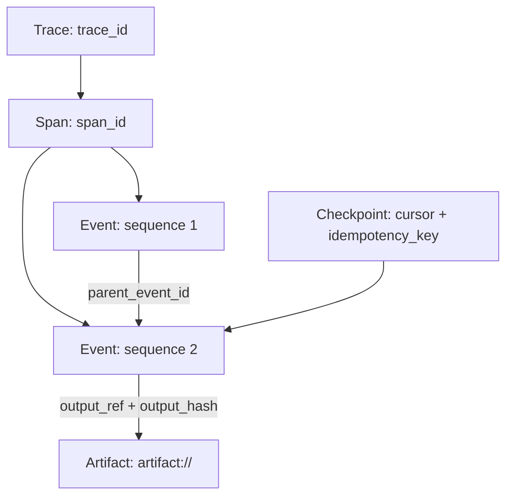
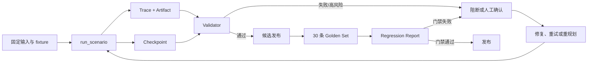

# Agent 可信执行闭环：从 Trace、Evals 到可恢复执行

> Agent 的“完成”不能只由最终文本证明。可信执行需要一条可审计的证据链：目标如何理解、计划如何推进、工具做了什么、结果如何验证、失败从哪里恢复，以及发布前是否通过回归门禁。

## 目标与边界

本章把可靠性层的五个主题整合成一条可运行路径：

```text
Goal -> Plan -> Tool Call -> Observation -> Validation
     -> Checkpoint -> Artifact -> Evals -> Replay
```

参考实现是离线的代码修复 Agent。它只读取固定 fixture，不访问网络，不修改真实仓库；所有过程证据写入运行目录。本文聚焦阶段 1 的可信执行闭环，不展开多 Agent Handoff、A2A、Context Engineering 或企业平台治理。

## 一、统一执行模型

一次任务由七类执行动作组成。

| 动作 | 要回答的问题 | 主要证据 |
| --- | --- | --- |
| Goal | 用户要完成什么？ | 目标 Artifact、约束 |
| Plan | 准备按什么顺序完成？ | 计划事件、步骤游标 |
| Tool Call | 调用了什么工具，是否允许？ | 工具名、幂等键、边界 |
| Observation | 工具实际返回了什么？ | 结果 Artifact 和 hash |
| Validation | 结果是否满足成功条件？ | 测试退出码、验证事件 |
| Checkpoint | 中断后从哪里继续？ | 状态、游标、重试计数 |
| Artifact | 哪些结果可审计、可回放？ | `artifact://` URI、SHA-256 |

事件层级固定为 `Trace -> Span -> Event`。每个 Event 至少包含 `trace_id`、`span_id`、`event_id`、`task_id`、`timestamp`、`sequence`、`event_type`、`name` 和 `status`，通过 `parent_event_id` 串起父子关系。大对象不直接塞进日志，而是用 `artifact://` 引用；引用必须同时带匹配的 SHA-256 hash。敏感凭据、令牌和个人数据在持久化前必须脱敏。

统一契约见：

- [Trace Event Schema](../assets/schemas/trace-event.md)
- [Checkpoint State Schema](../assets/schemas/checkpoint-state.yaml)
- [Eval Case Schema](../assets/schemas/eval-case.yaml)
- [Validator 决策表](../assets/checklists/validator-decision.md)
- [Regression Report 模板](../assets/checklists/regression-report.md)

## 二、可运行案例：代码修复 Agent

案例位于 [代码修复 Agent README](../assets/examples/code-repair-agent/README.md)。Runner 固定提供四个离线工具：`search_repo`、`run_tests`、`apply_patch` 和 `git_diff`。本 fixture 的工具只返回生产代码路径；通用 Runner 仍需在工具层实施路径 containment 和权限策略，具体边界可参考 [权限矩阵](../assets/checklists/permission-matrix.md)。

从案例目录运行六条确定性场景：

```text
cd cn/assets/examples/code-repair-agent
python run_demo.py --scenario success --out ./stage1-output
python run_demo.py --scenario input-required --out ./stage1-output
python run_demo.py --scenario tool-timeout --out ./stage1-output
python run_demo.py --scenario validation-failed --out ./stage1-output
python run_demo.py --scenario permission-denied --out ./stage1-output
python run_demo.py --scenario duplicate-replay --out ./stage1-output
```

`--out` 是输出根目录，Runner 在其下创建 `artifacts/run-<scenario>-<n>/`；以上命令的实际目录是 `./stage1-output/artifacts/run-<scenario>-<n>/`。一次运行通常包含：

```text
trace.jsonl       # 按 sequence 排序的 Trace Event
checkpoint.yaml   # 状态、游标、幂等键和失败原因
goal.json         # 目标输入 Artifact
search.json       # 搜索结果 Artifact
patch.diff        # 成功修复的补丁
test-report.json  # 测试命令和退出码
failure.json      # 失败或阻断说明
```

每个 Artifact 返回 `ref`、`path` 和 `hash` 三元组。`trace.jsonl` 中的 `artifact`、`observation` 和 `final_output` 事件会引用这些结果，因此审计者可以从一个 `trace_id` 找到完整执行链。

## 三、Trace：把执行变成证据链

Trace 不是工具日志的集合，而是一次任务的因果路径。案例中的最小顺序如下：

```text
receive_goal
  -> create_repair_plan
  -> search_repo
  -> save_checkpoint
  -> apply_patch
  -> run_tests
  -> validate_repair
  -> save_checkpoint
  -> final_output
```

Goal 和 Plan 解释意图与步骤；Tool Call 记录工具边界和幂等键；Observation 只保留可复现的结果引用；Validation 绑定测试退出码；Checkpoint 记录可恢复游标；最终 `final_output` 事件指向交付 Artifact。

Trace 的层级和结果引用关系可以单独画成：



这张图表达的是数据契约，不代表每个业务步骤都必须创建新的 Span；同一 Span 内的 Event 仍需保持唯一 `sequence` 和可追溯的父事件。

相关专题的分工是：

- [Agent 可观测性实战：从日志、Trace 到 Replay](Agent可观测性实战：从日志、Trace到Replay.md) 讨论事件检索、成本与 Replay。
- [Agent 的可观测性实战：用 Tracing 看清你的 Agent“大脑”](Agent的可观测性实战：用Tracing看清你的Agent“大脑”.md) 深入 `Trace -> Span -> Event` 和埋点属性。
- [Agent 的自动化评估体系（Evals）](Agent的自动化评估体系（Evals）：从单元测试到集成评测.md) 讨论评估分层、Golden Set 和证据要求。
- [Agent 状态管理与断点续传](Agent状态管理与断点续传：Checkpointer机制深度解析.md) 讨论游标、状态版本和幂等恢复。
- [Agent 自我纠错与验证机制](Agent自我纠错与验证机制设计.md) 讨论 Validator、事实核查和失败归因。

## 四、Checkpoint：恢复状态，不重复副作用

Checkpoint 不是 Trace 的替代品。Trace 记录发生过什么，Checkpoint 保存某个恢复点需要的最小状态：

```yaml
status: working
cursor:
  step_id: apply_patch
  step_index: 1
  completed_steps: [goal, plan, search_repo]
resume_policy:
  idempotency_key: run-001:apply_patch:1
  replay_mode: deterministic
  max_retries: 1
state:
  side_effects: 0
  retry_count: 0
  input_artifacts: []
  output_artifacts: []
failure:
  code: null
```

副作用步骤前先落盘 Checkpoint；恢复时检查 `task_id`、状态、游标、幂等键、重试次数和已有 Artifact。当前示例 Runner 对终态 Checkpoint 提供只读 `resume_from`：

```python
from pathlib import Path
from tempfile import TemporaryDirectory
import sys

runner_dir = Path("cn/assets/examples/code-repair-agent").resolve()
sys.path.insert(0, str(runner_dir))
from runner import run_scenario

with TemporaryDirectory() as temp_dir:
    output_dir = Path(temp_dir)
    first = run_scenario("success", output_dir)
    resumed = run_scenario(
        "success", output_dir, resume_from=Path(first["checkpoint_path"])
    )
    print(resumed["side_effect_count"])
```

这条路径只读取已有结果，副作用计数不会增加。`input-required` 的补充输入和非终态从游标继续，是协议层约定的后续接入点；接入真实执行器时必须保留原 Trace，并从 `input_received` 或最近 Checkpoint 继续，而不是重新执行已成功步骤。

## 五、Validator：让失败改变行为

Validator 至少检查四件事：输入是否完整、工具结果是否成功、补丁和测试证据是否匹配、动作是否越过权限边界。确定性规则优先于模型判断，高风险动作必须阻断或等待人工确认。

| 场景 | Trace 信号 | 任务状态 | 处理动作 | 恢复点 |
| --- | --- | --- | --- | --- |
| 输入不完整 | 缺少目标文件或测试命令 | `input-required` | 请求补充输入，不调用 `apply_patch` | `input_received` |
| 工具超时 | `DEADLINE_EXCEEDED`、工具事件 `failed` | `retrying` -> `failed` | 同一幂等键最多重试一次 | 最近 Checkpoint |
| 验证失败 | 测试退出码非零 | `failed` | 保留补丁和测试报告，生成失败说明 | `validation_failed` |
| 权限拒绝 | policy deny、人工确认 `waiting` | `failed` 或 `waiting-confirmation` | 立即阻断并转人工 | `permission_denied` |
| 重复执行 | 幂等键已存在 | 原终态 | 读取已有 Artifact，不再产生副作用 | 已完成事件 |

失败不是把结果改写成“成功”，而是要留下可解释的分类、证据和下一步动作。Validator 决策细节见 [Validator 决策表](../assets/checklists/validator-decision.md)。

## 六、四类失败恢复

### 1. 输入不完整

任务进入 `input-required`，只写目标、Checkpoint 和 `failure.json`，不修改工作区。补齐输入后，生产级 Runner 应沿原 Trace 的 `input_received` 游标继续。

### 2. 工具超时

工具事件记录失败码和耗时，Checkpoint 状态变为 `retrying`。使用同一幂等键重试一次；再次失败后进入 `failed`，不生成补丁副作用，失败分类为 `tool_timeout`。

### 3. 验证失败

补丁已生成但测试退出码非零时，保留 `patch.diff`、`test-report.json` 和 `failure.json`，状态为 `failed`，分类为 `validation_failed`。后续可以重规划或人工接管，但不能把缺失证据解释成通过。

### 4. 权限拒绝与重复执行

修改测试、访问网络、写入越权路径或执行外部命令都应触发 `permission_denied`。案例会写入真实的 `human_confirmation` 等待事件，并将高风险 `apply_patch` 标记为 `skipped`。重复幂等键只读取已有结果；`duplicate-replay` 的重放不会再次执行补丁，副作用计数保持稳定。

## 七、Evals 与发布门禁

固定 Golden Set 有 30 条 Case：

```text
normal                  10
input_incomplete         5
tool_failure              5
high_risk                 5
historical_regression    5
```

批量评估复用同一个 `run_scenario` 入口：

```text
python run_evals.py --cases eval_cases.yaml --out ./eval-output
```

评估器逐条检查：

1. Trace 字段、事件顺序、父子关系和 Artifact hash。
2. Checkpoint 状态、游标、幂等键和输入/输出 Artifact 摘要。
3. Case 声明的 fixture 与期望 Artifact hash。
4. required evidence、失败分类和禁止动作。
5. 成功率、成本、延迟与基线的变化。

输出为 `regression-report.json` 和 `regression-report.md`。报告应能回答“哪个 Case 失败、失败发生在哪个事件、是否产生了禁止动作、从哪个 Checkpoint 恢复”。高风险样本必须阻断或转人工；成功率相对基线下降超过 5 个百分点，或成本/延迟回归达到 20%，发布决策为 `blocked`。报告格式见 [Regression Report 模板](../assets/checklists/regression-report.md)。Evals 用于证明是否发生回归，而不是预先保证所有 Case 通过。

当前工作区的 30 条 Case 实测为 `pass_rate=0.7667`、`cost_regression=0.0`、`latency_regression=0.0`，发布决策为 `blocked`。阻断原因包括 `tool-01` 到 `tool-05` 的超时 `failure.json` hash 拼写错误，以及 `history-04` 和 `history-05` 使用了错误的 `patch.diff` hash；修正数据后必须重新执行批跑，不能用本段结果替代新的回归证据。

## 八、从一次运行到发布的闭环



这条链路把运行时可靠性和发布时可靠性接在一起：Trace 解释路径，Checkpoint 保证可恢复，Validator 约束行为，Evals 检验是否回归，Artifact 让结论可审计。

## 九、复用清单

1. 先复用 `trace-event.md` 的 canonical 字段，再添加业务字段。
2. 每个可能产生副作用的步骤前写 Checkpoint，并生成稳定幂等键。
3. 每条 Eval Case 固定输入、fixture、期望状态、禁止动作和 required evidence。
4. Validator 决策必须能回指 Trace 事件和最终 Artifact，并填写失败分类。
5. 发布前运行 30 条 Golden Set，审阅 `regression-report.md`，高风险路径不得静默放行。

## 结语

可信执行不是再加一个“更聪明的 Agent”，而是把不确定的智能行为约束成可观察、可验证、可恢复、可回归的工程流程。先用离线 fixture 跑通一条闭环，再逐步替换真实工具和存储；每次扩展都必须保留同样的 Trace、Checkpoint、Validator 和 Eval 契约。
