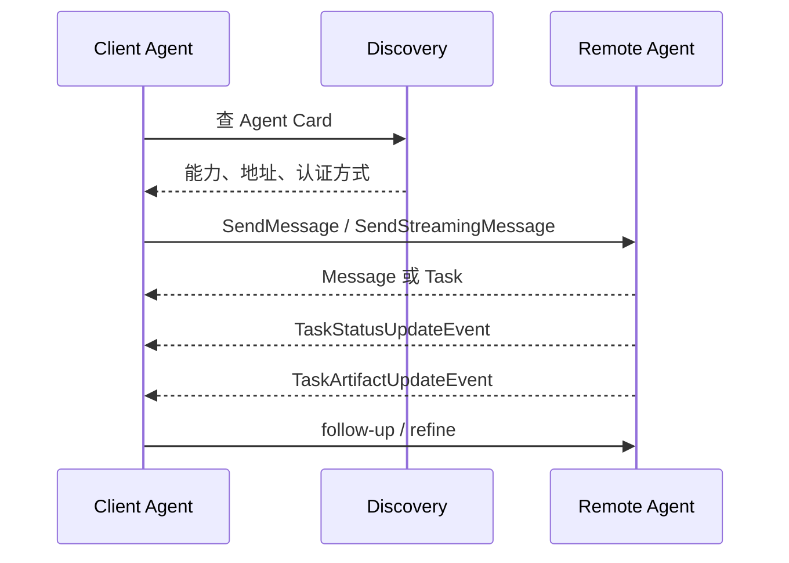
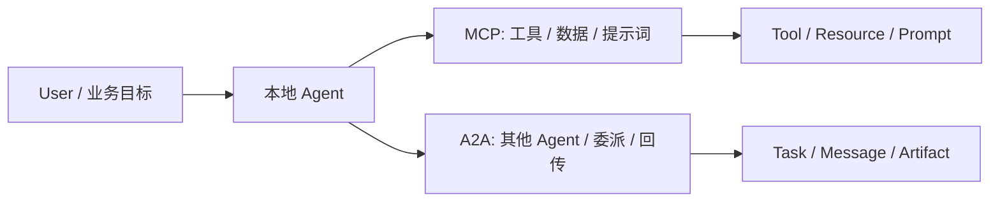

# 从MCP到A2A：解读Agent互联协议的未来

> MCP 解决的是 Agent 怎么接工具。
> A2A 解决的是 Agent 怎么接彼此。

---

## 一、先看一个更像未来的场景

一个采购 Agent 正在做供应商比价。

它先从 ERP 里拉出历史订单，再去供应商系统里查报价，然后把结果交给法务 Agent 复核条款，最后把审批材料发给财务 Agent。

如果只靠单个 Agent，问题很快就会出现：

- 供应商 A 的报价要等很久
- 法务复核和采购判断不是同一个节奏
- 财务那边需要的是结构化材料，不是长对话
- 中间某一步卡住，整条链就停

这时，MCP 已经不够用了。

MCP 很擅长把“一个 Agent 怎么稳定调用工具”这件事说清楚，但它不负责“一个 Agent 怎么找到另一个 Agent、怎么委派任务、怎么接回结果”。

这就是 A2A 出现的位置。

```text
MCP = Agent 与工具的协议
A2A = Agent 与 Agent 的协议
```

这篇文章不想把 A2A 讲成一堆名词。
它想回答的是：

```text
当 Agent 变成网络中的一个节点时，
协议要怎么设计，协作才不会变成互相猜。
```

---

## 二、先把层次摆正：A2A 不是另一个 MCP

官方对 A2A 的定位很明确：

- 它是 Agent 之间的通信标准
- 它不是 Agent 开发框架
- 它不是子 Agent 调用协议
- 它也不是聊天软件

这几个边界很重要。

因为很多人一听“Agent-to-Agent”，第一反应就是“那不就是多 Agent 群聊吗”。

其实不是。

真正有用的 A2A，解决的是这几个问题：

1. 这个 Agent 能做什么，怎么被发现
2. 一次请求是即时回复，还是长任务
3. 结果是消息，还是可交付的 artifact
4. 长任务怎么持续回传进度
5. 跟人类或别的 Agent 断开后怎么继续

你可以把它理解成一层更上面的协作网络。

```text
用户
  -> 本地 Agent
      -> MCP: 访问工具、数据源、工作流
      -> A2A: 找别的 Agent、委派任务、接收结果
```

MCP 管“手”。
A2A 管“队友”。

---

## 三、A2A 里最关键的三个东西

### 3.1 Agent Card：先知道对方是谁

在 A2A 里，Agent Card 相当于名片。

它不是装饰，而是发现入口。

一张 Agent Card 至少要告诉对方：

- 这个 Agent 叫什么
- 做什么
- 服务地址在哪
- 支持不支持 streaming
- 支不支持 push notifications
- 认证方式是什么
- 有哪些 skills

这就很像现实中的协作。

你不会先把一堆任务扔给一个人，再问他“你到底会不会做”。
你会先看他擅长什么，再决定是否把任务交给他。

A2A 把这件事协议化了。

### 3.2 Task / Message：快答和长任务分开

A2A 不是所有请求都当成一次聊天。

如果一个 Agent 能立即答复，它可以回 Message。
如果任务比较长，它就应该回 Task。

这很实际。

比如：

- “给我一个简单的汇率换算” -> Message 就够了
- “帮我和供应商比价并整理风险” -> 应该走 Task

长任务的价值在于，它能保留状态、进度和后续跟进。

### 3.3 Artifact：结果不是话，是交付物

很多 Agent 系统的问题，不是没回答，而是没有交付物。

A2A 里，Artifact 就是那个真正可交付的结果：

- 报价单
- 审批意见
- 合同修订稿
- 结构化表格
- 图片、文档、JSON

它和普通消息不一样。

消息是沟通。
Artifact 是产物。

这很适合企业场景，因为企业协作最终要落到可追踪、可复核的东西上，而不是一段顺滑的对话。

### 3.4 不是每个 Agent 都要先起 Task

官方把响应模式分得很清楚：有的 Agent 只回 `Message`，有的总是回 `Task`，还有的两者都支持。
这点很重要，因为它决定了你要不要为每次交互都维护状态。

| 模式 | 适合什么 | 返回什么 |
| :--- | :--- | :--- |
| Message-only Agent | 轻量问答、临时协商 | `Message` |
| Task-generating Agent | 长任务、可追踪工作 | `Task` |
| Hybrid Agent | 既要协商，也要执行 | `Message` 或 `Task` |

如果只是一次性澄清，回消息就够了。
如果开始要追踪进度、人工介入、产物回传，那就该起 Task 了。

---

## 四、A2A 怎么工作：发现、委派、回传、收敛

如果把 A2A 简化成一条链，大概是这样：

```text
发现 Agent
  -> 看 Agent Card
  -> 发起 Message / Task
  -> 收到即时回复或长任务状态
  -> 获取 Artifact
  -> 继续 follow-up
```



### 4.1 发现

A2A 允许几种发现方式：

| 方式 | 适合场景 | 备注 |
| :--- | :--- | :--- |
| Well-known URI | 公网可发现的 Agent | 适合公开服务 |
| Registry / Catalog | 企业内部或市场化平台 | 适合按 skill 搜索 |
| Direct config | 私有、固定关系 | 适合强绑定系统 |

这和 MCP 的思路有点像。
只是 MCP 发现的是工具能力，A2A 发现的是 Agent 能力。

### 4.2 委派

当本地 Agent 发现自己不适合做一件事时，它就应该把子任务发给更专业的 Agent。
这件事本质上是 delegation，不是甩锅。

比如采购 Agent 可以把这些任务拆出去：

- 报价核验给供应商 Agent
- 条款审核给法务 Agent
- 风险摘要给审计 Agent

这里关键不是“谁更聪明”，而是“谁对这类任务更专业”。

### 4.3 回传

长任务不是发出去就结束。

A2A 支持流式回传和异步通知。

官方文档里把这个说得很清楚：长任务可以通过 streaming 持续回传，也可以通过 push notifications 在客户端断开时推送重要状态变化。

这点特别适合：

- 几分钟到几天的任务
- 移动端
- serverless 环境
- 不能一直挂连接的客户端

### 4.4 收敛

任务不是永远能一次完成。

如果中途需要澄清，A2A 会进入 `input-required` 之类的状态。
如果任务到终态，后续修订要在同一 `contextId` 下开新任务，而不是把旧任务硬改活。

这很重要。

因为它让“任务”和“上下文”分开了：

- 任务有明确边界
- 上下文可以延续
- Artifact 的版本链由客户端维护，服务端尽量保持稳定的 `artifact-name`
- 后续修订应在同一个 `contextId` 下发起新任务，而不是硬改旧任务

这对协作网络来说，比“无限对话”靠谱得多。

---

## 五、一个真正能落地的例子：采购网络怎么用 A2A

我们回到开头那个采购场景。

### 5.1 角色分工

| Agent | 职责 | 主要输出 |
| :--- | :--- | :--- |
| 采购 Agent | 统筹需求、比较报价、发起委派 | 采购决策草案 |
| 供应商 Agent | 返回报价、库存、交期 | 报价 Artifact |
| 法务 Agent | 审核合同条款 | 风险清单 |
| 财务 Agent | 检查预算和付款条件 | 审批意见 |

这些 Agent 可能来自不同团队、不同框架、不同供应商。

这就是 A2A 的用武之地。

### 5.2 任务流

```text
采购 Agent
  -> 通过 A2A 找到供应商 Agent
  -> 发送报价请求
  -> 收到 Task
  -> 等待流式更新
  -> 接收报价 Artifact
  -> 把 Artifact 交给法务 Agent
  -> 法务返回风险意见
  -> 采购 Agent 合并后发给财务 Agent
```

每一步都不是闲聊，而是有明确对象：

- 谁发起
- 谁接收
- 谁负责
- 谁返回什么

这比“多个 Agent 一起聊”更像真正的业务系统。

### 5.3 为什么不用一个大 Agent 一把梭

因为现实里，供应商系统、法务规则、预算审批、合同版本，本来就不是一个 Agent 的上下文能全装下的。

把它们塞在一个 Agent 里，常见后果是：

- 上下文爆掉
- 工具越来越多
- 责任越来越模糊
- 出错后不知道该找谁

A2A 的意义，是把这个系统拆成一张网，而不是一个巨大的脑袋。

---

## 六、A2A 网络的三种接入方式

### 6.1 公共发现

适合对外开放、可广泛发现的 Agent。

做法是把 Agent Card 放在标准位置，例如 well-known URI。

### 6.2 目录发现

适合企业内部平台。

注册中心维护一批 Agent Card，客户端按 skill、标签、提供方去查。

这其实很像企业版“Agent 黄页”。

### 6.3 直连配置

适合私有系统、固定关系、测试环境。

这种方式最简单，但可扩展性最差。

如果你的协作对象是稳定少数几个，直连完全够用。

如果你的协作对象开始变成网络，目录和发现能力就很关键。

---

## 七、安全边界：A2A 也不是随便连

A2A 的官方文档对安全写得很明确。

Agent Card 里可能包含敏感信息，所以不能裸奔。

至少要考虑这些事：

- 认证
- 授权
- mTLS
- OAuth2
- 选择性披露
- 不在 Card 里放静态密钥

这和 MCP 的安全逻辑是通的。

只是 MCP 更像“工具暴露面”的安全，A2A 更像“协作面”的安全。

如果说 MCP 防的是“一个 Agent 调错工具”，那么 A2A 防的就是“一个 Agent 找错协作者、交错任务、拿错结果”。

---

## 八、A2A 和 MCP 怎么配合

这部分最容易被写乱。

正确理解应该是：

```text
MCP 给单个 Agent 配工具
A2A 让多个 Agent 互相协作
```

| 维度 | MCP | A2A |
| :--- | :--- | :--- |
| 暴露对象 | `tool` / `resource` / `prompt` | `Agent Card` / `Task` / `Message` / `Artifact` |
| 核心问题 | 能力怎么接进来 | 能力怎么彼此协作 |
| 发现方式 | Server 暴露工具列表 | Agent Card / 目录 / 直连 |
| 状态管理 | 多数交给 Host / Client | `contextId` + `taskId` |
| 输出形态 | 工具结果、结构化数据 | 消息、任务、产物 |



一个很自然的组合是：

```text
本地 Agent
  -> MCP: 读数据库、查文件、跑工具
  -> A2A: 把子任务交给别的 Agent
```

比如：

- 研究 Agent 用 MCP 查资料
- 评审 Agent 用 MCP 读规范
- 两者之间用 A2A 交换任务和 artifact

这样，MCP 解决“能力接入”，A2A 解决“能力编排”。

这也解释了为什么 A2A 不是 MCP 的替代品。

它们是一前一后。

---

## 九、一个最小协议感实现长什么样

如果把 A2A 真的压缩到最小，大概会是这样的几个对象：

### 9.1 Agent Card

```json
{
  "name": "supplier-agent",
  "description": "供应商报价与库存协作代理",
  "url": "https://supplier.example.com/a2a",
  "capabilities": {
    "streaming": true,
    "pushNotifications": true
  },
  "authentication": {
    "schemes": ["Bearer", "OAuth2"]
  },
  "skills": [
    {
      "id": "quote_lookup",
      "name": "报价查询",
      "description": "返回指定 SKU 的报价和交期",
      "inputModes": ["text", "json"],
      "outputModes": ["json"],
      "examples": ["查询 100 件某型号电阻的报价"]
    }
  ]
}
```

### 9.2 委派请求

```json
{
  "jsonrpc": "2.0",
  "id": "req-001",
  "method": "SendMessage",
  "params": {
    "message": {
      "role": "user",
      "parts": [
        { "text": "请查询 SKU-1024 的当前报价和交期。" }
      ]
    }
  }
}
```

### 9.3 长任务回传

长任务可能先返回一个 Task，再通过流式更新或 push notification 回传状态，最后给出 Artifact。

这个模型比“一个接口直接返回大段文本”更适合网络协作。

### 9.4 一个最小路由器

```python
def route_request(agent_card, message):
    target = discover(agent_card)
    reply = send_message(target, message)

    if reply.kind == "message":
        return reply.content

    task = reply.task
    while task.status.state not in {"completed", "failed", "canceled", "rejected"}:
        if task.status.state == "input-required":
            message = ask_user_for_clarification(task)
            reply = send_message(target, message, context_id=task.context_id)
            task = reply.task
            continue

        task = get_task(target, task.id)

    return task.artifacts[-1] if task.artifacts else task.status
```

这段代码不在于 SDK 名字，而在于路由逻辑：
先发现，再发起，再跟踪，再收敛。
这才是 A2A 最像“组织系统”的地方。

---

## 十、什么时候该上 A2A

不是所有项目都需要 A2A。

如果你的系统只是：

- 一个 Agent
- 几个固定工具
- 单一团队内部调用

那 MCP 往往就够了。

但如果你开始遇到下面这些信号，就该考虑 A2A：

- 需要跨框架协作
- 需要跨团队/跨域协作
- 需要长任务异步回传
- 需要把任务交给专业 Agent
- 需要统一发现和路由多个 Agent
- 需要把结果变成可追踪的 artifact

一句话：

```text
工具问题用 MCP，
协作网络问题用 A2A。
```

---

## 十一、结尾：A2A 让 Agent 开始像组织，而不是像单点模型

MCP 解决的是“怎么把外部能力接进来”。
A2A 解决的是“怎么让能力彼此协作起来”。

当 A2A 真正落地后，Agent 不再只是一个个孤立的推理体，而会变成一个可发现、可委派、可回传、可追踪的协作网络。

这件事最有价值的地方，不是多了一个协议名，而是：

- 专业能力可以被网络化
- 任务可以被跨 Agent 分发
- 结果可以被 artifact 化
- 协作可以被治理

所以，从 MCP 到 A2A，不是换赛道。

是从“工具连接”走向“组织连接”。

---

## 参考

- A2A Protocol Home: https://a2a-protocol.org/latest/
- Agent Discovery: https://a2a-protocol.org/latest/topics/agent-discovery/
- Core Concepts: https://a2a-protocol.org/latest/topics/key-concepts/
- Life of a Task: https://a2a-protocol.org/latest/topics/life-of-a-task/
- Streaming & Asynchronous Operations: https://a2a-protocol.org/latest/topics/streaming-and-async/
- A2A and MCP: https://a2a-protocol.org/latest/
