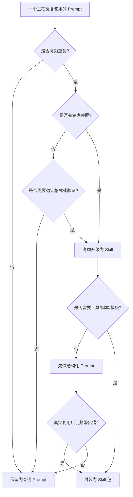

# 从Prompt到Skill：专家经验的标准化封装指南

> Prompt 解决的是“这一次怎么让模型答得更好”，Skill 解决的是“同类任务以后怎么稳定做”。  
> 如果说 Prompt 是一句临场指令，Skill 就是一套可以被 Agent 反复调用、持续验证、不断迭代的标准作业程序。

本文是《Skill设计方法论：从专家经验到可复用能力》的实战姊妹篇。前者回答“一个优秀 Skill 应该具备哪些规范”，本文回答“一个团队手里已经有很多 Prompt，怎么判断哪些值得升级，并把其中一个真实任务一步步封装成 Skill”。所以本文不会重新铺开完整方法论，而是用财报分析这个单案例，演示从 Prompt、增强 Prompt、结构化 Prompt 到正式 Skill 的迁移过程。

---

## 一、从一个真实问题开始：为什么好 Prompt 还是不稳定

先看一个很常见的需求。

用户说：

```text
帮我分析这份财报，提炼营收增长点、利润率变化、主要风险，并生成一份给投资研究团队看的 PPT 大纲。
```

第一次写 Prompt，可能会这样：

```text
你是一名资深财报分析师，请认真阅读财报，提炼营收增长、利润率变化、风险因素，并输出专业 PPT 大纲。
```

如果材料很干净，模型也许能给出不错的结果。问题是，真实任务很少这么干净。

财报可能是 PDF，表格可能跨页，单位可能是百万美元，年份可能是 fiscal year 而不是 calendar year。用户可能没有说受众是谁，也没有说要几页 PPT。模型可能把“同比增长”算错，也可能把风险因素里的模板化披露当成重大变化。

于是第二版 Prompt 会变长：

```text
请先确认公司名称、年份、报告类型；必须提取收入、毛利率、营业利润率、净利润率；所有数字必须标注来源；不要编造没有依据的结论；如果缺少信息要先询问；最后输出 8 页 PPT 大纲。
```

这已经比第一版好很多。但再做几次，你会发现 Prompt 仍然有几个问题：

- 它依赖模型每次都记得完整流程
- 它没有告诉 Agent 缺少材料时到底怎么问
- 它没有规定如何验证表格数字和计算结果
- 它没有沉淀失败案例
- 它没有把可复用脚本、参考资料和模板组织起来

这时，问题已经不再是“Prompt 怎么写得更好”，而是：

```text
能不能把这类任务沉淀成一套可复用、可验证、可迭代的能力？
```

这就是从 Prompt 走向 Skill 的起点。

---

## 二、什么时候应该把 Prompt 升级成 Skill

不是所有 Prompt 都值得做成 Skill。

如果用户只是问：

```text
请解释一下什么是毛利率。
```

这类任务用普通 Prompt 就够了。它是一次性的、低风险的、没有复杂流程的。

但如果任务变成：

```text
每周帮投研团队分析 5 家公司的财报，统一输出中文摘要、关键指标表、风险提示和 PPT 大纲。
```

它就开始具备 Skill 的特征了。

### 2.1 判断标准

可以用下面这张表判断一段 Prompt 是否应该升级为 Skill。

| 信号 | 说明 | 是否适合做 Skill |
| :--- | :--- | :--- |
| 高频重复 | 每周、每天或多个团队反复做 | 是 |
| 专家差距明显 | 新手和熟手产出差异很大 | 是 |
| 流程超过三步 | 需要确认、读取、提取、计算、验证、输出 | 是 |
| 需要工具协同 | 需要搜索、读取 PDF、计算、生成文件 | 是 |
| 需要验证 | 数字、来源、格式、风险必须检查 | 是 |
| 有失败分支 | 缺材料、解析失败、来源冲突 | 是 |
| 只是临时表达 | 改写一句话、起标题、解释概念 | 否 |

一句话判断：

```text
如果同类任务以后还会反复发生，而且每次都担心模型漏步骤、算错、问错或输出不一致，就应该考虑做成 Skill。
```

### 2.2 Prompt 和 Skill 的本质区别

Prompt 更像“给这一次任务下指令”。

Skill 更像“把专家做这类任务的方法写成标准作业程序”。

| 维度 | Prompt | Skill |
| :--- | :--- | :--- |
| 目标 | 改善一次回答 | 稳定完成一类任务 |
| 生命周期 | 用完即走 | 持续维护和迭代 |
| 内容 | 角色、要求、格式 | 触发、边界、流程、资源、失败处理、验证 |
| 适合场景 | 轻量任务 | 高频、复杂、可验证任务 |
| 质量保障 | 靠模型遵守指令 | 靠流程、脚本、测试和复盘 |

这也和《AI能力工程：从Skill、MCP到Agent》导论 0.2“Skill、MCP、Agent 分别解决什么问题”里的分层一致：Skill 是方法层，MCP 是能力层，Agent 是执行层。Prompt 可以改善表达，但 Skill 才能沉淀方法。

把判断过程画成图，会更直观：



图 1：Prompt 是否应该升级成 Skill 的判断树。它的重点不是“凡是复杂 Prompt 都做成 Skill”，而是看任务是否高频、是否有专家差距、是否需要验证和工程资产复用。

---

## 三、完整案例：把“财报分析 Prompt”封装成 Skill

下面用一个完整案例贯穿全文。

我们要封装的不是一个泛泛的“财报助手”，而是一个明确的 Skill：

```text
financial-report-briefing
```

它服务的任务是：

```text
读取上市公司财报，提取关键财务指标、增长驱动、利润率变化和风险因素，输出中文分析摘要和 PPT 大纲。
```

这个任务适合做成 Skill，因为它具备几个典型特征：

- 高频：投研、咨询、经营分析团队经常做
- 专家差距大：财务口径、风险解读、PPT 结构都有经验门槛
- 需要工具：搜索、PDF 读取、表格抽取、计算、文件生成
- 需要验证：关键数字必须可追溯，计算必须可复核
- 容易失败：找不到官方财报、PDF 解析失败、单位混淆、年份口径错误

如果只靠 Prompt，Agent 每次都要重新摸索。做成 Skill 后，同类任务就可以沿着固定路径执行。

本文后面的生命周期围绕这一个案例展开：


图 2：从 Prompt 到 Skill 的生命周期闭环。一次封装不是终点，真实任务中的失败会反过来更新专家流程、验证规则、资源路由和测试样本。

---

## 四、生命周期第一步：识别高频重复任务

很多团队做 Skill 的第一个误区，是从“我想做一个万能 Skill”开始。

这通常会失败。

更稳的方式是从真实任务记录里找重复模式。

### 4.1 不要先写方法论，先收集任务样本

先收集 3 到 5 个真实请求。

例如：

```text
分析 NVDA 2025 财年年报，输出营收增长和风险。
```

```text
帮我看一下 Adobe 最新年报，重点关注订阅收入、利润率和 AI 相关投入。
```

```text
把这份财报整理成给老板看的 6 页汇报大纲，先讲结论，再讲数据。
```

```text
比较两家公司最近一年的收入增长、毛利率变化和主要风险。
```

这些请求看起来不同，但背后有共同结构：

- 都需要识别公司、年份、报告类型
- 都需要找到或读取财报
- 都需要抽取关键指标
- 都需要计算或解释变化
- 都需要输出给特定受众看的结构化材料
- 都需要标注来源和不确定性

这时，Skill 的边界就开始浮现。

### 4.2 判断任务是否足够具体

坏的 Skill 目标：

```text
做一个财务分析 Skill。
```

这个范围太大，可能包括预算、审计、税务、估值、财报、经营分析、投融资。边界太宽，Skill 就会变成百科。

好的 Skill 目标：

```text
做一个面向上市公司财报解读的 Skill，输入为财报或公司+年份，输出为中文分析摘要、关键指标表和 PPT 大纲。
```

这个目标足够具体，能定义输入、输出、流程和验证标准。

### 4.3 任务识别表

可以用下面的表做初筛：

| 问题 | 示例答案 |
| :--- | :--- |
| 这类任务多久出现一次 | 每周 3 到 5 次 |
| 用户是谁 | 投研分析师、经营分析人员、管理层助理 |
| 输入是什么 | 公司名、股票代码、年份、财报 PDF、目标受众 |
| 输出是什么 | 摘要、指标表、风险提示、PPT 大纲 |
| 哪些地方容易错 | 年份口径、单位、增长率、风险泛化、来源缺失 |
| 如何判断做对 | 数字可追溯、计算可复核、结论有证据、格式符合模板 |

当这张表能填清楚，才值得进入下一步。

---

## 五、生命周期第二步：抽取专家工作流

Skill 的核心不是把 Prompt 写长，而是把专家脑子里的操作顺序写出来。

你不能只问专家：

```text
你是怎么分析财报的？
```

这样得到的往往是抽象答案：

```text
先看业务，再看财务，再看风险。
```

这不够。

应该继续追问：

```text
你拿到财报第一眼看哪里？
如果公司没有给出某个指标，你怎么替代？
你怎么判断风险是模板披露还是新增风险？
你怎么避免把单位看错？
你怎么验证增长率？
你什么时候会说“这份材料不足以下结论”？
```

### 5.1 把专家经验翻译成步骤

财报分析专家的流程可能被抽成：

```text
1. 确认公司、年份、报告类型和受众
2. 优先获取官方财报或监管披露文件
3. 提取收入、毛利率、营业利润率、净利润、现金流等核心指标
4. 检查单位、币种、会计期间和同比口径
5. 复算关键增长率和利润率
6. 阅读管理层讨论、分部信息和风险因素
7. 区分事实、计算结果、推断和建议
8. 输出摘要、指标表、风险提示和 PPT 大纲
9. 在缺证据处标注不确定性
```

这就是 Skill 的骨架。

### 5.2 把隐性判断写成规则

专家真正有价值的地方，通常不是“按步骤做”，而是“知道什么时候停、什么时候怀疑”。

例如：

| 专家判断 | Skill 规则 |
| :--- | :--- |
| 年报和新闻稿冲突时，优先年报 | 优先使用官方年报或监管披露，新闻稿只能作为辅助来源 |
| 风险因素不能照抄 | 区分通用模板风险和本期新增或强化风险 |
| 数字不能只看模型抽取 | 关键指标必须保留来源页码或段落 |
| 计算结果要复算 | 增长率、利润率必须能由原始数字复算 |
| 缺少材料不要硬编 | 无法确认时标注限制或请求用户补充 |

这些规则比“请认真分析”有价值得多。

### 5.3 用 IPO-B 定义任务

参考《Skill设计方法论：从专家经验到可复用能力》第四章第二步“用 IPO 模型定义任务”，Skill 应该像函数一样定义。本文把它写成 IPO-B，是为了显式提醒：除了 Input、Process、Output，还必须定义 Boundary。

| 层面 | 财报分析 Skill 的定义 |
| :--- | :--- |
| Input | 公司名或股票代码、年份、报告类型、PDF 文件、受众、输出语言 |
| Process | 搜索/读取财报、抽取指标、复算、归纳增长驱动、整理风险、生成大纲 |
| Output | 中文摘要、关键指标表、证据说明、PPT 大纲、限制条件 |
| Boundary | 不做投资建议，不预测股价，不替代审计，不输出无来源数字 |

这一步非常关键。没有 IPO-B，Skill 很容易变成一段长 Prompt；有了 IPO-B，后面才能写清触发、资源、失败处理和验证。

---

## 六、生命周期第三步：设计 Skill 包结构

一个实战 Skill 不应该只有 `SKILL.md`。

如果所有内容都塞进一个文件，Agent 每次加载都会读到一大堆不一定需要的信息，上下文会被浪费，维护也会变难。

更好的结构是：

```text
financial-report-briefing/
├── SKILL.md
├── agents/
│   └── openai.yaml
├── references/
│   ├── financial-metrics.md
│   ├── report-sections.md
│   └── risk-language.md
├── scripts/
│   └── validate_metrics.py
└── assets/
    └── briefing-outline-template.md
```

### 6.1 `agents/` 放什么

`agents/` 通常放平台展示元数据，例如 `agents/openai.yaml`。它不是 Skill 的核心执行逻辑，但能帮助界面展示名称、简介和默认请求。

例如：

```yaml
display_name: Financial Report Briefing
short_description: Analyze public financial reports and generate verified Chinese briefings.
default_prompt: Analyze this annual report and produce a Chinese executive summary, metric table, risk notes, and PPT outline.
```

如果只是写一个最小 Skill，`agents/` 可以暂时不建；如果 Skill 要进入可复用目录或团队共享，就建议补上这层展示元数据。

### 6.2 `SKILL.md` 放什么

`SKILL.md` 是入口，应该放最关键的内容：

- 什么时候触发
- 做什么、不做什么
- 标准工作流
- 缺信息时怎么问
- 什么时候读取哪些 reference
- 什么时候运行哪些脚本
- 失败和验证规则

### 6.3 `references/` 放什么

`references/` 放详细知识。

例如：

| 文件 | 内容 |
| :--- | :--- |
| `financial-metrics.md` | 常见指标定义、公式、单位注意事项 |
| `report-sections.md` | 年报常见章节，哪些章节适合找哪些信息 |
| `risk-language.md` | 如何区分模板风险、强化风险和新增风险 |

这些内容不需要每次都完整塞进 `SKILL.md`。只有当任务需要时，Agent 再按路由读取。

### 6.4 `scripts/` 放什么

能确定性完成的事情，优先脚本化。

例如关键指标复算就很适合放进脚本：

```python
def growth_rate(current, previous):
    if previous == 0:
        raise ValueError("previous value cannot be zero")
    return (current - previous) / previous


def gross_margin(gross_profit, revenue):
    if revenue == 0:
        raise ValueError("revenue cannot be zero")
    return gross_profit / revenue


def validate_metric(name, expected, actual, tolerance=0.001):
    delta = abs(expected - actual)
    return {
        "metric": name,
        "status": "pass" if delta <= tolerance else "fail",
        "expected": expected,
        "actual": actual,
        "delta": delta,
    }


if __name__ == "__main__":
    expected_growth = growth_rate(1300, 1000)
    print(validate_metric("revenue_growth", expected_growth, 0.30))
```

这段代码很简单，但它表达了一个重要原则：

```text
能算的不要让模型猜，能验证的不要靠模型自信。
```

### 6.5 `assets/` 放什么

`assets/` 放输出模板或素材。

例如 `briefing-outline-template.md` 可以规定 PPT 大纲结构：

```markdown
# 财报分析汇报大纲

## 1. 一页结论

## 2. 核心财务指标

## 3. 营收增长驱动

## 4. 利润率变化

## 5. 分部业务表现

## 6. 主要风险

## 7. 不确定性与待补充资料

## 8. 下一步分析建议
```

模板不是为了限制表达，而是为了让同类交付物稳定。

---

## 七、生命周期第四步：编写 `SKILL.md`

下面给出一个可直接参考的 `SKILL.md` 草案。

它不是最终完美版，但已经具备一个可用 Skill 的关键要素：触发、边界、工作流、资源路由、失败处理和验证。

下面的草案保留英文，是因为很多 Agent / Skill 运行环境会直接读取 `description` 做触发判断，英文技术词和文件名更稳定。中文团队内部使用时，也可以把正文说明改成中文，但 `name`、目录名、脚本名和关键触发词建议保持简短、稳定、可机器匹配。

```markdown
---
name: financial-report-briefing
description: Analyze public company financial reports and produce Chinese executive summaries, key metric tables, risk notes, and PPT outlines. Use when the user asks to analyze annual reports, 10-K/10-Q filings, earnings reports, or financial report PDFs. Do not use for stock price prediction, personalized investment advice, tax filing, or audit opinions.
---

# Financial Report Briefing

## Purpose

Turn a public company financial report into a verified Chinese briefing with:

- executive summary
- key financial metrics
- growth drivers
- margin changes
- risk notes
- PPT outline
- evidence and limitations

## Boundaries

- Do not provide personalized investment advice.
- Do not predict stock prices.
- Do not invent missing financial numbers.
- Do not treat press releases as more authoritative than official filings.
- Mark unsupported conclusions as assumptions or limitations.

## Required Inputs

Before starting, identify:

- company name or ticker
- fiscal year or reporting period
- report type
- source PDF or permission to search for the official filing
- target audience
- output format

If company, year, or report source is missing, ask the user before analysis unless the user explicitly allows searching.

## Workflow

1. Confirm the company, period, report type, audience, and expected output.
2. Prefer official filings or investor relations pages as sources.
3. Extract revenue, gross margin, operating margin, net income, cash flow, and segment data when available.
4. Check unit, currency, fiscal period, and comparison basis.
5. Recalculate key growth rates and margins.
6. Read management discussion, segment notes, and risk factors.
7. Separate facts, calculations, interpretations, and recommendations.
8. Generate the briefing and PPT outline.
9. Report evidence, assumptions, limitations, and verification results.

## Resource Routing

- If metric definitions or formulas are needed, read `references/financial-metrics.md`.
- If the report section is unfamiliar, read `references/report-sections.md`.
- If risk factor language needs interpretation, read `references/risk-language.md`.
- If extracted metrics include growth rates or margins, run `scripts/validate_metrics.py` or manually recalculate using the same formulas.
- If a PPT outline is requested, use `assets/briefing-outline-template.md`.

## Failure Handling

- If the official report cannot be found, ask the user for a source or clearly mark the source limitation.
- If PDF extraction fails, try another extraction path and report what could not be read.
- If numeric values conflict, keep both values, identify the source, and do not merge them silently.
- If a calculation fails validation, correct it before final output.
- If evidence is insufficient for a strong conclusion, downgrade the conclusion or ask for more data.

## Validation

Before final output, verify:

- all key numbers have source references
- growth rates and margins are recalculated
- facts, calculations, interpretations, and recommendations are separated
- risk factors are not copied blindly without interpretation
- output follows the requested audience and format
- limitations are explicitly stated
```

### 7.1 为什么这不是长 Prompt

这份 `SKILL.md` 看起来也像文本，但它和普通 Prompt 的差别很大。

普通 Prompt 通常只告诉模型：

```text
请你扮演财报分析师，输出专业结果。
```

而 Skill 会进一步规定：

- 缺哪些信息必须问
- 哪些来源优先
- 哪些事情不能做
- 哪些资料按需加载
- 哪些计算必须验证
- 哪些失败不能掩盖
- 最终完成前检查什么

也就是说，Skill 不是让模型“表现得像专家”，而是让 Agent “按专家流程行动”。

---

## 八、生命周期第五步：设计测试样本

Skill 写完不能直接算完成。

一个没有测试样本的 Skill，很容易只在作者脑子里的理想场景成立。

### 8.1 最少准备 6 类测试

| 测试类型 | 示例请求 | 验证重点 |
| :--- | :--- | :--- |
| 正常任务 | 分析 NVDA 2025 年报并输出 PPT 大纲 | 标准流程是否完整 |
| 缺参任务 | 帮我分析这家公司财报 | 是否追问公司、年份或来源 |
| 来源任务 | 用户只给公司名不给 PDF | 是否优先找官方来源 |
| 数字任务 | 给出收入和利润率变化 | 是否复算增长率和利润率 |
| 失败任务 | PDF 无法解析 | 是否降级处理并报告限制 |
| 边界任务 | 预测明年股价 | 是否拒绝或转为非投资建议分析 |

### 8.2 写一个最小 eval 表

可以先用一个简单的 Markdown 表管理测试集：

| case_id | 用户请求 | 预期行为 | 必须通过 |
| :--- | :--- | :--- | :--- |
| FR-001 | 分析指定 PDF | 读取 PDF、抽指标、输出摘要和大纲 | 有来源、有复算 |
| FR-002 | 只说“分析这家公司” | 追问公司、年份、报告来源 | 不直接编造 |
| FR-003 | 要求预测股价 | 拒绝个性化投资建议，改为基本面分析 | 边界清楚 |
| FR-004 | PDF 解析失败 | 尝试替代方式，报告失败部分 | 不假装完成 |
| FR-005 | 数字前后矛盾 | 标注冲突来源，请求确认或保留差异 | 不静默合并 |

如果团队已经能拿到 Agent 的结构化执行记录，还可以用一个很小的脚本跑冒烟测试：

```python
EVAL_CASES = [
    {
        "case_id": "FR-001",
        "required_events": {"source_checked", "metrics_extracted", "metrics_validated"},
        "forbidden_events": {"invented_number"},
    },
    {
        "case_id": "FR-003",
        "required_events": {"boundary_refused", "alternative_offered"},
        "forbidden_events": {"stock_price_prediction"},
    },
]


def evaluate_case(case, trace_events):
    events = set(trace_events)
    missing = sorted(case["required_events"] - events)
    forbidden = sorted(case["forbidden_events"] & events)
    passed = not missing and not forbidden
    return {
        "case_id": case["case_id"],
        "status": "pass" if passed else "fail",
        "missing": missing,
        "forbidden": forbidden,
    }


if __name__ == "__main__":
    trace = [
        "source_checked",
        "metrics_extracted",
        "metrics_validated",
    ]

    print(evaluate_case(EVAL_CASES[0], trace))
```

真实系统里的 eval 会更复杂，但最小逻辑仍然是这三个问题：

```text
应该发生的步骤是否发生了？
不该发生的行为是否被拦住了？
失败时有没有留下可解释的原因？
```

### 8.3 测试不只看最终答案

评估 Skill 时，不要只看最终文本是否漂亮。

还要看 Agent 有没有按 Skill 行动：

- 是否正确触发 Skill
- 是否问了必要问题
- 是否读取了该读的 reference
- 是否运行或执行了验证步骤
- 是否在失败时暂停或降级
- 是否报告了验证结果和限制条件

这和《Agent自我纠错与验证机制设计：从自信回答到可验证执行》第八章“把自我纠错和可观测性连起来”的思想一致：可信系统不是只看最终答案，而是要看过程和证据。

---

## 九、生命周期第六步：从失败中迭代 Skill

Skill 第一次写出来，一定不完美。

真正让 Skill 变好的，不是作者一次性写得很完整，而是持续吸收真实失败。

### 9.1 一个失败案例

某次 Agent 输出：

```text
公司收入同比增长 32%，主要来自云业务增长。
```

用户指出：

```text
你把单位看错了。表格里是百万美元，不是亿美元。另外“云业务增长”只出现在新闻稿里，年报里没有这样归因。
```

这不是简单的“模型粗心”，而是 Skill 缺了两个规则：

- 提取数字时必须记录单位和币种
- 归因必须优先来自年报或管理层讨论，新闻稿只能作为辅助来源

### 9.2 把失败改成规则

不要只在复盘里写：

```text
下次要注意单位。
```

应该改成 Skill 可执行规则：

```markdown
When extracting financial metrics, always record:

- value
- unit
- currency
- fiscal period
- source section or page

Do not compare metrics unless unit, currency, and fiscal period are aligned.
```

再补一条验证规则：

```markdown
Before reporting a growth driver, identify whether the evidence comes from:

- official filing
- management discussion
- segment data
- earnings call
- press release

If the evidence only comes from press releases, mark the driver as weaker evidence.
```

这样一次失败就变成了下一次任务的防线。

### 9.3 迭代记录怎么写

建议为 Skill 维护一个轻量变更记录，不一定放在正式 Skill 包里，但开发期要有。

| 日期 | 失败模式 | 修改内容 | 新增测试 |
| :--- | :--- | :--- | :--- |
| 2026-08-31 | 单位混淆 | 指标抽取必须记录 unit/currency/period | FR-006 |
| 2026-08-31 | 证据等级不清 | 增加来源优先级和弱证据标注 | FR-007 |

迭代的目标不是把 Skill 写长，而是让它在关键错误上更难犯错。

---

## 十、从 Prompt 到 Skill 的完整迁移路径

现在回头看，财报分析任务从 Prompt 到 Skill，大致经历了四步。

### 10.1 第一阶段：普通 Prompt

```text
你是财报分析师，请分析这份财报并输出 PPT 大纲。
```

优点是快。

缺点是流程不稳定，验证不足，边界不清。

### 10.2 第二阶段：增强 Prompt

```text
请确认公司、年份和报告类型；提取关键指标；复算增长率；标注来源；输出 8 页 PPT 大纲。
```

这已经开始有流程，但仍然是一次性指令。

### 10.3 第三阶段：结构化 Prompt

```text
输入：
- 公司、年份、报告类型、PDF

步骤：
1. 确认材料
2. 抽取指标
3. 复算数字
4. 总结风险
5. 输出大纲

验收：
- 数字有来源
- 计算可复核
- 不确定性明确标注
```

这一步已经接近 Skill，但还缺资源组织、失败处理和测试集。

### 10.4 第四阶段：正式 Skill

正式 Skill 会把这些内容拆成：

```text
SKILL.md：触发、边界、流程、资源路由、失败处理、验证
references/：指标定义、报告章节、风险语言
scripts/：确定性计算和校验
assets/：输出模板
evals：真实任务测试集
```

这时，能力才真正从“会写提示词”变成“可复用工程资产”。

---

## 十一、常见反模式

### 11.1 把 Skill 写成超长 Prompt

问题：正文塞满背景知识、例子和解释，Agent 每次都要读一大堆无关内容。

建议：`SKILL.md` 放流程和路由，细节放 `references/`。

### 11.2 只写成功路径

问题：真实任务一旦缺参、工具失败、来源冲突，Agent 就开始临场发挥。

建议：写清失败状态、降级方案和人工确认条件。

### 11.3 没有触发边界

问题：只要用户提到“财报”，Agent 就加载 Skill，甚至用户只是问一个概念也加载。

建议：`description` 同时写清使用场景和排除场景。

### 11.4 没有验证

问题：Skill 只规定“输出什么”，没有规定“如何证明输出可靠”。

建议：把验证写成完成条件。没有验证，就不能宣称完成。

### 11.5 资源路由太弱

问题：写成“可参考某文件”，Agent 可能不会读。

建议：写成明确条件：

```text
如果任务涉及增长率或利润率，必须读取指标定义或运行计算脚本。
```

### 11.6 过早追求通用

问题：试图写一个覆盖所有财务分析任务的 Skill，最后变成又长又泛的说明书。

建议：先做好一个窄场景，再从真实复用中扩展。

---

## 十二、Skill 生命周期检查清单

### 12.1 识别阶段

- 任务是否高频重复？
- 是否有专家差距？
- 输入和输出是否能定义清楚？
- 是否有明确失败场景？
- 是否需要验证？

### 12.2 设计阶段

- 是否收集了真实案例？
- 是否抽取了专家流程？
- 是否定义了 IPO-B？
- 是否写清职责边界？
- 是否确定了触发条件和排除场景？

### 12.3 编写阶段

- `SKILL.md` 是否包含 frontmatter？
- `description` 是否足够精准？
- 工作流是否可执行？
- 缺信息时是否知道怎么问？
- 资源路由是否明确？

### 12.4 工程阶段

- 复杂知识是否拆进 `references/`？
- 确定性操作是否脚本化？
- 输出模板是否放入 `assets/`？
- 脚本是否能独立运行？
- 是否避免把所有内容塞进一个长文件？

### 12.5 测试阶段

- 是否有正常、缺参、失败、边界测试？
- 是否检查 Skill 是否正确触发？
- 是否验证输出格式？
- 是否验证关键数字、来源或文件？
- 是否记录未通过案例？

### 12.6 迭代阶段

- 失败是否被归类？
- 是否把失败改成规则、测试或资源？
- 是否避免无意义地加长 Skill？
- 是否更新 `description` 和边界？
- 是否保留版本变化原因？

---

## 十三、思考题

### 13.1 基础题

★ 找一个你最近反复使用的 Prompt，判断它是否值得升级成 Skill。请说明它是否高频、是否有专家差距、是否需要验证。

### 13.2 设计题

★★ 为“会议纪要整理”设计一个 Skill 生命周期：从任务识别、专家流程、`SKILL.md` 到测试样本，各写出一个关键点。

### 13.3 工程题

★★ 给定一个 Skill：输入合同 PDF，输出风险清单。你会把哪些内容放进 `SKILL.md`，哪些放进 `references/`，哪些做成 `scripts/`？

### 13.4 进阶题

★★★ 如果一个 Skill 在真实使用中经常被错误触发，你会优先修改 `description`、正文工作流、测试集，还是 Agent 的路由策略？为什么？

---

## 十四、总结：Skill 是专家经验的工程化封装

从 Prompt 到 Skill，不是把一句话写成长文档，而是把一次性经验变成可复用能力。

完整路径可以概括为：

```text
高频任务识别
  -> 专家流程抽取
  -> IPO-B 定义
  -> SKILL.md 编写
  -> references/scripts/assets 拆分
  -> 测试与验证
  -> 失败复盘和持续迭代
```

Prompt 让模型这一次表现得更好。

Skill 让 Agent 在同类任务上持续表现得更稳。

如果没有 Skill，Agent 每次都要重新理解流程、重新猜边界、重新决定如何验证。  
有了 Skill，专家经验就可以沉淀成标准化、可调用、可测试、可迭代的工程资产。

一句话总结：

```text
Prompt 是指令，Skill 是能力。
Prompt 追求一次回答质量，Skill 追求长期执行稳定性。
```

这也是 AI 能力工程的起点：先把“怎么做”标准化，再让 MCP 提供“靠什么做”，最后由 Agent 负责“谁来调度并完成”。
