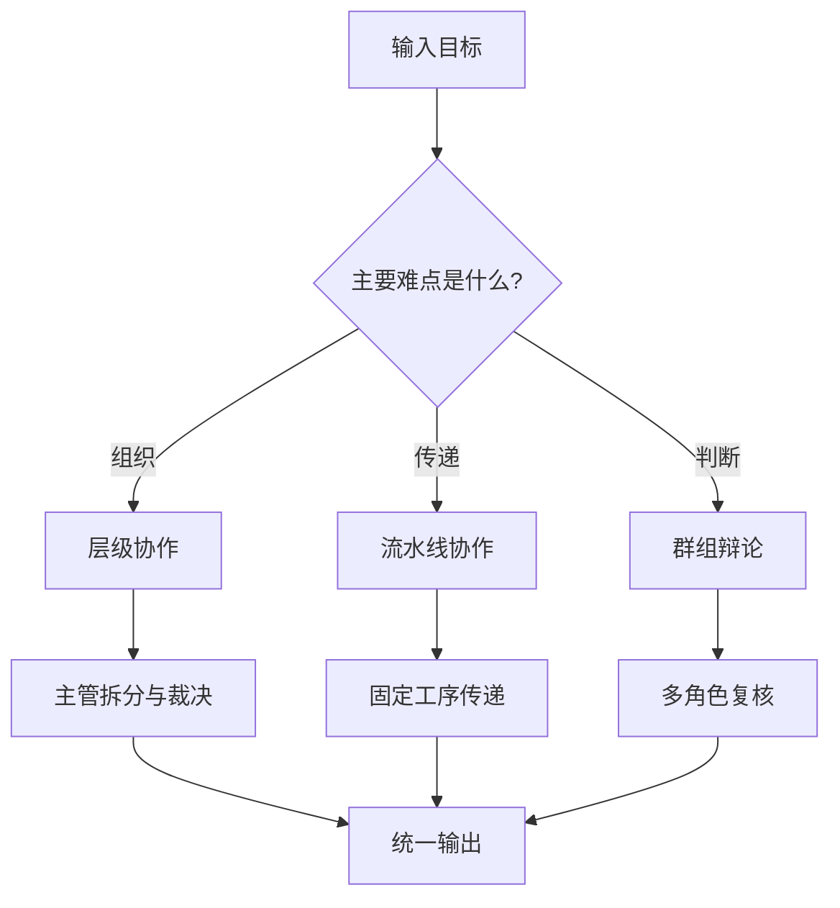

# 多Agent协作模式深度解析：层级、流水线与群组

> 多 Agent 不是“把几个模型拉进群聊”。
> 真正有用的，是把复杂任务拆成不同协作结构，让每个角色只做自己最擅长的那一段。

---

## 一、先看一个真实问题：为什么单 Agent 做着做着就散了

有些任务，单个 Agent 一开始看起来完全能做。

比如用户说：

```text
帮我做一份竞品分析，顺手把结论整理成汇报稿，最后给出下一步动作建议。
```

单 Agent 也许能查资料、写总结、输出建议，但一旦任务变长，问题就会开始出现：

- 前半段搜集的信息，后半段已经忘了
- 中间结论没有人复核，最后写得很顺
- 一边查资料一边下结论，证据和推断混在一起
- 任务越复杂，越容易在“继续做”还是“先确认”之间摇摆

这时候，多 Agent 的价值就出来了。

它不是为了“更高级”，而是为了把复杂任务拆成更稳定的协作结构：

```text
一个人统筹
一个人串行处理
几个人互相校验
```

这篇文章只讲三种最常见、也最容易落地的模式：

1. 主管-员工式层级协作
2. 数据流水线式协作
3. 多角色辩论式协作

它们不是互斥的，很多生产系统会混着用。关键是先选对主结构，再谈优化。

和前面几篇文章的边界也要先说清楚：

- `Agent的任务拆解艺术` 讲的是“怎么拆”
- `Agent规划范式进化论` 讲的是“怎么排”
- 这篇讲的是“拆完以后，谁负责什么，怎么交接，怎么收敛”

---

## 二、层级协作：一个人拍板，其他人执行

### 2.1 适合什么任务

层级协作最像真实团队。

有一个主管 Agent 负责拆任务、排优先级、做最终决策；下面几个执行 Agent 各做各的事，比如查资料、写草稿、补证据、做检查。

这种模式最适合：

- 任务目标明确，但路径不固定
- 中间会出现多次重规划
- 不同子任务之间有依赖关系
- 最后需要一个统一出口

典型场景包括：

- 市场分析
- 方案设计
- 代码修复
- 复杂报告撰写

### 2.2 典型流程

```text
用户目标
  -> 主管 Agent 解析目标
  -> 拆成子任务
  -> 分派给执行 Agent
  -> 汇总中间结果
  -> 发现冲突就重排
  -> 最终输出
```

比如“竞品分析”可以拆成：

1. 执行 Agent A：收集竞品基础信息
2. 执行 Agent B：整理产品差异点
3. 执行 Agent C：提炼结论风险
4. 主管 Agent：合并、取舍、定稿

这里最重要的不是“多”，而是“有主次”。

主管 Agent 负责三件事：

- 任务切分
- 冲突裁决
- 最终交付

执行 Agent 只负责一件事：

- 把某个子任务做深做实

### 2.3 这种模式的坑

层级协作最大的问题，不是分工不清，而是主管什么都想管。

常见失败方式有三种：

| 问题 | 表现 | 结果 |
| :--- | :--- | :--- |
| 过度调度 | 每一步都要主管确认 | 成本高，速度慢 |
| 过度放权 | 执行 Agent 自己改目标 | 输出开始跑偏 |
| 汇总失真 | 主管只看摘要，不看证据 | 最终结论看着完整，其实不稳 |

所以层级协作要守住一个原则：

```text
主管负责决策，执行负责事实。
```

### 2.4 设计要点

这类系统里，交接协议比模型本身更重要。

至少要定义这些字段：

```json
{
  "task_id": "cmp_20260904_001",
  "role": "researcher",
  "input_goal": "分析竞品差异",
  "expected_output": ["source_list", "key_findings", "open_questions"],
  "evidence_required": true,
  "handoff_to": "manager"
}
```

如果没有结构化交接，层级协作很容易退化成：

```text
一个 Agent 说完，另一个 Agent 接着猜。
```

那就不是协作，是接力式幻觉。

---

## 三、流水线协作：上一环产物，下一环只消费这个产物

### 3.1 适合什么任务

流水线协作更像工厂。

每个 Agent 只负责一段固定工序，前一段输出什么，后一段就吃什么。它的核心不是“讨论”，而是“稳定传递”。

最适合这类任务：

- 输入固定
- 中间步骤清晰
- 每一步都能检查
- 对顺序要求强

比如：

- 数据清洗 -> 特征提取 -> 分析 -> 报告生成
- 长文摘要 -> 结构化提纲 -> 初稿 -> 校对
- 工单分类 -> 根因判断 -> 解决方案 -> 回写

### 3.2 为什么流水线比“自由协作”稳

因为它把不确定性关在每一段里。

自由协作最怕的不是慢，而是边做边改目标。流水线则相反，它强迫每一步只做一件事。

```text
Stage 1: 只负责提取
Stage 2: 只负责转换
Stage 3: 只负责判断
Stage 4: 只负责输出
```

这样做的好处很现实：

- 容易测试
- 容易重放
- 容易定位问题
- 容易替换某一环

### 3.3 这种模式的坑

流水线也不是万能药。

它最大的问题是“早期错误会层层放大”。

| 问题 | 表现 | 典型后果 |
| :--- | :--- | :--- |
| 上游脏数据 | 第一环抽错 | 后面每一环都在错的基础上继续 |
| 过细切分 | 每一步都太窄 | 语义在中间丢失 |
| 过长链路 | 步骤很多 | 延迟和成本一起涨 |
| 中间格式不稳 | 字段经常变 | 下游总是适配失败 |

所以流水线最怕两件事：

1. 每一环都不愿意承担清晰责任
2. 中间数据没有稳定 schema

### 3.4 设计要点

流水线要优先设计“中间产物”，不是先设计角色名。

比如一条文档生产流水线，可以定义成：

```text
输入 -> 证据提取 -> 观点归纳 -> 结构生成 -> 草稿写作 -> 事实检查 -> 最终发布
```

这里每一步都应该有明确产物：

| 步骤 | 产物 |
| :--- | :--- |
| 证据提取 | 引用列表 |
| 观点归纳 | 结论卡片 |
| 结构生成 | 章节树 |
| 草稿写作 | 文本草稿 |
| 事实检查 | 风险清单 |

如果产物不清楚，流水线就会变成“多人轮流加工同一段话”。

---

## 四、群组辩论：让多个角色对同一个结论互相打架

### 4.1 适合什么任务

辩论式协作最适合“答案不唯一，但风险很高”的问题。

它不是为了热闹，而是为了逼出不同视角。

典型场景：

- 方案选型
- 风险评审
- 证据冲突
- 结论不确定但又必须给建议

常见角色可以是：

- 研究员：负责找证据
- 怀疑者：专门挑漏洞
- 审稿人：负责看表达和边界
- 裁决者：负责最终拍板

### 4.2 这个模式为什么有用

因为很多 Agent 的最大问题不是不会说，而是太容易“顺着自己刚才的想法说下去”。

辩论模式的作用，是把隐含前提拎出来。

比如一个结论是：

```text
这个方案成本更低，所以应该优先采用。
```

辩论角色会追问：

- 成本低是一次性成本，还是长期成本？
- 有没有把维护成本算进去？
- 失败后的回滚代价是多少？
- 这个判断有没有被最新数据推翻？

这类追问，单 Agent 也能做，但很容易自己放过自己。

### 4.3 这种模式的坑

辩论式协作最怕两种退化：

| 问题 | 表现 | 结果 |
| :--- | :--- | :--- |
| 变成闲聊 | 每个角色都在补充观点 | 没有收敛 |
| 变成表演 | 角色互相附和 | 看起来热闹，实则没有校验 |

真正有效的辩论，必须有明确的裁决标准：

- 证据权重
- 来源可信度
- 反例覆盖率
- 风险优先级
- 是否需要人工确认

没有裁决标准，辩论只会把噪音放大。

### 4.4 设计要点

辩论模式最关键的是“问题定义”。

不要让几个角色泛泛而谈，要让它们围绕同一组材料输出不同判断。

可以这样约束：

```json
{
  "topic": "是否采用方案A",
  "evidence_pack": ["doc_1", "metric_3", "log_7"],
  "roles": ["proposer", "skeptic", "reviewer", "judge"],
  "decision_rule": "judge must cite at least 2 evidence sources"
}
```

如果没有共享证据包，辩论就会变成各说各话。

---

## 五、怎么选：三种模式不是替代关系，而是主结构不同

很多团队一上来就问：

```text
到底该用层级、流水线，还是群组？
```

更好的问法是：

```text
这件事最难的部分，究竟是组织、传递，还是判断？
```

| 任务特征 | 更适合的模式 |
| :--- | :--- |
| 需要统一调度、动态拆解 | 层级协作 |
| 步骤稳定、输入输出清晰 | 流水线协作 |
| 结论有争议、需要交叉验证 | 群组辩论 |

再简单一点：

- 组织问题，用层级
- 传递问题，用流水线
- 判断问题，用辩论

### 5.1 一个更实用的判断法

如果你发现任务里有这三类信号，基本就该考虑多 Agent：

1. 子任务之间依赖复杂
2. 单个角色很难同时兼顾事实、推理和校验
3. 中间结果需要不同视角复核

反过来，如果任务只是简单查询、固定格式生成、一次性总结，单 Agent 往往更省。

---

## 六、把三种模式混着用，才更像生产系统

真正落地时，最常见的其实是组合拳。

一个比较稳的结构是：

```text
主管 Agent
  -> 任务拆分
  -> 派发给流水线
      -> 事实提取
      -> 结构整理
      -> 初稿生成
  -> 关键结论进入辩论组复核
  -> 主管做最终裁决
```

这比“纯多 Agent 群聊”强很多，因为每一层都解决自己的问题：

- 主管解决整体方向
- 流水线解决稳定产出
- 辩论解决关键争议

这也更接近真实团队。

不是所有人都要一起开会。

有些人负责跑腿，有些人负责加工，有些人负责挑错，最后只需要一个人拍板。

---

## 七、一个完整实例：新功能上线前，怎么把三种模式串起来

假设现在要做一件事：

```text
评审一个新功能上线方案，输出决策建议、风险清单和回滚预案。
```

这类任务很适合混合结构。

### 7.1 先用层级协作定问题

主管 Agent 先把目标拆清楚：

- 需要哪些输入
- 哪些结论必须有证据
- 哪些风险必须人工确认
- 最终要交付什么格式

它不直接写结论，只做任务裁定。

### 7.2 再用流水线把事实跑干净

流水线可以这样走：

```text
需求文档 -> 依赖梳理 -> 历史事故检索 -> 指标影响分析 -> 草稿生成
```

每一环都只输出自己的结果：

| 环节 | 输出 |
| :--- | :--- |
| 依赖梳理 | 依赖清单 |
| 历史事故检索 | 风险案例 |
| 指标影响分析 | 指标变化预测 |
| 草稿生成 | 初版评审稿 |

### 7.3 再把争议点丢给辩论组

把最容易吵起来的地方交给辩论组：

- 成本是否被低估
- 风险是否只看了短期
- 回滚条件是否足够明确
- 有没有忽略边缘用户

这一步不追求热闹，只追求把模糊结论打散。

### 7.4 最后由主管做裁决

主管 Agent 不是复读，而是合并结果：

```json
{
  "decision": "approve_with_changes",
  "required_changes": [
    "补充回滚预案",
    "明确灰度阈值",
    "补一条人工确认规则"
  ],
  "confidence": 0.82
}
```

这时的交付才算完整。

因为它不是“写了一份方案”，而是：

- 事实链是干净的
- 争议点是被逼出来的
- 决策是可追踪的
- 风险是可回退的

这就是多 Agent 真正值得上的地方。

---

## 八、工程上最容易忽略的三件事

### 7.1 交接协议

没有交接协议，多 Agent 就会变成消息接力。

建议每次交接至少包含：

- 当前任务
- 已知事实
- 未解决问题
- 下一步动作
- 失败回退方式

### 7.2 状态边界

谁能改目标，谁只能读结果，谁能发起重试，要提前写清楚。

否则每个 Agent 都在“帮忙”，最后没人对结果负责。

### 7.3 验证入口

关键结论不能只靠“看起来合理”。

最好把验证点前置：

- 数据是否存在
- 引用是否对齐
- 推断是否超出了证据
- 高风险动作是否需要人工确认

这部分可以直接和前面的自我纠错、Evals、Tracing 章节串起来。

---

## 九、结尾：多 Agent 的重点，不是角色数量，而是协作形状

多 Agent 最容易被误解成“模型越多越强”。

其实正好相反。

它真正考验的是：

- 你能不能把任务组织成合理结构
- 你能不能定义稳定的交接协议
- 你能不能让每个角色只做该做的事
- 你能不能让结果可验证、可回放、可收敛

所以，多 Agent 不是炫技题，而是工程题。

先选对协作形状，再谈角色数量。
先让流程可控，再让智能上场。

这才是它真正有价值的地方。

你也可以把它压成一个最小编排器：



```python
def route(task):
    if task.needs_dynamic_decomposition:
        return "hierarchy"
    if task.has_stable_stages:
        return "pipeline"
    if task.contains_conflicting_claims:
        return "debate"
    return "single_agent"
```

这段逻辑不复杂，但它比“先上多 Agent 再说”靠谱得多。
